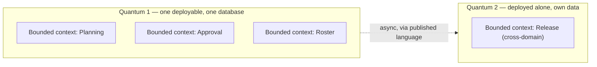

# R8 — The Architecture Quantum, and how it relates to the bounded context

**Created:** 2026-09-03 | **Last updated:** 2026-09-03 | **Author:** Axium (from Graham's question about a colleague's use of "quantum") | **Status:** exploratory — not doctrine

**Research conditions.** oreilly.com, thoughtworks.com, developertoarchitect.com and nealford.com are egress-blocked in this environment. Definitions below are cross-checked against three independent reader summaries plus one GitHub-hosted set of book notes (fetched); the exact book wording is marked `[UNVERIFIED]` where it could not be read from the page. The *shape* of the concept is stable across every source found; the wording differs by edition, and that difference is itself part of the story (§4).

## 1. TL;DR

- **"Quantum" is Neal Ford and Mark Richards's word**, not DDD's. It comes from the Thoughtworks **evolutionary-architecture / architecture-as-trade-offs** school: *Building Evolutionary Architectures* (Ford, Parsons, Kua; 2017; 2nd ed. with Sadalage 2022), *Fundamentals of Software Architecture* (Richards & Ford, 2020), *Software Architecture: The Hard Parts* (Ford, Richards, Sadalage, Dehghani, 2021), and Richards's weekly "Software Architecture Monday" lessons. A colleague who leans on "quantum" is almost certainly reading these.
- **An architecture quantum is a deployment-and-coupling boundary; a bounded context is a language-and-model boundary.** Current definition (*Hard Parts*): *an independently deployable artifact with high functional cohesion, high static coupling, and synchronous dynamic coupling.* The authors themselves say it is "like a bounded context, expressed in architecture terms" — which is an *analogy of shape*, not an identity.
- **They coincide only in the microservices ideal** (one deployable per context, each owning its data). In a modular monolith, **many bounded contexts live in one quantum**. With a shared database, **many deployables are still one quantum**, because the database is static coupling. The two are orthogonal axes; count both.
- **What quanta are for:** architecture characteristics (the "-ilities": availability, security, scalability, elasticity…) are **scoped per quantum**. Two parts that need *different* characteristics must be different quanta. That is the sharpest practical use of the word.
- **RR mapping:** a Floor is a bounded context (tier model, DA-D1). Under DA-D2 lean A the whole Building is **one front-end quantum containing many contexts**; a Floor becomes its own quantum when it is promoted (a real cadence / team / compartment / Angular-major reason). **A classified compartment deployment is a separate quantum of the same bounded context** — which is the Boundary Test's "classification is a deployment axis, not a domain boundary" said in Ford/Richards vocabulary.
- **Where the school earns its keep for RR:** its explicit **granularity disintegrators and integrators** (reasons to split a quantum, reasons to keep it together), its **static vs dynamic coupling** split, and **fitness functions** — which are exactly what Sheriff / dependency-cruiser boundary rules are in a monorepo.

## 2. Core concepts and vocabulary

| Term | Meaning in the Ford/Richards school | Nearest DDD term | Same thing? |
|---|---|---|---|
| **Architecture quantum** | the smallest unit that can be deployed independently, is functionally cohesive, and is held together by static coupling (shared contracts, a shared database) and synchronous runtime calls | bounded context | **No** — deployment/coupling unit vs model/language unit; they coincide only in the ideal case |
| **Independently deployable** | everything needed to run is inside it — including its database; a service that cannot run without another service's DB is not a separate quantum | — | DDD is silent on deployment |
| **High functional cohesion** | it does one purposeful thing; the code inside is unified in purpose | bounded context's single model | closest point of contact — this is the "expressed in architecture terms" bit |
| **Static coupling** | how things are *wired*: shared database, shared contracts, shared libraries, a common framework version | shared kernel; published language | overlaps: a shared kernel is static coupling |
| **Dynamic coupling** | how quanta *talk at runtime*: synchronous vs asynchronous, orchestration vs choreography, atomic vs eventual consistency | context-map relationships; domain events; ACL | the *Hard Parts* eight "saga" patterns are dynamic-coupling choices |
| **Synchronous connascence** (older wording) | components that call each other synchronously belong to one quantum | — | replaced by "synchronous dynamic coupling" in 2021 |
| **Connascence** (Meilir Page-Jones, 1992) | two components are connascent if a change in one requires a change in the other; graded static (name, type, meaning, position, algorithm) → dynamic (execution, timing, value, identity) | coupling in general | the school's coupling vocabulary; DDD does not use it |
| **Architecture characteristics** | the "-ilities" a system must exhibit; scoped per quantum | — | none; DDD leaves this to "the architecture" |
| **Fitness function** | an automated check that an architecture characteristic still holds (a dependency rule, a latency budget, a cyclomatic ceiling) | — | the enforcement of a DDD boundary *is* a fitness function |
| **Granularity disintegrators / integrators** | named reasons to split a service (scope, volatility, scalability, fault tolerance, security, extensibility) and to keep it together (transactions, workflow, shared code, data relationships) | subdomain / context heuristics | complementary: DDD finds *models*; these decide *deployables* |
| **First law of software architecture** | "everything in software architecture is a trade-off" | — | the school's posture; the reason "quantum" is a *measure*, not a rule |

## 3. Canonical sources

- Neal Ford, Rebecca Parsons, Patrick Kua — *Building Evolutionary Architectures* (O'Reilly, 2017). Introduced "architectural quantum" alongside fitness functions and incremental change. `[UNVERIFIED wording]`
- Mark Richards, Neal Ford — *Fundamentals of Software Architecture: An Engineering Approach* (O'Reilly, 2020). Ch. 7 defines the quantum as "an independently deployable artifact with high functional cohesion and synchronous connascence" and states that architecture characteristics are scoped at the quantum level. (Definition text confirmed via two independent reader notes; one fetched from GitHub.)
- Neal Ford, Mark Richards, Pramod Sadalage, Zhamak Dehghani — *Software Architecture: The Hard Parts* (O'Reilly, 2021). Ch. 2 refines the definition to "independently deployable artifacts with high functional cohesion, **high static coupling, and synchronous dynamic coupling**" and introduces the static/dynamic coupling split, the granularity disintegrators/integrators (ch. 7), data ownership and the eight transactional saga patterns (ch. 12). `[UNVERIFIED wording; structure confirmed by three summaries]`
- Ford, Parsons, Kua, Sadalage — *Building Evolutionary Architectures*, 2nd ed. (O'Reilly, Nov 2022). Ch. 2 "Architectural Quanta and Granularity": independently deployable, high functional cohesion, high static coupling, dynamic quantum coupling contracts. `[UNVERIFIED wording]`
- Mark Richards — *Software Architecture Monday*, Lesson 189 "Architectural Quantum Tradeoffs" (developertoarchitect.com, 2024-06-17). `[UNVERIFIED — host blocked]`
- Neal Ford, Mark Richards — *Architecture as Code* (O'Reilly, 2025/2026; ISBN 9798341640382 per bookseller listings). Presumably carries the quantum + fitness-function vocabulary into executable form. `[UNVERIFIED contents]`
- Meilir Page-Jones — *What Every Programmer Should Know About Object-Oriented Design* (1995) for connascence; Jim Weirich's "Grand Unified Theory of Software Design" talk popularised it. `[UNVERIFIED]`
- Eric Evans — *Domain-Driven Design* (2003), for the bounded context, as in R1.

## 4. How the definition evolved, and why it matters

| Year | Text | Definition | What changed |
|---|---|---|---|
| 2017 | BEA 1st ed. | an independently deployable component with high functional cohesion, including all the structural elements required to function | born as a *deployment* concept, to give fitness functions a scope |
| 2020 | Fundamentals | independently deployable artifact + high functional cohesion + **synchronous connascence** | the coupling criterion appears: things that call each other synchronously are one quantum |
| 2021 | Hard Parts | + **high static coupling** + **synchronous dynamic coupling** | the coupling criterion is split in two, so a **shared database now explicitly makes several services one quantum** |
| 2022 | BEA 2nd ed. | same as 2021 | consolidated |

The 2021 refinement is the one that matters for anyone using the word today: **static coupling counts.** If three services share one Postgres schema, they are *one* quantum no matter how many containers ship. This is the point most often missed by people who use "quantum" as a synonym for "microservice".

## 5. Quantum vs bounded context — the relationship, precisely

- **A bounded context is a design-time, semantic boundary:** inside it one model and one vocabulary hold (R1 §5.1; Boundary Test check 1–4).
- **A quantum is a runtime, structural boundary:** inside it, things deploy together, share static coupling, and call each other synchronously; architecture characteristics are set per quantum.
- **The four possible relationships:**

| Relationship | Example | Verdict |
|---|---|---|
| 1 context = 1 quantum | a microservice owning its data and its language | the ideal the authors' analogy describes |
| many contexts, 1 quantum | a **modular monolith**; a front-end shell with lazy fenced Floors; several services on one database | normal and healthy *if the context fences are enforced in code* — otherwise the contexts blur into the quantum's Big Ball of Mud |
| 1 context, many quanta | the same context deployed **per security domain / compartment**; a CQRS read side deployed separately for scale | legitimate when driven by an architecture *characteristic* (security, scalability); a smell when driven by org chart |
| many contexts, many quanta, mismatched | contexts cut one way, deployables cut another | the failure mode: teams own deployables that straddle models |

- **The authors' own claim** that a quantum "is like a bounded context in architecture terms" is true of the *shape* (cohesion inside, clear edges outside) and of the *ideal* (one-to-one). It is **not** a licence to use the words interchangeably: a quantum's edges are set by *what deploys together and shares a database*, a bounded context's by *what the experts mean*. The Boundary Test finds contexts; the granularity disintegrators find quanta.

## 6. The school's instruments, and what they add to a DDD design

### 6.1 Granularity disintegrators and integrators (*Hard Parts* ch. 7)

| Reasons to **split** into more quanta (disintegrators) | Reasons to **keep together** (integrators) |
|---|---|
| Service scope and function — it does two things | Database transactions — the pieces need ACID together |
| Code volatility — one part changes far more often | Workflow and choreography — splitting creates chatty sync calls |
| Scalability and throughput — different load profiles | Shared code — a shared library that would have to be versioned across quanta |
| Fault tolerance — one part must survive the other's failure | Data relationships — foreign-key-style integrity across the split |
| **Security** — different access or accreditation requirements | |
| Extensibility — new capabilities keep arriving on one side | |

This is the register's DA-D2 promotion rule, sourced: a Floor becomes its own quantum for cadence (volatility), team (extensibility), compartment (security), or Angular major (static coupling). "It got big" is not on the list.

### 6.2 Static vs dynamic coupling as a checklist

- **Static:** shared database? shared schema? shared library pinned by version? shared framework major? Each "yes" merges two candidate quanta into one. For RR: every Floor's BFF on one Postgres *schema per context* is fine (contexts keep data ownership) but the Building is still **one quantum** until a Floor's data and deployment separate — say so on the diagram rather than pretending otherwise.
- **Dynamic:** synchronous call vs event; orchestrated vs choreographed; atomic vs eventual consistency. The eight *Hard Parts* sagas (epic, phone-tag, fairy-tale, time-travel, fantasy-fiction, horror-story, parallel, anthology — names from the book, `[UNVERIFIED]`) are the catalogue of answers. R3's outbox + bus is the "asynchronous, eventual" corner.

### 6.3 Fitness functions = the DDD fence, automated

Ford/Richards would call a Sheriff or dependency-cruiser boundary rule, an ArchUnit test, or a build-size budget a **fitness function**: an automated, objective check that an architecture characteristic (here: modularity, context isolation) still holds. The currency contract's forbidden-idiom list and the corpus-graph `check` are fitness functions for the docs. If the colleague's vocabulary is Ford/Richards, "we will enforce the Floor fences with fitness functions in CI" is a sentence he will accept immediately.

## 7. RR lens

1. **Lexicon rule (proposed, for the Concordance):** *Floor* = bounded context (a model and a language). *Quantum* = an independently deployable unit with its own data and characteristics. A Floor **starts inside the Building's quantum** and **becomes its own quantum when promoted** (DA-D2 rule) or when a compartment deployment demands it. Never say "quantum" when you mean "Floor", and never say "Floor" when you mean "deployable".
2. **Count both axes on the C4 container diagram.** Containers are (roughly) quanta candidates; annotate each with the bounded contexts it hosts. A shared database drawn under several containers should be drawn *as the quantum boundary*, not hidden.
3. **Classification, restated in the colleague's words:** a classified compartment is a **separate quantum** (independent deployment, its own data, different security characteristics) hosting the **same bounded context** with a different manifest. That sentence reconciles the Boundary Test with the quantum vocabulary and should end most arguments.
4. **Two-island note:** a different Angular major between islands is *static coupling that cannot be shared*, so two front-end deployments at different majors are by definition two quanta. That is a characteristic-driven split, not a domain one.
5. **Front end specifically:** the authors treat the UI as part of a quantum. Under DA-D2 lean A the shell + all Floors are one UI quantum; micro-frontends (option B) make each remote a quantum candidate only if it also deploys independently *and* does not share the design-system major as static coupling — which with a pinned AstroUXDS + Angular singleton it does. So even federated Floors may still be one quantum by the 2021 definition. This is a strong argument for lean A: **federation buys deploy independence without changing the quantum count**, i.e. it often buys less than it seems.

## 8. Translating in the room — questions to ask the colleague

- "When you say quantum, do you mean *what deploys with its own database*, or *what has its own language*?" (Most people mean the first and think they mean the second.)
- "Which architecture characteristic differs between the two quanta you want?" (If none, the disintegrators say do not split.)
- "Do the two quanta share a database or a schema?" (If yes, by the *Hard Parts* definition they are one.)
- "What fitness function will tell us the boundary still holds?" (If none, it is a drawing, not an architecture.)
- "Is this a Floor question or a deployment question?" (The Boundary Test answers the first; §6.1 answers the second.)

## 9. Sources

Concept clock: Evans 2003 (R1 §3). Idiom/definition clock (all reader-facing pages blocked in-session; summaries used):
- Dan Lebrero, "Book notes: Fundamentals of Software Architecture" (2021-11-17) — https://danlebrero.com/2021/11/17/fundamentals-of-software-architecture-summary/ `[search-listed; page blocked]`
- Dan Lebrero, "Book notes: Software Architecture: The Hard Parts" (2022-03-30) — https://danlebrero.com/2022/03/30/software-architecture-the-hard-parts-book-summary/ `[search-listed; page blocked]`
- P. Kardas, notes on *Fundamentals of Software Architecture* — https://github.com/pkardas/notes/blob/master/books/fundamentals-of-architecture.md **(fetched 2026-09-03; definition and the three parts confirmed)**
- Tech World with Milan, "What I learned from Software Architecture: The Hard Parts" — https://newsletter.techworld-with-milan.com/p/what-i-learned-from-the-software `[search-listed]`
- Mark Richards, Lesson 189 "Architectural Quantum Tradeoffs" (2024-06-17) — https://www.developertoarchitect.com/lessons/lesson189.html `[blocked]`
- O'Reilly listing, *Building Evolutionary Architectures* 2nd ed. (2022), ch. 2 contents — https://www.oreilly.com/library/view/building-evolutionary-architectures/9781492097532/ `[search-listed]`
- Bookseller listings for *Architecture as Code* (Ford, Richards; ISBN 9798341640382) `[UNVERIFIED contents]`

## Modernization ledger (pass 2 standard applied at authoring, 2026-09-03)

Written directly to the currency contract: concept sources dated; the 2017 → 2021 definition change stated rather than averaged; no implementation idiom claimed beyond "Sheriff / dependency-cruiser as fitness functions" (versions in R1 §5.5 / R7 §4.2). Unverified: exact book wording, saga names, *Architecture as Code* contents, Lesson 189 text.
