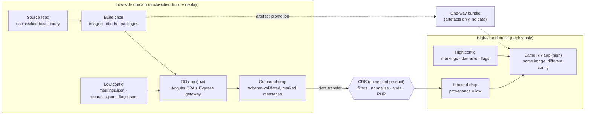

**Created:** 2026-09-03 | **Last updated:** 2026-09-03 — pass 2 (modernization) | **Author:** research agent under Axium (R6) | **Status:** exploratory — not doctrine

# R6 — Cross Domain Solution (CDS) integration

**Verification note.** In-session, the only primary sources reachable through the research proxy were NIST's machine-readable SP 800-53 Rev 5.2.0 catalog (via the `usnistgov/oscal-content` GitHub mirror) and the OpenTDF specification/platform repositories. Every AC-4 / SC-7 quotation below is verbatim from that catalog. Pass 2 (2026-09-03) re-confirmed the catalog: its OSCAL metadata reads `version: 5.2.0`, last-modified 2026-05-11, and NIST's own summary-of-changes dates Release 5.2.0 to 2025-08-27 (three new controls — SA-15(13), SA-24, SI-2(7) — none touching AC-4/SC-7; the date and control list reached via search-index excerpts of `csrc.nist.gov`, which stays blocked). NSA/NCDSMO, DoD issuances, CNSS, DNI, NCSC, vendor sites and the academic hosts were blocked, so those citations are from working knowledge of well-known public documents and are tagged `[UNVERIFIED]` — the *documents* are real and unclassified, but their URLs, dates and exact wording were not confirmed today. Nothing in this brief describes any specific classified system or program.

## 1. TL;DR

- **A CDS is a controlled interface between two security domains, and it is an accredited *product*, not a pattern you build.** NIST's own guidance says the CDS-grade AC-4 enhancements "are generally not available in commercial off-the-shelf products," and AC-4(20) points to the NSA NCDSMO's list of approved solutions. Your application never *is* the CDS; it is a *client* of one.
- **Design for the guard, not around it.** A guard passes only what it can fully parse, validate against a fully enumerated format, and normalise (AC-4(12), (14), (24)). Guard-friendly data is flat, schema-validated, explicitly marked, small, and free of active or embedded content. This is an application-design constraint you own.
- **Every cross-domain transfer is asynchronous and may be rejected without explanation.** Design message flows as store-and-forward with idempotent replay, explicit acknowledgements from the far side (when a return path exists at all), and reconciliation — never as a synchronous RPC.
- **"Same app on both sides" is the norm, and it is the RR centrepiece.** One codebase is built once (on the low side) and deployed per domain with domain-specific configuration and data. Markings, domain names, addresses, group lists and classified enumerations are *data*, never source. That is exactly the unclassified-base / per-customer-tailoring split Graham wants.
- **Low-side development, one-way promotion up** is how this is done in practice and maps one-to-one onto RR's Legacy/Desert Island bundle model. Test fixtures, schemas and marking vocabularies must be complete on the low side; the high side adds data, never code paths.
- **Identity does not federate across a guard.** Expect a separate identity store, separate accounts and separate authorisation data per domain; attribute *replication* through a CDS is possible but is an accreditation decision (R4).
- **Most of the hard questions are accreditation-bound, not engineering-bound.** Which CDS, which filters, which data types, what human review, what cadence — the program's security/accreditation authority decides. The engineering job is to make the application's cross-domain surface small, explicit and reviewable.

## 2. Core concepts and vocabulary

| Term | Meaning (one meaning per word) |
|---|---|
| **Security domain** | A set of systems and data under one security policy and one authority; NIST's glossary defines it as a domain implementing a security policy administered by a single authority ([NIST CSRC glossary, *security domain*](https://csrc.nist.gov/glossary/term/security_domain) `[UNVERIFIED — host blocked]`). Classification level is the usual axis, but "domain" also splits coalition, compartment, and organisation boundaries. |
| **Cross Domain Solution (CDS)** | "A form of controlled interface that provides the ability to manually and/or automatically access and/or transfer information between different security domains" (CNSSI 4009 definition, as reproduced in the NIST glossary `[UNVERIFIED]`). |
| **High side / low side** | Shorthand for the more- vs less-sensitive domain in a given transfer. *Low-to-high* moves data up (integrity/malware risk dominates); *high-to-low* moves data down (confidentiality/spillage risk dominates). |
| **Transfer CDS** | Moves data between domains, one-way or bidirectional, through filtering. NIST AC-4 enhancements 3–32 are its control vocabulary. |
| **Access CDS** | Lets one device reach several domains "while preventing information flow between the different security domains" (AC-4(22)). Thin clients, KVM-style and pixel-streaming products. |
| **Multi-level solution (MLS)** | One system that stores and processes data at multiple levels and enforces mandatory access control on every object (Bell–LaPadula lineage). Rare; usually a labelled database or OS rather than a general app platform. |
| **Guard** | The filtering component of a transfer CDS: a "high-assurance guard" in NIST's words. Inspects, validates, sanitises, passes or rejects. |
| **Filter (policy filter)** | One rule set applied to one data type inside the guard — structure checks (size, field length, schema) and content checks (dirty words, enumerated values, hidden content) (AC-4(8)). |
| **Filter pipeline** | The ordered, linear chain of filters a data type passes through (AC-4(28), (29)); redundant, independent filters per data type are expected (AC-4(27)). |
| **Data diode** | Hardware-enforced one-way flow (AC-4(7)); physically no return path, so the sender never receives an acknowledgement from the far side. |
| **Data type identifier** | The proof that a payload *is* what it claims to be — validated "syntactically and semantically against its specification," never by filename alone (AC-4(12)). |
| **Sanitisation / normalisation** | Rewriting content to remove unsanctioned material — parse to an "internal normalized format and regenerate" (AC-4(24)); commercially "content disarm and reconstruction (CDR)". |
| **Downgrade / regrade** | Changing the marking of information so it can move to a lower domain — a "trustworthy regrading mechanism" (AC-4 guidance). A human authority decision, never an app feature. |
| **Release / reliable human review** | The RHR step in which an authorised person inspects content before it leaves a domain; NIST AC-4(9) "Human Reviews" — used "when a fully automated flow control decision is not possible." |
| **Taint** | Colloquial: the property that data which has touched a higher domain is presumed to carry that domain's sensitivity until proven otherwise; drives "no data down without review." Not a formal control term. |
| **Marking / label** | Metadata asserting classification, control and dissemination on an object (AC-16). IC-ISM is the IC's XML attribute vocabulary; a TDF binds a label to encrypted content. |
| **NCDSMO** | NSA's National Cross Domain Strategy & Management Office — keeps the **baseline list** of approved CDS and runs **Raise the Bar (RTB)**, the post-2018 hardening strategy for CDS design and deployment; the public *CDS Design and Implementation Requirements: 2021 Raise the Bar Baseline Release* v4.1 is dated 2022-07-11, RTB is described as updated annually, and NSM-8 (January 2022) made agency progress reporting mandatory `[UNVERIFIED — nsa.gov blocked; dates from search-index excerpts of vendor and INCOSE material, 2026-09-03; no newer public baseline release was found]`. |
| **Baseline list** | The NCDSMO catalogue of CDS products assessed for use across DoD/IC; AC-4(20) requires "approved solutions." |
| **A&A / ATO** | Assessment & Authorisation under the RMF; an ATO (Authority to Operate) is the signed risk acceptance. A CDS carries its own authorisation *and* the connecting systems must be authorised for the connection (CA-3 "Information Exchange"). |
| **Cross-domain policy** | The organisational rule set for what may flow where: DoDI 8540.01 in DoD `[UNVERIFIED — date]`, implemented via each domain's authorising official. |
| **Provenance** | Application-level record that a datum arrived through a cross-domain transfer — source domain, time, transfer id — rendered to users as "this came from elsewhere." |

## 3. Canonical sources

**Policy and control baselines (US).**
- NIST SP 800-53 Rev 5 — **AC-4 Information Flow Enforcement** and **SC-7 Boundary Protection**. AC-4's guidance is the single best unclassified description of what a guard does: enforcement includes "prohibiting information transfers between connected systems (i.e., allowing access only), verifying write permissions before accepting information from another security or privacy domain … employing hardware mechanisms to enforce one-way information flows, and implementing trustworthy regrading mechanisms." [NIST, SP 800-53 Rev 5.2.0 OSCAL catalog, 2026](https://github.com/usnistgov/oscal-content) (verified).
- CNSSI 1253, *Security Categorization and Control Selection for National Security Systems*, March 2014 — tailors 800-53 for NSS and carries the CDS overlay concept ([CNSS issuances](https://www.cnss.gov/CNSS/issuances/Instructions.cfm) `[UNVERIFIED — host blocked]`; title/date confirmed via 800-53 back-matter).
- CNSSI 4009, CNSS Glossary, April 2015 (later revisions exist `[UNVERIFIED]`).
- DoDI 8540.01, *Cross Domain (CD) Policy* — establishes NCDSMO's role, the requirement to use baseline-listed solutions, the cross-domain support element and technical advisory board ([esd.whs.mil](https://www.esd.whs.mil/Portals/54/Documents/DD/issuances/dodi/854001p.pdf) `[UNVERIFIED — host blocked]`).
- NSA NCDSMO public page and the *Raise the Bar* overview ([nsa.gov](https://www.nsa.gov/Cybersecurity/Partnership/National-Cross-Domain-Strategy-Management-Office/) `[UNVERIFIED — host blocked; URL from the 2026-09-03 search index, replacing the older `/Resources/Everyone/Cross-Domain-Solutions/` path]`). Newest public secondary material found: INCOSE, *Fundamentals of Cross Domain Solutions (CDS)*, January 2026 presentation `[UNVERIFIED — PDF not fetched]`.
- DISA Cross Domain Enterprise Service (CDES) — the DoD enterprise-provided CDS capability, so programs need not stand up their own `[UNVERIFIED]`.

**Marking and data-centric standards.**
- ODNI IC-ISM (Information Security Marking Metadata) — the `urn:us:gov:ic:ism` XML attribute set (`classification`, `ownerProducer`, `disseminationControls`, `releasableTo`, …) ([dni.gov IC technical specifications](https://www.dni.gov/index.php/who-we-are/organizations/ic-cio/ic-cio-related-menus/ic-cio-related-links/ic-technical-specifications) `[UNVERIFIED — host blocked]`).
- OpenTDF specification — "an Open, Interoperable, JSON encoded data format for implementing Data Centric Security," modernising the IC's original XML-based TDF; manifest + encrypted payload; ABAC policy with `dataAttributes` and optional `dissem`; **handling assertions** "used for security labeling or handling instructions," cryptographically bound so they cannot be moved to another TDF. [OpenTDF, *spec*](https://github.com/opentdf/spec) and [OpenTDF, *platform*](https://github.com/opentdf/platform) (verified; The Clear BSD License). Current on 2026-09-03: spec **4.3.0** (`VERSION` file); platform `service` v0.26.0 (2026-08-28) and `sdk` v0.31.0 (2026-08-27) per the per-module changelogs; npm `@opentdf/sdk` 0.20.0 (2026-07-10). The platform is pre-1.0 and releases every few weeks — pin by module tag, not "latest".
- NIST SP 800-207 *Zero Trust Architecture* (2020) and the DoD Zero Trust Strategy (2022) — the "data pillar" framing: tag/label data, enforce on the data object, stop trusting network location `[UNVERIFIED — hosts blocked]`.
- DoD Data Strategy (2020) and the JADC2 Strategy summary (2022) — the "data-centric, share across domains" aspiration `[UNVERIFIED]`.

**Allied guidance (very readable).**
- UK NCSC, *Cross domain solutions* collection and *Pattern: Safely importing data* — the transform / verify / flow-control triad and "only pass content you can verify" `[UNVERIFIED — host blocked]`.
- Australian ACSC ISM, *Guidelines for gateways* (CDS section) `[UNVERIFIED]`.

**Foundational literature.**
- Rushby, *Design and Verification of Secure Systems*, SOSP 1981 — the separation kernel. Alves-Foss et al., *The MILS architecture for high-assurance embedded systems*, 2006 — separation kernel + middleware + application layers, with NEAT (non-bypassable, evaluatable, always invoked, tamperproof) enforcement. NIAP *Separation Kernel Protection Profile*, 2007. Bell & LaPadula, 1973/1976. Kang & Moskowitz, *A pump for rapid, reliable, secure communication*, 1993 (the NRL Pump — bounded-feedback one-way transfer). Anderson, *Security Engineering* 3rd ed., ch. 9 *Multilevel Security* — pumps, guards, diodes, the cascade problem and why MLS "is hard." All `[UNVERIFIED — hosts blocked]`; all are standard, unclassified references.

## 4. How it is done in practice

### 4.1 CDS types compared

| | **One-way transfer (diode)** | **Bidirectional transfer (guard)** | **Access** | **Multi-level** |
|---|---|---|---|---|
| Mechanism | Hardware one-way link (AC-4(7)); protocol break; no return path | Filter pipelines per data type; human review optional | Separate sessions per domain rendered on one device (AC-4(22)); pixel/keystroke only | Labelled OS/DB enforcing MAC on every object |
| Typical products (public) | Owl, Fend, Everfox/Forcepoint diodes `[UNVERIFIED]` | Everfox (ex-Forcepoint) High Speed Guard, Trusted Gateway System; Boeing HardwareWall `[UNVERIFIED]` | Everfox Trusted Thin Client; Garrison hardsec `[UNVERIFIED]` | Rare in apps; see R5 |
| What the app sees | Fire-and-forget; loss is possible; acks only via out-of-band or none | Async submit → later pass/reject; rejects may be silent | Nothing — the app runs *inside* one domain; the user just sees several windows | A label on every row; app must be label-aware |
| Dominant risk | Low→high: malware, integrity; high→low: none (physically impossible) | Spillage on high→low; malware on low→high | Covert channels between sessions | Correctness of every label decision |
| Latency | Seconds–minutes (batch/replication) | Seconds to hours (human review is hours–days) | Interactive | Interactive |
| App design impact | Store-and-forward, idempotent replay, sequence numbers | Plus: reconciliation, rejection handling, guard-friendly formats | None to code; identity per domain | Deep — every query is label-filtered |

### 4.2 Integration mechanisms

**File-drop / directory-based.** The most common shape. The app writes a file into an outbound directory (or an object-store bucket / SMB share) on its own side; the CDS polls, filters and, if accepted, writes it into an inbound directory on the far side. Each file is a self-contained unit: one data type, one marking, size-capped. Expect a naming convention that carries a transfer id and sequence number, and a quarantine/"failed" area on the sending side that your app must monitor (AC-4(31): failed content is never delivered).

**Message-based.** Queues, streams or SMTP relayed through a guard — often implemented as the guard consuming from a low-side topic and publishing to a high-side topic, with a diode or filter in between (R3's bus cannot span a domain; two buses, one per domain, are bridged by the CDS). Each message is filtered individually; batching is common to amortise cost. Streaming replication of a *database* across a guard exists (typically via a vendor connector) but is a special data type with its own approval.

**Structured-data filtering.** This is the core of guard design and where the application team's choices matter most. Filters are enumerated per data type (AC-4(12)); they demand "fully enumerated formats that restrict data structure and content" (AC-4(14)) — restricted character sets, alphanumeric-only fields, schema validation, bounded sizes; and the guard prefers to parse-and-regenerate rather than pass bytes through (AC-4(24)). The consequence is a rule of thumb: **the guard only passes what it can fully inspect.** Practically that means XML/JSON validated against a *closed* schema (no `additionalProperties`, no `xs:any`), no free-form binary, no scripts/macros, no nested archives, no encrypted blobs (AC-4(4) exists precisely because ciphertext blinds the filter), images only in whitelisted formats and sizes, and metadata filtered like payload (AC-4(19)).

**Latency and batching.** Transfers are never synchronous. Automated filtering adds seconds; human review adds hours or days; diodes may replicate on a schedule. The application must present "sent / pending / accepted / rejected" states rather than pretend the far side answered.

**Reconciliation and acknowledgement.** Through a bidirectional guard, the far-side application can emit an acknowledgement message (itself filtered, so keep it tiny and structured) keyed on the transfer id. Through a diode there is no return path; the sender infers loss via sequence gaps reported out-of-band, and reliability comes from **forward error correction and redundant sends** (the "pump" literature). Either way: every payload carries a monotonic sequence and an idempotency key; receivers dedupe; senders keep an outbox until acknowledged or expired. Note SC-7(23) — guards deliberately "disable feedback to senders on protocol format validation failure," so you may never learn *why* something was dropped.

**Guard-friendly message shape.** Flat (few nesting levels), one data type per message, schema-validated on *both* sides before/after transfer, explicitly marked (an IC-ISM-style header block, or a TDF handling assertion), size-bounded, ASCII/UTF-8 restricted, no embedded objects, no active content, provenance fields (`sourceDomain`, `transferId`, `sequence`, `producedAt`) that the receiving app persists and renders. The filter rule set for that type is written *from your schema* by the CDS team, so freezing the schema early is part of the accreditation path.

### 4.3 The "same app on both sides" pattern

Organisations do not fork codebases per domain; they build **once** and deploy **per domain**. The build artefact (container image, npm package set, Helm chart) is identical; what differs is configuration and data loaded at deploy/run time.

What must **not** be in shared code: specific classification markings and caveats; domain names, hostnames, IP ranges, network zone names; user/group/organisation lists; "classified enums" (any enumeration whose *values* are themselves sensitive — e.g. a list of mission names, sensor types, partner nations); anything that reveals the *existence* of a high-side capability. Shared code carries the *shape*: a marking model with slots, a domain model with an id, a feature model with a key.

**Marking display is data-driven.** The banner primitive (R5's `@rr/markings`) is a standalone `OnPush` Angular 22 component whose signal `input()` is a `Marking` value object; the *display vocabulary* (colour, ordering, abbreviations, portion-mark syntax) is not an input but a `resource` — `httpResource<MarkingVocabulary>(() => '/api/config/markings')` in a root SignalStore — loaded from the gateway at run time. On the low side that resource resolves to unclassified/CUI entries and test values; the high side serves a fuller vocabulary from its ConfigMap. The component logic — precedence, portion marks, banner top/bottom, print header — is identical on both sides and unit-tested (Vitest) against fixture vocabularies by setting the input signal and stubbing the resource; rendering is `@if`-gated on the vocabulary having resolved, so an unconfigured deployment paints nothing marking-shaped rather than a default.

**Provenance in the UI.** Data that crossed a domain carries `sourceDomain` / `transferId` / `sequence` / `producedAt` in the API payload; the surface renders an origin affordance (an AstroUXDS status/tag primitive) through a `ProvenanceBadgeComponent` with a signal `input<Provenance>()`, and the transfer state (`sent | pending | accepted | rejected | expired`) is a `computed` over the record plus the store's acknowledgement feed, switched with `@switch`/`@if`. Stale-because-async is a first-class state, not an error: a `resource` whose `value()` is the last-known record while its `status()` reports a reload in progress *is* that state — do not model it with a separate loading flag.

**Feature flags per domain.** Flags are config, resolved at boot from the gateway's `/api/config` through one `httpResource<DomainConfig>(() => '/api/config')` in a root `DomainConfigStore`; a flag *key* is public (`config.value()?.flags.someKey`), its *value* is per-domain. Flag names must themselves be unclassified. Routes gate on flags with functional `CanMatch` guards that read the store, not with template checks.

### 4.4 Development-lifecycle realities

Development happens on the low side; artefacts are **promoted up** through a one-way transfer, exactly RR's bundle model. Consequences: (a) **fixtures and test data are low-side by construction** — synthetic data whose schema matches production, marking vocabularies with dummy values, recorded guard responses (accept, reject, timeout) as test doubles; (b) **tests never depend on high-side data** — contract tests validate against the frozen schema, and marking/provenance logic is tested with fixture vocabularies; (c) **configuration is data** delivered by ConfigMap/JSON, never rebuilt per domain; (d) **the CDS rule set and the A&A process set the release cadence** — a new data type or a schema change means a filter change means a re-assessment, so version schemas additively, keep the cross-domain surface small, and batch schema changes into planned drops. Debugging on the high side is hard (no agent, no internet, no source), so ship diagnostics — structured logs, a "what config am I running" page, deterministic build ids — in the artefact.

### 4.5 Interactions with the sibling briefs

- **R5 (MAC stores / markings):** the label model is the shared vocabulary; the CDS filters *on* labels (AC-4(1), (6), (19)), so whatever R5 chooses must serialise into the guard-approved header format. IC-ISM attributes or TDF assertions are the two public shapes.
- **R3 (event bus):** a bus never spans domains; you run one per domain and bridge via file/message transfer through the CDS. Events crossing must be flat, typed, idempotent; expect ordering to be per-key, not global, after a guard.
- **R4 (identity):** identity is **not federated across a guard** in the normal case — separate directories, separate accounts (often separate tokens/CACs), separate authorisation data. Some enterprise ICAM efforts replicate *attributes* through a CDS to keep accounts aligned, but that is an approved data type with its own review, and a low-side token is never trusted high-side. Verify with the program's security authority.
- **R2 (data fabric):** the JADC2/DoD-data-strategy aspiration is data that flows across classifications by label; the reality is that every crossing is a CDS transfer with a filter, so a "fabric" is really per-domain fabrics stitched by approved transfers.

## 5. Trade-offs, anti-patterns, failure modes

- **Treating the guard as a network hop.** Synchronous calls across a CDS, retries without idempotency, and assuming ordering all fail in production.
- **Rich formats.** Office documents, PDFs with scripts, nested archives, arbitrary JSON with open schemas: each expands the filter's job and the accreditation scope. Closed schemas are cheaper than clever ones.
- **Encrypting through the guard** blinds the filter (AC-4(4)); either the CDS terminates the crypto or the transfer is refused. Note the tension with TDF-style data-centric security — labels ride outside the ciphertext for this reason.
- **Markings in code.** Hard-coded banner strings, enum values naming classified things, or domain hostnames in a config *file committed to the repo* turn an unclassified base into something that cannot leave the high side — the exact failure Graham's goal is designed to avoid.
- **Silent rejection.** Because of SC-7(23), the far side may never hear why; without an outbox with expiry and an operator-visible "pending" state, data silently vanishes.
- **Schema drift between sides.** Two deployments of "the same app" at different versions with different message schemas; mitigate with additive versioning and a schema-version field the guard also validates.
- **Access-solution comfort.** An access CDS solves *seeing* both sides, not *moving* data; users will copy-type across, which is a policy problem, not yours, but the UI should not encourage it.
- **The cascade problem** (Anderson): chaining several small trusted interconnects can create an aggregate path the accreditor never approved; keep an explicit map of every crossing.

## 6. RR lens — implications for Desert Island

- **The unclassified base library is the whole strategy.** Structure the npm workspace so `@rr/*` packages contain shape, not values: a `@rr/markings` package with the banner/portion-mark components and a *schema* for vocabularies; `@rr/provenance` primitives; `@rr/domain-config` typing the runtime config the Express gateway serves from `/config/runtime-config.json`. Per-customer/domain tailoring = a ConfigMap + a vocabulary JSON + flag values, delivered in the Helm chart's values, never a code branch.
- **Two islands, one artefact stream.** Legacy Island → Desert Island bundle transfer is already a one-way artefact promotion; build it as if a diode sat in the middle (manifests, checksums, sequence, no return path assumed). The same discipline later serves a real CDS if RR ever deploys across security domains.
- **Stack synchronisation is a CDS concern too.** If two domains' clusters must run the same image, the image must be built once on the low side; Desert Island pins therefore follow whatever the build island can produce (`two_island_model.md`).
- **Building / Floor / Suite / Office.** Domain = Building-level config; markings vocabulary and flags flow down; a Suite/Office never learns a marking string from code, only from the store — a root `DomainConfigStore` built as `signalStore(withProps(() => ({ config: httpResource<DomainConfig>(() => '/api/config') })), withComputed(...))` with `domain`, `markings` and `flags` slices; it loads once at boot because its request never changes, `config.reload()` re-hydrates on operator request, and every consumer `@if`-gates on `config.hasValue()`. (`@ngrx/signals` 22.0.0 with peer `@angular/core ^22.0.0`; `httpResource` is public API from Angular 22.0, experimental in v19.2–v21, so a v19–v21 re-pin swaps in `resource()` over `HttpClient` with the same shape — verified 2026-09-03.)
- **Gateway as the only cross-domain edge.** If RR ever emits data to a CDS drop, put the outbox, schema validation, sequence numbering and provenance stamping in the Express gateway, not the SPA; the browser must never know a drop path exists.
- **Design for testability without high-side data.** Vitest fixtures for marking vocabularies, provenance states and guard outcomes belong in the base library from day one.
- **Route to the accreditation authority, do not decide:** which CDS (baseline list, DISA CDES vs program-owned), which data types and schemas are approvable, whether human review applies, whether identity attributes may replicate, cross-domain policy cadence, and any real domain names/markings.

## 7. Open questions for Graham

1. Does RR *today* have any requirement to move data between security domains, or is "unclassified base + classified tailoring" purely about deployment configuration? The answer sets whether §4.2 is design or background.
2. Which marking vocabulary governs the customers' domains — DoD CUI/classification banners, IC-ISM, coalition? Can a public vocabulary schema be agreed so the base library's marking component is stable?
3. Is a CDS (and which — enterprise CDES or program-owned) already accredited on either island's target cluster, and who is its owner/CDSE contact?
4. Do the two islands share a transfer mechanism (already open in `two_island_model.md`)? If it is a real diode/guard, the bundle format must satisfy its data-type filters.
5. Identity: is one directory per domain the known answer for the customer sites, and is attribute replication through a CDS in scope or out?
6. What return channel, if any, exists from the high side to the low side (for acknowledgements, defect reports, logs)? "None" changes how diagnostics are designed.

## 8. Sources

### Concept sources (any age — policy, controls, standards, literature)

- NIST, *SP 800-53 Rev 5, Release 5.2.0 — OSCAL catalog (controls AC-4, AC-16, CA-3, SC-7, SC-32, SC-39)* — https://github.com/usnistgov/oscal-content (verified; raw JSON at `nist.gov/SP800-53/rev5/json/`; metadata `version: 5.2.0`, last-modified 2026-05-11, re-read 2026-09-03). NIST, *Summary of Changes: NIST SP 800-53 Release 5.2.0*, 27 August 2025 — https://csrc.nist.gov/csrc/media/Projects/risk-management/800-53%20Comment%20Site/SP800-53-r5.2.0-changes.pdf `[UNVERIFIED — host blocked; date and control list from search-index excerpts]`.
- CNSS, *CNSSI 1253* (2014) and *CNSSI 4009* (2015) — https://www.cnss.gov/CNSS/issuances/Instructions.cfm `[UNVERIFIED — host blocked; titles/dates via 800-53 back-matter]`.
- DoD, *DoDI 8540.01 Cross Domain (CD) Policy* — https://www.esd.whs.mil/Portals/54/Documents/DD/issuances/dodi/854001p.pdf `[UNVERIFIED]`.
- NSA NCDSMO, *National Cross Domain Strategy & Management Office* / *Raise the Bar* — https://www.nsa.gov/Cybersecurity/Partnership/National-Cross-Domain-Strategy-Management-Office/ `[UNVERIFIED — host blocked; URL from the 2026-09-03 search index]`. *CDS Design and Implementation Requirements: 2021 Raise the Bar Baseline Release* v4.1, 11 July 2022 `[UNVERIFIED — title/date from vendor and INCOSE excerpts]`.
- INCOSE, *Fundamentals of Cross Domain Solutions (CDS)*, January 2026 — https://www.incose.org/wp-content/uploads/2026/01/Presentation-68.pdf `[UNVERIFIED — not fetched; newest public secondary material found]`.
- DISA, *Cross Domain Enterprise Service (CDES)* — https://www.disa.mil `[UNVERIFIED]`.
- ODNI, *IC-ISM and IC technical specifications* — https://www.dni.gov/index.php/who-we-are/organizations/ic-cio/ic-cio-related-menus/ic-cio-related-links/ic-technical-specifications `[UNVERIFIED]`.
- NIST, *SP 800-207 Zero Trust Architecture* (2020) — https://csrc.nist.gov/pubs/sp/800/207/final `[UNVERIFIED]`.
- DoD CIO, *DoD Zero Trust Strategy* (2022) — https://dodcio.defense.gov/Portals/0/Documents/Library/DoD-ZTStrategy.pdf `[UNVERIFIED]`.
- DoD, *Summary of the JADC2 Strategy* (2022) — https://media.defense.gov/2022/Mar/17/2002958406/-1/-1/1/SUMMARY-OF-THE-JOINT-ALL-DOMAIN-COMMAND-AND-CONTROL-STRATEGY.PDF `[UNVERIFIED]`.
- UK NCSC, *Cross domain solutions* — https://www.ncsc.gov.uk/collection/cross-domain-solutions; *Pattern: Safely importing data* — https://www.ncsc.gov.uk/guidance/pattern-safely-importing-data `[UNVERIFIED]`.
- Everfox (ex-Forcepoint), *Cross domain solutions* — https://www.everfox.com/products/cross-domain-solutions; Owl Cyber Defense, *Data diodes* — https://owlcyberdefense.com/learn-about-data-diodes/; Garrison — https://www.garrison.com/; Fend — https://www.fend.tech/ `[all UNVERIFIED — hosts blocked; vendor material, read critically]`.
- Rushby, *Design and Verification of Secure Systems*, SOSP 1981 — https://www.csl.sri.com/papers/sosp81/ `[UNVERIFIED]`.
- Alves-Foss, Oman, Taylor, Harrison, *The MILS architecture for high-assurance embedded systems*, Int. J. Embedded Systems, 2006 — https://www.csds.uidaho.edu/papers/Alves-Foss06a.pdf `[UNVERIFIED]`.
- NIAP, *U.S. Government Protection Profile for Separation Kernels in Environments Requiring High Robustness* v1.03, 2007 `[UNVERIFIED]`.
- Kang & Moskowitz, *A pump for rapid, reliable, secure communication*, ACM CCS 1993 `[UNVERIFIED]`.
- Anderson, *Security Engineering*, 3rd ed., 2020, ch. 9 *Multilevel Security* — https://www.cl.cam.ac.uk/archive/rja14/Papers/SEv3-ch9-7sep.pdf `[UNVERIFIED]`.

### Implementation / idiom sources (dated, primary — fetched 2026-09-03 unless marked)

- OpenTDF, *Trusted Data Format specification* 4.3.0 — https://github.com/opentdf/spec (verified; `VERSION` file); *OpenTDF platform* — https://github.com/opentdf/platform (verified; `service/CHANGELOG.md` 0.26.0 2026-08-28, `sdk/CHANGELOG.md` 0.31.0 2026-08-27; LICENSE = The Clear BSD License); npm `@opentdf/sdk` 0.20.0 (2026-07-10) — https://registry.npmjs.org/@opentdf/sdk
- Angular `adev` guides (repo `angular/angular`, `main`): *Reactive data fetching with `httpResource`* — https://github.com/angular/angular/blob/main/adev/src/content/guide/http/http-resource.md ; *Async reactivity with resources* — https://github.com/angular/angular/blob/main/adev/src/content/guide/signals/resource.md ; *Angular without ZoneJS* — https://github.com/angular/angular/blob/main/adev/src/content/guide/zoneless.md ; *Accepting data with input properties* — https://github.com/angular/angular/blob/main/adev/src/content/guide/components/inputs.md ; `CHANGELOG.md` — https://github.com/angular/angular/blob/main/CHANGELOG.md ; `@publicApi 22.0` tags — https://github.com/angular/angular/blob/main/packages/common/http/src/resource.ts
- NgRx SignalStore guides (`withProps`, `withComputed`, custom features) — https://github.com/ngrx/platform/tree/main/projects/www/src/app/pages/guide/signals/signal-store ; `modules/signals/package.json` (22.0.0, peer `@angular/core ^22.0.0`)
- npm registry (2026-09-03): `@angular/core` 22.1.5, `@ngrx/signals` 22.0.0, `@astrouxds/angular` 9.0.0 — https://registry.npmjs.org/

## Modernization ledger (pass 2, 2026-09-03)

**What changed.**

- §4.3 "same app on both sides": the three front-end paragraphs (marking display, provenance, feature flags) restated in the signal-first, zoneless Angular 22 idiom — the banner primitive as a standalone `OnPush` component with a signal `input()` of a `Marking` value object; the display vocabulary as a `resource` (`httpResource<MarkingVocabulary>(() => '/api/config/markings')`) rather than an input; provenance through a `ProvenanceBadgeComponent` with `input<Provenance>()` and a `computed` transfer state; stale-because-async expressed as a `resource`'s `value()` + `status()`, not a loading flag; config-as-data through one `httpResource<DomainConfig>(() => '/api/config')` in a root `DomainConfigStore`; flags gating routes via functional `CanMatch` guards; Vitest fixtures by setting inputs and stubbing resources.
- §6 Building/Floor/Suite/Office bullet: the "SignalStore slot hydrated once" restated as `withProps` + `httpResource` + `withComputed` slices, `reload()` for re-hydration, `@if`-gating on `hasValue()`, with the v19–v21 fallback (`resource()` over `HttpClient`) named.
- Verification note, §2 NCDSMO row, §3 NSA bullet: NIST 800-53 Release 5.2.0 re-confirmed and dated (2025-08-27 release; catalog last-modified 2026-05-11); NCDSMO URL updated; RTB baseline v4.1 (2022-07-11), the annual-update description and NSM-8 reporting recorded — all still `[UNVERIFIED]` at source; an INCOSE January 2026 presentation noted as the newest public secondary item found.
- §3 OpenTDF bullet: current spec/platform/npm versions with dates and a pin-by-module-tag warning.
- §8 regrouped into concept vs implementation/idiom sources.

**Verified against (all fetched 2026-09-03 via `raw.githubusercontent.com` and `registry.npmjs.org`).**

- NIST: `usnistgov/oscal-content/main/nist.gov/SP800-53/rev5/json/NIST_SP-800-53_rev5_catalog.json` metadata (`title` "…Rev 5.2.0…", `version: 5.2.0`, `last-modified 2026-05-11`, `oscal-version 1.2.2`).
- OpenTDF: `opentdf/spec/main/VERSION` (4.3.0) and README (SemVer badge 4.3.0); `opentdf/platform/main/service/CHANGELOG.md`, `sdk/CHANGELOG.md`, `LICENSE`; npm `@opentdf/sdk` dist-tags.
- Angular: `adev/src/content/guide/http/http-resource.md` (request-object form, `hasValue()`/`error()`/`isLoading()` template gating, "Avoid using `httpResource` for mutations"), `guide/signals/resource.md` (`params`/`loader`/`abortSignal`, `status`), `guide/zoneless.md` ("Zoneless is the default in Angular v21+"), `guide/components/inputs.md`; `CHANGELOG.md` — 22.0.0 (2026-06-03) OnPush default; 21.0.0 (2025-11-19) zoneless-by-default migration; 20.0.0 (2025-05-28) zoneless stable; 19.2.0 (2025-02-26) experimental `httpResource`; 19.0.0 (2024-11-19) `input`/`output`/`model` stable; `packages/common/http/src/resource.ts` `@publicApi 22.0`.
- NgRx: `modules/signals/package.json` (22.0.0, peer `@angular/core ^22.0.0`); `with-props.ts`, `with-linked-state.ts`, `with-feature.ts` on `main`. npm: `@angular/core` 22.1.5, `@ngrx/signals` 22.0.0, `@astrouxds/angular` 9.0.0.
- Search (3 of the 20-search budget): NCDSMO/RTB public material, MinIO status (for R2), NIST 5.2.0 release date — results used only as dated pointers, never as API facts.

**Stayed (version-independent).** The TL;DR, the whole glossary except the NCDSMO row's dates, every AC-4/SC-7 quotation, the CDS-type comparison, the integration mechanisms and guard-friendly message shape, the build-once/deploy-per-domain diagram and the "what must not be in shared code" list, the lifecycle realities, the sibling-brief interactions, the trade-offs, the RR lens apart from the Building bullet, and the open questions.

**Still `[UNVERIFIED]`.** Everything so marked in pass 1 (nsa.gov, cnss.gov, esd.whs.mil, dni.gov, csrc.nist.gov, ncsc.gov.uk, disa.mil, vendor and academic hosts — still egress-blocked); the RTB baseline v4.1 date, the annual-update cadence and NSM-8 linkage (search excerpts only); whether any RTB baseline newer than v4.1 has been published; the INCOSE 2026 presentation's content; the NIST 5.2.0 release date (2025-08-27) as distinct from the catalog's last-modified stamp; AstroUXDS's status/tag primitives' current API (docs blocked).
