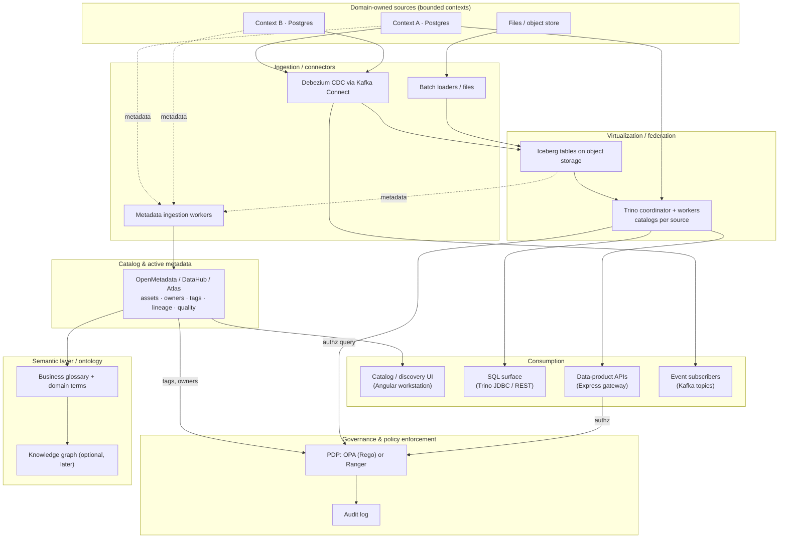

# R2 — Data Fabric research brief v0

**Created:** 2026-09-03 | **Last updated:** 2026-09-03 | **Author:** research agent under Axium (R2) | **Status:** exploratory — not doctrine

> Sourcing note. Several primary hosts (gartner.com, martinfowler.com, media.defense.gov, api.army.mil, dni.gov, most vendor and project-doc sites) were blocked by the research session's egress proxy. Where a primary URL is cited but its text was confirmed only through search-index excerpts or trade press, the claim is marked `[UNVERIFIED]`. GitHub-hosted project READMEs were fetched directly.

## 2. TL;DR

- **"Data fabric" is a design concept, not a product.** Gartner's framing: an integrated layer of data and connecting processes that uses metadata — especially *active* metadata — plus semantics/knowledge graphs to automate integration and access ([Gartner glossary, *Data Fabric*](https://www.gartner.com/en/information-technology/glossary/data-fabric) `[UNVERIFIED verbatim]`). Vendor products are implementations of a subset of that idea.
- **The load-bearing part is the metadata plane** (catalog, lineage, classification, policy), not the query engine. A fabric without a trusted catalog is just federation.
- **Fabric and mesh are not rivals; they answer different questions.** Fabric answers "how do we connect and govern heterogeneous data with automation?" (technology-first). Data mesh answers "who owns data and how is it published?" (socio-technical, domain-owned data products) ([Dehghani, *Data Mesh Principles and Logical Architecture*, 2020](https://martinfowler.com/articles/data-mesh-principles.html)). The US Army's UDRA explicitly combines both ([DASA(DES), *UDRA v1.1*, 2024](https://api.army.mil/e2/c/downloads/2025/02/07/37ae5c1c/udra-v1-1.pdf) `[UNVERIFIED verbatim]`).
- **The defense community uses "data fabric" in the JADC2 sense**: a *federated* environment for discovering, understanding and exchanging tagged data across domains, echelons and security levels — explicitly "not a single enterprise cloud [or] data lake" ([DoD, *Summary of the JADC2 Strategy*, 2022](https://media.defense.gov/2022/Mar/17/2002958406/-1/-1/1/SUMMARY-OF-THE-JOINT-ALL-DOMAIN-COMMAND-AND-CONTROL-STRATEGY.PDF)). Data tagging is a hard requirement there (Zero Trust data pillar 4.3) — hence the overlap with R5 and R6.
- **For DDD, the fabric sits *beside* bounded contexts, never *under* them.** Contexts own their data and publish products through explicit contracts; the fabric catalogs, links and governs what is published. A fabric that lets consumers reach into a context's tables is the *integration database* anti-pattern in new clothes ([Fowler, *IntegrationDatabase*](https://martinfowler.com/bliki/IntegrationDatabase.html)).
- **On an isolated Kubernetes cluster, a realistic first-release fabric is small**: one OSS catalog (OpenMetadata or DataHub), Postgres-backed domain stores, Kafka + Debezium for change events, Trino over Iceberg on object storage for read-side federation, and OPA for policy — all Apache-2.0, all Helm-installable from a mirrored registry. The "enterprise" picture (knowledge graph, AI-driven active metadata, virtualization suite) is a later, deliberate step.
- **What the front end builds**: catalog/discovery, query/preview, security-marking display on every data-bearing component, and lineage/provenance views. Those four surfaces *are* the fabric to a user.

## 3. Core concepts and vocabulary

| Term | Meaning in this corpus (one meaning per word) |
|---|---|
| **Data fabric** | A metadata-driven architectural layer that connects, catalogs, governs and serves data that stays in heterogeneous stores. A *design concept*, not a product ([Gartner](https://www.gartner.com/en/information-technology/glossary/data-fabric) `[UNVERIFIED verbatim]`). |
| **Active metadata** | Metadata that is continuously collected and analysed (technical, business, operational, social) and *used to act* — recommend, monitor, orchestrate — rather than merely documented. Passive metadata is the design-time schema/glossary and runtime logs ([Gartner, *Active Metadata Management*, relayed by Atlan](https://atlan.com/gartner-active-metadata-management/) `[UNVERIFIED verbatim]`). |
| **Data catalog** | The searchable inventory of data assets with owners, descriptions, classifications and lineage. Examples: OpenMetadata, DataHub, Apache Atlas. |
| **Lineage** | The recorded graph of where a dataset came from and what consumes it, at table or column granularity. |
| **Data virtualization / federation** | Querying data in place across multiple sources through one SQL or API surface without copying it first (Trino, Denodo). |
| **Semantic layer / ontology** | A shared model of business meaning (entities, relationships, metrics) that sits above physical schemas. An ontology is the formal, machine-readable form; a knowledge graph is the instantiated form. |
| **Knowledge graph** | A graph of entities and typed relationships, usually with an ontology, used to integrate diverse data at scale ([Hogan et al., *Knowledge Graphs*, ACM CSUR 2021](https://dl.acm.org/doi/10.1145/3447772)). Gartner treats it as the semantic core of a fabric. |
| **Data mesh** | A socio-technical approach: domain ownership, data as a product, self-serve platform, federated computational governance ([Dehghani 2020](https://martinfowler.com/articles/data-mesh-principles.html)). |
| **Data product** | A domain-owned, discoverable, addressable, self-describing, trustworthy, interoperable dataset with an explicit contract and owner (Dehghani; adopted with the same sense in Army UDRA). |
| **Data lake** | Raw files in object storage, schema-on-read. |
| **Lakehouse** | A data lake with an open table format (Iceberg, Delta) giving ACID, schema evolution and warehouse-grade SQL over open files ([Armbrust et al., *Lakehouse*, CIDR 2021](https://www.cidrdb.org/cidr2021/papers/cidr2021_paper17.pdf)). |
| **Data warehouse** | A centrally modeled, schema-on-write analytical store. |
| **Data tag / label / marking** | Machine-readable metadata bound to data expressing classification, releasability, handling caveats and other attributes (IC ISM, TDF, STANAG 4774/4778). |
| **Policy decision point (PDP) / enforcement point (PEP)** | The service that evaluates policy (e.g., OPA, Ranger) vs. the component that applies its verdict (query engine, API gateway, UI). |
| **VAULTIS** | DoD Data Strategy goals: Visible, Accessible, Understandable, Linked, Trustworthy, Interoperable, Secure ([DoD Data Strategy, 2020](https://media.defense.gov/2020/Oct/08/2002514180/-1/-1/0/DOD-DATA-STRATEGY.PDF)). |

## 4. Canonical sources

**Analyst definitions.** Gartner's glossary and 2021-era research fixed the term's modern meaning: a design concept using active metadata, semantics and knowledge graphs to automate integration `[UNVERIFIED — gartner.com not fetchable; wording relayed via [Atlan](https://atlan.com/gartner-data-fabric/) and [Solutions Review](https://solutionsreview.com/data-management/gartner-da-summit-2023-the-gartner-view-of-the-data-fabric/)]`. Gartner also places data fabric in the *trough of disillusionment* in its 2024 Data Management Hype Cycle ([Denodo commentary](https://www.datamanagementblog.com/my-reflections-on-the-gartner-hype-cycle-for-data-management-2024/) `[UNVERIFIED]`) — useful calibration. Forrester's Noel Yuhanna coined "big data fabric" in 2016; Forrester defines the enterprise data fabric as "a unified, integrated, and intelligent end-to-end data platform" that automates ingestion, transformation, orchestration, governance, security, preparation, quality and curation ([Forrester, *Now Tech: Enterprise Data Fabric, Q1 2022*](https://www.forrester.com/report/now-tech-enterprise-data-fabric-q1-2022/RES177027) `[UNVERIFIED verbatim]`; [Forrester Wave: Enterprise Data Fabric, Q1 2024](https://www.denodo.com/en/document/analyst-report/forrester-wave-enterprise-data-fabric-q1-2024)). Gartner describes a *design*; Forrester describes a *product category* — which is why 15 vendors can appear in a Wave.

**Vendor whitepapers (read critically).** NetApp's "Data Fabric" (from 2014) means *storage-layer* data mobility across on-prem and cloud ([NetApp, 2015](https://www.scc.com/wp-content/uploads/2015/10/NetApp-Data-Fabric-Fundamentals-Building-a-Data-Fabric-Today.pdf)) — a different layer entirely; read it as "storage fabric". IBM's definition emphasises a catalog-centric architecture with virtualization and governance ([IBM, *What is a data fabric?*](https://www.ibm.com/think/topics/data-fabric) `[UNVERIFIED]`). Denodo equates the fabric with a *logical* layer built on data virtualization, "zero replication" ([Denodo, *Data Virtualization Overview*](https://www.denodo.com/en/data-virtualization/overview) `[UNVERIFIED]`). Talend Data Fabric and Informatica IDMC are integration/quality/governance suites wearing the name ([Talend Cloud Data Fabric reference architecture](https://help.qlik.com/talend/en-US/talend-cloud-physical-reference-architecture/Cloud/talend-data-fabric); [Informatica, *Data Fabric, the Transformative Next Step*](https://www.informatica.com/resources/articles/data-fabric-the-transformative-next-step-in-data-management.html)). Pattern: each vendor defines the fabric as the thing it sells.

**Data mesh (the contrast).** [Dehghani, *How to Move Beyond a Monolithic Data Lake to a Distributed Data Mesh* (2019)](https://martinfowler.com/articles/data-monolith-to-mesh.html) and [*Data Mesh Principles and Logical Architecture* (2020)](https://martinfowler.com/articles/data-mesh-principles.html); the book *Data Mesh: Delivering Data-Driven Value at Scale* (O'Reilly, 2022).

**Lakehouse and knowledge graphs.** [Armbrust, Ghodsi, Xin, Zaharia, *Lakehouse*, CIDR 2021](https://www.cidrdb.org/cidr2021/papers/cidr2021_paper17.pdf); [Hogan et al., *Knowledge Graphs*, ACM Computing Surveys 54(4), 2021](https://dl.acm.org/doi/10.1145/3447772).

**Defense (public).** The DoD Data Strategy (Oct 2020); Deputy Secretary Hicks' *Creating Data Advantage* memo (May 2021, the "five data decrees"); the unclassified *Summary of the JADC2 Strategy* (Mar 2022); the *Data, Analytics, and AI Adoption Strategy* (Nov 2023); the DoD Zero Trust Strategy data pillar (Nov 2022); Army UDRA v1.0/v1.1 (2024); ODNI's ISM.XML and DDMS specifications; the OpenTDF specification; NATO STANAG 4774/4778. Full URLs in §9.

**Tooling primary docs.** Project READMEs for OpenMetadata, DataHub (and its Helm chart), Apache Atlas, Apache Ranger, Trino, Apache Iceberg, Debezium and Open Policy Agent were fetched directly from GitHub; URLs in §9.

## 5. How it is done in practice

### 5.1 What a fabric is, and is not

Strip the marketing and a data fabric is four commitments: (1) **data stays where it lives** — the fabric connects, it does not mandate one store; (2) **metadata is the integration medium** — a catalog with lineage, classification and ownership is the primary artifact; (3) **a semantic layer gives one meaning per term** across sources; and (4) **governance is enforced through the layer** — policy decisions are made against metadata (tags, owners, classifications), not hand-coded in every consumer. Gartner's "active metadata" adds a fifth aspiration: the metadata is analysed continuously to recommend and automate integration ([Gartner via Atlan](https://atlan.com/gartner-active-metadata-management/) `[UNVERIFIED verbatim]`). That fifth part is the least mature and the most oversold.

What it is **not**: not a database; not a message bus; not an API gateway; not a warehouse with a new name; not NetApp's storage-mobility fabric; and not a substitute for domain ownership.

| Concern | **Data fabric** | **Data mesh** | **Data lake / lakehouse** | **Data warehouse** | **ESB** | **API gateway** |
|---|---|---|---|---|---|---|
| Nature | Architecture/design concept | Socio-technical operating model | Storage + table format | Modeled analytical store | Integration middleware | Edge/request routing |
| Primary question | How to connect + govern heterogeneous data via metadata | Who owns data; how is it published | Where analytical data physically lands | How to model data for reporting | How do systems exchange messages | How do clients reach services |
| Ownership model | Usually central platform team | Domains own data products | Central data team (typically) | Central | Central | Central platform |
| Data movement | Minimises copies (virtualize) but tolerates them | Products may copy; contract matters | Copies in (ELT) | Copies in (ETL) | Moves messages, not datasets | None (proxies calls) |
| Metadata role | Central, active | Product self-description + federated governance | Table metadata (Iceberg) | Schema | Message schema | OpenAPI contracts |
| Typical OSS | OpenMetadata/DataHub + Trino + OPA | Same tools, different org | Iceberg/Delta + Spark/Trino | Postgres/ClickHouse/… | Kafka/Camel | Express/Kong/Envoy |
| Relationship | Can be the *platform* a mesh runs on | Can be the *operating model* on a fabric | Often a fabric's largest source | One source among many | Feeds the fabric with events | Fronts a fabric's APIs |

Gartner's own position (relayed by [Starburst](https://www.starburst.io/blog/gartner-data-fabric-data-mesh/) `[UNVERIFIED]`) and the Army's UDRA both treat fabric and mesh as **complementary** rather than competing: mesh supplies ownership and the product contract; fabric supplies the shared discovery, semantics and policy plane.

### 5.2 Reference architecture

Layer by layer, with the open-source options that matter on an isolated network:

| Layer | Purpose | OSS candidates (all Apache-2.0 unless noted) | Notes |
|---|---|---|---|
| Ingestion / connectors | Get data and metadata *out* of sources without coupling to them | Kafka Connect + [Debezium](https://github.com/debezium/debezium) (CDC for Postgres, MySQL, SQL Server, Oracle, MongoDB; three deployment modes: Kafka Connect, Debezium Server, embedded engine) | CDC turns each domain database's commit log into an event stream — the natural bridge to R3's bus. |
| Storage / open table format | A shared, engine-neutral analytical store | [Apache Iceberg](https://github.com/apache/iceberg) — "brings the reliability and simplicity of SQL tables to big data" with Spark, Trino, Flink, Hive able to share tables | The lakehouse layer; needs S3-compatible object storage (MinIO or similar) on the cluster. |
| Virtualization / federation | One SQL surface over many sources | [Trino](https://github.com/trinodb/trino) — "a fast distributed SQL query engine for big data analytics" built around connectors/catalogs; can join Postgres and Iceberg in one statement | Federation is *read-side*. Never let it become a write path into domain stores. |
| Catalog & active metadata | Inventory, ownership, lineage, tags, quality | [OpenMetadata](https://github.com/open-metadata/OpenMetadata) (Postgres/MySQL + Elasticsearch/OpenSearch + Airflow-based ingestion; 130+ connectors; column-level lineage, glossary, classification, RBAC policies, data contracts; DCAT/PROV-O/RDF support). [DataHub](https://github.com/datahub-project/datahub) (LinkedIn origin; requires Kafka + MySQL/Postgres + Elasticsearch/OpenSearch, optional Neo4j; domains and *data products* are first-class). [Apache Atlas](https://github.com/apache/atlas) (JanusGraph over HBase/Cassandra + Solr/ES + Kafka — Hadoop-era footprint) | Choose one. DataHub's Kafka dependency is a plus if Kafka is already there (R3), a cost otherwise. |
| Semantic layer / ontology | One meaning per term; entity relationships | Catalog glossaries first; a triple store (Apache Jena, or a graph DB) only when a real ontology exists | Gartner's knowledge-graph-as-core is a phase-2 concern for RR. |
| Governance & policy enforcement | Decide and enforce access from metadata | [OPA](https://github.com/open-policy-agent/opa) (CNCF graduated, Rego, decision decoupled from enforcement; partial evaluation compiles Rego into SQL predicates — [OPA docs](https://www.openpolicyagent.org/docs/filtering/partial-evaluation) `[UNVERIFIED]`). [Apache Ranger](https://github.com/apache/ranger) (plugins for Trino, Kafka, Hive, HDFS; tag-based policies synced from Atlas) | Tag-based policy — "mark the column PII/SECRET, the policy follows" — is the mechanism that makes a fabric enforce markings rather than merely display them. |
| Access / consumption | APIs, SQL, events, UI | Express gateway (RR stack), Trino JDBC/REST, Kafka topics, the Angular catalog surface | The Express gateway is the natural PEP for product APIs. |

### 5.3 How the defense community uses the term

DoD usage is consistent and specific, and it is *not* the analyst usage:

- **DoD Data Strategy (2020)** sets the VAULTIS goals and treats data as a strategic asset; every later document cites it ([DoD, 2020](https://media.defense.gov/2020/Oct/08/2002514180/-1/-1/0/DOD-DATA-STRATEGY.PDF); [Nextgov summary](https://www.nextgov.com/digital-government/2020/12/dod-released-its-first-enterprisewide-data-strategy-2020-heres-why-it-matters/171016/)).
- **The "five data decrees" (Hicks, May 2021)** make it operational: maximise sharing, publish assets in a *federated data catalog* with common interface specifications, apply best-practice authentication/encryption/access management, appoint component data leaders ([Nextgov](https://www.nextgov.com/analytics-data/2021/05/pentagon-publishes-five-data-decrees/173956/); [FedScoop](https://fedscoop.com/kathleen-hicks-data-dod-memo/)). "Federated catalog" is the fabric-shaped requirement.
- **JADC2 (2022)** names an "interoperable and standardized data fabric" among its guiding principles and a "data enterprise" line of effort. The working definition attributed to the JADC2 data enterprise LOE: "a DoD federated data environment for sharing information through interfaces and services to discover, understand and exchange data with partners across all domains, echelons and security … not a single enterprise cloud, data lake, combat cloud or a tactical cloud" ([DoD, JADC2 summary, 2022](https://media.defense.gov/2022/Mar/17/2002958406/-1/-1/1/SUMMARY-OF-THE-JOINT-ALL-DOMAIN-COMMAND-AND-CONTROL-STRATEGY.PDF); definition as relayed by [RTI](https://www.rti.com/blog/jadc2-enabling-the-data-centric-enterprise) `[UNVERIFIED verbatim]`). Note *federated*, *interfaces and services*, and *across security levels* — the last is a cross-domain (R6) problem, not a database one.
- **Army UDRA 1.0/1.1 (2024)** is the most concrete public reference architecture: "founded on the Data Mesh concept", with domain-owned data products ("a pre-packaged set of data and metadata … self-describing and computationally governed"), joining mesh and fabric so users reach products across formats and locations; v1.1 aligns to DoD metadata guidance. Products are produced at Corps and above and the scope is analytical, not real-time C2 ([UDRA v1.1](https://api.army.mil/e2/c/downloads/2025/02/07/37ae5c1c/udra-v1-1.pdf) `[UNVERIFIED verbatim]`; [CDO Magazine](https://www.cdomagazine.tech/us-federal-news-bureau/us-army-launches-unified-data-reference-architecture); [Breaking Defense](https://breakingdefense.com/2024/01/army-identifying-which-programs-will-implement-new-data-architecture/)). This is where "data as a product" enters defense vocabulary in Dehghani's sense.
- **Air Force VAULT** is the DAF's enterprise data platform ($762M support vehicle), named for the VAULTIS goals; press frames the DAF Battle Network's "data fabric" as AI-enabled discovery across ~50 C3BM programs ([Washington Technology, 2022](https://www.washingtontechnology.com/contracts/2022/08/air-force-chooses-7-762m-data-platform-support-contract/375122/); [GovConWire, 2023](https://www.govconwire.com/2023/07/the-future-of-the-daf-battle-network-and-jadc2/)). `[UNVERIFIED — trade press only]`
- **DISA Thunderdome** deferred data at first, then added a Confluent/Kafka "enterprise data broker" for policy-based access ([MeriTalk](https://www.meritalk.com/articles/disa-cto-sees-data-as-next-frontier-for-thunderdome/); [Confluent](https://www.confluent.io/blog/confluent-welcomes-data-to-the-thunderdome/) `[UNVERIFIED]`). Instructive: a *broker plus policy*, not a lake.
- **CDAO / Advana** provides the enterprise catalog and marketplace; CDAO has issued a "Data Mesh Reference Design" and the 2023 adoption strategy, whose "AI hierarchy of needs" starts with quality data and governance ([DoD fact sheet, 2023](https://media.defense.gov/2023/Nov/02/2003333301/-1/-1/1/DAAIS_FACTSHEET.PDF); [Breaking Defense, 2024](https://breakingdefense.com/2024/07/cdao-opens-advana-analytics-to-multiple-vendors-in-a-push-to-scale-up/)).

**Tagging is not optional.** The DoD Zero Trust Strategy's data pillar has explicit activities: 4.1 Data Catalog Risk Alignment, 4.2.1 Define Data Tagging Standards, 4.3 Data Labeling and Tagging (manual then automated), 4.5/4.6 DRM and DLP *enforced via data tags*, and 4.7 Data Access Control integrated with the enterprise IdP ([DoD ZT Strategy data pillar, tabulated by Microsoft](https://github.com/MicrosoftDocs/security/blob/main/security-docs/zero-trust/dod-zero-trust-strategy-data.md)). The standards those tags follow are the IC's ISM.XML (classification, dissemination, need-to-know), the Trusted Data Format ([OpenTDF spec](https://github.com/opentdf/spec/blob/main/README.md): manifest + encrypted payload with ABAC policy bound to the object), DDMS for discovery metadata, and for NATO interoperability STANAG 4774 (label syntax) and 4778 (binding). R5 and R6 own the store-side and guard-side detail; the point here is that **the catalog's classification model must be the vocabulary those systems consume**, or the fabric will display one marking and enforce another.

### 5.4 Relationship to DDD

- **Bounded contexts are the data-product owners.** In mesh terms each context team publishes its products; in fabric terms the catalog records them with the context as owner. The context's *internal* model never enters the fabric — only what it chooses to publish.
- **Published language vs. semantic layer.** DDD's *published language* is a context-map pattern: a documented, shared representation used at a boundary. A fabric's glossary/semantic layer is the enterprise-wide registry of such published languages, plus mappings between them. It should *reference* each context's published schema (from the `@rr/common` contracts package), not redefine it.
- **Where the fabric sits.** Beside domain services and the event bus, on the *read/analytical* side. Domain services own writes; the bus (R3) carries facts between contexts; the fabric catalogs both stores and topics, materialises analytical copies (via CDC into Iceberg), and federates reads. Trino querying a context's Postgres directly is acceptable for a first release *only* against a published view, with policy enforced.
- **The anti-pattern.** When "the fabric" becomes the place everyone reads everyone's tables, you have rebuilt Fowler's *integration database* — "a major source of nasty coupling" — and the bounded-context boundaries evaporate ([Fowler, *IntegrationDatabase*](https://martinfowler.com/bliki/IntegrationDatabase.html)). The tell is a consumer that breaks when a producer refactors an internal column.

## 6. Trade-offs, anti-patterns, failure modes

- **Tool-first fabric.** Installing a catalog before deciding ownership yields an empty catalog; Gartner's trough placement reflects this.
- **Virtualization as a write path or a hot path.** Federated queries push load onto operational stores and couple consumers to their schemas. Keep federation read-only, view-based, and prefer CDC-materialised Iceberg copies for anything heavy.
- **Two tag vocabularies.** Catalog tags that do not map 1:1 to the enforcement system's tags (Ranger/OPA/MAC labels) produce markings the UI shows but the PDP ignores.
- **Active-metadata theatre.** AI-driven recommendation needs volume and history; a first release has neither. Treat it as a later capability.
- **Footprint creep.** DataHub + Kafka + Elasticsearch + Neo4j + Airflow is a lot of pods for a greenfield cluster with no vendor support line. Every dependency is another image to mirror and patch.
- **Lineage that lies.** Lineage captured only from ingestion metadata (not from actual query logs) drifts; a lineage view users cannot trust is worse than none.
- **Mesh without a platform.** Domain ownership with no self-serve platform yields seven bespoke pipelines; the fabric *is* that platform.

## 7. RR lens

**Isolated network.** Everything arrives as pinned artifacts in a one-way bundle: Helm charts, container images mirrored into an in-cluster registry, npm packages. All candidates above are Apache-2.0 with Helm charts; none documents an *air-gapped* path specifically, so the bundle work (image digest lists, `values.yaml` registry overrides, offline connector jars for Trino/Debezium) is RR's own and must be human-executable from the document alone. OpenMetadata has the smaller dependency set (Postgres + OpenSearch + ingestion workers) than DataHub (adds Kafka + optional Neo4j) or Atlas (adds HBase/Cassandra + JanusGraph). If R3 lands Kafka anyway, DataHub's dependency becomes shared infrastructure and its first-class *data product* / *domain* objects fit DDD well; otherwise OpenMetadata is the smaller honest choice.

**A small, honest first-release fabric.** (1) One catalog. (2) Domain Postgres stores, one per bounded context, with *published views* registered in the catalog. (3) Debezium → Kafka → Iceberg on MinIO for analytical copies. (4) Trino for read-side SQL over Iceberg and published views. (5) OPA as the single PDP, fed by catalog tags, enforced at the Express gateway, in Trino, and mirrored in the UI. (6) Glossary maintained by context owners. No knowledge graph, no AI-driven active metadata, no commercial virtualization suite. That is legitimately a data fabric in the JADC2 sense — federated, discoverable, tagged, interface-based — without the enterprise price.

**Defense context.** Adopt the DoD tagging vocabulary (ISM-style classification, dissemination and releasability attributes) as the catalog's classification schema from day one, even on the unclassified base — the classified tailoring (R6) then reuses it rather than re-inventing it. Design the catalog's ownership model around the Building / Floor / Suite / Office hierarchy: a *Suite* (bounded context) owns data products; a *Floor* aggregates them for a mission area; the *Building* is the enterprise catalog.

**Two-island synchronization.** Fabric components are backend services, less exposed to the Angular-version coupling than the UI, but they share the cluster: pin them in the same per-target manifest, and treat Legacy Island's estate (10+ apps with their own stores) as *sources* the catalog registers, not systems it rewrites.

**The front end.** The workstation's fabric surfaces are: a **catalog/discovery** view (search, facets by domain/owner/classification, asset detail with schema and quality) — consumable through OpenMetadata's or DataHub's REST/GraphQL APIs behind the Express gateway; a **query/preview** surface (Trino-backed, read-only, paginated, with result-set markings); **marking display** — an AstroUXDS-styled classification banner on every data-bearing component, driven by the same tag payload the PDP evaluated; and **lineage/provenance** graphs (both catalogs expose lineage APIs; render with a graph library, not by hand). These belong in the SignalStore as global state (selected asset, active markings, user's clearance/attributes) per the presumed-global rule.

## 8. Open questions for Graham

1. Does Desert Island's cluster have (or can it get) S3-compatible object storage? Without it, Iceberg/Trino is off the table and the first release is catalog + Postgres views only.
2. Will Kafka exist for R3 regardless? That decides DataHub vs OpenMetadata.
3. Which tagging standard will the island owners mandate — ISM.XML, TDF/OpenTDF, STANAG 4774, or a local scheme? The catalog classification model must be that one.
4. Is any Legacy Island application already a de facto system of record whose data must be catalogued first?
5. Who owns the glossary on an island with no agent access — is there a data steward role, or does it fall to each Suite team?
6. Is read-side federation directly against domain Postgres acceptable to security, or must all cross-context reads go through materialised copies?

## 9. Sources

- Gartner, *Data Fabric* (glossary) — https://www.gartner.com/en/information-technology/glossary/data-fabric `[UNVERIFIED — not fetchable]`
- Gartner active-metadata and data-fabric framing as relayed by Atlan — https://atlan.com/gartner-data-fabric/ ; https://atlan.com/gartner-active-metadata-management/
- Solutions Review, *Gartner D&A Summit 2023: The Gartner View of the Data Fabric* — https://solutionsreview.com/data-management/gartner-da-summit-2023-the-gartner-view-of-the-data-fabric/
- Starburst, *Gartner: Data fabric and data mesh: same or different* — https://www.starburst.io/blog/gartner-data-fabric-data-mesh/
- Denodo blog on Gartner Hype Cycle for Data Management 2024 — https://www.datamanagementblog.com/my-reflections-on-the-gartner-hype-cycle-for-data-management-2024/
- Forrester, *Now Tech: Enterprise Data Fabric, Q1 2022* — https://www.forrester.com/report/now-tech-enterprise-data-fabric-q1-2022/RES177027
- Forrester Wave: Enterprise Data Fabric, Q1 2024 (via Denodo) — https://www.denodo.com/en/document/analyst-report/forrester-wave-enterprise-data-fabric-q1-2024
- NetApp, *Data Fabric Fundamentals* (2015) — https://www.scc.com/wp-content/uploads/2015/10/NetApp-Data-Fabric-Fundamentals-Building-a-Data-Fabric-Today.pdf
- IBM, *What is a data fabric?* — https://www.ibm.com/think/topics/data-fabric
- Denodo, *Data Virtualization Overview* — https://www.denodo.com/en/data-virtualization/overview
- Talend Cloud Data Fabric reference architecture — https://help.qlik.com/talend/en-US/talend-cloud-physical-reference-architecture/Cloud/talend-data-fabric
- Informatica, *Data Fabric, the Transformative Next Step in Data Management* — https://www.informatica.com/resources/articles/data-fabric-the-transformative-next-step-in-data-management.html
- Dehghani, *How to Move Beyond a Monolithic Data Lake to a Distributed Data Mesh* (2019) — https://martinfowler.com/articles/data-monolith-to-mesh.html
- Dehghani, *Data Mesh Principles and Logical Architecture* (2020) — https://martinfowler.com/articles/data-mesh-principles.html
- Fowler, *IntegrationDatabase* — https://martinfowler.com/bliki/IntegrationDatabase.html
- Armbrust, Ghodsi, Xin, Zaharia, *Lakehouse*, CIDR 2021 — https://www.cidrdb.org/cidr2021/papers/cidr2021_paper17.pdf
- Hogan et al., *Knowledge Graphs*, ACM Computing Surveys 2021 — https://dl.acm.org/doi/10.1145/3447772
- DoD Data Strategy (2020) — https://media.defense.gov/2020/Oct/08/2002514180/-1/-1/0/DOD-DATA-STRATEGY.PDF
- Nextgov, *DOD Released Its First Enterprisewide Data Strategy* (2020) — https://www.nextgov.com/digital-government/2020/12/dod-released-its-first-enterprisewide-data-strategy-2020-heres-why-it-matters/171016/
- Nextgov, *Pentagon Publishes Five Data Decrees* (2021) — https://www.nextgov.com/analytics-data/2021/05/pentagon-publishes-five-data-decrees/173956/ ; FedScoop — https://fedscoop.com/kathleen-hicks-data-dod-memo/
- DoD, *Summary of the JADC2 Strategy* (2022) — https://media.defense.gov/2022/Mar/17/2002958406/-1/-1/1/SUMMARY-OF-THE-JOINT-ALL-DOMAIN-COMMAND-AND-CONTROL-STRATEGY.PDF
- RTI, *JADC2: Enabling the Data-Centric Enterprise* — https://www.rti.com/blog/jadc2-enabling-the-data-centric-enterprise
- DoD, *2023 Data, Analytics, and AI Adoption Strategy* fact sheet — https://media.defense.gov/2023/Nov/02/2003333301/-1/-1/1/DAAIS_FACTSHEET.PDF
- DoD Zero Trust Strategy data pillar (Microsoft Learn tabulation; GitHub source fetched) — https://learn.microsoft.com/en-us/security/zero-trust/dod-zero-trust-strategy-data ; https://github.com/MicrosoftDocs/security/blob/main/security-docs/zero-trust/dod-zero-trust-strategy-data.md
- Army UDRA v1.0 (2024) — https://api.army.mil/e2/c/downloads/2024/03/26/4b65a3b3/udra-v1-0-final.pdf ; v1.1 — https://api.army.mil/e2/c/downloads/2025/02/07/37ae5c1c/udra-v1-1.pdf ; DAU overview — https://www.dau.edu/sites/default/files/2024-06/UDRA%20Overview%20June2024.pdf
- CDO Magazine, *US Army Launches UDRA* — https://www.cdomagazine.tech/us-federal-news-bureau/us-army-launches-unified-data-reference-architecture ; Breaking Defense — https://breakingdefense.com/2024/01/army-identifying-which-programs-will-implement-new-data-architecture/
- Washington Technology, *Air Force chooses 7 for $762M data platform support contract* — https://www.washingtontechnology.com/contracts/2022/08/air-force-chooses-7-762m-data-platform-support-contract/375122/ ; GovConWire, *The Future of the DAF Battle Network & JADC2* — https://www.govconwire.com/2023/07/the-future-of-the-daf-battle-network-and-jadc2/
- MeriTalk, *DISA CTO Sees Data as Next Frontier for Thunderdome* — https://www.meritalk.com/articles/disa-cto-sees-data-as-next-frontier-for-thunderdome/ ; Confluent — https://www.confluent.io/blog/confluent-welcomes-data-to-the-thunderdome/
- Breaking Defense, *CDAO opens Advana analytics to multiple vendors* (2024) — https://breakingdefense.com/2024/07/cdao-opens-advana-analytics-to-multiple-vendors-in-a-push-to-scale-up/
- ODNI, *ISM.XML* — https://www.dni.gov/index.php/who-we-are/organizations/ic-cio/ic-technical-specifications/information-security-marking-metadata ; *DDMS* — https://www.dni.gov/index.php/who-we-are/organizations/ic-cio/ic-technical-specifications/dod-discovery-metadata
- OpenTDF specification — https://github.com/opentdf/spec/blob/main/README.md ; platform — https://github.com/opentdf/platform
- NATO STANAG 4774/4778 overview (Isode whitepaper) — https://www.isode.com/whitepaper/isode-approach-to-data-centric-security-using-nato-confidentiality-labels/
- OpenMetadata — https://github.com/open-metadata/OpenMetadata ; docs — https://docs.open-metadata.org/
- DataHub — https://github.com/datahub-project/datahub ; Helm — https://github.com/acryldata/datahub-helm
- Apache Atlas — https://github.com/apache/atlas ; Apache Ranger — https://github.com/apache/ranger ; Ranger tag-based policies — https://cwiki.apache.org/confluence/display/RANGER/Tag+based+policy+requirements
- Trino — https://github.com/trinodb/trino ; concepts — https://trino.io/docs/current/overview/concepts.html
- Apache Iceberg — https://github.com/apache/iceberg ; spec — https://iceberg.apache.org/spec/
- Debezium — https://github.com/debezium/debezium
- Open Policy Agent — https://github.com/open-policy-agent/opa ; partial evaluation / data filtering — https://www.openpolicyagent.org/docs/filtering/partial-evaluation
