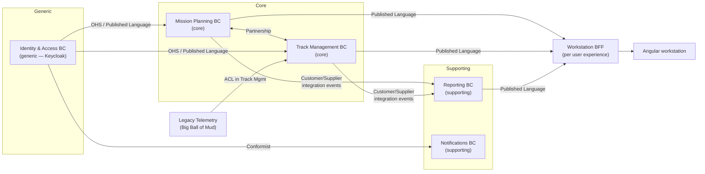

# R1 — Domain-Driven Design (DDD) research brief v0

**Created:** 2026-09-03 | **Last updated:** 2026-09-03 | **Author:** research agent under Axium (R1) | **Status:** exploratory — not doctrine

## 2. TL;DR

- **DDD is two disciplines.** *Strategic* design decides where boundaries go (subdomains, bounded contexts, context maps); *tactical* design shapes code inside one boundary (aggregates, value objects, repositories). Strategic first; tactical is optional per context. [Evans 2003]; [Vernon 2016]
- **A bounded context is a language boundary, not a deployment unit.** One model, one vocabulary, one team. Whether it ships as a package in a modular monolith or as a microservice is a separate, later decision. [Evans 2003 ch.14]; [Khononov 2021]; [Vernon & Jaskuła 2021]
- **Subdomains are discovered; bounded contexts are designed.** Find subdomains with the business (EventStorming, Domain Storytelling); then *choose* contexts, usually one per subdomain, splitting where one word means two things. [Khononov 2021]
- **The field's answer to "teams or functions?" is: business capability defines the boundary, and you then align the team to it** — the Inverse Conway Maneuver. Organising by customer group or by org-chart box produces duplicated models and an architecture that copies the reporting lines. [Conway 1968]; [ThoughtWorks Radar 2015]; [Skelton & Pais 2019]
- **Default to a modular monolith** with enforced module boundaries; extract a service only when a context has a demonstrated need (scale, isolation, cadence). The "microservice premium" is real and expensive on an air-gapped island. [Fowler 2015a/b]; [Grzybek 2019]
- **CQRS and event sourcing are per-context options, never system-wide architecture.** Use them for a core subdomain with audit/time-travel needs; skip them for CRUD-shaped supporting contexts. [Young 2010]; [Fowler 2011]; [Dudycz 2021]
- **Front end:** the same boundaries become Angular *domain libraries* with lint-enforced access rules; each context's published API contract lives in the shared `common` package; a BFF composes per *user experience*, not per context. Details in R7. [Steyer 2019/2023]; [Newman 2015]

## 3. Core concepts and vocabulary

| Term | One meaning (RR lexicon candidate) | Source |
|---|---|---|
| **Domain** | The subject area the software serves; the *problem space*. | Evans 2003 |
| **Subdomain** | A business capability inside the domain. **Core** = differentiator, most complex, changes most; **Supporting** = necessary, custom, not differentiating; **Generic** = solved problem, buy/adopt (auth, billing). | Evans 2003 ch.15; Vernon 2013; Khononov 2021 ch.1 |
| **Bounded Context (BC)** | The *solution-space* boundary inside which one model and one ubiquitous language apply consistently; explicit in team ownership, code base and schema. | Evans 2003 ch.14; Fowler 2014 |
| **Ubiquitous Language** | The rigorous vocabulary shared by experts and developers *within one BC*, used in conversation, docs, code and UI labels. A second meaning for a word signals a second context. | Evans 2003 ch.2; Fowler 2006 |
| **Context Map** | Diagram + agreement naming every BC and the *relationship pattern* between each pair (§5.2); documents team relationships as much as code. | Evans 2003 ch.14; DDD Crew |
| **Upstream / Downstream** | Direction of influence: upstream changes affect downstream; downstream cannot affect upstream. | Evans 2003; DDD Crew |
| **Entity** | Object defined by identity and continuity over time, not by attributes. | Evans 2003 ch.5; Fowler 2005 |
| **Value Object** | Immutable object defined entirely by its attributes; equality by value; replaceable, side-effect-free. | Evans 2003 ch.5; Vernon 2013 |
| **Aggregate** | Cluster of entities and value objects treated as one unit for data changes; one *root* entity is the only entry point; the transactional consistency boundary. | Evans 2003 ch.6; Fowler 2013; Vernon 2011 |
| **Repository** | Collection-like interface giving the illusion of an in-memory set of aggregates; one per aggregate root. | Evans 2003 ch.6 |
| **Factory** | Encapsulates the creation of complex aggregates so invariants hold from birth. | Evans 2003 ch.6 |
| **Domain Service** | Stateless domain operation that does not belong to any entity/value object. | Evans 2003 ch.5; Vernon 2013 ch.7 |
| **Application Service** | Thin use-case coordinator: load aggregate, call domain behaviour, commit, publish. No business rules. | Vernon 2013 ch.14 |
| **Domain Event** | Record of something business-significant that happened inside a BC, in its language; consumed in-process. | Fowler 2005b; Vernon 2013 ch.8 |
| **Integration Event** | Public, versioned event published *across* BC boundaries (part of the Published Language), usually via a broker. | Microsoft .NET guide; Khononov 2021 ch.15 |
| **Specification** | Predicate-like value object encapsulating a business rule, reusable for validation, selection and construction. | Evans & Fowler 1997 |
| **Anticorruption Layer (ACL)** | Downstream translation layer isolating your model from an upstream model you do not control. | Evans 2003 ch.14 |
| **Open Host Service / Published Language (OHS/PL)** | Upstream exposes one well-defined protocol (OHS) expressed in a documented, shared schema (PL) for any consumer. | Evans 2003 ch.14 |
| **Modular monolith** | One deployable whose internal modules have enforced boundaries and explicit interfaces; modules are the BCs. | Grzybek 2019; Newman 2019 |
| **Ports and Adapters (Hexagonal)** | Domain core exposes *ports* (interfaces); UI, DB, messaging are *adapters* plugged into them; dependencies point inward. | Cockburn 2005 |
| **BFF** | Backend-for-Frontend: a server-side façade owned by a UI team, one per user experience, composing calls across contexts. | Newman 2015 |
| **Stream-aligned team** | Team aligned to one continuous flow of value (product, capability, persona); the primary team type in Team Topologies. | Skelton & Pais 2019 |
| **Inverse Conway Maneuver** | Deliberately restructuring teams so that Conway's Law produces the architecture you want. | ThoughtWorks Radar 2015 |

## 4. Canonical sources

The canon is small. Suggested reading order for RR: **Vernon, *DDD Distilled* (2016)** — the whole picture in 170 pages; **Khononov, *Learning DDD* (2021)** — the modern, heuristic-driven version, best on subdomain-vs-context and on when *not* to use tactical patterns; **Evans (2003)** ch.14–15 as the primary strategic text, with his free **DDD Reference (2015)** for one-paragraph definitions; **Vernon, *Implementing DDD* (2013)** and **"Effective Aggregate Design" (2011)** for tactical depth; **Brandolini** and **Hofer & Schwentner** for discovery workshops; **Conway (1968)**, **Skelton & Pais (2019)** and **Tune & Perrin (2024)** for the team question; Fowler's bliki as glosses; the **DDD Crew** canvases as working tools; **Steyer** for Angular. URLs in §9.

## 5. How it is done in practice

### 5.1 Strategic design: finding the boundaries

**Step 1 — discover subdomains** (problem space). Run a **Big Picture EventStorming**: experts and engineers post orange domain-event stickies on a timeline ("Sortie approved", "Track correlated"), then add actors, external systems, commands, policies and hotspots. Boundaries *emerge* where the language shifts, where pivotal events mark hand-offs, and where different experts own different stretches of wall [Brandolini]. **Domain Storytelling** complements it: experts narrate scenarios as actor–activity–work-object pictographs; suspect a boundary where the same work object gets a different name, information flows one way, or a new trigger starts a new story [Hofer & Schwentner 2021]. Plot results on a **Core Domain Chart** (differentiation × complexity) to label core/supporting/generic [DDD Crew].

**Step 2 — design bounded contexts** (solution space). Default: one BC per subdomain. Split when one word carries two meanings ("Customer" in Sales vs Support [Fowler 2014]); merge when two candidates share so much language that a boundary only adds translation. *Subdomains are discovered, bounded contexts are designed* — the boundary is a choice you own [Khononov 2021 ch.3]. Fill a **Bounded Context Canvas** per context (purpose, classification, inbound/outbound communication, language, decisions) [DDD Crew].

**Step 3 — respect Conway.** An organisation "will produce a design whose structure is a copy of the organization's communication structure" [Conway 1968]. The corollary every DDD author repeats: **one team may own several contexts, but one context must not be shared by several teams**, because a shared context cannot keep one language [Vernon 2016 ch.2; Khononov 2021 ch.3]. If designed boundaries do not match existing teams, move the boundary or move the team — the **Inverse Conway Maneuver** [ThoughtWorks Radar 2015]. Team Topologies makes *business-domain bounded context* the preferred "fracture plane", ahead of regulatory, cadence, geography, risk, performance or persona planes [Skelton & Pais 2019 ch.6].

**The DDD Crew "Starter Modelling Process"** packages this as *Align → Discover → Decompose → Strategize → Connect → Organise → Define → Code* — a good first-iteration recipe for a team new to DDD [DDD Crew].

### 5.2 Context-map relationship patterns

| Pattern | Team relationship | What it means | Use when |
|---|---|---|---|
| **Partnership** | Mutually dependent | Two teams succeed or fail together; joint planning, coordinated releases. | Two core contexts that must ship in lock-step. |
| **Shared Kernel** | Mutually dependent | A small, explicit subset of model + code both teams own; no change without consulting the other. | Identity types, money, units — kept *tiny*. |
| **Customer / Supplier** | Upstream → Downstream | Downstream is a customer whose needs enter upstream's planning; acceptance tests protect the contract. | Cooperative teams with a clear provider. |
| **Conformist** | Upstream → Downstream | Downstream adopts upstream's model wholesale; zero translation, zero influence. | Upstream is good enough and will not negotiate (a vendor or platform). |
| **Anticorruption Layer** | Upstream → Downstream | Downstream builds a translation façade so upstream's model never leaks in. | Legacy or external systems; any Big Ball of Mud. |
| **Open Host Service** | Upstream → Downstream | Upstream publishes one protocol for all consumers instead of bespoke integrations. | A context with many consumers. |
| **Published Language** | Upstream → Downstream (paired with OHS) | The documented, versioned schema of that protocol (JSON schema, OpenAPI, Avro, shared TS types). | Always, for an OHS. |
| **Separate Ways** | Free | No integration at all; duplicate the small overlap. | Integration cost exceeds the value. |
| **Big Ball of Mud** | — | Boundary drawn *around* a mess to stop it propagating; never model inside it. | Marking legacy honestly. |

Sources: [Evans 2003 ch.14]; [Evans 2015 DDD Reference, which adds Partnership and Big Ball of Mud]; [DDD Crew context-mapping cheat sheet]; [Foote & Yoder 1997].



*Illustrative only — RR's real contexts come out of a Big Picture EventStorming with the island owners, not from this brief.*

### 5.3 Tactical design inside one context

Tactical DDD is a toolbox for a *complex core*; Khononov is explicit that supporting/generic contexts are often better served by a transaction script or active record, and that applying aggregates everywhere is a classic failure [Khononov 2021 ch.5–6, ch.10].

- **Entities and value objects** are the vocabulary made into types. Prefer value objects: they are immutable, compare by value, and carry behaviour (`Coordinate.distanceTo`, `Classification.dominates`). [Evans 2003 ch.5; Vernon 2013 ch.6]
- **Aggregates** are consistency boundaries, not object graphs. Vernon's four rules: (1) model *true* invariants in consistency boundaries; (2) design small aggregates; (3) reference other aggregates by identity only; (4) use eventual consistency outside the boundary. One transaction touches one aggregate. [Vernon 2011; Fowler 2013]
- **Repositories** load/save whole aggregates by root id; **factories** build valid ones; **domain services** hold stateless logic spanning aggregates (a deconfliction rule); **application services** are the use-case layer — `approveSortie(cmd)` = load → call → save → publish — with no rules of their own. [Evans 2003 ch.6; Vernon 2013 ch.7, 14]
- **Domain events vs integration events.** A domain event is raised by an aggregate, handled in-process, and may carry private detail. An integration event is the *public*, versioned form published to other contexts, via a transactional outbox so publish cannot outrun commit. Never leak domain events across a boundary unchanged. [Microsoft .NET guide; Khononov 2021 ch.9, 15; the bus is R3's topic]
- **Specifications** keep composable business predicates out of repositories and controllers. [Evans & Fowler 1997]

**Hosting shape.** **Hexagonal / Ports and Adapters** [Cockburn 2005], **Onion** [Palermo 2008] and **Clean Architecture** [Martin 2012] all say one thing: *domain in the middle, dependencies point inward, I/O at the edge*; Evans' **Layered Architecture** is the same idea before dependency inversion [Evans 2003 ch.4]. Bogard's **Vertical Slice** critique — strict layers become ceremony; organise by use case [Bogard 2018] — is why the common compromise is one folder per BC with `domain/ application/ infrastructure/ interface/` and per-use-case slices inside `application/`.

**CQRS and event sourcing — when NOT to.** CQRS "is not a top-level architecture" [Young 2010]; Fowler: "you should be very cautious about using CQRS", it "adds risky complexity" for most systems [Fowler 2011]. Event sourcing "should be considered at the module level" — skip it for CRUD-shaped or supporting modules; adopt it where audit, temporal queries or complex workflows justify it [Dudycz 2021; Khononov 2021 ch.7].

### 5.4 Deployment shape: modular monolith vs microservices

The honest answer to "one bounded context = one deployable?" is **no, not necessarily — but a deployable should never contain *half* a context.** Vernon: "you can think of either a monolithic module as being a bounded context, or think of a microservice as being a bounded context — this is the way that we deploy things" [Vernon & Jaskuła 2021]. Khononov: every microservice is a bounded context, not every bounded context is a microservice; the BC is the *widest* safe service boundary, the aggregate the narrowest [Khononov 2021 ch.14]. Evans now distinguishes "service-internal" contexts from "clusters of co-designed services" forming one context [Evans, DDD Europe 2019].

**Field guidance:** start with a **modular monolith** — one deployable, modules = BCs, boundaries enforced by tooling, integration through explicit interfaces and in-process events [Grzybek 2019; Newman 2019; Fowler 2015a]. "Don't even consider microservices unless you have a system that's too complex to manage as a monolith" [Fowler 2015b], and the prerequisites (rapid provisioning, monitoring, rapid deployment) must exist first [Fowler 2014]. Tilkov's counter — monolith boundaries rarely survive extraction [Tilkov 2015] — is exactly why the *modular* discipline (package boundaries, no shared tables, events not method calls across modules) matters from day one.

### 5.5 DDD in TypeScript / Node

There is no dominant TS DDD framework; the ecosystem is conventions plus enforcement. The reference layouts (Sairyss's *domain-driven-hexagon*, Stemmler's DDD-with-TypeScript series) converge on:

```
packages/
  contexts/
    mission-planning/          # one npm workspace package = one BC  (@rr/ctx-mission-planning)
      package.json             # "exports": { ".": "./src/index.ts" }  ← only the public API
      src/
        index.ts               # published language: DTOs, commands, integration-event types, ports
        domain/                # entities, value objects, aggregates, domain events, specs
        application/           # use cases / application services, command+query handlers
        infrastructure/        # repositories (Postgres), outbox, adapters
        interface/             # Express router, message consumers
  common/                      # @rr/common: shared kernel (ids, money, classification) + PL contracts
apps/
  gateway/                     # Node 22 + Express: mounts each context's router; the BFF lives here
  web/                         # Angular 22
```

- **npm workspaces** give each BC a package identity; the package's `exports` map is the *enforced* public API — anything not exported is unreachable.
- **Boundary enforcement**: `dependency-cruiser` rules ("domain may not import infrastructure", "a context may only import another context's `index.ts`") and/or `eslint-plugin-boundaries`, run in the local gate.
- **Libraries:** `@nestjs/cqrs` (command/query/event buses, sagas) if NestJS is adopted; otherwise small helpers (`type-ddd`, `@node-ts/ddd`) or hand-rolled `Entity` / `ValueObject` / `AggregateRoot` base classes — the field's usual choice, since they are ~100 lines.
- **Contracts as code:** define each Published Language as Zod schemas in `common`, derive TS types, validate at the boundary; gateway and Angular import the *same* schema.

### 5.6 Briefly: Java and Python

**Java.** **Spring Modulith** turns a Spring Boot app into a modular monolith: each top-level package is a module, only its root package is public, `ApplicationModules.verify()` fails the build on illegal dependencies, and an event-publication registry gives transactional in-process events [Spring Modulith docs — direct fetch blocked in-session]. **jMolecules** supplies `@AggregateRoot`, `@Entity`, `@ValueObject`, `@Repository`, `@DomainEvent` plus layered/onion/hexagonal annotations verified by ArchUnit [xmolecules]. **Axon** is the CQRS/event-sourcing framework (`@Aggregate`, `@CommandHandler`, `@EventSourcingHandler`, buses) [AxonIQ]. **Python.** Percival & Gregory, *Architecture Patterns with Python* (O'Reilly 2020, free online) covers repository, unit of work, service layer, aggregates, message bus and CQRS in plain Python [UNVERIFIED — site blocked]; Bywater's `eventsourcing` library covers event-sourced aggregates [PyPI].

### 5.7 How boundaries propagate to the front end (seams only — R7 goes deep)

- **The context boundary is also a front-end boundary.** Steyer slices the Angular workspace by *domain* (= bounded context), and each domain by library type — `feature` (smart, use-case components), `ui` (dumb components), `domain`/`data` (models, facades, SignalStores, API access), `util`, a `shell` owning the domain's routes, and an `api` library that is the *only* thing other domains may import — enforced by Sheriff or Nx `enforce-module-boundaries` [Steyer 2019a/b, 2023]. It is the front-end twin of the `exports` map in §5.5.
- **"A UI per bounded context?"** Not literally: users work across contexts, so the *shell* composes domain features into one workstation. Micro-frontends (an independently deployable UI per context) are the extreme form and pay their own premium [Jackson 2019]; Steyer's "Modulith" (one Angular deployable, domain-sliced) is the default.
- **Published Language is the front-end contract.** Each context's `index.ts` DTOs / Zod schemas live in `common` and are imported by the Angular domain library; the front end never sees a context's entities, only its read models and commands.
- **BFF composes per user experience, not per context.** Newman's rule: one BFF per UI, owned by the UI team, aggregating calls across contexts; a shared "general-purpose BFF" degrades into an API gateway [Newman 2015; URL unverified in-session]. In RR the Express gateway is the natural BFF host.
- **State follows the boundary.** One SignalStore per domain library holding that context's read models; cross-context state only via the shell. R7 covers task-based and permission-aware UI and the tier model.

### 5.8 Teams or functions — the question Graham is wrestling with

**The field's answer, with sources:** *business capabilities (functions) define the boundaries; teams are then aligned to those boundaries.*

- Conway's Law says the org will stamp itself on the architecture regardless [Conway 1968]; Lewis & Fowler therefore prescribe services "organized around business capabilities" with cross-functional teams to match [2014]; ThoughtWorks names the deliberate version the Inverse Conway Maneuver [Radar 2015]; Team Topologies is a book-length treatment of it, with business-domain bounded context as the preferred fracture plane and the stream-aligned team as owner [Skelton & Pais 2019]; Tune & Perrin make software–strategy–structure alignment the whole thesis [2024].
- Khononov supplies the why: a subdomain is a business capability, a bounded context is a designed boundary around a model, and the *team* is aligned to both — never the starting point [Khononov 2021 ch.1, 3].

**Trade-offs, honestly.**

| Boundary chosen by | Gains | Costs |
|---|---|---|
| **Business capability** (recommended) | Stable — capabilities change slower than org charts; one model per concept; independent evolution; teams can be re-formed around it. | Requires org change (someone must own "Track Management" end-to-end); initially unfamiliar to customers who think in their own groups. |
| **Existing team / org unit** | Zero re-org; matches current budgets and approval chains. | Copies today's politics into the code; duplicated "Customer" / "Mission" models per team; the org chart moves and the code cannot follow. |
| **Customer group / persona** | Each group gets a tailored product; simple accountability. | Every group re-implements the shared capabilities; N copies of Identity, Reporting, Notification drift apart; the *shared* core has no owner. Team Topologies treats persona as a *secondary* fracture plane. |

Practical synthesis: capabilities define the *backend* contexts; personas/customer groups organise the *front end and BFF* layer (a workstation per user experience composing shared contexts) — the seam R7's Building/Floor/Suite/Office model must formalise.

## 6. Trade-offs, anti-patterns, failure modes

- **Tactical-only DDD** (aggregates everywhere, no context map) — the most common failure; the value is in the boundaries [Vernon 2016; Khononov 2021].
- **Anemic domain model** — entities as getter/setter bags with logic in services; an anti-pattern for a complex core, acceptable in supporting contexts [Fowler; Vernon 2013 ch.1].
- **Shared kernel creep** — `common` grows into a god-package that every context imports; keep it to identifiers, units and *contracts*, never behaviour.
- **Big aggregates / multi-aggregate transactions** — lock contention and lost invariants; apply Vernon's four rules [Vernon 2011].
- **Leaking domain events as integration events** — couples every consumer to your internals; version a public event schema instead.
- **Distributed monolith** — extracting services without first having clean modules; the worst of both shapes [Tilkov 2015; Newman 2019].
- **System-wide CQRS/ES** — Young, Fowler and Dudycz all warn against it; apply per module [Young 2010; Fowler 2011; Dudycz 2021].
- **Org-chart boundaries** — see §5.8.
- **Skipping discovery** — designing contexts from a requirements document rather than with experts [Brandolini].

## 7. RR lens

- **Isolated islands favour the modular monolith.** No internet, no agent access, one-way bundle transfer and human-executable set-up raise the microservice premium (provisioning, monitoring, per-service pipelines) to prohibitive levels. Design direction: **one gateway deployable per island hosting all BCs as `@rr/ctx-*` workspace packages**, boundaries enforced in the local gate, in-process events behind an outbox so a broker (R3) can arrive later without touching context code.
- **Stack fit.** npm workspaces + `@rr/*` scope (ADR-004) map 1:1 to "one package per BC"; `common` is the natural home for the shared kernel *and* every Published Language; Node 22 + Express hosts gateway and BFF; Angular 22 + SignalStore + Sheriff/Nx boundaries realise the same slicing in the client. Nothing depends on the v19-vs-v22 decision (DR-04).
- **Two-island synchronisation** is easier when contexts are packages: the context map, with Published Language versions, is the manifest of what must move together in a bundle. Check it in; do not leave it on a whiteboard.
- **Defence context.** Identity & Access and security markings are **generic subdomains** — adopt (Keycloak, R4/R5), integrate as **Conformist** or via a thin ACL, never re-model. Legacy Island systems are honest **Big Balls of Mud** behind ACLs. Classification types belong in the shared kernel.
- **Building / Floor / Suite / Office.** The tiers are a *front-end* hierarchy; DDD supplies the *backend* contexts they compose. Expect a Floor ≈ persona/user-experience (one BFF) and a Suite/Office to compose feature libraries from several contexts — R7's seam.

## 8. Open questions for Graham

1. Who are the domain experts per island, and can a Big Picture EventStorming be run with them (on paper if needed) before contexts are fixed?
2. Which subdomains are genuinely *core* for RR — what would the programme lose competitively if they were bought?
3. Is there any capability that must run in a separate process for security or accreditation reasons (a forced microservice), or can everything start in one gateway?
4. Do the customer groups on the islands share business capabilities (argues for capability-aligned contexts + persona-aligned BFFs) or are they truly separate businesses (argues for Separate Ways)?
5. Which Legacy Island systems will Desert Island integrate with, and does the change-control regime allow an ACL on the Desert side only?
6. Will there be more than one team per island? With one team Conway is moot for now — but draw package boundaries as if teams will follow.
7. Is a broker permitted on the islands at all (R3), or must cross-context integration stay in-process for the first milestones?

## 9. Sources

Primary books and papers
- Evans, E. *Domain-Driven Design: Tackling Complexity in the Heart of Software*, Addison-Wesley 2003, ISBN 978-0321125217. https://www.dddcommunity.org/book/evans_2003/
- Evans, E. *Domain-Driven Design Reference: Definitions and Pattern Summaries*, Domain Language 2015 (CC-BY 4.0). https://www.domainlanguage.com/wp-content/uploads/2016/05/DDD_Reference_2015-03.pdf
- Evans, E. *Getting Started with DDD When Surrounded by Legacy Systems*, Domain Language 2013. https://www.domainlanguage.com/wp-content/uploads/2016/04/GettingStartedWithDDDWhenSurroundedByLegacySystemsV1.pdf
- Evans, E. Keynote "Language in Context", DDD Europe 2019. https://www.youtube.com/watch?v=xyuKx5HsGK8
- Evans, E. & Fowler, M. "Specifications", 1997. https://martinfowler.com/apsupp/spec.pdf
- Vernon, V. *Implementing Domain-Driven Design*, Addison-Wesley 2013, ISBN 978-0321834577.
- Vernon, V. *Domain-Driven Design Distilled*, Addison-Wesley 2016, ISBN 978-0134434421.
- Vernon, V. "Effective Aggregate Design" Parts I–III, 2011. https://www.dddcommunity.org/wp-content/uploads/files/pdf_articles/Vernon_2011_1.pdf (…_2.pdf, …_3.pdf)
- Vernon, V. & Jaskuła, T. *Strategic Monoliths and Microservices*, Addison-Wesley 2021, ISBN 978-0137355464.
- Khononov, V. *Learning Domain-Driven Design*, O'Reilly 2021, ISBN 978-1098100131.
- Khononov, V. *Balancing Coupling in Software Design*, Addison-Wesley 2024, ISBN 978-0137353484.
- Brandolini, A. *Introducing EventStorming*, Leanpub (first blog post 2013). https://leanpub.com/introducing_eventstorming ; https://www.eventstorming.com/book/
- Hofer, S. & Schwentner, H. *Domain Storytelling*, Addison-Wesley 2021, ISBN 978-0137458912. https://domainstorytelling.org
- Skelton, M. & Pais, M. *Team Topologies*, IT Revolution 2019, ISBN 978-1942788812. https://teamtopologies.com/book
- Tune, N. & Perrin, J.-G. *Architecture Modernization*, Manning 2024, ISBN 978-1633438156. https://www.manning.com/books/architecture-modernization
- Conway, M. "How Do Committees Invent?", *Datamation*, April 1968. https://www.melconway.com/Home/Committees_Paper.html
- Foote, B. & Yoder, J. "Big Ball of Mud", PLoP 1997. https://www.laputan.org/mud/
- Young, G. *CQRS Documents*, 2010. https://cqrs.wordpress.com/wp-content/uploads/2010/11/cqrs_documents.pdf (the "not a top-level architecture" line is quoted in Microsoft's CQRS Journey, https://github.com/microsoftarchive/cqrs-journey/blob/master/docs/Reference_02_CQRSIntroduction.markdown)
- Cockburn, A. "Hexagonal Architecture", 2005. https://alistair.cockburn.us/hexagonal-architecture/
- Palermo, J. "The Onion Architecture", 2008. https://jeffreypalermo.com/tag/onion-architecture/
- Martin, R. "The Clean Architecture", 2012. https://blog.cleancoder.com/uncle-bob/2012/08/13/the-clean-architecture.html
- Bogard, J. "Vertical Slice Architecture", 2018. https://www.jimmybogard.com/vertical-slice-architecture/
- Percival, H. & Gregory, B. *Architecture Patterns with Python*, O'Reilly 2020. https://www.cosmicpython.com/ [UNVERIFIED in-session — domain blocked]

Fowler bliki / martinfowler.com (direct fetch blocked in-session; dates confirmed via index)
- "Bounded Context" (2014-01-15) https://martinfowler.com/bliki/BoundedContext.html · "Ubiquitous Language" (2006-10-31) https://martinfowler.com/bliki/UbiquitousLanguage.html · "DDD Aggregate" (2013-04-23) https://martinfowler.com/bliki/DDD_Aggregate.html · "Evans Classification" (2005-12-14) https://martinfowler.com/bliki/EvansClassification.html · "Anemic Domain Model" https://martinfowler.com/bliki/AnemicDomainModel.html · "Domain Event" (2005-12-12) https://martinfowler.com/eaaDev/DomainEvent.html · "CQRS" (2011-07-14) https://martinfowler.com/bliki/CQRS.html · "Monolith First" (2015) https://martinfowler.com/bliki/MonolithFirst.html · "Microservice Premium" (2015-05-13) https://martinfowler.com/bliki/MicroservicePremium.html · "Microservice Prerequisites" (2014) https://martinfowler.com/bliki/MicroservicePrerequisites.html · "Presentation Domain Data Layering" (2015-08-26) https://martinfowler.com/bliki/PresentationDomainDataLayering.html · "Conway's Law" https://martinfowler.com/bliki/ConwaysLaw.html · Lewis & Fowler "Microservices" (2014) https://martinfowler.com/articles/microservices.html · Tilkov "Don't start with a monolith" (2015-06-09) https://martinfowler.com/articles/dont-start-monolith.html · Jackson "Micro Frontends" (2019-06-19) https://martinfowler.com/articles/micro-frontends.html · Robinson "Consumer-Driven Contracts" (2006) https://martinfowler.com/articles/consumerDrivenContracts.html

Working tools and cheat sheets
- DDD Crew: Context Mapping cheat sheet https://github.com/ddd-crew/context-mapping · Bounded Context Canvas https://github.com/ddd-crew/bounded-context-canvas · Core Domain Charts https://github.com/ddd-crew/core-domain-charts · Aggregate Design Canvas https://github.com/ddd-crew/aggregate-design-canvas · Starter Modelling Process https://github.com/ddd-crew/ddd-starter-modelling-process
- ThoughtWorks Technology Radar, "Inverse Conway Maneuver" (Trial, Jan 2015). https://www.thoughtworks.com/radar/techniques/inverse-conway-maneuver
- Plöd, M. *Hands-on Domain-driven Design — by example*, Leanpub. https://leanpub.com/ddd-by-example
- Dudycz, O. "When not to use Event Sourcing?", 2021-06-23. https://event-driven.io/en/when_not_to_use_event_sourcing/
- Microsoft, "Domain events: design and implementation" (.NET microservices guide). https://learn.microsoft.com/en-us/dotnet/architecture/microservices/microservice-ddd-cqrs-patterns/domain-events-design-implementation ; "Anti-corruption Layer pattern" https://learn.microsoft.com/en-us/azure/architecture/patterns/anti-corruption-layer
- Newman, S. "Backends For Frontends", 2015. https://samnewman.io/patterns/architectural/bff/ [URL UNVERIFIED in-session — domain blocked]
- Grzybek, K. "Modular Monolith: A Primer", 2019, https://www.kamilgrzybek.com/blog/categories/modular-monolith ; reference repo https://github.com/kgrzybek/modular-monolith-with-ddd
- Newman, S. *Monolith to Microservices*, O'Reilly 2019; *Building Microservices* 2e, O'Reilly 2021. [editions UNVERIFIED in-session]

Front end (Angular)
- Steyer, M. "Sustainable Angular Architectures 1: Strategic Design" https://www.angulararchitects.io/blog/sustainable-angular-architectures-1/ ; "2: Implementing your Strategic Design with Angular and Nx" https://www.angulararchitects.io/blog/sustainable-angular-architectures-2/ ; "Modern Architectures with Angular – Part 1: Strategic Design with Sheriff and Standalone Components" https://www.angulararchitects.io/en/blog/modern-architectures-with-angular-part-1-strategic-design-with-sheriff-and-standalone-components/ ; "DDD in Angular & Frontend Architecture" https://www.angulararchitects.io/blog/all-about-ddd-for-frontend-architectures-with-angular-co/ ; free ebook *Enterprise Angular: Micro Frontends and Moduliths* https://www.angulararchitects.io/en/ebooks/micro-frontends-and-moduliths-with-angular/
- `@angular-architects/ddd` Nx plugin https://github.com/angular-architects/nx-ddd-plugin · Sheriff https://github.com/softarc-consulting/sheriff · Nx "Enforce Module Boundaries" https://nx.dev/docs/features/enforce-module-boundaries

Implementation references (server)
- Spring Modulith reference docs https://docs.spring.io/spring-modulith/reference/ [direct fetch blocked in-session] · jMolecules https://github.com/xmolecules/jmolecules · Axon Framework reference, "Aggregates" https://docs.axoniq.io/axon-framework-reference/4.13/axon-framework-commands/modeling/aggregate/ · NestJS CQRS recipe https://docs.nestjs.com/recipes/cqrs · Sairyss *domain-driven-hexagon* https://github.com/Sairyss/domain-driven-hexagon · Stemmler, "Domain-Driven Design w/ TypeScript" https://khalilstemmler.com/articles/domain-driven-design-intro/ · `type-ddd` https://www.npmjs.com/package/types-ddd · `@node-ts/ddd` https://github.com/node-ts/ddd · dependency-cruiser https://github.com/sverweij/dependency-cruiser · eslint-plugin-boundaries https://github.com/javierbrea/eslint-plugin-boundaries · Bywater, `eventsourcing` (Python) https://pypi.org/project/eventsourcing/
