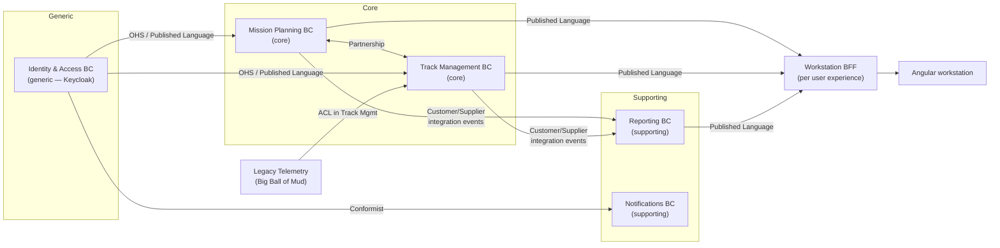

# R1 — Domain-Driven Design (DDD) research brief v0

**Created:** 2026-09-03 | **Last updated:** 2026-09-03, pass 2 (modernization) | **Author:** research agent under Axium (R1) | **Status:** exploratory — not doctrine

> **Two clocks.** DDD *concepts* below cite their canonical sources whatever their age (Evans 2003, Vernon 2013 remain the concept clock). Every *implementation idiom* — how a package, gateway, schema, store, resource or form is written — is restated in the 2026 idiom and verified against the primary docs of the target majors on 2026-09-03 (README §Currency contract). The Modernization ledger at the end records what changed.

## 2. TL;DR

- **DDD is two disciplines.** *Strategic* design decides where boundaries go (subdomains, bounded contexts, context maps); *tactical* design shapes code inside one boundary (aggregates, value objects, repositories). Strategic first; tactical is optional per context. [Evans 2003]; [Vernon 2016]
- **A bounded context is a language boundary, not a deployment unit.** One model, one vocabulary, one team. Whether it ships as a package in a modular monolith or as a microservice is a separate, later decision. [Evans 2003 ch.14]; [Khononov 2021]; [Vernon & Jaskuła 2021]
- **Subdomains are discovered; bounded contexts are designed.** Find subdomains with the business (EventStorming, Domain Storytelling); then *choose* contexts, usually one per subdomain, splitting where one word means two things. [Khononov 2021]
- **The field's answer to "teams or functions?" is: business capability defines the boundary, and you then align the team to it** — the Inverse Conway Maneuver. Organising by customer group or by org-chart box produces duplicated models and an architecture that copies the reporting lines. [Conway 1968]; [ThoughtWorks Radar 2015]; [Skelton & Pais 2019]
- **Default to a modular monolith** with enforced module boundaries; extract a service only when a context has a demonstrated need (scale, isolation, cadence). The "microservice premium" is real and expensive on an air-gapped island. [Fowler 2015a/b]; [Grzybek 2019]
- **In 2026 a bounded context in TypeScript is an ESM npm-workspace package whose `exports` map is its Open Host Service**, written in erasable TypeScript that Node 22/24 runs unbuilt (type stripping: default since 22.18, stable since 24.12), typed by TypeScript 6.0 (`strict`/ESM defaults, `erasableSyntaxOnly` + `verbatimModuleSyntax`), fronted by Express 5, with Zod 4 schemas as the Published Language. Module boundaries are enforced by Sheriff 0.19 / dependency-cruiser 18 in the local gate — `exports` alone "is not a strong encapsulation" [Node packages doc]. §5.5
- **CQRS and event sourcing are per-context options, never system-wide architecture.** Use them for a core subdomain with audit/time-travel needs; skip them for CRUD-shaped supporting contexts. [Young 2010]; [Fowler 2011]; [Dudycz 2021]
- **Front end:** the same boundaries become Angular *domain libraries* with lint-enforced access rules; each context's Published Language lives in the shared `common` package and is consumed by `httpResource`/`resource` (stable in v22) and one NgRx SignalStore per domain library — signal-first, zoneless (default since v21), `OnPush` (default since v22), Signal Forms for command forms (public API in v22). A BFF composes per *user experience*, not per context. Details in R7. [Steyer 2019/2023]; [Newman 2015]; [Angular v22 / NgRx 22 docs, verified]

## 3. Core concepts and vocabulary

| Term | One meaning (RR lexicon candidate) | Source |
|---|---|---|
| **Domain** | The subject area the software serves; the *problem space*. | Evans 2003 |
| **Subdomain** | A business capability inside the domain. **Core** = differentiator, most complex, changes most; **Supporting** = necessary, custom, not differentiating; **Generic** = solved problem, buy/adopt (auth, billing). | Evans 2003 ch.15; Vernon 2013; Khononov 2021 ch.1 |
| **Bounded Context (BC)** | The *solution-space* boundary inside which one model and one ubiquitous language apply consistently; explicit in team ownership, code base and schema. | Evans 2003 ch.14; Fowler 2014 |
| **Ubiquitous Language** | The rigorous vocabulary shared by experts and developers *within one BC*, used in conversation, docs, code and UI labels. A second meaning for a word signals a second context. | Evans 2003 ch.2; Fowler 2006 |
| **Context Map** | Diagram + agreement naming every BC and the *relationship pattern* between each pair (§5.2); documents team relationships as much as code. | Evans 2003 ch.14; DDD Crew |
| **Upstream / Downstream** | Direction of influence: upstream changes affect downstream; downstream cannot affect upstream. | Evans 2003; DDD Crew |
| **Entity** | Object defined by identity and continuity over time, not by attributes. | Evans 2003 ch.5; Fowler 2005 |
| **Value Object** | Immutable object defined entirely by its attributes; equality by value; replaceable, side-effect-free. | Evans 2003 ch.5; Vernon 2013 |
| **Aggregate** | Cluster of entities and value objects treated as one unit for data changes; one *root* entity is the only entry point; the transactional consistency boundary. | Evans 2003 ch.6; Fowler 2013; Vernon 2011 |
| **Repository** | Collection-like interface giving the illusion of an in-memory set of aggregates; one per aggregate root. | Evans 2003 ch.6 |
| **Factory** | Encapsulates the creation of complex aggregates so invariants hold from birth. | Evans 2003 ch.6 |
| **Domain Service** | Stateless domain operation that does not belong to any entity/value object. | Evans 2003 ch.5; Vernon 2013 ch.7 |
| **Application Service** | Thin use-case coordinator: load aggregate, call domain behaviour, commit, publish. No business rules. | Vernon 2013 ch.14 |
| **Domain Event** | Record of something business-significant that happened inside a BC, in its language; consumed in-process. | Fowler 2005b; Vernon 2013 ch.8 |
| **Integration Event** | Public, versioned event published *across* BC boundaries (part of the Published Language), usually via a broker. | Microsoft .NET guide; Khononov 2021 ch.15 |
| **Specification** | Predicate-like value object encapsulating a business rule, reusable for validation, selection and construction. | Evans & Fowler 1997 |
| **Anticorruption Layer (ACL)** | Downstream translation layer isolating your model from an upstream model you do not control. | Evans 2003 ch.14 |
| **Open Host Service / Published Language (OHS/PL)** | Upstream exposes one well-defined protocol (OHS) expressed in a documented, shared schema (PL) for any consumer. | Evans 2003 ch.14 |
| **Modular monolith** | One deployable whose internal modules have enforced boundaries and explicit interfaces; modules are the BCs. | Grzybek 2019; Newman 2019 |
| **Ports and Adapters (Hexagonal)** | Domain core exposes *ports* (interfaces); UI, DB, messaging are *adapters* plugged into them; dependencies point inward. | Cockburn 2005 |
| **BFF** | Backend-for-Frontend: a server-side façade owned by a UI team, one per user experience, composing calls across contexts. | Newman 2015 |
| **Stream-aligned team** | Team aligned to one continuous flow of value (product, capability, persona); the primary team type in Team Topologies. | Skelton & Pais 2019 |
| **Inverse Conway Maneuver** | Deliberately restructuring teams so that Conway's Law produces the architecture you want. | ThoughtWorks Radar 2015 |
| **Read model** | A query-side projection shaped for one consumer (a screen, a report), served instead of aggregates; the thing a front end fetches. | Young 2010; Vernon 2013 ch.4 |
| **Transactional outbox** | Events written in the same transaction as the aggregate change, relayed to consumers afterwards, so publication cannot outrun commit. | Khononov 2021 ch.9; Spring Modulith *Event Publication Registry* |

## 4. Canonical sources

The canon is small. Suggested reading order for RR: **Vernon, *DDD Distilled* (2016)** — the whole picture in 170 pages; **Khononov, *Learning DDD* (2021)** — the modern, heuristic-driven version, best on subdomain-vs-context and on when *not* to use tactical patterns; **Evans (2003)** ch.14–15 as the primary strategic text, with his free **DDD Reference (2015)** for one-paragraph definitions; **Vernon, *Implementing DDD* (2013)** and **"Effective Aggregate Design" (2011)** for tactical depth; **Brandolini** and **Hofer & Schwentner** for discovery workshops; **Conway (1968)**, **Skelton & Pais (2019)** and **Tune & Perrin (2024)** for the team question; Fowler's bliki as glosses; the **DDD Crew** canvases as working tools; **Steyer** for Angular. URLs in §9.

**Idiom clock (dated, primary — §9 group B):** the Node.js `packages` and `typescript` API docs (v24.x / v22.x branches), the TypeScript 6.0 and 5.8 release notes, Express's `History.md`, Zod's repository, the `angular/angular` `adev` guides and `CHANGELOG.md`, the `ngrx/platform` SignalStore guide and `modules/signals` source, the Sheriff / dependency-cruiser / eslint-plugin-boundaries / Nx docs, Spring Modulith's Antora docs, and the npm / PyPI / Maven Central registries — all read on 2026-09-03.

## 5. How it is done in practice

### 5.1 Strategic design: finding the boundaries

**Step 1 — discover subdomains** (problem space). Run a **Big Picture EventStorming**: experts and engineers post orange domain-event stickies on a timeline ("Sortie approved", "Track correlated"), then add actors, external systems, commands, policies and hotspots. Boundaries *emerge* where the language shifts, where pivotal events mark hand-offs, and where different experts own different stretches of wall [Brandolini]. **Domain Storytelling** complements it: experts narrate scenarios as actor–activity–work-object pictographs; suspect a boundary where the same work object gets a different name, information flows one way, or a new trigger starts a new story [Hofer & Schwentner 2021]. Plot results on a **Core Domain Chart** (differentiation × complexity) to label core/supporting/generic [DDD Crew].

**Step 2 — design bounded contexts** (solution space). Default: one BC per subdomain. Split when one word carries two meanings ("Customer" in Sales vs Support [Fowler 2014]); merge when two candidates share so much language that a boundary only adds translation. *Subdomains are discovered, bounded contexts are designed* — the boundary is a choice you own [Khononov 2021 ch.3]. Fill a **Bounded Context Canvas** per context (purpose, classification, inbound/outbound communication, language, decisions) [DDD Crew].

**Step 3 — respect Conway.** An organisation "will produce a design whose structure is a copy of the organization's communication structure" [Conway 1968]. The corollary every DDD author repeats: **one team may own several contexts, but one context must not be shared by several teams**, because a shared context cannot keep one language [Vernon 2016 ch.2; Khononov 2021 ch.3]. If designed boundaries do not match existing teams, move the boundary or move the team — the **Inverse Conway Maneuver** [ThoughtWorks Radar 2015]. Team Topologies makes *business-domain bounded context* the preferred "fracture plane", ahead of regulatory, cadence, geography, risk, performance or persona planes [Skelton & Pais 2019 ch.6].

**The DDD Crew "Starter Modelling Process"** packages this as *Align → Discover → Decompose → Strategize → Connect → Organise → Define → Code* — a good first-iteration recipe for a team new to DDD [DDD Crew].

### 5.2 Context-map relationship patterns

| Pattern | Team relationship | What it means | Use when |
|---|---|---|---|
| **Partnership** | Mutually dependent | Two teams succeed or fail together; joint planning, coordinated releases. | Two core contexts that must ship in lock-step. |
| **Shared Kernel** | Mutually dependent | A small, explicit subset of model + code both teams own; no change without consulting the other. | Identity types, money, units — kept *tiny*. |
| **Customer / Supplier** | Upstream → Downstream | Downstream is a customer whose needs enter upstream's planning; acceptance tests protect the contract. | Cooperative teams with a clear provider. |
| **Conformist** | Upstream → Downstream | Downstream adopts upstream's model wholesale; zero translation, zero influence. | Upstream is good enough and will not negotiate (a vendor or platform). |
| **Anticorruption Layer** | Upstream → Downstream | Downstream builds a translation façade so upstream's model never leaks in. | Legacy or external systems; any Big Ball of Mud. |
| **Open Host Service** | Upstream → Downstream | Upstream publishes one protocol for all consumers instead of bespoke integrations. | A context with many consumers. |
| **Published Language** | Upstream → Downstream (paired with OHS) | The documented, versioned schema of that protocol (JSON schema, OpenAPI, Avro, shared TS types). | Always, for an OHS. |
| **Separate Ways** | Free | No integration at all; duplicate the small overlap. | Integration cost exceeds the value. |
| **Big Ball of Mud** | — | Boundary drawn *around* a mess to stop it propagating; never model inside it. | Marking legacy honestly. |

Sources: [Evans 2003 ch.14]; [Evans 2015 DDD Reference, which adds Partnership and Big Ball of Mud]; [DDD Crew context-mapping cheat sheet]; [Foote & Yoder 1997].



*Illustrative only — RR's real contexts come out of a Big Picture EventStorming with the island owners, not from this brief.*

### 5.3 Tactical design inside one context

Tactical DDD is a toolbox for a *complex core*; Khononov is explicit that supporting/generic contexts are often better served by a transaction script or active record, and that applying aggregates everywhere is a classic failure [Khononov 2021 ch.5–6, ch.10].

- **Entities and value objects** are the vocabulary made into types. Prefer value objects: they are immutable, compare by value, and carry behaviour (`Coordinate.distanceTo`, `Classification.dominates`). [Evans 2003 ch.5; Vernon 2013 ch.6]
- **Aggregates** are consistency boundaries, not object graphs. Vernon's four rules: (1) model *true* invariants in consistency boundaries; (2) design small aggregates; (3) reference other aggregates by identity only; (4) use eventual consistency outside the boundary. One transaction touches one aggregate. [Vernon 2011; Fowler 2013]
- **Repositories** load/save whole aggregates by root id; **factories** build valid ones; **domain services** hold stateless logic spanning aggregates (a deconfliction rule); **application services** are the use-case layer — `approveSortie(cmd)` = load → call → save → publish — with no rules of their own. [Evans 2003 ch.6; Vernon 2013 ch.7, 14]
- **Domain events vs integration events.** A domain event is raised by an aggregate, handled in-process, and may carry private detail. An integration event is the *public*, versioned form published to other contexts, via a transactional outbox so publish cannot outrun commit. Never leak domain events across a boundary unchanged. [Microsoft .NET guide; Khononov 2021 ch.9, 15; the bus is R3's topic]
- **Specifications** keep composable business predicates out of repositories and controllers. [Evans & Fowler 1997]

**Hosting shape.** **Hexagonal / Ports and Adapters** [Cockburn 2005], **Onion** [Palermo 2008] and **Clean Architecture** [Martin 2012] all say one thing: *domain in the middle, dependencies point inward, I/O at the edge*; Evans' **Layered Architecture** is the same idea before dependency inversion [Evans 2003 ch.4]. Bogard's **Vertical Slice** critique — strict layers become ceremony; organise by use case [Bogard 2018] — is why the common compromise is one folder per BC with `domain/ application/ infrastructure/ interface/` and per-use-case slices inside `application/`.

**CQRS and event sourcing — when NOT to.** CQRS "is not a top-level architecture" [Young 2010]; Fowler: "you should be very cautious about using CQRS", it "adds risky complexity" for most systems [Fowler 2011]. Event sourcing "should be considered at the module level" — skip it for CRUD-shaped or supporting modules; adopt it where audit, temporal queries or complex workflows justify it [Dudycz 2021; Khononov 2021 ch.7]. **2026 idiom (verified):** the *concept* has not moved, the tooling has. The outbox is now a first-class platform feature rather than a blog pattern — Spring Modulith's Event Publication Registry persists publications with a lifecycle (since 2.0), resubmits failed ones, and (2.1) can hand externalization to the Namastack Outbox or JobRunr [Spring Modulith `events.adoc`]; in Node the choice is a ~200-line table-plus-relay in the gateway or `pg-transactional-outbox` 0.6.5 (2026-01-24; pre-1.0). Per-module event sourcing in Node has a maintained, Express-integrated framework in Dudycz's **Emmett** 0.42.4 (2026-08-12; Postgres / EventStoreDB / SQLite / in-memory stores; pre-1.0, so pin and vendor); Java keeps **Axon** 5.3.1 (2026-08-14). Read models are served to the UI as *screen-shaped projections*, never aggregates (R7 §4.3).

### 5.4 Deployment shape: modular monolith vs microservices

The honest answer to "one bounded context = one deployable?" is **no, not necessarily — but a deployable should never contain *half* a context.** Vernon: "you can think of either a monolithic module as being a bounded context, or think of a microservice as being a bounded context — this is the way that we deploy things" [Vernon & Jaskuła 2021]. Khononov: every microservice is a bounded context, not every bounded context is a microservice; the BC is the *widest* safe service boundary, the aggregate the narrowest [Khononov 2021 ch.14]. Evans now distinguishes "service-internal" contexts from "clusters of co-designed services" forming one context [Evans, DDD Europe 2019].

**Field guidance:** start with a **modular monolith** — one deployable, modules = BCs, boundaries enforced by tooling, integration through explicit interfaces and in-process events [Grzybek 2019; Newman 2019; Fowler 2015a]. "Don't even consider microservices unless you have a system that's too complex to manage as a monolith" [Fowler 2015b], and the prerequisites (rapid provisioning, monitoring, rapid deployment) must exist first [Fowler 2014]. Tilkov's counter — monolith boundaries rarely survive extraction [Tilkov 2015] — is exactly why the *modular* discipline (package boundaries, no shared tables, events not method calls across modules) matters from day one.

### 5.5 DDD in TypeScript / Node — the 2026 idiom

There is still no dominant TS DDD framework; the ecosystem is conventions plus enforcement. The reference layouts (Sairyss's *domain-driven-hexagon*, **verified**; Stemmler's series `[URL UNVERIFIED — host blocked]`) still hold; the platform under them has moved. Target majors on 2026-09-03, all **verified** (§9-B): **Node 22 LTS "Jod"** (maintenance since 2025-10-21, EOL 2027-04-30) and **Node 24 LTS "Krypton"** (active LTS; maintenance from 2026-10-20; EOL 2028-04-30); **TypeScript 6.0.x** (6.0.3 2026-04-16 — the stack pin; **7.0.2**, the native port, has been npm `latest` since 2026-07-08 and 6.0 is explicitly its "transition release"); **Express 5.2.1** (2025-12-01; 5.0.0 GA 2024-09-10; `node >= 18`); **Zod 4.5.4** (2026-08-29; 4.0.0 2025-07-09).

```
packages/
  contexts/
    mission-planning/            # one npm workspace package = one BC  (@rr/ctx-mission-planning)
      package.json               # "type": "module"; "exports" = the Open Host Service; "imports" = private aliases
      src/
        index.ts                 # Published Language: read-model, command and integration-event schemas (Zod), ports
        domain/                  # entities, value objects, aggregates, domain events, specifications
        application/             # use cases / application services, command + query handlers
        infrastructure/          # repositories (Postgres), outbox relay, adapters
        interface/               # Express 5 router, message consumers
  common/                        # @rr/common: shared kernel (ids, money, classification) + every context's PL re-exported
apps/
  gateway/                       # Node 22/24 + Express 5: mounts each context's router; the BFF lives here
  web/                           # Angular 22 + NgRx SignalStore
```

```jsonc
// packages/contexts/mission-planning/package.json
{
  "name": "@rr/ctx-mission-planning",
  "type": "module",
  "exports": {
    ".":        { "types": "./src/index.ts",            "default": "./dist/index.js" },            // Published Language only
    "./router": { "types": "./src/interface/router.ts", "default": "./dist/interface/router.js" }
  },
  "imports": { "#domain/*": "./src/domain/*", "#app/*": "./src/application/*" }                  // private to this package
}
```

- **`exports` is the Open Host Service.** With an `exports` map only the listed entry points resolve — `require('pkg/subpath.js')` throws `ERR_PACKAGE_PATH_NOT_EXPORTED` — and a package may self-reference by name only through them. The doc is candid that this "is not a strong encapsulation" (an absolute path into `node_modules` still loads), which is why lint-level boundary tooling (table below) stays mandatory. **`imports`** (`#`-prefixed) gives each context private aliases for its layers; the bare `#/` prefix needs Node 24.14 + TypeScript 6.0, `#domain/*`-style keys work on every supported Node [Node `packages.md` v24.x; TS 6.0 notes, **verified**].
- **Run the TypeScript unbuilt in dev; `tsc` for the image.** Node **type stripping** arrived at 22.6 behind `--experimental-strip-types`, is *on by default* from **22.18** (v22 docs: "Stability 1.2 — Release candidate"; opt-out `--no-experimental-strip-types`) and *stable* from **24.12** (opt-out `--no-strip-types`) [Node `typescript.md` v22.x / v24.x, **verified**]. Only erasable syntax runs: **no `enum`, no parameter properties, no runtime `namespace`, no import aliases and — still TC39 stage 3 — no decorators**; `tsconfig.json` is ignored (no `paths`) and specifiers must carry `.ts`. Node's recommended `tsconfig`: `target: esnext`, `module: nodenext`, `rewriteRelativeImportExtensions`, **`erasableSyntaxOnly`** (TS 5.8), **`verbatimModuleSyntax`** (TS 5.0). For tactical code that means plain classes with explicit fields, `as const` unions instead of `enum`, `import type` for types — and that a decorator framework (NestJS 12.0.1, 2026-08-27, `node >= 20`) cannot run under stripping at all; it needs `tsc`, `tsx` or SWC. RR's Express gateway has no such dependency.
- **TypeScript 6.0 changes the defaults under you** [TS 6.0 notes, **verified**]: `strict: true`, `module: esnext`, floating `target` (now `es2025`), `types: []` (set `["node"]`), `rootDir: "."`, `noUncheckedSideEffectImports: true`; `moduleResolution node`/`classic`, `baseUrl`, `outFile`, `target es5` and namespace-style `module` are deprecated behind `ignoreDeprecations: "6.0"` and **removed in 7.0**. Direction: `moduleResolution: nodenext` in gateway and context packages, `bundler` (the stack pin) in the Angular app; replace `baseUrl` aliasing with `imports`; clear every 6.0 deprecation before the 7.0 re-pin.
- **Express 5 as gateway and BFF** [`History.md` 5.0.0; `pillarjs/router` 2.x source, **verified**]: `router@2` awaits a returned native `Promise` and forwards rejection to `next(err)`, so application services are plain `async` handlers with no wrapper; `res.status()` is integer-only; `express.json()` is `body-parser` 2 built in; `res.redirect('back')` is gone. One `Router` per context under `/api/<context>`; the BFF is a second router set composing across contexts (§5.7).
- **Zod 4 is the Published Language** [Zod repo, **verified**]: `import * as z from "zod"`; each `index.ts` exports read-model, command and integration-event schemas; the gateway `parse`s inbound commands, the Angular app hands the same schema to `httpResource`'s `parse` option (§5.7), and `z.toJSONSchema()` (native in v4) emits JSON Schema for non-TypeScript consumers. Pin `^4`; 3.25 was the last 3.x (2025-07).
- **Tactical helpers:** hand-roll `Entity` / `ValueObject` / `AggregateRoot` (~100 lines, erasable syntax). The helper packages the first pass listed are stale — `types-ddd` last published 2024-12-22, `@node-ts/ddd` 2022-05-12 (**verified**) — do not adopt. `@nestjs/cqrs` 12.0.0 exists only if NestJS is ever adopted; it is not in the intended stack.

**Boundary enforcement — the modular-monolith toolchain** (versions from `registry.npmjs.org`, 2026-09-03):

| Tool | Current | What it enforces | Fit for RR (npm workspaces, no Nx — ADR-004) |
|---|---|---|---|
| **Sheriff** (`@softarc/sheriff-core` + `@softarc/eslint-plugin-sheriff`) | 0.19.6 (2025-09-22) | Module boundaries (a folder with `index.ts`, or a module declared in `sheriff.config.ts`; internals unreachable) + tag-based dependency rules (`domain:*` × `type:*`); zero dependencies; ESLint rule or `sheriff verify` CLI [docs, **verified**] | **Default**, same config style for the Angular app and the context packages |
| **dependency-cruiser** | 18.2.0 (2026-08-10) | Arbitrary import-graph rules ("`domain/` may not import `infrastructure/`", no cycles, only `index.ts` across contexts) + graph output [README, **verified**] | **Layer rules + cycle detection** inside a context; complements Sheriff |
| **eslint-plugin-boundaries** | 7.2.0 (2026-08-09) | Element / category / origin classification with policies [README, **verified**] | Alternative to Sheriff for a pure-ESLint config; do not run both |
| **Nx** `@nx/enforce-module-boundaries` | Nx 23.2.0 (2026-09-02) | Tag `depConstraints` over the project graph via ESLint (or Oxlint); the language-agnostic Conformance rule is Enterprise-only [docs, **verified**] | Not adopted (ADR-004); copy the tag *vocabulary* (`scope:*`, `type:*`) only |
| ESLint / typescript-eslint | 10.9.1 / 8.69.0 | Host for the rules above (flat config) | Already in the local gate |

*Sheriff's docs still explain `type:feature` / `type:ui` with the retired component-taxonomy vocabulary; RR keeps the tags, and in v22 they mean "routed library that owns a store" versus "signal-input rendering library" (R7 §4.2).*

### 5.6 Briefly: Java and Python (versions verified 2026-09-03)

**Java.** Current GA lines: **Spring Boot 4.1.1** (4.0.0 GA 2025-11-20; 4.1.0 2026-06-10; 4.2.0-M1 milestone 2026-08-20) and **Spring Modulith 2.1.1** (2.0.0 2025-11-21; 2.1.0 2026-06-11; 2.2.0-M1 milestone) — Modulith 2.x tracks Boot 4.x, 1.4 was the Boot 3.5 line [Maven Central metadata; Modulith `appendix.adoc` compatibility matrix, **verified**]. Modulith turns a Boot app into a modular monolith: each top-level package is an application module whose root package is its API, `ApplicationModules.of(App.class).verify()` fails the build on module cycles or on any reference into another module's internal packages, and the **Event Publication Registry** persists in-process events transactionally, tracks their lifecycle (since 2.0), resubmits failures and externalizes `@Externalized` events to Kafka/AMQP/JMS/SQS/SNS — with 2.1 delegating externalization to Namastack Outbox or JobRunr if wanted [Modulith `verification.adoc`, `events.adoc`, **verified**]. **jMolecules 2.0.1** (2025-11-20) supplies `@AggregateRoot`, `@Entity`, `@Identity`, `@ValueObject`, `@Repository`, `@DomainEvent` plus layered / onion / hexagonal annotations, with ArchUnit rules and Spring/JPA/Jackson integrations in `jmolecules-integrations` [xmolecules repos, **verified**]. **Axon Framework 5.3.1** (2026-08-14; 5.0.0 2025-11-18; repository now under the AxonIQ organisation) is the CQRS / event-sourcing framework [Axon README + Maven Central, **verified**]. The first-pass `[UNVERIFIED]` on Spring Modulith is cleared.

**Python.** **CPython 3.14** is the current stable line (3.14.7 on the release branch); 3.13.15 is in maintenance; **3.15 is at release-candidate 2** and not GA on 2026-09-03 [cpython branch READMEs, **verified**; the planned October 2026 GA date is `[UNVERIFIED — PEP not fetched]`]. **FastAPI 0.141.1** (2026-07-29; still a 0.x line) with **Pydantic 2.13.5** (2026-08-28) is the idiomatic host: Pydantic models are Python's equivalent of Zod schemas as Published Language, and both sides can meet on JSON Schema (`z.toJSONSchema()` ↔ `model_json_schema()`) [PyPI, **verified**]. Bywater's **`eventsourcing` 9.5.5** (2026-08-19; Python ≥ 3.11) covers event-sourced aggregates [PyPI, **verified**]. Percival & Gregory, *Architecture Patterns with Python* (O'Reilly 2020; repository, unit of work, service layer, aggregates, message bus, CQRS) remains the concept text `[UNVERIFIED — cosmicpython.com blocked in-session; book title/authors are prior knowledge]`.

### 5.7 How boundaries propagate to the front end (seams only — R7 goes deep)

Restated in the Angular 22 / NgRx 22 idiom; every API here is verified against the `angular/angular` `adev` guides + `CHANGELOG.md` and the `ngrx/platform` guide + `modules/signals` source (2026-09-03).

- **The context boundary is also a front-end boundary.** Slice by *domain* (= bounded context), each domain by library type — `feature` (routed; owns the domain's SignalStore and `*.routes.ts`), `ui` (signal-input rendering), `data-access` (stores, resources, DTO→view-model mappers = the client-side ACL), `domain`, `util`, a `shell` owning routes, and `common` for the Published Language — with a Sheriff `domain:*` × `type:*` tag matrix as the front-end twin of §5.5's `exports` map [Steyer for the taxonomy; Sheriff docs, **verified**; R7 §4.2 is the binding table]. Components are standalone, **`OnPush` by default (v22.0, 2026-06-03)**, **zoneless by default (v21.0)**, built from `input()` / `output()` / `model()`, `computed`, `linkedSignal` and `@if` / `@for` / `@defer`; there is no component taxonomy to design — the store is the coordinator.
- **The Published Language is what the front end fetches, through resources.** ``httpResource(() => `/api/mission-planning/sorties/${sortieId()}`, { parse: SortieReadModel.parse })`` re-requests when its inputs change, cancels the in-flight request, and its `parse` option runs the Zod schema so `value()` *is* the PL type; `resource()` / `rxResource()` cover non-HTTP loaders. All three are `@publicApi 22.0` (experimental from 19.0 / 19.2). Fetch is the default `HttpClient` backend in v22 — `withFetch()` is redundant, `withXhr()` the opt-out (server XHR deprecated for v23) — so the stack doc's `provideHttpClient(withFetch())` is a v19-era line.
- **State follows the boundary.** One **NgRx SignalStore** per domain `data-access` library holds that context's read models — `signalStore` + `withState` / `withComputed` / `withMethods` / `withHooks` / `withEntities` / `withLinkedState` / `withProps` / `withFeature`, `patchState`, `rxMethod` for stream-shaped work, and the **Events plugin** (`@ngrx/signals/events`: `event`, `withReducer`, `withEventHandlers`, `Dispatcher`) where a Floor prefers dispatched events to method calls (`@ngrx/signals` 22.0.0, peer `@angular/core ^22`). **Commands are store methods named in the ubiquitous language** (`approveSortie`), each posting a `@rr/common` command schema; bus events (R3) arrive as store methods that patch or invalidate read models. Cross-context state lives only in the shell's small root store.
- **Command forms are Signal Forms** (`@angular/forms/signals`; schema-based validation over a signal model; experimental 21.0, public API 22.0). **Version honesty for the DR-04 re-pin:** on v19/v20 Signal Forms do not exist and resources are experimental — a v19 floor keeps reactive forms and a store-owned `HttpClient` call inside `rxMethod`; the shape (PL schema → store → template) is identical, only the primitive moves.
- **"A UI per bounded context?"** Not literally: the shell composes domain features into one workstation via `loadChildren` / `loadComponent`, functional `CanMatchFn` guards and route-level `providers`. Micro-frontends (Native Federation 22.1.2) are the extreme form and pay their own premium [Jackson 2019]; Steyer's "Modulith" (one Angular deployable, domain-sliced) is the default.
- **BFF composes per user experience, not per context** [Newman 2015; URL unverified]. The Express 5 gateway is RR's BFF host; it serves screen-shaped read models (R7 §4.3), so each `httpResource` maps to one screen, never one aggregate.

### 5.8 Teams or functions — the question Graham is wrestling with

**The field's answer, with sources:** *business capabilities (functions) define the boundaries; teams are then aligned to those boundaries.*

- Conway's Law says the org will stamp itself on the architecture regardless [Conway 1968]; Lewis & Fowler therefore prescribe services "organized around business capabilities" with cross-functional teams to match [2014]; ThoughtWorks names the deliberate version the Inverse Conway Maneuver [Radar 2015]; Team Topologies is a book-length treatment of it, with business-domain bounded context as the preferred fracture plane and the stream-aligned team as owner [Skelton & Pais 2019]; Tune & Perrin make software–strategy–structure alignment the whole thesis [2024].
- Khononov supplies the why: a subdomain is a business capability, a bounded context is a designed boundary around a model, and the *team* is aligned to both — never the starting point [Khononov 2021 ch.1, 3].

**Trade-offs, honestly.**

| Boundary chosen by | Gains | Costs |
|---|---|---|
| **Business capability** (recommended) | Stable — capabilities change slower than org charts; one model per concept; independent evolution; teams can be re-formed around it. | Requires org change (someone must own "Track Management" end-to-end); initially unfamiliar to customers who think in their own groups. |
| **Existing team / org unit** | Zero re-org; matches current budgets and approval chains. | Copies today's politics into the code; duplicated "Customer" / "Mission" models per team; the org chart moves and the code cannot follow. |
| **Customer group / persona** | Each group gets a tailored product; simple accountability. | Every group re-implements the shared capabilities; N copies of Identity, Reporting, Notification drift apart; the *shared* core has no owner. Team Topologies treats persona as a *secondary* fracture plane. |

Practical synthesis: capabilities define the *backend* contexts; personas/customer groups organise the *front end and BFF* layer (a workstation per user experience composing shared contexts) — the seam R7's Building/Floor/Suite/Office model must formalise.

## 6. Trade-offs, anti-patterns, failure modes

- **Tactical-only DDD** (aggregates everywhere, no context map) — the most common failure; the value is in the boundaries [Vernon 2016; Khononov 2021].
- **Anemic domain model** — entities as getter/setter bags with logic in services; an anti-pattern for a complex core, acceptable in supporting contexts [Fowler; Vernon 2013 ch.1].
- **Shared kernel creep** — `common` grows into a god-package that every context imports; keep it to identifiers, units and *contracts*, never behaviour.
- **Big aggregates / multi-aggregate transactions** — lock contention and lost invariants; apply Vernon's four rules [Vernon 2011].
- **Leaking domain events as integration events** — couples every consumer to your internals; version a public event schema instead.
- **Distributed monolith** — extracting services without first having clean modules; the worst of both shapes [Tilkov 2015; Newman 2019].
- **System-wide CQRS/ES** — Young, Fowler and Dudycz all warn against it; apply per module [Young 2010; Fowler 2011; Dudycz 2021].
- **Org-chart boundaries** — see §5.8.
- **Skipping discovery** — designing contexts from a requirements document rather than with experts [Brandolini].

## 7. RR lens

- **Isolated islands favour the modular monolith.** No internet, no agent access, one-way bundle transfer and human-executable set-up raise the microservice premium (provisioning, monitoring, per-service pipelines) to prohibitive levels. Design direction: **one gateway deployable per island hosting all BCs as `@rr/ctx-*` workspace packages**, boundaries enforced in the local gate, in-process events behind an outbox so a broker (R3) can arrive later without touching context code.
- **Stack fit (2026 idiom).** npm workspaces + `@rr/*` scope (ADR-004) map 1:1 to "one ESM package per BC" whose `exports` map is the OHS and whose `imports` map hides its layers; `common` is the natural home for the shared kernel *and* every Zod-4 Published Language; Node 22/24 + Express 5 hosts gateway and BFF, running erasable TypeScript 6.0 unbuilt in dev; Angular 22 + SignalStore + `httpResource` + Sheriff boundaries realise the same slicing in the client. **What the v19-vs-v22 decision (DR-04) does and does not touch:** package layout, `exports`/`imports`, Sheriff tags, routes, guards and stores are identical on both; `resource`/`httpResource` (experimental → stable) and Signal Forms (absent → public) are the two primitives that move, so a v19 floor writes its `data-access` loaders inside `rxMethod` and keeps reactive forms — same shape, older primitive (§5.7). Freeze the Node/TypeScript pins together: TypeScript 7.0 removes what 6.0 only deprecates.
- **Two-island synchronisation** is easier when contexts are packages: the context map, with Published Language versions, is the manifest of what must move together in a bundle. Check it in; do not leave it on a whiteboard.
- **Defence context.** Identity & Access and security markings are **generic subdomains** — adopt (Keycloak, R4/R5), integrate as **Conformist** or via a thin ACL, never re-model. Legacy Island systems are honest **Big Balls of Mud** behind ACLs. Classification types belong in the shared kernel.
- **Building / Floor / Suite / Office.** The tiers are a *front-end* hierarchy; DDD supplies the *backend* contexts they compose. Expect a Floor ≈ persona/user-experience (one BFF) and a Suite/Office to compose feature libraries from several contexts — R7's seam.

## 8. Open questions for Graham

1. Who are the domain experts per island, and can a Big Picture EventStorming be run with them (on paper if needed) before contexts are fixed?
2. Which subdomains are genuinely *core* for RR — what would the programme lose competitively if they were bought?
3. Is there any capability that must run in a separate process for security or accreditation reasons (a forced microservice), or can everything start in one gateway?
4. Do the customer groups on the islands share business capabilities (argues for capability-aligned contexts + persona-aligned BFFs) or are they truly separate businesses (argues for Separate Ways)?
5. Which Legacy Island systems will Desert Island integrate with, and does the change-control regime allow an ACL on the Desert side only?
6. Will there be more than one team per island? With one team Conway is moot for now — but draw package boundaries as if teams will follow.
7. Is a broker permitted on the islands at all (R3), or must cross-context integration stay in-process for the first milestones?

## 9. Sources

Two groups, per the README's currency contract: **A — concept sources** may be any age and are cited for ideas; **B — idiom sources** are primary, dated, and cited for how things are written on the target majors. Reachability on 2026-09-03: `raw.githubusercontent.com`, `registry.npmjs.org`, `nodejs.org`, `pypi.org` and `repo1.maven.org` answered; `martinfowler.com`, `domainlanguage.com`, `cosmicpython.com`, `samnewman.io`, `angulararchitects.io`, `expressjs.com`, `zod.dev`, `angular.dev`, `ngrx.io`, `docs.spring.io`, `event-driven.io`, `kamilgrzybek.com`, `teamtopologies.com`, `github.com` (HTML) were egress-blocked — those links are carried as published, flagged where the content could not be re-read.

### A. Concept sources (any age)

Primary books and papers
- Evans, E. *Domain-Driven Design: Tackling Complexity in the Heart of Software*, Addison-Wesley 2003, ISBN 978-0321125217. https://www.dddcommunity.org/book/evans_2003/
- Evans, E. *Domain-Driven Design Reference: Definitions and Pattern Summaries*, Domain Language 2015 (CC-BY 4.0). https://www.domainlanguage.com/wp-content/uploads/2016/05/DDD_Reference_2015-03.pdf `[host blocked in-session]`
- Evans, E. *Getting Started with DDD When Surrounded by Legacy Systems*, Domain Language 2013. https://www.domainlanguage.com/wp-content/uploads/2016/04/GettingStartedWithDDDWhenSurroundedByLegacySystemsV1.pdf `[host blocked in-session]`
- Evans, E. Keynote "Language in Context", DDD Europe 2019. https://www.youtube.com/watch?v=xyuKx5HsGK8
- Evans, E. & Fowler, M. "Specifications", 1997. https://martinfowler.com/apsupp/spec.pdf `[host blocked in-session]`
- Vernon, V. *Implementing Domain-Driven Design*, Addison-Wesley 2013, ISBN 978-0321834577.
- Vernon, V. *Domain-Driven Design Distilled*, Addison-Wesley 2016, ISBN 978-0134434421.
- Vernon, V. "Effective Aggregate Design" Parts I–III, 2011. https://www.dddcommunity.org/wp-content/uploads/files/pdf_articles/Vernon_2011_1.pdf (…_2.pdf, …_3.pdf)
- Vernon, V. & Jaskuła, T. *Strategic Monoliths and Microservices*, Addison-Wesley 2021, ISBN 978-0137355464.
- Khononov, V. *Learning Domain-Driven Design*, O'Reilly 2021, ISBN 978-1098100131.
- Khononov, V. *Balancing Coupling in Software Design*, Addison-Wesley 2024, ISBN 978-0137353484.
- Brandolini, A. *Introducing EventStorming*, Leanpub (first blog post 2013). https://leanpub.com/introducing_eventstorming ; https://www.eventstorming.com/book/
- Hofer, S. & Schwentner, H. *Domain Storytelling*, Addison-Wesley 2021, ISBN 978-0137458912. https://domainstorytelling.org
- Skelton, M. & Pais, M. *Team Topologies*, IT Revolution 2019, ISBN 978-1942788812. https://teamtopologies.com/book `[host blocked in-session]`
- Tune, N. & Perrin, J.-G. *Architecture Modernization*, Manning 2024, ISBN 978-1633438156. https://www.manning.com/books/architecture-modernization
- Conway, M. "How Do Committees Invent?", *Datamation*, April 1968. https://www.melconway.com/Home/Committees_Paper.html
- Foote, B. & Yoder, J. "Big Ball of Mud", PLoP 1997. https://www.laputan.org/mud/
- Young, G. *CQRS Documents*, 2010. https://cqrs.wordpress.com/wp-content/uploads/2010/11/cqrs_documents.pdf `[host blocked in-session]` (the "not a top-level architecture" line is quoted in Microsoft's CQRS Journey, https://github.com/microsoftarchive/cqrs-journey/blob/master/docs/Reference_02_CQRSIntroduction.markdown)
- Cockburn, A. "Hexagonal Architecture", 2005. https://alistair.cockburn.us/hexagonal-architecture/
- Palermo, J. "The Onion Architecture", 2008. https://jeffreypalermo.com/tag/onion-architecture/
- Martin, R. "The Clean Architecture", 2012. https://blog.cleancoder.com/uncle-bob/2012/08/13/the-clean-architecture.html
- Bogard, J. "Vertical Slice Architecture", 2018. https://www.jimmybogard.com/vertical-slice-architecture/
- Percival, H. & Gregory, B. *Architecture Patterns with Python*, O'Reilly 2020. https://www.cosmicpython.com/ `[UNVERIFIED in-session — domain blocked]`

Fowler bliki / martinfowler.com (direct fetch blocked in-session on both passes; dates from the first pass's index check)
- "Bounded Context" (2014-01-15) https://martinfowler.com/bliki/BoundedContext.html · "Ubiquitous Language" (2006-10-31) https://martinfowler.com/bliki/UbiquitousLanguage.html · "DDD Aggregate" (2013-04-23) https://martinfowler.com/bliki/DDD_Aggregate.html · "Evans Classification" (2005-12-14) https://martinfowler.com/bliki/EvansClassification.html · "Anemic Domain Model" https://martinfowler.com/bliki/AnemicDomainModel.html · "Domain Event" (2005-12-12) https://martinfowler.com/eaaDev/DomainEvent.html · "CQRS" (2011-07-14) https://martinfowler.com/bliki/CQRS.html · "Monolith First" (2015) https://martinfowler.com/bliki/MonolithFirst.html · "Microservice Premium" (2015-05-13) https://martinfowler.com/bliki/MicroservicePremium.html · "Microservice Prerequisites" (2014) https://martinfowler.com/bliki/MicroservicePrerequisites.html · "Presentation Domain Data Layering" (2015-08-26) https://martinfowler.com/bliki/PresentationDomainDataLayering.html · "Conway's Law" https://martinfowler.com/bliki/ConwaysLaw.html · Lewis & Fowler "Microservices" (2014) https://martinfowler.com/articles/microservices.html · Tilkov "Don't start with a monolith" (2015-06-09) https://martinfowler.com/articles/dont-start-monolith.html · Jackson "Micro Frontends" (2019-06-19) https://martinfowler.com/articles/micro-frontends.html · Robinson "Consumer-Driven Contracts" (2006) https://martinfowler.com/articles/consumerDrivenContracts.html

Working tools and cheat sheets
- DDD Crew: Context Mapping cheat sheet https://github.com/ddd-crew/context-mapping · Bounded Context Canvas https://github.com/ddd-crew/bounded-context-canvas · Core Domain Charts https://github.com/ddd-crew/core-domain-charts · Aggregate Design Canvas https://github.com/ddd-crew/aggregate-design-canvas · Starter Modelling Process https://github.com/ddd-crew/ddd-starter-modelling-process
- ThoughtWorks Technology Radar, "Inverse Conway Maneuver" (Trial, Jan 2015). https://www.thoughtworks.com/radar/techniques/inverse-conway-maneuver
- Plöd, M. *Hands-on Domain-driven Design — by example*, Leanpub. https://leanpub.com/ddd-by-example
- Dudycz, O. "When not to use Event Sourcing?", 2021-06-23. https://event-driven.io/en/when_not_to_use_event_sourcing/ `[host blocked in-session]`
- Microsoft, "Domain events: design and implementation" (.NET microservices guide). https://learn.microsoft.com/en-us/dotnet/architecture/microservices/microservice-ddd-cqrs-patterns/domain-events-design-implementation ; "Anti-corruption Layer pattern" https://learn.microsoft.com/en-us/azure/architecture/patterns/anti-corruption-layer
- Newman, S. "Backends For Frontends", 2015. https://samnewman.io/patterns/architectural/bff/ `[URL UNVERIFIED — domain blocked on both passes]`
- Grzybek, K. "Modular Monolith: A Primer", 2019, https://www.kamilgrzybek.com/blog/categories/modular-monolith `[host blocked]` ; reference repo https://github.com/kgrzybek/modular-monolith-with-ddd
- Newman, S. *Monolith to Microservices*, O'Reilly 2019; *Building Microservices* 2e, O'Reilly 2021. `[editions UNVERIFIED in-session]`
- Steyer, M. (Angular architecture taxonomy — concept use only; the Angular idiom is taken from group B): "Sustainable Angular Architectures 1/2" https://www.angulararchitects.io/blog/sustainable-angular-architectures-1/ , …-2/ ; "Modern Architectures with Angular – Part 1: Strategic Design with Sheriff and Standalone Components" https://www.angulararchitects.io/en/blog/modern-architectures-with-angular-part-1-strategic-design-with-sheriff-and-standalone-components/ ; free ebook *Enterprise Angular: Micro Frontends and Moduliths* https://www.angulararchitects.io/en/ebooks/micro-frontends-and-moduliths-with-angular/ `[host blocked in-session]` · `@angular-architects/ddd` Nx plugin https://github.com/angular-architects/nx-ddd-plugin
- Sairyss, *domain-driven-hexagon* https://github.com/Sairyss/domain-driven-hexagon **(README verified via raw; NestJS + Slonik examples — layout concept only)** · Stemmler, "Domain-Driven Design w/ TypeScript" https://khalilstemmler.com/articles/domain-driven-design-intro/ `[URL UNVERIFIED — host blocked]`

### B. Idiom sources (dated, primary — all read 2026-09-03)

Node.js / TypeScript / Express / Zod
- Node.js API docs, *Modules: Packages* (v24.x branch) — `exports` encapsulation, subpath `imports`, self-referencing, `#/` (v24.14). https://github.com/nodejs/node/blob/v24.x/doc/api/packages.md (public render: https://nodejs.org/api/packages.html)
- Node.js API docs, *Modules: TypeScript* — v24.x (Stability 2, stable since v24.12.0; `--no-strip-types`; recommended `tsconfig`) https://github.com/nodejs/node/blob/v24.x/doc/api/typescript.md · v22.x (Stability 1.2; default since v22.18.0; `--no-experimental-strip-types`) https://github.com/nodejs/node/blob/v22.x/doc/api/typescript.md
- Node.js Release schedule (`schedule.json`): v22 "Jod" LTS 2024-10-29, maintenance 2025-10-21, EOL 2027-04-30; v24 "Krypton" LTS 2025-10-28, maintenance 2026-10-20, EOL 2028-04-30; v26 LTS due 2026-10-28. https://github.com/nodejs/Release/blob/main/schedule.json · current builds v22.23.2 (2026-07-28), v24.20.0 (2026-08-26) https://nodejs.org/dist/index.json
- TypeScript 6.0 release notes (defaults, deprecations, `#/` imports, "transition release" to 7.0). https://github.com/microsoft/TypeScript-Website/blob/v2/packages/documentation/copy/en/release-notes/TypeScript%206.0.md · TypeScript 5.8 notes (`--erasableSyntaxOnly`) …/TypeScript%205.8.md · TypeScript 5.0 notes (`--verbatimModuleSyntax`) …/TypeScript%205.0.md · registry: `typescript` 6.0.2 2026-03-23, 6.0.3 2026-04-16, 7.0.2 (`latest`) 2026-07-08. https://registry.npmjs.org/typescript
- Express `History.md` — 5.0.0 2024-09-10, 5.1.0 2025-03-31, 5.2.1 2025-12-01. https://github.com/expressjs/express/blob/master/History.md · `express@5.2.1` engines `node >= 18`, deps `router@^2.2.0`, `body-parser@^2.2.1` (registry) · `pillarjs/router` `lib/layer.js` (promise rejection → `next(error)`) https://github.com/pillarjs/router/blob/master/lib/layer.js · expressjs.com migration guide `[host blocked]`
- Zod — repository README (`import * as z from "zod"`), `packages/zod/src/v4/core/to-json-schema.ts` and `classic/external.ts` (`toJSONSchema` / `fromJSONSchema`). https://github.com/colinhacks/zod · registry: 4.0.0 2025-07-09, 4.5.4 2026-08-29; 3.25.76 2025-07-08 (last 3.x). https://registry.npmjs.org/zod · zod.dev `[host blocked]`
- NestJS — `@nestjs/core` 12.0.1 (2026-08-27, engines `node >= 20`), `@nestjs/cqrs` 12.0.0 (registry); docs *First steps* (Node ≥ 20.19 / 22.12) https://github.com/nestjs/docs.nestjs.com/blob/master/content/first-steps.md ; *CQRS* recipe https://github.com/nestjs/docs.nestjs.com/blob/master/content/recipes/cqrs.md
- Event sourcing / outbox in Node — Emmett 0.42.4 (2026-08-12) https://github.com/event-driven-io/emmett · `pg-transactional-outbox` 0.6.5 (2026-01-24) https://github.com/Zehelein/pg-transactional-outbox · stale helpers (do not adopt): `types-ddd` 3.11.1 (2024-12-22), `@node-ts/ddd` 0.2.0 (2022-05-12) — registry.

Module-boundary tooling
- Sheriff — README, *Introduction*, *Dependency Rules*, *Integration* docs. https://github.com/softarc-consulting/sheriff (docs source `docs/docs/*.md`; site https://softarc-consulting.github.io/sheriff/) · `@softarc/sheriff-core` / `@softarc/eslint-plugin-sheriff` 0.19.6 (2025-09-22).
- dependency-cruiser — README + `doc/rules-reference.md`. https://github.com/sverweij/dependency-cruiser · 18.2.0 (2026-08-10).
- eslint-plugin-boundaries — README. https://github.com/javierbrea/eslint-plugin-boundaries · 7.2.0 (2026-08-09); docs site https://www.jsboundaries.dev/ `[not fetched]`.
- Nx *Enforce Module Boundaries* (`astro-docs/src/content/docs/features/enforce-module-boundaries.mdoc`). https://github.com/nrwl/nx · `nx` 23.2.0 (2026-09-02) · public render https://nx.dev/docs/features/enforce-module-boundaries
- ESLint 10.9.1 (2026-08-24), `typescript-eslint` 8.69.0 (2026-08-31) — registry.

Angular / NgRx
- `angular/angular` `adev` guides: *Reactive data fetching with `httpResource`* (`parse` option) https://github.com/angular/angular/blob/main/adev/src/content/guide/http/http-resource.md · *Async reactivity with resources* …/guide/signals/resource.md · *Angular without ZoneJS* ("Zoneless is the default in Angular v21+") …/guide/zoneless.md · *Forms with Angular Signals* (requires v21+) …/guide/forms/signals/overview.md · *Setting up HttpClient* (fetch default; `withXhr`) …/guide/http/setup.md · *Accepting data with input properties* …/guide/components/inputs.md
- `angular/angular` `CHANGELOG.md`: 19.0.0 (2024-11-19) experimental `resource()`/`rxResource()`, `linkedSignal`; 19.2.0 (2025-02-26) experimental `httpResource`; 20.0.0 (2025-05-28) zoneless → developer preview; 21.0.0 (2025-11-19) experimental Signal Forms, zoneless-by-default migration; 22.0.0 (2026-06-03) `OnPush` default, Signal Forms graduated to public API, `FetchBackend` default, `paramsInheritanceStrategy: 'always'`; 22.1.0 (2026-07-29). https://github.com/angular/angular/blob/main/CHANGELOG.md · source stability tags `@publicApi 22.0` on `resource` (`packages/core/src/resource/resource.ts`), `httpResource` (`packages/common/http/src/resource.ts`), `rxResource` (`packages/core/rxjs-interop/src/rx_resource.ts`) · registry: `@angular/core` 22.1.5 (2026-09-03), v19-lts 19.2.25, v20-lts 20.3.30, v21-lts 21.2.22.
- `ngrx/platform` — SignalStore guide (`projects/www/src/app/pages/guide/signals/signal-store/index.md` and sibling pages `linked-state`, `events`, `custom-store-features`, `entity-management`, `state-tracking`, `private-store-members`, `lifecycle-hooks`; `guide/signals/rxjs-integration.md`) https://github.com/ngrx/platform · source `modules/signals/src/{with-linked-state,with-props,with-feature,with-hooks,signal-store}.ts`, `modules/signals/entities/`, `modules/signals/events/src/index.ts`, `modules/signals/rxjs-interop/src/rx-method.ts` · `@ngrx/signals` 22.0.0 (2026-08-24; peer `@angular/core ^22.0.0`) · public render https://ngrx.io/guide/signals/signal-store `[host blocked]`
- `@angular-architects/native-federation` 22.1.2 (2026-08-29) — registry.

Java / Python
- Spring Boot — Maven Central `org.springframework.boot:spring-boot` (4.0.0 2025-11-20; 4.1.0 2026-06-10; 4.1.1 latest GA; 4.2.0-M1 2026-08-20) https://repo1.maven.org/maven2/org/springframework/boot/spring-boot/ · `gradle.properties` on `main` = 4.2.0-SNAPSHOT.
- Spring Modulith — Antora docs `verification.adoc`, `events.adoc` (Event Publication Registry, lifecycle since 2.0, externalization, Namastack Outbox / JobRunr since 2.1), `appendix.adoc` compatibility matrix. https://github.com/spring-projects/spring-modulith/tree/main/src/docs/antora/modules/ROOT/pages · Maven Central 2.0.0 2025-11-21, 2.1.0 2026-06-11, 2.1.1 latest GA, 2.2.0-M1 · public render https://docs.spring.io/spring-modulith/reference/ `[host blocked]`
- jMolecules — `readme.adoc`; `jmolecules-integrations` (`jmolecules-archunit`, `-bytebuddy`, `-spring`, `-jackson`). https://github.com/xmolecules/jmolecules , https://github.com/xmolecules/jmolecules-integrations · Maven Central `jmolecules-ddd` 2.0.1 (2025-11-20).
- Axon Framework — README (repository moved to the AxonIQ org); Maven Central `axon-messaging` 5.0.0 2025-11-18, 5.3.1 2026-08-14. https://github.com/AxonFramework/AxonFramework · docs.axoniq.io `[host blocked]`
- CPython branch READMEs: `3.13` → 3.13.15+, `3.14` → 3.14.7+, `3.15` → 3.15.0rc2+dev, `main` → 3.16.0a0. https://github.com/python/cpython
- PyPI: `fastapi` 0.141.1 (2026-07-29), `pydantic` 2.13.5 (2026-08-28), `eventsourcing` 9.5.5 (2026-08-19, requires Python ≥ 3.11). https://pypi.org/project/fastapi/ , …/pydantic/ , …/eventsourcing/

## Modernization ledger (pass 2, 2026-09-03)

**Why.** Graham's R7 review found the corpus describing a 2019 Angular and a build-then-run Node; the README's currency contract now requires two clocks. This pass kept every *concept* and re-verified every *idiom* against primary docs. No web searches were spent (0 of 20); verification went through `raw.githubusercontent.com`, `registry.npmjs.org`, `nodejs.org/dist`, `pypi.org` and `repo1.maven.org`.

**What changed**

| Section | Pass 1 | Pass 2 | Verified against |
|---|---|---|---|
| Header, TL;DR, §3, §4 | — | "Two clocks" note; TL;DR bullets for the 2026 package idiom and the signal-first front end; glossary rows **Read model**, **Transactional outbox**; idiom-clock line in §4 | README contract; Young 2010; Modulith `events.adoc` |
| §5.3 CQRS/ES | concept only | + current tooling: Modulith Event Publication Registry (lifecycle 2.0; Namastack/JobRunr 2.1), Emmett 0.42.4, `pg-transactional-outbox` 0.6.5, Axon 5.3.1 | Modulith `events.adoc`; npm; Maven Central |
| §5.5 | `"exports": {".": "./src/index.ts"}`, "Node 22 + Express", unversioned lint tools, `@nestjs/cqrs`, `type-ddd`, `@node-ts/ddd`, unversioned Zod | ESM package with conditional `exports` (OHS) + `imports`; type-stripping status per Node line (22.6 flag → 22.18 default → 24.12 stable) and its erasable-syntax rules incl. no decorators; Node's recommended `tsconfig`; TypeScript 6.0 defaults/deprecations and the 7.0 removal cliff; Express 5.2.1 behaviour; Zod 4 (`parse`, `z.toJSONSchema()`); stale helpers dropped; dated tooling table (Sheriff 0.19.6, dependency-cruiser 18.2.0, eslint-plugin-boundaries 7.2.0, Nx 23.2.0, ESLint 10.9.1) | Node `packages.md` / `typescript.md` (v22.x, v24.x); TS 6.0 / 5.8 / 5.0 notes; Express `History.md` + `router` source; Zod source; Sheriff / dependency-cruiser / boundaries / Nx docs; npm |
| §5.6 | Spring Modulith `[UNVERIFIED]`; no versions | Spring Boot 4.1.1, Modulith 2.1.1, jMolecules 2.0.1, Axon 5.3.1 with dates + compatibility matrix; `verify()` rules and the registry from the Antora docs; CPython 3.14 stable / 3.15 rc2; FastAPI 0.141.1, Pydantic 2.13.5, `eventsourcing` 9.5.5 | Maven Central metadata + POM dates; Modulith `verification.adoc` / `events.adoc` / `appendix.adoc`; cpython READMEs; PyPI |
| §5.7 | component-taxonomy wording for `feature`/`ui`, "facades", generic "API access" | Standalone + `OnPush` (v22 default) + zoneless (v21 default); `httpResource` / `resource` / `rxResource` `@publicApi 22.0` with `parse` carrying the Zod PL; SignalStore feature list incl. `withLinkedState` / `withProps` / `withFeature` + Events plugin; Signal Forms (experimental 21.0 → public 22.0); fetch-default `HttpClient`; explicit v19/v20 honesty for DR-04; retired vocabulary removed | `adev` guides; `CHANGELOG.md` 19.0→22.1; Angular source `@publicApi` tags; `ngrx/platform` guide + `modules/signals` source; npm |
| §7 RR lens | "Nothing depends on the v19-vs-v22 decision" | What DR-04 does / does not move (two primitives); "freeze Node/TS pins together — 7.0 removes what 6.0 deprecates" | as above |
| §9 | one flat list | **A concept (any age)** / **B idiom (dated, primary)**; blocked hosts flagged per link; Modulith `[UNVERIFIED]` cleared; stale helpers marked | reachability probe 2026-09-03 |

**Stayed because version-independent:** §3 definitions (Evans / Vernon / Khononov), §5.1–5.2 strategic method and the context-map table, §5.3 tactical rules and hosting shapes, §5.4 modular-monolith guidance, §5.8 and its trade-off table, §6, §8, the illustrative context map.

**Still `[UNVERIFIED]` after pass 2 (all concept-side; no idiom claim depends on them):** Percival & Gregory book contents (cosmicpython.com blocked); Newman's BFF URL (samnewman.io blocked) and book editions; Stemmler's article URL (host blocked); Fowler bliki wording (martinfowler.com blocked; dates from pass 1); Steyer's angulararchitects.io pages (blocked; cited for the library taxonomy only); the planned October 2026 GA date for Python 3.15 (PEP not fetched; branch README shows rc2). Every version number and API name in §5.3, §5.5, §5.6, §5.7 and §7 was read from a primary source on 2026-09-03.

**Drift to watch:** TypeScript 7.0 is already npm `latest` while the stack pins 6.0 — a deliberate lag to close before Angular 23; Sheriff 0.19.6 is a year old (2025-09-22); `@angular/core` 22.1.5 and `@angular/build` 22.1.7 moved on 2026-09-02/03, so re-read any pin from the registry at authoring time.
