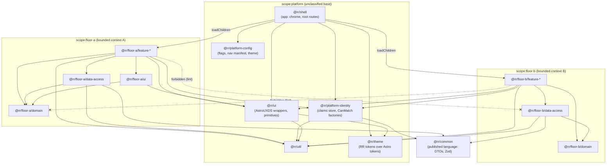
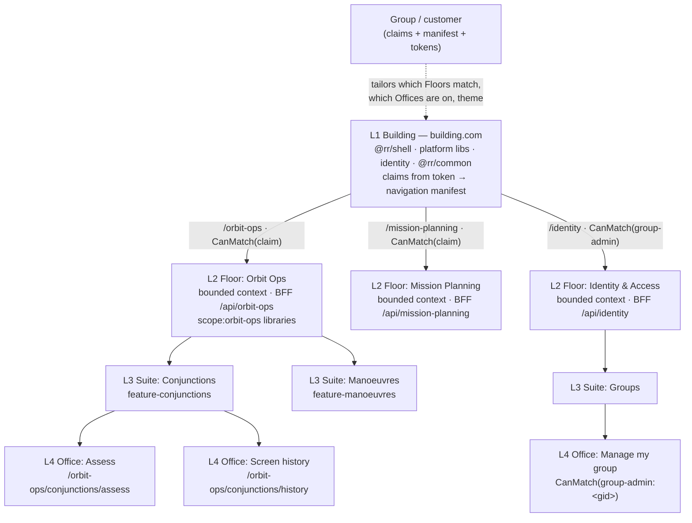

# R7 — UI/UX practice in relation to DDD (front-end architecture for a DDD system) research brief v0

**Created:** 2026-09-03 | **Last updated:** 2026-09-03 | **Author:** research agent under Axium (R7) | **Status:** exploratory — not doctrine

> **Verification note.** The session's web-search budget was exhausted and the egress proxy blocked the public documentation sites (angular.dev, nx.dev, martinfowler.com, ngrx.io, astrouxds.com, owasp.org, teamtopologies.com, samnewman.io). Every source marked **(verified)** was confirmed from its **primary repository source on GitHub or its npm registry record**; quotations come from those files. Everything else is cited from prior knowledge and marked `[UNVERIFIED]` — the claims are mainstream, but URLs and exact wording were not re-checked.

## 1. TL;DR

- **Code boundaries follow capabilities; access and tailoring follow groups.** The field's answer to "Floors = groups or Floors = functions?" is *functions*: each L2 Floor is a bounded context with its own vocabulary, read models and BFF. Groups, tenants and customers are **configuration** (claims, feature flags, theme tokens, a navigation manifest), not code. Honest counter-case: when a customer's need is a *genuinely different domain*, that is a new Floor — because it is a new bounded context, not because it is a new customer.
- **Start as a modular monolith with lazy, lint-fenced feature libraries; earn micro-frontends later.** One organisation, one design system and an isolated network with no CDN make a single Angular app with `loadChildren` per Floor, `@rr/*` workspace libraries and an enforced dependency graph the right default. Native Federation (tracks Angular majors, delegates to the esbuild builder) is the escape hatch to keep open, not the starting point.
- **Adopt the Nx library taxonomy even without Nx.** `shell` · `feature` · `ui` · `data-access` · `domain` · `util`, tagged by *type* and *scope* (Floor), enforced by `@nx/enforce-module-boundaries` or Sheriff — both run on plain npm workspaces. Graham's "unclassified base library" is exactly the `scope:platform` ring: `ui`, `util`, shell chrome, identity/claims, token-driven theme — and **nothing domain-specific lives in it**.
- **The front end consumes read models, never aggregates.** Screens are shaped by CQRS read models from a BFF per Floor; DTOs map to view models at one anti-corruption seam; commands are verbs (task-based UI). The `common` package is the *published language* — contracts only, Zod-validated, versioned.
- **The UI is never the enforcement point.** OWASP ASVS 5.0 §8.3.1: authorization is enforced "at a trusted service layer", never via "client-side JavaScript". `CanMatch` (route absent; lazy chunk never loads) is the guard for *entitlement*; `CanActivate` for *state*. Delegated group admin is an Office whose `CanMatch` passes only group admins — with a BFF that enforces the same claim.
- **URL = capability path; tenant = claim.** `/floor/suite/office` names what the user is doing; the group rides in the token. A group path prefix is defensible only for multi-group users — and then it is a prefix on the Building, never a Floor.
- **Two RR-lens facts found in-session:** the AstroUXDS repository README carries a "not currently being actively maintained" warning, and its default install pulls the component bundle and Roboto from public CDNs (§7).

## 2. Core concepts and vocabulary

One meaning per word; the RR lexicon will be built from this table.

| Term | Meaning in this brief | Source |
|---|---|---|
| **Bounded context** | Explicit boundary inside which one model and one ubiquitous language apply; the unit of code ownership | Evans, *DDD* (2003); DDD Reference (2015) `[UNVERIFIED URL]` |
| **Ubiquitous language** | The vocabulary of one context, used identically in conversation, labels, routes and identifiers | Evans |
| **Context map** | Drawn relationships between contexts: Partnership, Shared Kernel, Customer/Supplier, Conformist, Anticorruption Layer, Open-Host Service, Published Language, Separate Ways, Big Ball of Mud | [DDD Crew, Context Mapping](https://github.com/ddd-crew/context-mapping) **(verified)**, quoting Evans |
| **Published language** | "A well-documented shared language that can express the necessary domain information" — for RR, `@rr/common` | Evans via DDD Crew **(verified)** |
| **Anticorruption layer** | "An isolating layer to provide your system with functionality of the upstream system in terms of your own domain model" — on the client, the DTO → view-model mapper | Evans via DDD Crew **(verified)** |
| **Shared kernel** | "Some subset of the domain model that the teams agree to share. Keep this kernel small." | Evans via DDD Crew **(verified)** |
| **Read model** | Query-side projection shaped for a consumer (a screen), separate from the write-side aggregate | Fowler, *CQRS* (2011) `[UNVERIFIED]`; Vernon, *IDDD* ch. 4 |
| **Task-based UI** | UI organised around the *tasks* (commands) a user performs rather than around editing records | Young, *Task Based UI* (2010) `[UNVERIFIED]`; Vernon |
| **BFF** | One backend per user experience, owned by the front-end team, shaping data for that experience | Newman (2015) `[UNVERIFIED]` |
| **Micro-frontend** | Independently deliverable front-end applications composed into a whole | Jackson (2019) `[UNVERIFIED]`; Geers **(author verified)** |
| **Modular monolith (modulith)** | One deployable front-end built from strictly bounded, lazily loaded libraries | Steyer `[UNVERIFIED]` |
| **Module Federation** | Loads separately compiled and deployed code at runtime, sharing dependencies; MF 2.0 adds a runtime, manifest and plugin system | [module-federation/core](https://github.com/module-federation/core) **(verified)** |
| **Native Federation** | "A 'browser-native' implementation of the successful mental model behind webpack Module Federation" on ESM + import maps; versions track Angular majors | [`@angular-architects/native-federation`](https://www.npmjs.com/package/@angular-architects/native-federation) **(verified, 22.1.2)** |
| **Shell / feature / ui / data-access / domain / util** | Library types (§4.2): host app; routed use case; presentational only; stores + clients + mappers; types of one context; pure helpers | Nx library types `[UNVERIFIED URL]`; Steyer |
| **Public API (barrel)** | The `index.ts` / `public-api.ts` that is the only legal import path into a library | [Angular, Creating libraries](https://angular.dev/tools/libraries/creating-libraries) **(verified)**; Sheriff **(verified)** |
| **Module boundary rule** | Lint rule failing a build when a library imports what its tags forbid | [Nx, Enforce Module Boundaries](https://nx.dev/features/enforce-module-boundaries) **(verified)** |
| **`CanMatch`** | Guard run during *path matching*; on `false` the router "tries other matching routes instead of completely blocking navigation" and the lazy chunk is never requested | [Angular, Route guards](https://angular.dev/guide/routing/route-guards) **(verified)** |
| **`CanActivate`** | Guard run after matching; blocks or redirects | same **(verified)** |
| **Claim** | Assertion about the subject carried in the token (group, role, clearance, entitlement); input to both `CanMatch` and the server check | R4 |
| **Tenant / group** | A partition of users sharing privileges and tailoring — an *access* concept, not a *code* concept | §5 |
| **Tailoring** | Per-group variation via configuration: claims, flags, navigation manifest, theme tokens | §4.5 |
| **Design token** | A named design decision exposed as a CSS custom property; AstroUXDS ships reference / system / component tiers | [`@astrouxds/tokens`](https://www.npmjs.com/package/@astrouxds/tokens) **(verified, 1.14.0)** |
| **Building / Floor / Suite / Office** | Graham's L1–L4; mapped in §5 to shell / bounded-context area / capability area / tool | Graham |

## 3. Canonical sources

What the field actually cites (URLs in §9). **DDD:** Evans, *Domain-Driven Design* (2003), Part IV "Strategic Design", restated in his 2015 *DDD Reference* — the text the DDD Crew cheat sheet quotes **(verified)**; Vernon, *Implementing DDD* (2013), ch. 4 on CQRS and presenting read models rather than aggregates; Fowler's *BoundedContext* and *CQRS* bliki entries `[UNVERIFIED]`. **Task-based UI:** Greg Young's *CQRS Documents* (2010), tracing the idea to Microsoft's *Inductive User Interface Guidelines* (2001) `[UNVERIFIED]`. **Composition:** Cam Jackson's *Micro Frontends* on martinfowler.com (2019) `[UNVERIFIED]`; Geers, *Micro Frontends in Action* (2020) and micro-frontends.org **(author/site verified)**; Mezzalira, *Building Micro-Frontends* (2021) `[UNVERIFIED]`; Steyer's *Micro Frontends and Moduliths with Angular* `[UNVERIFIED]` and the Native Federation package **(verified)**; Module Federation 2.0 README **(verified)**. **Boundaries:** Nx *Enforce Module Boundaries* and the rule reference **(verified)**; Nx library types `[UNVERIFIED URL]`; Sheriff **(verified)**; Angular *Creating libraries* and *Package Format* **(verified)**. **Platform docs:** Angular route guards, loading strategies, standalone, signals, router `Route` model — all **(verified from `angular/angular` sources)**; NgRx SignalStore guide **(verified, `@ngrx/signals` 22.0.0)**. **Backend contract:** Newman's BFF (2015), Microsoft's BFF, Anti-Corruption Layer and *Map requests to tenants* pages `[UNVERIFIED]`. **Security:** OWASP ASVS 5.0 V8 and the Authorization Cheat Sheet **(verified)**. **Teams:** Skelton & Pais, *Team Topologies* (2019) **(book verified; content prior knowledge)**. **IA:** Rosenfeld, Morville & Arango (4th ed., 2015) and NNG `[UNVERIFIED]`; GOV.UK *Navigate a service* pattern and *Service navigation* component **(verified)**; USWDS `[UNVERIFIED]`. **Design system:** AstroUXDS repository READMEs and the `@astrouxds/angular` 9.0.0 / `@astrouxds/tokens` 1.14.0 registry records **(verified)**.

## 4. How it is done in practice

Graham's goals, quoted back, are the yardstick: **Scalable** — "add new features / new Angular applications for new user groups or customers with ease." **Modular** — "a base library of unclassified front-end code to lean on, no copy-paste as the system scales, tailored UIs per user group / customer." **Secure** — "each user group has data privileges unique to it." **Robust user management** — "delegated group-level admin (a group admin adds users to their own group)." **DDD coexistence** — "interacts with / coexists with a DDD backend."

### 4.1 Bounded contexts on the front end

The screen is where the ubiquitous language becomes visible, so the front end inherits DDD's strategic patterns directly: a context's UI uses that context's vocabulary in labels, route segments, selectors and store names, and a composite page that shows two contexts' data is composing two read models with a visible seam in the code (two feature libraries, one composing route). The practical unit is **"UI per bounded context"** — one Angular area (lazy feature tree + library set + usually a BFF) per context. Three strategies deliver it.

| Strategy | Build/deploy independence | Shared state & navigation | Design-system consistency | Bundle duplication | Versioning across teams | Isolated-network cost | Best when |
|---|---|---|---|---|---|---|---|
| **A. Modular monolith** — one app, `loadChildren` per Floor, lint-fenced libraries | Low (one artefact; CI can still build only affected libs) | Trivial: one router, one injector, one token | Strong: one Angular, one AstroUXDS, one token set | None | One version graph | **Lowest**: one bundle, no runtime loader | One organisation, few teams, one release train, air-gapped hosting |
| **B. Micro-frontends** — shell loads remotes via Module/Native Federation | High: each remote deploys alone | Hard: cross-remote state via shared lib or events; router integration is the classic pain | At risk unless framework + DS pinned as shared singletons | Avoided only with compatible pins | Independent — the point and the cost | **Highest**: federation runtime + manifests/import maps hosted in-cluster; every remote separately bundled and mirrored | Many teams on different cadences; independent products |
| **C. Separate apps, thin shell** — Floor = its own app; reverse proxy + shared chrome lib | High | Weak: full reload between Floors; state via URL/storage/server | Discipline only (shared `ui` + tokens, pinned) | Each app ships its own Angular | Independent | Medium: N bundles, no runtime | Floors that are near-separate products |

Three observations temper the table. Jackson's article lists the micro-frontend costs plainly — payload size, environment differences, operational and governance complexity — and recommends the pattern once teams and codebases have actually grown `[UNVERIFIED wording]`; Geers's principles (technology-agnostic, isolate team code, team prefixes, native browser features) presuppose *many autonomous teams* **(site verified; wording prior knowledge)**. Steyer's "modulith" — bounded contexts as strictly separated libraries in one app, federation only where independent deployment is actually needed — is the mainstream single-organisation Angular answer `[UNVERIFIED wording]`. And Native Federation is built to make the later move cheap: it keeps "the mental model of Module Federation", uses "Web Standards" (ESM, import maps) "to be independent of build tools like webpack", "directly delegates to Angular's ... esbuild-based ApplicationBuilder", and its version numbers follow Angular's (`22.x` for Angular 22) **(verified)** — which matters for two-island synchronisation.

**Recommendation:** strategy **A** by default, with libraries, routes and BFF split designed so any Floor can be promoted to B or C without a rewrite. That promotion is cheap only if the Floor was never allowed to import across Floor boundaries (§6).

### 4.2 Monorepo library architecture for many Angular apps

Nx's doc states the problem: "even a small organization will end up with a dozen apps and dozens or hundreds of libs. If all of them can depend on each other freely, chaos will ensue" **(verified)**. The taxonomy is the de-facto vocabulary whether or not Nx runs.

| Type | Contains | May import | Must never import | Base or overlay? |
|---|---|---|---|---|
| **shell** (app) | `main.ts`, root routes, chrome composition, providers | everything below | another shell | Base: one RR shell (per-compartment shells only under §5.2) |
| **feature** | routed smart components, `*.routes.ts`, feature store, guards | own-scope `ui`/`data-access`/`domain`/`util` + platform | another Floor's `feature` or `data-access` | Per Floor — never in base |
| **ui** | presentational components, directives, pipes, AstroUXDS wrappers | `util`, `domain` types | `data-access`, `feature` | Base if generic (`@rr/ui`); per Floor if it renders Floor vocabulary |
| **data-access** | SignalStores, HTTP clients, DTO→VM mappers (the ACL) | `domain`, `util`, `@rr/common` | `ui`, `feature` | Per Floor; identity/claims is the one base data-access lib |
| **domain** | view-model types, value objects, enums of one context | `util`, `@rr/common` | Angular runtime | Per Floor. **No domain enums in base** |
| **util** | pure helpers (formatting, validation, marking-banner rendering rules) | nothing internal | anything else | Base |
| **platform** (scope, not type) | chrome, layout regions, identity, flags, manifest renderer, theming, telemetry | `util` | any Floor scope | **This is the unclassified base library** |
| **common** | DTOs, Zod schemas, command/query names, error codes | nothing | anything client- or server-specific | Base; consumed by client and BFF |

**Enforcement** is what makes this architecture rather than convention. Nx tags projects (`type:feature`, `scope:orbit-ops`) and lint fails on violation — "A project tagged with 'scope:admin' can only depend on projects tagged with 'scope:shared' or 'scope:admin'" **(verified)**; `depConstraints` compose with AND, and `notDependOnLibsWithTags`, `banTransitiveDependencies` ("Ban import of dependencies that were not specified in the root or project's `package.json`") and `enforceBuildableLibDependency` are the options that matter **(verified)**. Sheriff does the same "with zero dependencies, requiring only TypeScript as a peer dependency", with ESLint or "standalone through its CLI", public APIs "through `index.ts` files" and "automatic and manual tagging" **(verified)** — the natural fit for an npm-workspaces repo without Nx.

**Public API surface.** Angular: "The public API for your library is maintained in the `public-api.ts` file ... Anything exported from this file is made public" **(verified)**; `@angular/core` belongs in `peerDependencies`, otherwise a consumer "might get a different Angular module instead, which would cause your application to break" **(verified)** — the single-Angular rule that also governs federation. The Angular Package Format gives "one primary entrypoint and zero or more secondary entrypoints (for example, `@angular/common/http`)" via `package.json` `exports` **(verified)** — the mechanism for `@rr/ui/forms` vs `@rr/ui/tables` without splitting packages.

**Semver inside the monorepo.** Start *locked* (one version for all `@rr/*`, one release train); grant *independent* semver and a changelog only to packages consumed outside the repo (a Legacy-Island app, a customer overlay). `common` is the one package whose breaking changes are contractual regardless.

**Graham's "unclassified base library"** = the `scope:platform` ring plus generic `ui`/`util`: chrome and layout regions, AstroUXDS wrappers and RR tokens, identity/claims store, feature-flag service, navigation-manifest renderer, notification/error primitives, marking *renderers* (how to draw a banner, not what is marked). **Per-customer overlays are data**: a token override file, a navigation manifest, a flag set, a claims mapping. Rule: *if an overlay needs a component, it is either generic (belongs in `@rr/ui`) or a Floor feature (belongs in that Floor) — never a third place.*

### 4.3 The backend contract

**BFF per Floor.** Newman's pattern is one backend per user experience, owned by the front-end team, so a general-purpose API does not become the queue every UI team waits on `[UNVERIFIED wording]`. RR's grain is **one BFF per Floor**, mounted at `/api/<floor>/…` on the Express gateway. A BFF per *app* only follows a Floor's promotion to its own app; a BFF per *group* is the anti-pattern — access logic in topology instead of claims.

**`common` as the published language.** Evans: translation "requires a common language ... translating as necessary into and out of that language" **(verified)**. `@rr/common` carries DTOs, command and query names, error codes and Zod schemas validated on both sides (BFF validates inbound commands; the client validates read models in dev builds). A breaking change here is a *contract* change with a deprecation window — the one place "just refactor both sides" is not enough, because Legacy-Island apps may consume it later.

**Anti-corruption at the client boundary.** The client `data-access` library is a **Conformist** to the read-model shape most of the time (conformity "enormously simplifies integration" **(verified)**) but always maps DTO → view model in one place, so the mapper is the only code that knows a DTO field name. Templates and stores see view models only.

**Read models, not aggregates.** Aggregates protect invariants on the write side; exposing them to the UI couples every screen to consistency boundaries the screen does not care about and makes screens re-derive the same projections (Vernon ch. 4; Fowler *CQRS* `[UNVERIFIED wording]`). The BFF serves **screen-shaped read models** — denormalised, pre-authorised to the rows and fields this subject may see (ASVS §8.2.2/8.2.3 **(verified)**) — and accepts **commands** named in the ubiquitous language. Real-time updates (R3 covers the bus) arrive as events that patch or invalidate read models, applied by a SignalStore method — never as aggregate snapshots.

### 4.4 Task-based UI and the ubiquitous language

A CRUD screen ("edit, save") loses *intent* — the server sees a diff, not "relocated" vs "typo corrected" — and intent is what the domain model needs to enforce rules and what an audit trail needs to be honest (Young `[UNVERIFIED wording]`). A **task-based UI** exposes verbs — *Assess*, *Approve*, *Reassign*, *Retire* — each a command in `@rr/common`, a store method, a button whose enabled state is a computed signal over the read model's affordances, and, in a defence context, a distinct audit event. This cascades into naming: routes name capabilities and tasks (`/orbit-ops/conjunctions/assess`, not `/records/123/edit`); selectors and stores use the context's words (`ConjunctionAssessmentStore`, not `RecordEditorStore`); a word may mean different things in two Floors (that is what contexts are for) but one thing *inside* a Floor and inside the base; cross-Floor words that must agree (user, group, marking) are the shared kernel governed in `@rr/common`. **Lexicon governance:** a `lexicon.md` per Floor plus one for the platform, reviewed on any PR that adds a route segment, public component or store, with a lint/corpus check that flags a new public identifier absent from the lexicon — cheap, and it catches the "playbook" class of drift the house has already paid for once.

### 4.5 Permission-aware UI

**No-leak rule.** ASVS 5.0 §8.3.1: "Verify that the application enforces authorization rules at a trusted service layer and doesn't rely on controls that an untrusted consumer could manipulate, such as client-side JavaScript" **(verified)**. The Authorization Cheat Sheet: client-side checks "may be permissible for improving the user experience, they should never be the decisive factor" **(verified)**. Everything below is UX; the BFF re-checks the same claim on every request.

**`CanMatch` vs `CanActivate`.** `CanMatch` "determines whether a route can be matched during path matching. Unlike other guards, rejection falls through to try other matching routes instead of blocking navigation entirely" **(verified)**. Two consequences make it the entitlement guard: an unentitled Floor's chunk is never fetched (no code leak, no bundle cost), and one path can resolve to different Floors/Offices per claim — the docs mount `AdminDashboard` and `UserDashboard` on the same `dashboard` path with different `canMatch` guards **(verified)**. `CanActivate` "is most commonly used for authentication" **(verified)**: use it for *state* (not signed in, session expired) and `CanDeactivate` for unsaved work. Loaders run "within the injection context of the current route", so `loadChildren` itself can branch on a claim or flag **(verified)**.

**Hide vs disable vs absent.** *Absent* (route unmatched, nav item not rendered) means "this does not exist for you" — the default for entitlement and all cross-group data. *Disabled* (rendered, with a reason) means "this exists, you cannot do it *now*" — precondition unmet, workflow state, or a permission the user could obtain. *Hidden* (in the DOM, `hidden`) is almost never right: indistinguishable from absent to the user, present to an inspector. NNG's guidance runs the same way — do not show navigation users cannot use, but do explain unavailable actions that are part of their job `[UNVERIFIED]`.

**Per-group tailoring via configuration.** A group's experience is a *manifest*: which Floors match (claims), which Offices are on, which flags are set, which token file themes the shell, which landing route. The shell fetches it from `/api/config` (already in the intended stack) and renders navigation from it. A new customer with the same domain = a new manifest, zero new code.

**Delegated group admin as an Office.** "A group admin adds users to their own group" is a capability of the Identity context (R4). It is an Office — `/identity/groups/manage` — that (a) `CanMatch`es only subjects holding `group-admin:<groupId>`, (b) receives a read model *already scoped to the admin's group by the BFF* (never "all groups, filtered client-side" — ASVS §8.4.1 on cross-tenant controls **(verified)**), and (c) issues commands (*Enrol member*, *Revoke member*) whose group is derived server-side from the claim, never supplied by the client. It looks like any other Office; the difference is who can match it and what the BFF returns.

## 5. The tier question — Building / Floor / Suite / Office

### 5.1 The field's answer

Graham's model: **L1 Building** `building.com`; **L2 Floor** first segment, possibly its own app; **L3 Suite** second segment; **L4 Office** the tool. Are Floors *groups* or *functions*? Four bodies of practice converge.

1. **DDD.** Bounded contexts are drawn around models and language; a context map is a map of *capabilities* **(verified via Evans's patterns)**. A customer is not a context — a customer *uses* several. Code organised by customer yields N copies of each context with slightly different language each, the Big Ball of Mud the cheat sheet says must not "propagate into the other bounded contexts" **(verified)**.
2. **Team Topologies.** Stream-aligned teams own a stream of change aligned to a capability or journey, supported by a platform team; the inverse Conway manoeuvre shapes the org to the architecture you want **(book verified; content prior knowledge)**. A Floor per capability is what one such team can own end-to-end (UI + BFF + read models). A Floor per customer is a team owning every capability for one customer — the cognitive-load failure the book is about.
3. **Information architecture.** Rosenfeld & Morville treat *audience* organisation schemes as the fragile one: users straddle audiences, content duplicates, and the top level mirrors the org chart instead of the task `[UNVERIFIED]`. GOV.UK is task-first — links "must go to the most important top-level sections that are the most useful to the user"; the header stacks "the most general ... at the top, with the more specific (service-level) elements further down" **(verified)** — with identity in a separate slot (One Login), not in the hierarchy **(verified)**.
4. **Security engineering.** ASVS treats tenancy as an authorization property ("cross-tenant controls", §8.4.1 **(verified)**): privileges are claims enforced against resources whether or not the customer is in the URL. Making the tenant a code boundary adds nothing to enforcement; it multiplies the places enforcement must be right.

**So: L2 Floors are bounded contexts. Groups define access and tailoring, which are configuration.** The same Floor serves every group holding the claim; what differs per group is which Floors match, which Offices are on, and which theme paints them.

### 5.2 Honest counter-cases

- **A customer's need is a different domain** with its own model and language → a new Floor, named customer-neutrally, *because it is a new context*. If others later need it, nothing moves.
- **Mandated artefact separation** (two groups may not share a *build*, not just data) → strategy C per compartment: a *deployment* boundary, still not a Floor; the compartment's app composes the same Floor libraries with a different manifest. This is where R6's unclassified-base / classified-overlay split earns its keep.
- **Users who act as different groups** → the group must be explicit and switchable (§5.4).
- **A customer on a different release cadence** → federation or its own app: a deploy-independence argument, not a code-organisation one.

### 5.3 The concrete mapping

| Tier | What it is | Code artefact | Route | Owns | Lazy boundary |
|---|---|---|---|---|---|
| **L1 Building** | The system | `@rr/shell` + `scope:platform` libs + `@rr/common` + identity | `/` | chrome, root router, claims, theme, navigation manifest, global time/selection state | eager (landing, login, error) |
| **L2 Floor** | A bounded context (or small cluster) | `scope:<floor>` library set + one BFF | `/<floor>` | its language, read models, commands, stores, `routes.ts` | `loadChildren` behind a claims `CanMatch` — always |
| **L3 Suite** | A capability area / sub-context inside the Floor | one `feature-<suite>` library with child routes | `/<floor>/<suite>` | a coherent task set; a suite store if needed | `loadChildren` only when heavy or separately entitled |
| **L4 Office** | A tool | a routed leaf (`loadComponent`), a utility window, or a small feature lib | `/<floor>/<suite>/<office>` or a window without a route | one task; component-local state | `loadComponent` only when heavy |

Floor names are placeholders; the real ones come from R1's context map.

**Lazy loading per tier.** `loadChildren` and `loadComponent` both "accept a loader function that returns a Promise" and run in the route's injection context **(verified)**; the docs warn that "nested lazy loading at multiple levels ... can significantly impact performance" **(verified)**. Rule: Floor is always a lazy boundary; Suite and Office are lazy by weight or entitlement. Three lazy levels by default is the wrong reading of the tier model.

**When is something big enough to be its own app?** Never by size. Promote a Floor to an app (C) or remote (B) only when it must (i) deploy on a different cadence from the shell, (ii) be built by a team outside the release train, (iii) be installable on a cluster or compartment where the rest of the Building is not, or (iv) run a different Angular major (the two-island case). Otherwise a Floor stays a library set — and because its imports were fenced from day one, promotion is a build-configuration change, not a refactor.

### 5.4 URL design — where does the group go?

**Design 1 — tenant as claim, capability path only:** `building.com/orbit-ops/conjunctions/assess`. The token says which group the subject acts for; the BFF scopes every read model by it. *Pros:* one URL space, links shareable across groups sharing a capability, no group name in URLs or logs, code unaware of groups beyond the claims store. *Cons:* multi-group users need an explicit "acting as" control that re-scopes the token; deep links cannot say "as group X".

**Design 2 — tenant as path prefix:** `building.com/g/<group>/orbit-ops/…`. *Pros:* multi-group users and group-explicit deep links for free; support can reproduce a user's view. *Cons:* the group becomes a route parameter every guard and BFF call must validate against the token — the IDOR surface the cheat sheet describes, an ID "exposed as a query parameter, path variable" that a user "changed ... to another value" **(verified)**; group names land in URLs, logs and history, which may itself be sensitive; and the prefix invites someone to make `/g/<group>` a code boundary. Microsoft's multitenant guidance lists subdomain, path, header and claim, noting path/subdomain make tenancy visible at the cost of validation burden `[UNVERIFIED]`.

**Recommendation:** Design 1 by default; add Design 2's prefix only if multi-group users are common — and then as a prefix on the Building, never a Floor, treated by every guard as a claim to verify, never a fact.

## 6. Trade-offs, anti-patterns, failure modes

| Anti-pattern | How it happens | Cost | Prevention |
|---|---|---|---|
| **Shared-kernel UI sprawl** | "Put it in `@rr/ui` so both Floors can use it" — a Floor widget with domain types lands in base | Every Floor compiles every other's vocabulary; base changes ripple | "Keep this kernel small" **(verified)**; lint: `scope:platform` → no `scope:<floor>`; `ui` → no `data-access` |
| **`common` as dumping ground** | helpers, Angular services, "temporary" shared state dropped into the published language | client and BFF coupled through non-contract code | types, schemas, pure functions only; `banTransitiveDependencies`; CODEOWNERS |
| **Copy-paste apps per customer** | new customer → clone last app → diverge | N forks of every fix — the thing Graham named | tailoring = manifest + tokens; a new customer adds no `feature` code unless it is a new context |
| **One giant store** | root `AppStore` grows a slice per Floor | every Floor's state in the initial bundle | store per Floor `data-access`; component-level stores for Offices (they are "tied to the component lifecycle ... useful for managing local/component state" **(verified)**); a small global store for time/selection/identity; the Events plugin for rare cross-store coordination |
| **Cross-Floor imports** | Floor B needs Floor A's view model "for one column" | Floors can no longer be promoted; language leaks | lint forbids `scope:a` → `scope:b`; go through `@rr/common` or BFF composition |
| **Per-customer forks of the base** | a customer wants a different sidebar → copy `@rr/shell` | the base stops being a base | themes, manifests, slots (GOV.UK service navigation uses "slots to render custom HTML code at specific places" **(verified)** — content projection here) |
| **Group-as-Floor** | `/acme/…`, `/navy/…` at L2 | duplicated capabilities, org-chart IA, tenancy in topology | §5 |
| **UI as the only gate** | `@if (canEdit)` with no server check | ASVS §8.3.1 failure | every command carries the claim; BFF re-checks; contract tests hit the BFF without the UI |
| **Federation before its time** | micro-frontends for a two-team system | runtime loader, singleton pinning, import-map hosting, duplicated bundles with no CDN | §4.1; keep the promotion path, not the runtime |
| **Three lazy levels** | every tier gets `loadChildren` | chunk waterfall on every deep link (Angular's warning **(verified)**) | Floor always; Suite/Office by weight |
| **Aggregates on screen** | BFF proxies domain objects through | screens couple to consistency boundaries | screen-shaped read models; commands as verbs |

## 7. RR lens — implications for Desert Island

**Isolated network (both islands: no internet, no agent access, one-way bundle transfer).**

- **No CDN — vendor the design system.** Astro's web-components README instructs a `<link>` to `cdn.jsdelivr.net` and Roboto from `fonts.googleapis.com` ("We recommend using Google's CDN; however, you can also pull down and serve your own copy") **(verified)**. On the islands the `@astrouxds/astro-web-components` bundle, the `@astrouxds/tokens` CSS and the Roboto files are repo assets served by the shell and listed in the bundle-transfer manifest. Current registry versions: `@astrouxds/angular` 9.0.0, `@astrouxds/tokens` 1.14.0 **(verified)**; pins must be frozen against what can be mirrored.
- **AstroUXDS maintenance status is a risk to register now.** The repository README: "Documentation and code is not currently being actively maintained and may be outdated. Contact Rocket Communications to discuss support options" **(verified)**. For a multi-year estate this argues for (a) wrapping every Astro component behind an `@rr/ui` primitive so a fork or replacement is a one-library change, and (b) keeping the RR brand in tokens layered over Astro's reference → system → component tiers **(verified)** rather than in component CSS — exactly the "overrides, never a fork" line in `technology_stack.md`.
- **Federation runtimes cost more here.** Native Federation's manifest/import maps and Module Federation 2.0's "Federation Runtime" and "Manifest" **(verified)** are extra artefacts to build, transfer and host in-cluster, and every remote is a separately mirrored bundle with its own singleton pins. Strategy A avoids all of it. If a Floor is ever promoted, Native Federation fits best because it "directly delegates" to the standard Angular builder and its version tracks the Angular major **(verified)** — the number the two-island rule pins.
- **Boundary tooling is a mirrored dependency.** `@nx/eslint-plugin` 23.2.0 or `@softarc/sheriff-core` + `@softarc/eslint-plugin-sheriff` 0.19.6 **(verified versions)** must be in the island registry and runnable from the document alone. Sheriff's "zero dependencies, requiring only TypeScript" **(verified)** is a real advantage for a mirror that must stay small, and it fits ADR-004's "no Nx decided".
- **Runtime config carries tailoring.** The gateway already serves `/api/config` from a Helm ConfigMap. The group manifest (Floors on, Offices on, theme file, landing route) belongs there, so a new customer on an island is a ConfigMap change plus a token file — no rebuild, no re-transfer.

**Intended-stack fit.** Standalone components and functional guards (`CanMatchFn`) exist from v15/v16, so the Floor/Suite/Office routing design is identical on the v19 floor and the v22 stretch; only Native Federation's version would move. SignalStore maps to the tiers cleanly: a small root store for the Building (identity, claims, global time/selection — the house's "presumed-global" set), one `providedIn: 'root'` store per Floor `data-access` instantiated with its chunk, component-provided stores for Offices, and `signalStoreFeature` for base cross-cutting features (`withRequestStatus`, `withClassificationMarking`, `withAuditedCommand`) every Floor store composes **(verified mechanism)**. npm workspaces need no Nx for the taxonomy: each library is a package with an `index.ts` public API and `exports`-based secondary entry points **(verified)**; tags live in `package.json` (`"nx": {"tags": […]}` **(verified)**) or `sheriff.config.ts`. The intended `common` package should be *strictly* the published language — DTOs, Zod, command names — with anything else moved out.

**Defence context.** Marking *rendering* rules are base `util`/`ui`; *which* data carries which marking is a read-model field (R5). R6's unclassified-base / classified-tailoring split maps onto `scope:platform` (shareable across islands and customers) vs Floor libraries and manifests (may be classified). Audit demands task-based commands: "the operator *approved the manoeuvre*" is an audit event; "row 4071 PUT" is not.

**Two-island synchronisation.** Legacy Island's 10+ v17 apps are strategy-C apps without a shell. The base packages (`@rr/ui`, `@rr/theme`, `@rr/platform-identity`) are the first thing they could consume once upgraded — the argument for giving those packages independent semver from the start and keeping them free of Angular APIs newer than the v19 floor until DR-04 closes.

**Concordance.** A Floor packet claims its `region:` and `state:` rows; the shell packet owns L1 regions; a Suite never claims a region of its own.

## 8. Open questions for Graham

1. **What are the bounded contexts?** The tier model is only as good as the context map. Which capabilities exist on day one, and which are genuinely different languages rather than different screens over one model? (Feeds R1.)
2. **Do users hold more than one group?** Decides URL Design 1 vs 2 and whether the shell needs an "acting as" control.
3. **Is any group separation a build/deployment separation** (may not share an artefact), or all data-privilege separation? Only the former forces strategy C.
4. **Who owns a Floor?** One stream-aligned team per Floor (UI + BFF + read models), or a front-end team spanning Floors? This decides whether a Floor's BFF lives in the Floor's package or the gateway package.
5. **AstroUXDS support.** Given the maintenance warning, is there a Rocket Communications arrangement, or should `@rr/ui` be designed as a replaceable façade from day one?
6. **Nx or Sheriff?** Enforcement is non-negotiable; the tool is a choice. Sheriff is lighter to mirror; Nx brings affected-graph builds and generators.
7. **Versioning regime for `@rr/*`.** Locked until a Legacy-Island app consumes a base package, or independent from day one?
8. **Real-time.** Which Floors need live read-model updates in v1, and does the bus reach the browser via the BFF (SSE/WebSocket) or polling? Shapes every Floor `data-access` store.
9. **Lexicon owner.** Who arbitrates when two Floors want the same word for different things?

## 9. Sources

**(verified)** = confirmed in-session from the primary repository source on GitHub or the npm registry; the public URL is given for readers. `[UNVERIFIED]` = cited from prior knowledge; not re-checked.

**Angular (verified from `angular/angular` `adev/src/content`, `main`, 2026-09-03)**
- [Angular, Route guards](https://angular.dev/guide/routing/route-guards) — `CanMatch`/`CanActivate` semantics, same-path example.
- [Angular, Loading strategies](https://angular.dev/guide/routing/loading-strategies) — `loadChildren`/`loadComponent`, injection-context lazy loading, nested-lazy warning.
- [Angular, Creating libraries](https://angular.dev/tools/libraries/creating-libraries) — `public-api.ts`, `peerDependencies`.
- [Angular, Angular Package Format](https://angular.dev/tools/libraries/angular-package-format) — primary/secondary entry points via `exports`.
- [Angular, Migrate to standalone](https://angular.dev/reference/migrations/standalone); [Angular, Signals](https://angular.dev/guide/signals); `packages/router/src/models.ts`.

**State (verified from `ngrx/platform`, `projects/www`)**
- [NgRx, SignalStore](https://ngrx.io/guide/signals/signal-store); [Custom store features](https://ngrx.io/guide/signals/signal-store/custom-store-features); [Events plugin](https://ngrx.io/guide/signals/signal-store/events). `@ngrx/signals` 22.0.0 (registry).

**Boundaries**
- [Nx, Enforce Module Boundaries](https://nx.dev/features/enforce-module-boundaries) **(verified, `nrwl/nx` `astro-docs`)**; [Nx, `@nx/enforce-module-boundaries` rule](https://nx.dev/docs/kb/enforce-module-boundaries) **(verified)**; `@nx/eslint-plugin` 23.2.0 (registry).
- [Nx, Library types / project dependency rules](https://nx.dev/concepts/decisions/project-dependency-rules) `[UNVERIFIED URL — page moved; content from prior knowledge]`.
- [Sheriff](https://github.com/softarc-consulting/sheriff) **(verified)**; `@softarc/sheriff-core` 0.19.6 (registry).

**Micro-frontends and federation**
- [Cam Jackson, Micro Frontends, martinfowler.com, 2019](https://martinfowler.com/articles/micro-frontends.html) `[UNVERIFIED]`.
- [Michael Geers, micro-frontends.org](https://micro-frontends.org/) **(author/site verified via `neuland/micro-frontends`)**; Geers, *Micro Frontends in Action*, Manning, 2020.
- Luca Mezzalira, *Building Micro-Frontends*, O'Reilly, 2021 `[UNVERIFIED]`.
- [Manfred Steyer, Micro Frontends and Moduliths with Angular](https://www.angulararchitects.io/en/ebooks/micro-frontends-and-moduliths-with-angular/) `[UNVERIFIED]`.
- [`@angular-architects/native-federation`](https://www.npmjs.com/package/@angular-architects/native-federation) **(verified, 22.1.2; "v4 rework" at Angular 22)**; [`@angular-architects/module-federation`](https://www.npmjs.com/package/@angular-architects/module-federation) **(verified, 21.2.2)**.
- [Module Federation 2.0 README](https://github.com/module-federation/core) **(verified)**.

**DDD**
- Eric Evans, *Domain-Driven Design*, Addison-Wesley, 2003; [Evans, DDD Reference, 2015](https://www.domainlanguage.com/ddd/reference/) `[UNVERIFIED URL]` — quoted via [DDD Crew, Context Mapping](https://github.com/ddd-crew/context-mapping) **(verified)**.
- Vaughn Vernon, *Implementing Domain-Driven Design*, Addison-Wesley, 2013.
- [Fowler, BoundedContext, 2014](https://martinfowler.com/bliki/BoundedContext.html) `[UNVERIFIED]`; [Fowler, CQRS, 2011](https://martinfowler.com/bliki/CQRS.html) `[UNVERIFIED]`.
- [Greg Young, CQRS Documents — Task Based UI, 2010](https://cqrs.wordpress.com/documents/task-based-ui/) `[UNVERIFIED]`; Microsoft, *Inductive User Interface Guidelines*, 2001 `[UNVERIFIED]`.

**Backend contract**
- [Sam Newman, Pattern: Backends For Frontends, 2015](https://samnewman.io/patterns/architectural/bff/) `[UNVERIFIED]`.
- Microsoft Azure Architecture Center: [Backends for Frontends](https://learn.microsoft.com/en-us/azure/architecture/patterns/backends-for-frontends), [Anti-Corruption Layer](https://learn.microsoft.com/en-us/azure/architecture/patterns/anti-corruption-layer), [Map requests to tenants](https://learn.microsoft.com/en-us/azure/architecture/guide/multitenant/considerations/map-requests) `[UNVERIFIED]`.

**Security**
- [OWASP ASVS 5.0, V8 Authorization](https://github.com/OWASP/ASVS/blob/master/5.0/en/0x17-V8-Authorization.md) **(verified)** — §8.2.2, §8.2.3, §8.3.1, §8.4.1.
- [OWASP Authorization Cheat Sheet](https://cheatsheetseries.owasp.org/cheatsheets/Authorization_Cheat_Sheet.html) **(verified from `OWASP/CheatSheetSeries`)**.

**Teams and IA**
- Skelton & Pais, *Team Topologies*, IT Revolution, 2019 **(book verified via `TeamTopologies/Team-Shape-Templates`)**.
- Rosenfeld, Morville & Arango, *Information Architecture for the Web and Beyond*, 4th ed., O'Reilly, 2015 `[UNVERIFIED]`; Nielsen Norman Group, IA vs navigation and audience-based navigation articles `[UNVERIFIED]`.
- [GOV.UK Design System, Navigate a service](https://design-system.service.gov.uk/patterns/navigate-a-service/) **(verified from `alphagov/govuk-design-system`)**; [Service navigation](https://design-system.service.gov.uk/components/service-navigation/) **(verified)**; US Web Design System navigation guidance `[UNVERIFIED]`.

**Design system**
- [AstroUXDS repository README](https://github.com/RocketCommunicationsInc/astro) **(verified — maintenance warning)**; [web-components README](https://github.com/RocketCommunicationsInc/astro/blob/main/packages/web-components/README.md) **(verified — CDN/Roboto instructions)**.
- [`@astrouxds/angular`](https://www.npmjs.com/package/@astrouxds/angular) **(verified, 9.0.0)**; [`@astrouxds/tokens`](https://www.npmjs.com/package/@astrouxds/tokens) **(verified, 1.14.0)**.

**RR corpus** — `docs/context/canonical/technology_stack.md`; `docs/context/canonical/two_island_model.md`; `docs/context/team/agents/software-engineers/01_coder/angular_frontend_engineering_policy.md`; sibling briefs R1, R3, R4, R5, R6.
