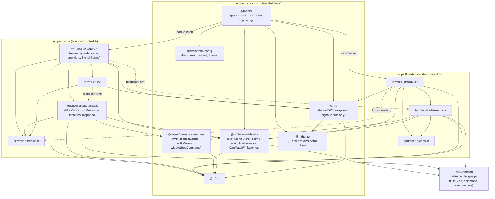
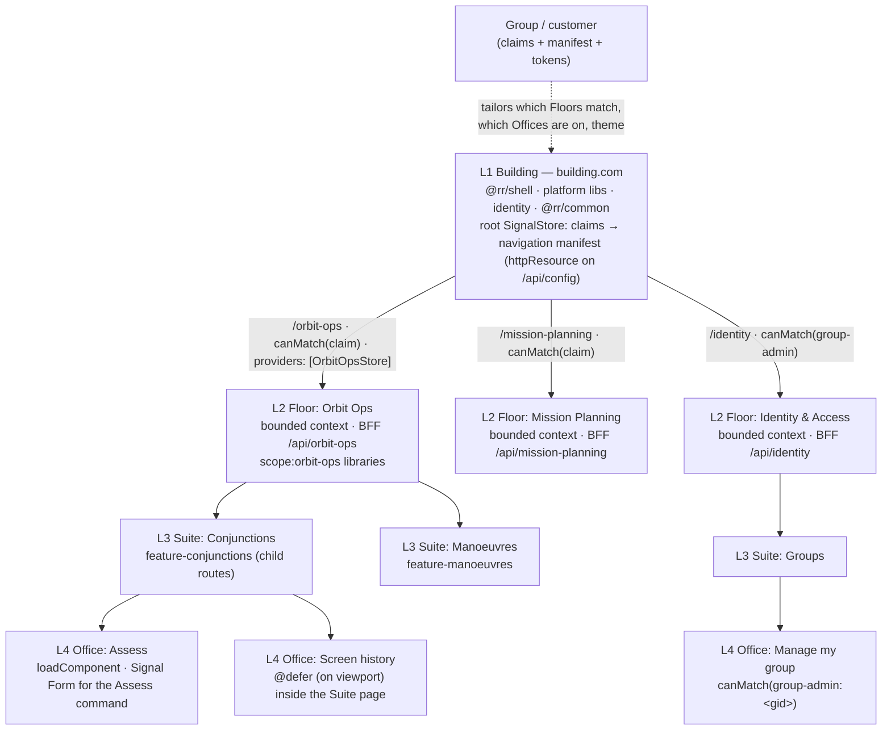

# R7 — UI/UX practice in relation to DDD (front-end architecture for a DDD system) research brief v0

**Created:** 2026-09-03 | **Last updated:** 2026-09-03, pass 2 (modernization) | **Author:** research agent under Axium (R7) | **Status:** exploratory — not doctrine

> **Verification note (pass 2).** The public documentation sites (angular.dev, ngrx.io, nx.dev, martinfowler.com, infoq.com, native-federation.com, vendor blogs) remain egress-blocked from the research environment. Every implementation-idiom claim below was therefore verified on **2026-09-03** against the **primary repository sources**: `angular/angular` `main` (`adev/src/content/**`, `CHANGELOG.md`, and the `@publicApi` / `@experimental` JSDoc tags in `packages/**` on `main`, `21.2.x`, `20.3.x` and `19.2.x`), `ngrx/platform` `main` (`projects/www/src/app/pages/guide/signals/**`, `CHANGELOG.md`), the npm registry records for `@angular/*`, `@ngrx/signals`, `@angular-architects/native-federation` and `@softarc/sheriff-core`, and the `nrwl/nx`, `module-federation/core` and `softarc-consulting/sheriff` READMEs. Sources marked **(verified)** were read from those files; `[UNVERIFIED]` means cited from prior knowledge and not re-checked. The brief obeys the corpus **currency contract** (README §Currency contract): concept sources may be old; the idiom in which a concept is restated is the **Angular 22.1 / `@ngrx/signals` 22.0** idiom, with the v19→v22 delta stated wherever an idiom changed, because Desert Island may be re-pinned to whatever Legacy Island reaches.

## 1. TL;DR

- **Code boundaries follow capabilities; access and tailoring follow groups.** The field's answer to "Floors = groups or Floors = functions?" is *functions*: each L2 Floor is a bounded context with its own vocabulary, read models and BFF. Groups, tenants and customers are **configuration** (claims, flags, theme tokens, a navigation manifest), not code. Counter-case: a customer whose need is a *genuinely different domain* gets a new Floor — because it is a new context, not a new customer.
- **The brief is written in the 2026 idiom: signal-first and zoneless.** Components declare `input()`/`output()`/`model()`, derive with `computed`/`linkedSignal`, render with `@if`/`@for`/`@defer`, are `OnPush` by default (v22) and run without Zone.js (default since v21). Async reads are **resources** (`resource()`, `httpResource`, `rxResource` — all `@publicApi 22.0`) or a **SignalStore**; forms are **Signal Forms** (public in v22); routes use functional guards, `loadChildren`/`loadComponent`, route-level `providers` **(all verified)**. The smart/dumb split pass 1 used is superseded; what survives is a *dependency rule* (`ui` may not import `data-access`), not a component type.
- **Start as a modular monolith with lazy, lint-fenced feature libraries; earn micro-frontends later.** One organisation, one design system and no CDN make one Angular app with `loadChildren` per Floor, `@rr/*` workspace libraries and an enforced dependency graph the right default. Native Federation 22.x (the "v4" rework) is the escape hatch to keep open, not the starting point. Pass 2 re-checked this against current tooling and the 2026 literature; the recommendation stands (§4.1).
- **Adopt the library taxonomy even without Nx, recast for 2026.** `shell` · `feature` · `ui` · `data-access` · `domain` · `util`, tagged by *type* and *scope*, enforced by `@nx/enforce-module-boundaries` or Sheriff on plain npm workspaces **(verified)**. `data-access` = SignalStores, `httpResource` factories, mappers, event-stream adapters; `ui` = design-system wrappers with signal inputs. Graham's "unclassified base library" is the `scope:platform` ring — **nothing domain-specific lives in it**.
- **State is global unless a packet argues otherwise, and has a home per tier:** a small root SignalStore (identity, claims, global time/selection); one SignalStore per Floor, provided on the Floor route and composed from `withEntities`, `withLinkedState`, `withFeature` and — for genuine inter-store coordination — the Events plugin; component-provided stores or plain resources for Offices **(mechanism verified)**.
- **The front end consumes read models, never aggregates.** `httpResource`'s `parse` runs the `@rr/common` Zod schema at the one anti-corruption seam; commands are verbs (task-based UI) sent through `HttpClient` — the docs say not to use `httpResource` for mutations **(verified)**.
- **The UI is never the enforcement point** (ASVS 5.0 §8.3.1 **(verified)**). `CanMatchFn` (route absent; chunk never loads) guards *entitlement*; `CanActivateFn` guards *state*. **URL = capability path; tenant = claim**; a group prefix is defensible only for multi-group users, and then on the Building, never a Floor.
- **Three RR-lens facts found in-session:** AstroUXDS's README says it is "not currently being actively maintained" and its default install pulls the bundle and Roboto from public CDNs (§7); and `technology_stack.md`'s `provideHttpClient(withFetch())` is already a v22 deprecation — fetch is the default backend and `withFetch` "can be safely removed" **(verified, CHANGELOG 22.0.0)**.

## 2. Core concepts and vocabulary

One meaning per word; the RR lexicon will be built from this table. Concept rows cite the concept clock; idiom rows cite the primary doc read on 2026-09-03.

| Term | Meaning in this brief | Source |
|---|---|---|
| **Bounded context** | Explicit boundary inside which one model and one ubiquitous language apply; the unit of code ownership | Evans, *DDD* (2003); DDD Reference (2015) `[UNVERIFIED URL]` |
| **Ubiquitous language** | The vocabulary of one context, used identically in conversation, labels, routes and identifiers | Evans |
| **Context map** | Drawn relationships between contexts: Partnership, Shared Kernel, Customer/Supplier, Conformist, Anticorruption Layer, Open-Host Service, Published Language, Separate Ways, Big Ball of Mud | [DDD Crew, Context Mapping](https://github.com/ddd-crew/context-mapping) **(verified)**, quoting Evans |
| **Published language** | "A well-documented shared language that can express the necessary domain information" — for RR, `@rr/common` | Evans via DDD Crew **(verified)** |
| **Anticorruption layer** | "An isolating layer to provide your system with functionality of the upstream system in terms of your own domain model" — on the client, the DTO → view-model mapper (and the `parse` step of an `httpResource`) | Evans via DDD Crew **(verified)** |
| **Shared kernel** | "Some subset of the domain model that the teams agree to share. Keep this kernel small." | Evans via DDD Crew **(verified)** |
| **Read model** | Query-side projection shaped for a consumer (a screen), separate from the write-side aggregate | Fowler, *CQRS* (2011) `[UNVERIFIED]`; Vernon, *IDDD* ch. 4 |
| **View model** | The client-side shape a template reads; produced from a read-model DTO by the mapper; the only shape `ui` components accept | this brief |
| **Task-based UI** | UI organised around the *tasks* (commands) a user performs rather than around editing records | Young, *Task Based UI* (2010) `[UNVERIFIED]`; Vernon |
| **BFF** | One backend per user experience, owned by the front-end team, shaping data for that experience | Newman (2015) `[UNVERIFIED]` |
| **Micro-frontend** | Independently deliverable front-end applications composed into a whole | Jackson (2019) `[UNVERIFIED]`; Geers **(author verified)** |
| **Modular monolith (modulith)** | One deployable front-end built from strictly bounded, lazily loaded libraries | Steyer `[UNVERIFIED]` |
| **Module Federation** | Loads separately compiled and deployed code at runtime, sharing dependencies; MF 2.0 adds a runtime, manifest and plugin system | [module-federation/core README](https://github.com/module-federation/core) **(verified)** |
| **Native Federation** | "A 'browser-native' implementation of the successful mental model behind webpack Module Federation" on ESM + import maps; "we follow Angular's version numbers"; from Angular 22 the "v4" rework with an orchestrator | [`@angular-architects/native-federation` README, 22.1.2](https://www.npmjs.com/package/@angular-architects/native-federation) **(verified)** |
| **Signal** | A synchronous reactive value (`signal`, `computed`, `input`, `linkedSignal`); the unit of state and change notification in a zoneless app | [Angular, Signals overview](https://angular.dev/guide/signals) **(verified)** |
| **Resource** | "A way to incorporate async data into your application's signal-based code and still allow you to access its data synchronously"; `resource()`, `rxResource`, `httpResource`; statuses `idle`/`loading`/`reloading`/`resolved`/`error`/`local` | [Angular, Async reactivity with resources](https://angular.dev/guide/signals/resource) **(verified, `@publicApi 22.0`)** |
| **SignalStore** | NgRx's signal-based store: `signalStore(withState, withComputed, withMethods, withHooks, withProps, withLinkedState, withEntities, withFeature…)`; provided at component, route or root level | [NgRx, SignalStore](https://ngrx.io/guide/signals/signal-store) **(verified, 22.0.0)** |
| **Zoneless** | Change detection driven by signal writes, `markForCheck`, input sets and listener callbacks instead of Zone.js patching; "the default in Angular v21+" | [Angular, Zoneless](https://angular.dev/guide/zoneless) **(verified)** |
| **`OnPush` default** | Components "with undefined `changeDetection` property are now `OnPush` by default"; the old default is renamed `Eager` | Angular CHANGELOG 22.0.0 **(verified)** |
| **Signal Forms** | `form()` over a `WritableSignal` model with schema validation and the `FormField` directive, from `@angular/forms/signals`; requires v21+, public API in v22 | [Angular, Forms with Signals](https://angular.dev/guide/forms/signals) **(verified)** |
| **`@defer`** | A template block whose dependencies are split into a separate chunk and loaded on a trigger (`idle`, `viewport`, `interaction`, `hover`, `immediate`, `timer`, `when`) | [Angular, Deferred loading](https://angular.dev/guide/templates/defer) **(verified)** |
| **Shell / feature / ui / data-access / domain / util** | Library *types* (§4.2), each defined by what it may import — not by a component "kind" | Nx tags/boundaries **(verified)**; Steyer `[UNVERIFIED]` |
| **Public API (barrel)** | The `index.ts` / `public-api.ts` that is the only legal import path into a library | [Angular, Creating libraries](https://angular.dev/tools/libraries/creating-libraries) **(verified, pass 1)**; Sheriff **(verified)** |
| **Module boundary rule** | Lint rule failing a build when a library imports what its tags forbid | [Nx, Enforce Module Boundaries](https://nx.dev/features/enforce-module-boundaries) **(verified)** |
| **`CanMatchFn`** | Functional guard run during *path matching*; on `false` the router "tries other matching routes instead of completely blocking navigation" and the lazy chunk is never requested; its third (`currentSnapshot`) parameter is required from v22 | [Angular, Route guards](https://angular.dev/guide/routing/route-guards) **(verified)**; CHANGELOG 22.0.0 **(verified)** |
| **`CanActivateFn`** | Functional guard run after matching; blocks or redirects; "most commonly used for authentication and authorization" | same **(verified)** |
| **Claim** | Assertion about the subject carried in the token (group, role, clearance, entitlement); input to both `canMatch` and the server check | R4 |
| **Tenant / group** | A partition of users sharing privileges and tailoring — an *access* concept, not a *code* concept | §5 |
| **Tailoring** | Per-group variation via configuration: claims, flags, navigation manifest, theme tokens | §4.5 |
| **Design token** | A named design decision exposed as a CSS custom property; AstroUXDS ships reference / system / component tiers | [`@astrouxds/tokens`](https://www.npmjs.com/package/@astrouxds/tokens) **(verified, 1.14.0)** |
| **Building / Floor / Suite / Office** | Graham's L1–L4; mapped in §5 to shell / bounded-context area / capability area / tool | Graham |

## 3. Canonical sources

Two clocks, kept apart. **Concept clock** (age is fine): Evans, *Domain-Driven Design* (2003), Part IV "Strategic Design", restated in the 2015 *DDD Reference* — the text the DDD Crew cheat sheet quotes **(verified)**; Vernon, *Implementing DDD* (2013), ch. 4 on CQRS and presenting read models rather than aggregates; Fowler's *BoundedContext* and *CQRS* bliki entries `[UNVERIFIED]`; Greg Young's *CQRS Documents* (2010) on task-based UI `[UNVERIFIED]`; Newman's BFF (2015) `[UNVERIFIED]`; Jackson's *Micro Frontends* (2019) `[UNVERIFIED]`, Geers (2020) **(author/site verified)**, Mezzalira (2021) `[UNVERIFIED]`; Skelton & Pais, *Team Topologies* (2019) **(book verified)**; Rosenfeld, Morville & Arango (2015) `[UNVERIFIED]`; GOV.UK *Navigate a service* / *Service navigation* **(verified)**; OWASP ASVS 5.0 V8 and the Authorization Cheat Sheet **(verified)**.

**Idiom clock** (must be current; all read 2026-09-03 from primary repositories): the Angular `adev` guides on signals, resources, `linkedSignal`, effects, inputs/outputs, control flow, `@defer`, zoneless, `httpResource`, `HttpClient` setup, Signal Forms, routes, guards, loading strategies and testing; `CHANGELOG.md` (22.1.0 2026-07-29 · 22.0.0 2026-06-03 · 21.0.0 2025-11-19 · 20.0.0 2025-05-28 · 19.0.0 2024-11-19); and the `@publicApi`/`@experimental` JSDoc tags in the `resource`, `httpResource`, `rxResource`, Signal Forms, `linkedSignal` and `ChangeDetectionStrategy` sources on `main` and the `21.2.x`/`20.3.x`/`19.2.x` branches **(all verified)**. NgRx `www` guides (SignalStore, Linked State, Entity Management, Custom Store Features, Events, RxJS Integration, Lifecycle Hooks) and `ngrx/platform` `CHANGELOG.md` **(verified, `@ngrx/signals` 22.0.0, 2026-08-24)**. Native Federation README + registry record (22.1.2, 2026-08-29), Module Federation 2.0 README, Sheriff README, Nx *Enforce Module Boundaries* **(all verified)**. Nx's *library types* page could not be located on the current `nrwl/nx` tree `[UNVERIFIED URL]`.

## 4. How it is done in practice

Graham's goals, quoted back, are the yardstick: **Scalable** — "add new features / new Angular applications for new user groups or customers with ease." **Modular** — "a base library of unclassified front-end code to lean on, no copy-paste as the system scales, tailored UIs per user group / customer." **Secure** — "each user group has data privileges unique to it." **Robust user management** — "delegated group-level admin (a group admin adds users to their own group)." **DDD coexistence** — "interacts with / coexists with a DDD backend."

### 4.1 Bounded contexts on the front end

The screen is where the ubiquitous language becomes visible, so the front end inherits DDD's strategic patterns directly: a context's UI uses that context's vocabulary in labels, route segments, selectors and store names, and a composite page that shows two contexts' data is composing two read models with a visible seam in the code (two feature libraries, one composing route). The practical unit is **"UI per bounded context"** — one Angular area (lazy feature tree + library set + usually a BFF) per context. Three strategies deliver it.

| Strategy | Build/deploy independence | Shared state & navigation | Design-system consistency | Bundle duplication | Versioning across teams | Isolated-network cost | Best when |
|---|---|---|---|---|---|---|---|
| **A. Modular monolith** — one app, `loadChildren` per Floor, lint-fenced libraries | Low (one artefact; CI can still build only affected libs) | Trivial: one router, one injector, one root store | Strong: one Angular, one AstroUXDS, one token set | None | One version graph | **Lowest**: one bundle, no runtime loader | One organisation, few teams, one release train, air-gapped hosting |
| **B. Micro-frontends** — shell loads remotes via Native Federation (or MF 2.0) | High: each remote deploys alone | Hard: cross-remote state via shared lib or events; router integration is the classic pain | At risk unless framework + DS pinned as shared singletons (NF: `strictVersion`, `requiredVersion: "auto"`, share scopes) | Avoided only with compatible pins | Independent — the point and the cost | **Highest**: orchestrator/runtime + `remoteEntry.json` manifests + import maps hosted in-cluster; every remote separately bundled and mirrored | Many teams on different cadences; independent products |
| **C. Separate apps, thin shell** — Floor = its own app; reverse proxy + shared chrome lib | High | Weak: full reload between Floors; state via URL/storage/server | Discipline only (shared `ui` + tokens, pinned) | Each app ships its own Angular | Independent | Medium: N bundles, no runtime | Floors that are near-separate products |

**Pass-2 re-verification of the table.** Three things changed in the tooling since the concept sources were written; none changes the ranking. First, Native Federation's Angular 22 line is a rework — "Starting at Angular version 22, we're migrating to a small rework we call the v4 upgrade" — that "directly delegates to Angular's … esbuild-based ApplicationBuilder", "embraces ESM and Import Maps", supports SSR, depends on `@softarc/native-federation` 4.5 plus an *orchestrator* replacing the older runtime, and adds "Version-Pinned Share Scopes" **(verified, README + registry)**. Second, its versions "follow Angular's version numbers … Use version 22.1.x for Angular 22.1.x" **(verified)**; the `native-federation-v4` bridge for older Angular currently peers on `@angular/build >=21.2.0`, so read the README's "backport to Angular 21 and 20" as *21.2+* **(verified, registry)**. Third, the webpack-based `@angular-architects/module-federation` plugin stops at 21.2.2 (2026-03-20) **(verified, registry)** — on Angular 22 the federation choice is Native Federation, full stop. The 2026 practitioner literature (cited only for "what people do") repeats the concept sources: Native Federation is the Angular tool, and a well-structured modular monolith is the usual stepping stone `[UNVERIFIED wording; community sources]`. Jackson's costs and Geers's principles presuppose *many autonomous teams*; Steyer's "modulith" — strictly separated libraries in one app, federation only where independent deployment is actually needed — remains the single-organisation answer `[UNVERIFIED wording]`.

**Recommendation (unchanged after re-verification):** strategy **A** by default, with libraries, routes and BFF split so any Floor can be promoted to B or C without a rewrite. Promotion is cheap only if the Floor never imported across Floor boundaries (§6) — and, new in pass 2, only if its state lives in its own SignalStore rather than a root-store slice, because a promoted remote cannot share a root injector.

### 4.2 Monorepo library architecture for many Angular apps — the taxonomy in 2026 terms

Nx's doc states the problem: "even a small organization will end up with a dozen apps and dozens or hundreds of libs. If all of them can depend on each other freely, chaos will ensue" **(verified, pass 1)**. The taxonomy is the de-facto vocabulary whether or not Nx runs. Pass 1 defined the types by a component *kind* ("routed smart components", "presentational components"); in a signal-first, zoneless codebase there is no such axis — every component is `OnPush`, reads signals and declares `input()`/`output()`/`model()`, and one that injects a store differs from one that only takes inputs by its imports alone. So the types are defined by **what they may import**, which lint can enforce and a component kind never could.

| Type | Contains (2026) | May import | Must never import | Base or overlay? |
|---|---|---|---|---|
| **shell** (app) | `main.ts`, `app.config.ts` (`provideRouter`, `provideHttpClient(withInterceptors…)` only when features are needed — `HttpClient` is injectable by default from v21), root routes, chrome composition, the root SignalStore | everything below | another shell | Base: one RR shell (per-compartment shells only under §5.2) |
| **feature** | routed components (`loadComponent` targets), `*.routes.ts` with functional guards and route-level `providers`, the Floor/Suite SignalStore *provision*, Signal Forms for the Floor's command forms | own-scope `ui`/`data-access`/`domain`/`util` + platform | another Floor's `feature` or `data-access` | Per Floor — never in base |
| **ui** | design-system wrappers (AstroUXDS behind `@rr/ui`) and RR primitives: signal inputs/outputs/`model()`, `computed` for derived display state, content projection and slots, `@if`/`@for`/`@switch` templates, no HTTP, no store injection | `util`, `domain` types | `data-access`, `feature` — **a dependency rule, not a component type** | Base if generic (`@rr/ui`); per Floor if it renders Floor vocabulary |
| **data-access** | SignalStores (`withState`/`withEntities`/`withLinkedState`/`withComputed`/`withMethods`/`withHooks`), `httpResource` factories and `resource({stream})` adapters for SSE/WebSocket read-model updates, DTO→view-model mappers (the ACL, incl. `parse` with the `@rr/common` Zod schema), command submitters over `HttpClient`, `rxMethod`s only where RxJS operators genuinely earn their place (debounce, switchMap) | `domain`, `util`, `@rr/common` | `ui`, `feature` | Per Floor; identity/claims is the one base data-access lib |
| **domain** | view-model types, value objects, enums of one context; pure `computed`-friendly selectors | `util`, `@rr/common` | Angular runtime | Per Floor. **No domain enums in base** |
| **util** | pure helpers (formatting, validation rules, marking-banner rendering rules) | nothing internal | anything else | Base |
| **platform** (scope, not type) | chrome, layout regions, identity, flags, manifest renderer, theming, telemetry, `signalStoreFeature`s shared by every Floor (`withRequestStatus`, `withClassificationMarking`, `withAuditedCommand`) | `util` | any Floor scope | **This is the unclassified base library** |
| **common** | DTOs, Zod schemas, command/query names, error codes, event type names | nothing | anything client- or server-specific | Base; consumed by client and BFF |

**What a `ui` library is when there are no "dumb components".** It is where a component's *only* knowledge is its inputs and the design system: `value = input.required<Reading>()`, `selected = model(false)`, `changed = output<Reading>()`, a `computed` label, an `@if` guard, nothing injected but perhaps a theming token. The docs describe that contract — inputs are "recorded statically at compile-time", `input` returns a read-only `InputSignal`, `input.required` is enforced "at build-time", `output()` returns an `OutputEmitterRef` **(verified)**. That a `ui` component *could* inject a store is what the lint rule forbids; the rule is the architecture, the component is just a component.

**What `data-access` holds, and where resources live versus stores.** The 2026 question is "resource or store", and the docs draw the line. A resource's `params` recomputes "whenever any read signals change", the loader re-runs, an outstanding request is aborted via `abortSignal`, and `value`/`status`/`isLoading`/`error` are signals; `httpResource` "initiates the request *eagerly*", "cancels the outstanding request before issuing a new one", validates with `parse`, and is not for "*mutations* like `POST` or `PUT`" **(verified)**. Rule for a Floor: **a parameter-driven read model consumed by one screen with no commands is a resource** (an Office detail keyed by a route param); **a read model shared across components, outliving any one of them, patched by commands or bus events, or carrying optimistic state is a SignalStore** — which may *own* resources, via `withProps` or by turning a `resource({stream})` into `patchState` calls in `withHooks.onInit`. Both live in `data-access`; a resource declared in a leaf Office component is fine but is never the Floor's system of record. Components own neither subscriptions nor `ngOnChanges`; the reactive primitive is `computed`, and `effect` is for non-reactive APIs — "avoid using effects for propagation of state changes" **(verified)**.

**How per-Floor stores compose with the shell's root store.** SignalStore's provision model is the mechanism: a store "must be included in a providers array at the component, route, or root level"; component-provided, it "is tied to the component lifecycle"; `providedIn: 'root'` gives "a single shared instance … across the entire application" **(verified)**. The **root store** (`@rr/platform-identity`, root) holds the presumed-global set — identity and claims, the acting-as group, global time and selection, the navigation manifest. A **Floor store** is provided on the Floor's route (`providers` on a `Route` **(verified)**), so it is created when the Floor's chunk activates, is shared by every Suite and Office beneath it, never sits in the initial bundle, and moves wholesale into a federated remote. A Floor store reads the root store (`inject(IdentityStore)` inside `withMethods`/`withComputed`, which run "within the injection context" **(verified)**), never the reverse, and never another Floor's store. Cross-Floor coordination that cannot go through `@rr/common` or BFF composition uses the **Events plugin**, which "excels in more advanced scenarios that involve inter-store coordination" and can be provided platform-wide and scoped (20.1/21.0) **(verified)**. `withFeature` (19.1) composes base features into a Floor store; `withLinkedState` (20.0) expresses "the selected item stays valid when the list changes" inside a store — "the SignalStore wraps it in a `linkedSignal()`" **(verified)**. The house lesson holds: time, selection and identity are global unless the packet argues otherwise; a Floor store that grows its own "current time" is the failure mode.

**How `@defer` and `loadComponent` change the Office (L4) story.** Pass 1 had one lazy grain (route-level `loadChildren`/`loadComponent`); there are two, and Offices are where the second earns its keep. `@defer` splits "the code for any components, directives, and pipes inside the `@defer` block … into a separate JavaScript file", requires standalone dependencies (all are, from v19), and offers `on idle` (default; optional timeout since v22), `viewport`, `interaction`, `hover`, `immediate`, `timer` and `when`, with `@placeholder`/`@loading`/`@error` **(verified)**. So a *routed tool* Office uses `loadComponent` (plus route-level `providers` for its store); a *heavy panel inside a Suite page* — a chart, a marking-aware viewer, the delegated-admin roster — is a `@defer (on viewport)` block with no route. The docs' warning that nested lazy loading "can significantly impact performance" **(verified)** then has a clean answer: Floor is `loadChildren`; Suite is a child route set (lazy only when separately entitled); Office is `loadComponent` if it has a URL and `@defer` if it does not.

**Enforcement** is what makes this architecture rather than convention. Nx tags projects (`type:feature`, `scope:orbit-ops`) in `project.json` or `package.json` and lint fails on violation — "A project tagged with 'scope:admin' can only depend on projects tagged with 'scoped:shared' or 'scope:admin'" **(verified)**; `depConstraints` compose with AND, and `notDependOnLibsWithTags`, `banTransitiveDependencies` and `enforceBuildableLibDependency` are the options that matter **(verified, pass 1)**. Sheriff does the same "with zero dependencies, requiring only TypeScript as a peer dependency", with ESLint or "standalone through its CLI", public APIs "through `index.ts` files" and "automatic and manual tagging" **(verified)** — the natural fit for an npm-workspaces repo without Nx.

**Public API surface.** Angular: "The public API for your library is maintained in the `public-api.ts` file … Anything exported from this file is made public"; `@angular/core` belongs in `peerDependencies` **(verified, pass 1)** — the single-Angular rule that also governs federation. The Angular Package Format gives one primary and zero or more secondary entry points via `package.json` `exports` **(verified, pass 1)** — the mechanism for `@rr/ui/forms` vs `@rr/ui/tables` without splitting packages.

**Semver inside the monorepo.** Start *locked* (one version for all `@rr/*`, one release train); grant *independent* semver and a changelog only to packages consumed outside the repo (a Legacy-Island app, a customer overlay). `common` is the one package whose breaking changes are contractual regardless.

**Graham's "unclassified base library"** = the `scope:platform` ring plus generic `ui`/`util`: chrome and layout regions, AstroUXDS wrappers and RR tokens, identity/claims store, feature-flag service, navigation-manifest renderer, notification/error primitives, marking *renderers* (how to draw a banner, not what is marked), and the shared `signalStoreFeature`s. **Per-customer overlays are data**: a token override file, a navigation manifest, a flag set, a claims mapping. Rule: *if an overlay needs a component, it is either generic (belongs in `@rr/ui`) or a Floor feature (belongs in that Floor) — never a third place.*



### 4.2a State and data flow in a Floor (2026)

One sketch, three artefacts: the Floor store in `data-access`, an `httpResource`-backed read model, and an Office component consuming both with signal inputs — zoneless throughout (nothing here needs Zone.js; every template read is a signal, so `OnPush` by default is sufficient notification). The DTO names are placeholders from a fictional Orbit Ops Floor.

```ts
// @rr/orbit-ops/data-access/conjunction-store.ts
import { computed, inject } from '@angular/core';
import { httpResource } from '@angular/common/http';
import { signalStore, withComputed, withHooks, withLinkedState, withMethods, withProps, patchState } from '@ngrx/signals';
import { withEntities, setAllEntities } from '@ngrx/signals/entities';
import { ConjunctionDto, ConjunctionListSchema } from '@rr/common';
import { IdentityStore } from '@rr/platform-identity';
import { withRequestStatus } from '@rr/platform-store-features';
import { toConjunctionVm, ConjunctionVm } from './conjunction.mapper';   // the ACL: DTO -> view model

export const ConjunctionStore = signalStore(                               // provided on the Floor route, not root
  withEntities<ConjunctionVm>(),
  withRequestStatus(),
  withProps(() => ({ identity: inject(IdentityStore) })),
  withLinkedState(({ entities }) => ({ selectedId: () => entities()[0]?.id ?? null })), // stays valid when the list changes
  withProps(({ identity }) => ({
    // read model, keyed by the presumed-global "acting-as" group; re-fetches when the claim changes
    list: httpResource<ConjunctionDto[]>(() => `/api/orbit-ops/conjunctions?group=${identity.activeGroup()}`,
                                         { parse: ConjunctionListSchema.parse }),
  })),
  withComputed(({ entities, selectedId }) => ({
    selected: computed(() => entities().find((c) => c.id === selectedId()) ?? null),
  })),
  withMethods((store) => ({
    select(id: string) { patchState(store, { selectedId: id }); },
    // command: a verb in the ubiquitous language, sent over HttpClient (httpResource is for reads)
    async assess(id: string) { /* await this.http.post(...); then store.list.reload() */ },
  })),
  withHooks({ onInit(store) { /* an effect here mirrors list.value() into entities via setAllEntities(toConjunctionVm) */ } }),
);

// @rr/orbit-ops/ui/conjunction-card.ts  — a `ui` component: signal inputs, no store, no HTTP
@Component({ selector: 'rr-conjunction-card', imports: [RuxCard], template: `@if (c(); as c) { <rux-card>{{ c.title }}</rux-card> }` })
export class ConjunctionCard { c = input.required<ConjunctionVm>(); assess = output<string>(); }

// @rr/orbit-ops/feature-conjunctions/assess-office.ts — an Office; store comes from the Floor route's providers
@Component({ selector: 'rr-assess-office', imports: [ConjunctionCard],
  template: `@if (store.list.isLoading()) { <rux-progress /> }
             @for (c of store.entities(); track c.id) { <rr-conjunction-card [c]="c" (assess)="store.assess($event)" /> }
             @defer (on viewport) { <rr-conjunction-history [id]="store.selectedId()" /> } @placeholder { <div>…</div> }` })
export class AssessOffice { readonly store = inject(ConjunctionStore); }
```

Status of every API in the sketch, so the sketch is honest under a re-pin: `signalStore`, `withEntities`, `withProps`, `withComputed`, `withMethods`, `withHooks`, `patchState`, `input()`, `output()`, `@if`/`@for`, `inject` — **stable on v19 and every later major** (`withProps` 19.0; `input`/`output`/`model` stable 19.0). `withLinkedState` — **`@ngrx/signals` 20.0+** (needs Angular 20). `httpResource` with `parse` — **experimental 19.2 → 21.x, `@publicApi 22.0`**. `@defer` — shipped v17, stable since v18. `OnPush` needs to be written explicitly on v19–v21; on v22 it is the default. Zoneless bootstrap: `provideZonelessChangeDetection()` on v20 (dev preview 20.0, stable 20.2), default on v21+. Nothing in the sketch uses Signal Forms; a command form in this Office would, on v22, be `form(model, schema)` + `FormField`, and on v21 the same API marked `@experimental 21.0.0`, and on v19/v20 reactive forms **(all verified — §7 delta table)**.

### 4.3 The backend contract

**BFF per Floor.** Newman's pattern is one backend per user experience, owned by the front-end team, so a general-purpose API does not become the queue every UI team waits on `[UNVERIFIED wording]`. RR's grain is **one BFF per Floor**, mounted at `/api/<floor>/…` on the Express gateway. A BFF per *app* only follows a Floor's promotion to its own app; a BFF per *group* is the anti-pattern — access logic in topology instead of claims.

**`common` as the published language.** Evans: translation "requires a common language … translating as necessary into and out of that language" **(verified)**. `@rr/common` carries DTOs, command and query names, error codes and Zod schemas validated on both sides — the BFF validates inbound commands; the client validates read models through `httpResource`'s `parse` option, which the docs show with Zod: "The return type of the `parse` function determines the type of the resource's `value`" **(verified)**. Running the schema in dev builds only, or on every response, is a Floor decision. A breaking change here is a *contract* change with a deprecation window — the one place "just refactor both sides" is not enough, because Legacy-Island apps may consume it later.

**Anti-corruption at the client boundary.** The client `data-access` library is a **Conformist** to the read-model shape most of the time (conformity "enormously simplifies integration" **(verified)**) but always maps DTO → view model in one place, so the mapper is the only code that knows a DTO field name. Templates, stores and `ui` components see view models only.

**Read models, not aggregates.** Aggregates protect invariants on the write side; exposing them to the UI couples every screen to consistency boundaries the screen does not care about and makes screens re-derive the same projections (Vernon ch. 4; Fowler *CQRS* `[UNVERIFIED wording]`). The BFF serves **screen-shaped read models** — denormalised, pre-authorised to the rows and fields this subject may see (ASVS §8.2.2/8.2.3 **(verified)**) — and accepts **commands** named in the ubiquitous language. Real-time updates (R3 covers the bus) arrive as events that patch or invalidate read models: the docs' *streaming resources* — "Use `stream` for these continuously updating data sources. Examples include WebSockets, Server-Sent Events (SSE)" **(verified)** — are the adapter, and a store `withHooks.onInit` turns each emission into a `patchState`/entity updater; never aggregate snapshots.

### 4.4 Task-based UI and the ubiquitous language

A CRUD screen ("edit, save") loses *intent* — the server sees a diff, not "relocated" vs "typo corrected" — and intent is what the domain model needs to enforce rules and what an audit trail needs to be honest (Young `[UNVERIFIED wording]`). A **task-based UI** exposes verbs — *Assess*, *Approve*, *Reassign*, *Retire* — each a command in `@rr/common`, a store method, a button whose enabled state is a `computed` over the read model's affordances, and, in a defence context, a distinct audit event. The command's *form*, where it has one, is a Signal Form: `form()` over a `WritableSignal` model with "schema-based validation" and "type-safe field access", validation "in one place using a validation schema" **(verified)** — which fits a command whose schema already exists in `@rr/common` as Zod; whether the Zod schema and the Signal Forms schema can share a definition is an open question (§8). This cascades into naming: routes name capabilities and tasks (`/orbit-ops/conjunctions/assess`, not `/records/123/edit`); selectors and stores use the context's words (`ConjunctionAssessmentStore`, not `RecordEditorStore`); a word may mean different things in two Floors (that is what contexts are for) but one thing *inside* a Floor and inside the base; cross-Floor words that must agree (user, group, marking) are the shared kernel governed in `@rr/common`. **Lexicon governance:** a `lexicon.md` per Floor plus one for the platform, reviewed on any PR that adds a route segment, public component or store, with a lint/corpus check that flags a new public identifier absent from the lexicon — cheap, and it catches the "playbook" class of drift the house has already paid for once.

### 4.5 Permission-aware UI

**No-leak rule.** ASVS 5.0 §8.3.1: "Verify that the application enforces authorization rules at a trusted service layer and doesn't rely on controls that an untrusted consumer could manipulate, such as client-side JavaScript" **(verified)**. The Authorization Cheat Sheet: client-side checks "may be permissible for improving the user experience, they should never be the decisive factor" **(verified)**. Everything below is UX; the BFF re-checks the same claim on every request.

**`CanMatchFn` vs `CanActivateFn`.** Guards are functions using `inject()` **(verified)**. `CanMatch` "determines whether a route can be matched during path matching. Unlike other guards, rejection falls through to try other matching routes instead of blocking navigation entirely" **(verified)** — so an unentitled Floor's chunk is never fetched (no code leak, no bundle cost), and one path can resolve to different Floors/Offices per claim, as the docs' two dashboards on one path show **(verified)**. `CanActivate` "is most commonly used for authentication and authorization" **(verified)**: use it for *state* (not signed in, session expired) and `CanDeactivate` for unsaved work. Loaders run "within the injection context of the current route", so `loadChildren` itself can branch on a claim or flag **(verified)**. Two v22 details for the two-island rule: `CanMatchFn`'s `currentSnapshot` parameter "is now required" (a migration exists), and `paramsInheritanceStrategy` "now defaults to 'always'", so an Office reads its Floor's params without configuration on v22 but must set the option on v19–v21 **(verified, CHANGELOG 22.0.0)**.

**Hide vs disable vs absent.** *Absent* (route unmatched, nav item not rendered) means "this does not exist for you" — the default for entitlement and all cross-group data. *Disabled* (rendered, with a reason) means "this exists, you cannot do it *now*" — precondition unmet, workflow state, or an obtainable permission; in a template that is `[disabled]="!can.assess()"` over a `computed`, never an `@if` that removes the control. *Hidden* (in the DOM) is almost never right: indistinguishable from absent to the user, present to an inspector. NNG's guidance runs the same way `[UNVERIFIED]`.

**Per-group tailoring via configuration.** A group's experience is a *manifest*: which Floors match (claims), which Offices are on, which flags are set, which token file themes the shell, which landing route. The shell fetches it from `/api/config` (already in the intended stack) as an `httpResource` on the root store and renders navigation from it with `@for`. A new customer with the same domain = a new manifest, zero new code.

**Delegated group admin as an Office.** "A group admin adds users to their own group" is a capability of the Identity context (R4). It is an Office — `/identity/groups/manage` — that (a) `canMatch`es only subjects holding `group-admin:<groupId>`, (b) receives a read model *already scoped to the admin's group by the BFF* (never "all groups, filtered client-side" — ASVS §8.4.1 on cross-tenant controls **(verified)**), and (c) issues commands (*Enrol member*, *Revoke member*) whose group is derived server-side from the claim, never supplied by the client. It looks like any other Office; the difference is who can match it and what the BFF returns.

## 5. The tier question — Building / Floor / Suite / Office

### 5.1 The field's answer

Graham's model: **L1 Building** `building.com`; **L2 Floor** first segment, possibly its own app; **L3 Suite** second segment; **L4 Office** the tool. Are Floors *groups* or *functions*? Four bodies of practice converge.

1. **DDD.** Bounded contexts are drawn around models and language; a context map is a map of *capabilities* **(verified via Evans's patterns)**. A customer is not a context — a customer *uses* several. Code organised by customer yields N copies of each context with slightly different language each, the Big Ball of Mud the cheat sheet says must not "propagate into the other bounded contexts" **(verified)**.
2. **Team Topologies.** Stream-aligned teams own a stream of change aligned to a capability or journey, supported by a platform team; the inverse Conway manoeuvre shapes the org to the architecture you want **(book verified; content prior knowledge)**. A Floor per capability is what one such team can own end-to-end (UI + BFF + read models). A Floor per customer is a team owning every capability for one customer — the cognitive-load failure the book is about.
3. **Information architecture.** Rosenfeld & Morville treat *audience* organisation schemes as the fragile one: users straddle audiences, content duplicates, and the top level mirrors the org chart instead of the task `[UNVERIFIED]`. GOV.UK is task-first — links "must go to the most important top-level sections that are the most useful to the user"; the header stacks "the most general … at the top, with the more specific (service-level) elements further down" **(verified)** — with identity in a separate slot (One Login), not in the hierarchy **(verified)**.
4. **Security engineering.** ASVS treats tenancy as an authorization property ("cross-tenant controls", §8.4.1 **(verified)**): privileges are claims enforced against resources whether or not the customer is in the URL. Making the tenant a code boundary adds nothing to enforcement; it multiplies the places enforcement must be right.

**So: L2 Floors are bounded contexts. Groups define access and tailoring, which are configuration.** The same Floor serves every group holding the claim; what differs per group is which Floors match, which Offices are on, and which theme paints them.

### 5.2 Honest counter-cases

- **A customer's need is a different domain** with its own model and language → a new Floor, named customer-neutrally, *because it is a new context*. If others later need it, nothing moves.
- **Mandated artefact separation** (two groups may not share a *build*, not just data) → strategy C per compartment: a *deployment* boundary, still not a Floor; the compartment's app composes the same Floor libraries with a different manifest. This is where R6's unclassified-base / classified-overlay split earns its keep.
- **Users who act as different groups** → the group must be explicit and switchable (§5.4), and it lives in the root store as a signal every Floor resource keys on (the sketch in §4.2a).
- **A customer on a different release cadence** → federation or its own app: a deploy-independence argument, not a code-organisation one.

### 5.3 The concrete mapping

| Tier | What it is | Code artefact | Route | Owns | State home | Lazy boundary |
|---|---|---|---|---|---|---|
| **L1 Building** | The system | `@rr/shell` + `scope:platform` libs + `@rr/common` + identity | `/` | chrome, root router, claims, theme, navigation manifest, global time/selection | root SignalStore (`providedIn: 'root'`) | eager (landing, login, error) |
| **L2 Floor** | A bounded context (or small cluster) | `scope:<floor>` library set + one BFF | `/<floor>` | its language, read models, commands, `routes.ts` | Floor SignalStore in route-level `providers` | `loadChildren` behind a claims `canMatch` — always |
| **L3 Suite** | A capability area / sub-context inside the Floor | one `feature-<suite>` library with child routes | `/<floor>/<suite>` | a coherent task set | the Floor store, or a Suite store on the Suite route if the vocabulary is distinct | child routes; `loadChildren` only when heavy or separately entitled |
| **L4 Office** | A tool | a routed leaf (`loadComponent`), a `@defer` block inside a Suite page, or a utility window | `/<floor>/<suite>/<office>` or no route | one task | a component-provided store or a plain `resource`/`httpResource`; Signal Form for its command | `loadComponent` when routed; `@defer` when embedded |



Floor names are placeholders; the real ones come from R1's context map.

**Lazy loading per tier.** `loadChildren` and `loadComponent` both "accept a loader function that returns a Promise" and run in the route's injection context; "in general, eager loading is recommended for primary landing page(s) while other pages would be lazy-loaded"; nested lazy loading "at multiple levels … can significantly impact performance" **(verified)**. Rule: Floor is always a route-level lazy boundary; Suite is a child route set; Office is `loadComponent` when routed and `@defer` when embedded. Three route-level lazy levels by default is the wrong reading of the tier model.

**When is something big enough to be its own app?** Never by size. Promote a Floor to an app (C) or remote (B) only when it must (i) deploy on a different cadence from the shell, (ii) be built by a team outside the release train, (iii) be installable on a cluster or compartment where the rest of the Building is not, or (iv) run a different Angular major (the two-island case). Otherwise a Floor stays a library set — and because its imports were fenced from day one and its state lives in its own route-provided store, promotion is a build-configuration change, not a refactor.

### 5.4 URL design — where does the group go?

**Design 1 — tenant as claim, capability path only:** `building.com/orbit-ops/conjunctions/assess`. The token says which group the subject acts for; the BFF scopes every read model by it. *Pros:* one URL space, links shareable across groups sharing a capability, no group name in URLs or logs, code unaware of groups beyond the root store's `activeGroup` signal. *Cons:* multi-group users need an explicit "acting as" control that re-scopes the token; deep links cannot say "as group X".

**Design 2 — tenant as path prefix:** `building.com/g/<group>/orbit-ops/…`. *Pros:* multi-group users and group-explicit deep links for free; support can reproduce a user's view. *Cons:* the group becomes a route parameter every guard and BFF call must validate against the token — the IDOR surface the cheat sheet describes, an ID "exposed as a query parameter, path variable" that a user "changed … to another value" **(verified)**; group names land in URLs, logs and history, which may itself be sensitive; and the prefix invites someone to make `/g/<group>` a code boundary. Microsoft's multitenant guidance lists subdomain, path, header and claim, noting path/subdomain make tenancy visible at the cost of validation burden `[UNVERIFIED]`.

**Recommendation:** Design 1 by default; add Design 2's prefix only if multi-group users are common — and then as a prefix on the Building, never a Floor, treated by every guard as a claim to verify, never a fact.

## 6. Trade-offs, anti-patterns, failure modes

| Anti-pattern | How it happens | Cost | Prevention |
|---|---|---|---|
| **Shared-kernel UI sprawl** | "Put it in `@rr/ui` so both Floors can use it" — a Floor widget with domain types lands in base | Every Floor compiles every other's vocabulary; base changes ripple | "Keep this kernel small" **(verified)**; lint: `scope:platform` → no `scope:<floor>`; `ui` → no `data-access` |
| **Container/presentational as architecture** | the team classifies components as "smart" and "dumb" and organises libraries by that axis | a component *kind* cannot be linted; the real boundary (may this library import data-access?) goes unenforced; "dumb" components grow `ngOnChanges`/subscriptions to cope | define types by imports (§4.2); every component is signal-input + `OnPush`; the lint rule is the boundary |
| **RxJS-first component state** | `BehaviorSubject`s and `async` pipes as the component's model; `combineLatest` to derive display state | zoneless notification depends on `AsyncPipe`'s `markForCheck`; derivations are opaque to the signal graph; leaks when unsubscribed wrongly | `computed`/`linkedSignal` for derivation; resources for async reads; `rxMethod` inside a store for the operator-heavy cases; `toSignal` at the single seam where an Observable must cross |
| **`effect` as the reactive primitive** | `effect(() => this.b.set(f(this.a())))` to "sync" signals | the docs: "avoid using effects for propagation of state changes … `ExpressionChangedAfterItHasBeenChecked` errors, infinite circular updates" **(verified)** | `computed`/`linkedSignal`; `effect` only for non-reactive APIs (logging, DOM, third-party widgets) |
| **`httpResource` for commands** | `httpResource(() => ({url, method: 'POST', body}))` to "reuse the pattern" | eager, re-issues on any signal change, cancels in flight; the docs say "avoid" **(verified)** | commands go through `HttpClient` in a store method; then `resource.reload()` or a `patchState` |
| **`Eager` to paper over missing signals** | a component "doesn't update" on v22, so `changeDetection: Eager` is added | the component is now Zone-dependent in a zoneless app and silently stops updating | the state that changed was not a signal; fix the state, keep `OnPush` |
| **`common` as dumping ground** | helpers, Angular services, "temporary" shared state dropped into the published language | client and BFF coupled through non-contract code | types, schemas, pure functions only; `banTransitiveDependencies`; CODEOWNERS |
| **Copy-paste apps per customer** | new customer → clone last app → diverge | N forks of every fix — the thing Graham named | tailoring = manifest + tokens; a new customer adds no `feature` code unless it is a new context |
| **One giant store** | root `AppStore` grows a slice per Floor | every Floor's state in the initial bundle; a Floor can never be promoted | store per Floor on the Floor route; component-provided stores for Offices ("tied to the component lifecycle" **(verified)**); a small root store for time/selection/identity; the Events plugin for rare cross-store coordination |
| **Cross-Floor imports** | Floor B needs Floor A's view model "for one column" | Floors can no longer be promoted; language leaks | lint forbids `scope:a` → `scope:b`; go through `@rr/common` or BFF composition |
| **Per-customer forks of the base** | a customer wants a different sidebar → copy `@rr/shell` | the base stops being a base | themes, manifests, slots (GOV.UK service navigation uses "slots to render custom HTML code at specific places" **(verified)** — content projection here) |
| **Group-as-Floor** | `/acme/…`, `/navy/…` at L2 | duplicated capabilities, org-chart IA, tenancy in topology | §5 |
| **UI as the only gate** | `@if (canEdit())` with no server check | ASVS §8.3.1 failure | every command carries the claim; BFF re-checks; contract tests hit the BFF without the UI |
| **Federation before its time** | micro-frontends for a two-team system | orchestrator, singleton pinning, import-map hosting, duplicated bundles with no CDN | §4.1; keep the promotion path, not the runtime |
| **Three route-level lazy levels** | every tier gets `loadChildren` | chunk waterfall on every deep link (Angular's warning **(verified)**) | Floor always; Suite as child routes; Office `loadComponent`/`@defer` |
| **Aggregates on screen** | BFF proxies domain objects through | screens couple to consistency boundaries | screen-shaped read models; commands as verbs |

## 7. RR lens — implications for Desert Island

**Isolated network (both islands: no internet, no agent access, one-way bundle transfer).**

- **No CDN — vendor the design system.** Astro's web-components README instructs a `<link>` to `cdn.jsdelivr.net` and Roboto from `fonts.googleapis.com` ("We recommend using Google's CDN; however, you can also pull down and serve your own copy") **(verified, pass 1)**. On the islands the `@astrouxds/astro-web-components` bundle, the `@astrouxds/tokens` CSS and the Roboto files are repo assets served by the shell and listed in the bundle-transfer manifest. Current registry versions: `@astrouxds/angular` 9.0.0 (2026-06-23), `@astrouxds/tokens` 1.14.0 **(verified)**; pins must be frozen against what can be mirrored.
- **AstroUXDS maintenance status is a risk to register now.** The repository README: "Documentation and code is not currently being actively maintained and may be outdated. Contact Rocket Communications to discuss support options" **(verified, pass 1)**. For a multi-year estate this argues for (a) wrapping every Astro component behind an `@rr/ui` primitive with signal inputs so a fork or replacement is a one-library change, and (b) keeping the RR brand in tokens layered over Astro's reference → system → component tiers rather than in component CSS — exactly the "overrides, never a fork" line in `technology_stack.md`. Whether `@astrouxds/angular` 9.0.0 is zoneless-safe (a wrapper library hosting user components "cannot use `OnPush`" if those may be `Eager` **(verified, zoneless guide)**) is `[UNVERIFIED]` and belongs in the first spike.
- **Federation runtimes cost more here.** Native Federation 22's orchestrator, `remoteEntry.json` manifests and import maps, and Module Federation 2.0's "Federation Runtime" and "Manifest" **(verified)** are extra artefacts to build, transfer and host in-cluster, and every remote is a separately mirrored bundle with its own singleton pins. Strategy A avoids all of it. If a Floor is ever promoted, Native Federation fits best because it "directly delegates" to the standard Angular builder and its version tracks the Angular major **(verified)** — the number the two-island rule pins — and because the webpack plugin has no 22 line **(verified, registry)**.
- **Boundary tooling is a mirrored dependency.** `@nx/eslint-plugin` 23.2.0 or `@softarc/sheriff-core` + `@softarc/eslint-plugin-sheriff` 0.19.6 (2025-09-22) **(verified versions)** must be in the island registry and runnable from the document alone. Sheriff's "zero dependencies, requiring only TypeScript" **(verified)** is a real advantage for a mirror that must stay small, and it fits ADR-004's "no Nx decided".
- **Runtime config carries tailoring.** The gateway already serves `/api/config` from a Helm ConfigMap. The group manifest (Floors on, Offices on, theme file, landing route) belongs there, read by the root store as an `httpResource`, so a new customer on an island is a ConfigMap change plus a token file — no rebuild, no re-transfer.

**Intended-stack fit, restated in the 2026 idiom.** `technology_stack.md` says Angular 22, standalone, strict templates, SignalStore, `provideHttpClient(withFetch())`, Vitest, and "zoneless is an open option". Three corrections from the primary docs. (1) **Zoneless is the v21+ default, not an option** — "Zoneless is the default in Angular v21+ … verify that `provideZoneChangeDetection` is not used anywhere" **(verified)**; delete the blueprint's `provideZoneChangeDetection` line and drop `zone.js` from `polyfills` and `package.json`. On v20 the call is `provideZonelessChangeDetection()`; on v19 zoneless is experimental and not a design assumption. (2) **`withFetch()` is deprecated in v22** — fetch is the default backend, `withXhr()` the opt-out, and `HttpClient` is "available for injection by default in Angular v21 and later" **(verified)**, so `app.config.ts` needs `provideHttpClient(...)` only for interceptors. (3) **Vitest + `jsdom` is the CLI default**; Karma "is still supported" but is a migration target **(verified)**; the version at which the default flipped is `[UNVERIFIED]` (CLI changelog not fetched). The routing design is version-stable — standalone and functional guards exist from v15/v16 — apart from the two v22 router changes in §4.5. Every `@ngrx/signals` major peers strictly on its Angular major (`^19` … `^22` **(verified, registry)**), so a re-pin moves both. npm workspaces need no Nx: each library is a package with an `index.ts` public API and `exports` secondary entry points; tags live in `package.json` (`"nx": {"tags": […]}` **(verified)**) or `sheriff.config.ts`. `common` should be *strictly* the published language — DTOs, Zod, command and event names.

**Two-island synchronisation — the v19 → v22 idiom delta.** Legacy Island's 10+ v17 apps are strategy-C apps without a shell; the base packages (`@rr/ui`, `@rr/theme`, `@rr/platform-identity`) are the first thing they could consume once upgraded — the argument for independent semver on those packages and for keeping them free of APIs newer than the achieved floor until DR-04 closes. The table records, per idiom the brief relies on, what each major offers, so a re-pin is a lookup, not a re-research. Sources: Angular `CHANGELOG.md` and the JSDoc tags on `main`/`21.2.x`/`20.3.x`/`19.2.x`; NgRx `CHANGELOG.md`; npm registry **(all verified 2026-09-03)**.

| Idiom | v19 (19.0.0 2024-11-19; LTS 19.2.25) | v20 (20.0.0 2025-05-28; LTS 20.3.30) | v21 (21.0.0 2025-11-19; LTS 21.2.22) | v22 (22.0.0 2026-06-03; latest 22.1.5) |
|---|---|---|---|---|
| Core signals (`signal`, `computed`, `effect`) | stable (since 17.0) | stable | stable | stable; `debounce` for signals added 22.0 |
| `input()` / `output()` / `model()` | **stable 19.0** ("mark input, output and model APIs as stable") | stable | stable | stable |
| Standalone default | **default 19.0** ("flipping the default value for `standalone` to `true`"); `strictStandalone` flag | default | default | default |
| Control flow `@if`/`@for`/`@switch` | stable (built-in since 17.0) | stable | stable | stable; `@default never` exhaustiveness |
| `@defer` | stable (shipped 17.0, completed 18.0) | stable | stable; misconfigured-trigger diagnostic | stable; `on idle(timeout)`, custom `IdleService` (22.0) |
| `linkedSignal` | **experimental** (introduced 19.0) | **stable 20.0** (`@publicApi 20.0`) | stable | stable; custom `set` option (22.1) |
| `resource()` / `rxResource` | **experimental** 19.0 (streaming + default value 19.2) | experimental (`@experimental 19.0` on 20.3.x) | experimental (`@experimental 19.0` on 21.2.x); snapshot composition 21.2 | **stable** (`@publicApi 22.0`); `chain`, SSR cache `id` |
| `httpResource` | **experimental** 19.2 | experimental; fetch options 20.1 | experimental; `referrerPolicy` 21.0 | **stable** (`@publicApi 22.0`); `parse` |
| Zoneless | experimental (`provideExperimentalZonelessChangeDetection`) — not a design assumption | dev preview 20.0 → **stable 20.2** (`provideZonelessChangeDetection()`) | **default for new apps** (migration in 21.0) | default |
| `OnPush` as the default strategy | no — write `changeDetection: OnPush` explicitly | no | no; `Eager` alias for `Default` added 21.2 | **yes** (22.0); `Default` deprecated in favour of `Eager` |
| Signal Forms (`@angular/forms/signals`) | not available | not available | **experimental** (`@experimental 21.0.0`) | **public API** (22.0: "graduate signal forms APIs to public API", `@publicApi 22.0`) |
| `HttpClient` injectable without `provideHttpClient` | no | no | **yes** (21+) | yes; fetch default, `withFetch` deprecated, `withXhr` opt-out |
| Router: `CanMatchFn` snapshot param; `paramsInheritanceStrategy` | optional; `emptyOnly` | optional; `emptyOnly` | optional; `emptyOnly` | **required**; **`always`** |
| TypeScript / Node | TS ≥5.5 <5.9; Node 18.19/20.11/22 | TS ≥5.8 <6.0; Node 20.19/22.12/24 | TS ≥5.9 <6.1; Node 20.19/22.12/24 | TS **6.0**; Node 22.22.3+/24.15+/26 |
| `@ngrx/signals` | 19.x (peer `^19`): `withProps` 19.0, `withFeature` 19.1, Events plugin 19.2 | 20.x (peer `^20`): **`withLinkedState`** 20.0, platform-level store/Events provision 20.1 | 21.x (peer `^21`): scoped events; `withEffects` → `withEventHandlers` (breaking) | 22.0.0 (peer `^22`, 2026-08-24) |
| `@angular-architects/native-federation` | 19.x (v3 line) | 20.x (v3) | 21.x (v3); v4 bridge `native-federation-v4` 21.2.11 for `@angular/build >=21.2` | **22.x = v4 rework** (orchestrator, ESM, share scopes) |
| Testing | Karma default; Vitest via community | experimental Vitest builder `[UNVERIFIED]` | Vitest CLI default `[UNVERIFIED version]` | Vitest + jsdom default; Karma "still supported" |

Reading the table for planning: a v19 re-pin keeps the *architecture* (standalone, signal inputs, control flow, functional guards, SignalStore, lint-fenced libraries) and loses the *async idiom* — resources and `httpResource` are experimental, Signal Forms do not exist, zoneless is unsafe. The v19 substitute is a SignalStore method around `HttpClient` with `withRequestStatus`, reactive forms, and `OnPush` written by hand; §4.2's boundaries do not change. v20/v21 recover zoneless and `linkedSignal`; only v22 makes everything in §4.2a stable.

**Defence context.** Marking *rendering* rules are base `util`/`ui`; *which* data carries which marking is a read-model field (R5). R6's unclassified-base / classified-tailoring split maps onto `scope:platform` (shareable across islands and customers) vs Floor libraries and manifests (may be classified). Audit demands task-based commands: "the operator *approved the manoeuvre*" is an audit event; "row 4071 PUT" is not.

**Concordance.** A Floor packet claims its `region:` and `state:` rows; the shell packet owns L1 regions; a Suite never claims a region of its own. The `state:` ledger should name, per Floor, which signals are in the root store and which in the Floor store — the seam this brief says is the expensive one.

## 8. Open questions for Graham

1. **What are the bounded contexts?** The tier model is only as good as the context map. Which capabilities exist on day one, and which are genuinely different languages rather than different screens over one model? (Feeds R1.)
2. **Do users hold more than one group?** Decides URL Design 1 vs 2, whether the shell needs an "acting as" control, and whether `activeGroup` is a root-store signal every Floor resource keys on.
3. **Is any group separation a build/deployment separation** (may not share an artefact), or all data-privilege separation? Only the former forces strategy C.
4. **Who owns a Floor?** One stream-aligned team per Floor (UI + BFF + read models), or a front-end team spanning Floors? This decides whether a Floor's BFF lives in the Floor's package or the gateway package.
5. **AstroUXDS support and zoneless safety.** Given the maintenance warning, is there a Rocket Communications arrangement, or should `@rr/ui` be designed as a replaceable façade from day one? And has anyone run `@astrouxds/angular` 9.0.0 zoneless?
6. **Nx or Sheriff?** Enforcement is non-negotiable; the tool is a choice. Sheriff is lighter to mirror; Nx brings affected-graph builds and generators.
7. **Versioning regime for `@rr/*`.** Locked until a Legacy-Island app consumes a base package, or independent from day one?
8. **Real-time.** Which Floors need live read-model updates in v1, and does the bus reach the browser via the BFF (SSE/WebSocket) or polling? On v22 the adapter is a streaming `resource`; on v19 an `rxMethod`.
9. **Lexicon owner.** Who arbitrates when two Floors want the same word for different things?
10. **Re-pin policy for the async idiom.** If DR-04 lands on v19–v21, do Floors build on `@experimental` `resource`/`httpResource` or on the SignalStore-around-`HttpClient` substitute — per Floor or programme-wide?
11. **One schema or two for commands?** `@rr/common` carries Zod; Signal Forms validate with their own schema functions. Shared definition via a small adapter, or both?

## 9. Sources

**(verified)** = read in-session from the primary repository source on GitHub or the npm registry, on the date given; the public URL is given for readers. `[UNVERIFIED]` = cited from prior knowledge; not re-checked.

### Implementation idiom — primary, dated (all read 2026-09-03 from `angular/angular` `main` `adev/src/content/**` and `packages/**`, `ngrx/platform` `main`, and registry.npmjs.org)

- [Angular, Signals overview](https://angular.dev/guide/signals) — `signal`/`computed`; "Use `effect` or `afterRenderEffect`" only for non-reactive APIs. **(verified 2026-09-03)**
- [Angular, Async reactivity with resources](https://angular.dev/guide/signals/resource) — `resource`, `params`/`loader`/`stream`, `abortSignal`, `reload`, statuses, `chain`, snapshots. **(verified 2026-09-03; `packages/core/src/resource/resource.ts` `@publicApi 22.0`; `@experimental 19.0` on `21.2.x`/`20.3.x`/`19.2.x`)**
- [Angular, Reactive data fetching with `httpResource`](https://angular.dev/guide/http/http-resource) — eager, cancels in flight, `parse` (Zod example), "avoid … for mutations", testing. **(verified 2026-09-03; `packages/common/http/src/resource.ts` `@publicApi 22.0`; `@experimental 19.2` on `21.2.x`)**
- `rxResource` — `packages/core/rxjs-interop/src/rx_resource.ts` `@publicApi 22.0`; `@experimental` on `21.2.x`/`20.3.x`/`19.2.x`. **(verified 2026-09-03)**
- [Angular, Dependent state with `linkedSignal`](https://angular.dev/guide/signals/linked-signal) — computation, `source`/`computation`/`previous`, custom `set` (22.1). **(verified 2026-09-03; `linked_signal.ts` `@publicApi 20.0`)**
- [Angular, Side effects with `effect`](https://angular.dev/guide/signals/effect) — "Avoid using effects for propagation of state changes". **(verified 2026-09-03)**
- [Angular, Accepting data with input properties](https://angular.dev/guide/components/inputs); [Custom events with outputs](https://angular.dev/guide/components/outputs) — `input()`, `input.required`, transforms, `model()`, `output()`. **(verified 2026-09-03)**
- [Angular, Control flow](https://angular.dev/guide/templates/control-flow) — `@if`/`@for`/`@switch`, `track`, `@empty`, `@default never`. **(verified 2026-09-03)**
- [Angular, Deferred loading with `@defer`](https://angular.dev/guide/templates/defer) — standalone requirement, triggers, sub-blocks, `idle(timeout)`, `IdleService`. **(verified 2026-09-03)**
- [Angular, Angular without ZoneJS](https://angular.dev/guide/zoneless) — "the default in Angular v21+", v20 `provideZonelessChangeDetection()`, `OnPush` compatibility, library-host caveat, `PendingTasks`, `TestBed`. **(verified 2026-09-03)**
- [Angular, Setting up `HttpClient`](https://angular.dev/guide/http/setup) — injectable by default v21+, fetch default, `withXhr`. **(verified 2026-09-03)**
- [Angular, Forms with Angular Signals](https://angular.dev/guide/forms/signals) — "require Angular v21 or higher", `form`/`FormField`. **(verified 2026-09-03; `packages/forms/signals/src/api/structure.ts` `@publicApi 22.0` on `main`, `@experimental 21.0.0` on `21.2.x`)**
- [Angular, Define routes](https://angular.dev/guide/routing/define-routes) — route-level `providers`. [Route guards](https://angular.dev/guide/routing/route-guards) — functional `CanMatchFn`/`CanActivateFn`, same-path example. [Route loading strategies](https://angular.dev/guide/routing/loading-strategies) — `loadChildren`/`loadComponent`, injection-context lazy loading, nested-lazy warning. **(verified 2026-09-03)**
- [Angular, Testing overview](https://angular.dev/guide/testing) — Vitest + jsdom default; Karma still supported. **(verified 2026-09-03)**
- [Angular `CHANGELOG.md`](https://github.com/angular/angular/blob/main/CHANGELOG.md) — 22.0.0 (2026-06-03): `OnPush` default / `Eager`, TS 6.0, `CanMatchFn` snapshot required, `paramsInheritanceStrategy: 'always'`, fetch backend default, `withFetch` deprecated, Signal Forms graduated; 21.0.0 (2025-11-19): experimental Signal Forms, zoneless-by-default migration; 20.2.0: "Promote zoneless to stable"; 20.0.0: `linkedSignal` stable; 19.2.0: experimental `httpResource`; 19.0.0: `input`/`output`/`model` stable, standalone default, experimental `resource`/`rxResource`/`linkedSignal`; 17.0.0: built-in control flow, core signals stable. **(verified 2026-09-03)**
- `packages/core/src/change_detection/constants.ts` — "OnPush is enabled by default"; `Default` "@deprecated Use `Eager` instead". **(verified 2026-09-03)**
- [NgRx, SignalStore](https://ngrx.io/guide/signals/signal-store) — provision at component/route/root, `withState`/`withComputed`/`withMethods`/`withProps`, `patchState`, `rxMethod`. [Linked State](https://ngrx.io/guide/signals/signal-store/linked-state). [Entity Management](https://ngrx.io/guide/signals/signal-store/entity-management). [Custom Store Features](https://ngrx.io/guide/signals/signal-store/custom-store-features) — `signalStoreFeature`, `withRequestStatus`. [Events](https://ngrx.io/guide/signals/signal-store/events). [RxJS Integration](https://ngrx.io/guide/signals/rxjs-integration). [Lifecycle Hooks](https://ngrx.io/guide/signals/signal-store/lifecycle-hooks). **(verified 2026-09-03 from `projects/www/src/app/pages/guide/signals/**`)**
- [NgRx `CHANGELOG.md`](https://github.com/ngrx/platform/blob/main/CHANGELOG.md) — `withProps` 19.0, `withFeature` 19.1, Events plugin 19.2, `withLinkedState` 20.0, platform-level provision 20.1, scoped events / `withEventHandlers` rename 21.0, `rxMethod` outside injection context deprecated 21.1. `@ngrx/signals` 22.0.0 published 2026-08-24; peers `@angular/core ^22`. **(verified 2026-09-03)**
- [`@angular-architects/native-federation`](https://www.npmjs.com/package/@angular-architects/native-federation) 22.1.2 (2026-08-29) — README: v4 rework at Angular 22, esbuild `ApplicationBuilder` delegation, ESM + import maps, SSR, version policy, share scopes; `dependencies` on `@softarc/native-federation` 4.5 and `-orchestrator` 4.5. [`native-federation-v4`](https://www.npmjs.com/package/@angular-architects/native-federation-v4) 21.2.11 (peer `@angular/build >=21.2.0`). [`@angular-architects/module-federation`](https://www.npmjs.com/package/@angular-architects/module-federation) latest 21.2.2 (2026-03-20). **(verified 2026-09-03)**
- [Module Federation 2.0 README](https://github.com/module-federation/core) — runtime, manifest, plugin system. **(verified 2026-09-03)**
- [Nx, Enforce Module Boundaries](https://nx.dev/features/enforce-module-boundaries) — tags in `project.json`/`package.json`, `depConstraints`. **(verified 2026-09-03, `nrwl/nx` `astro-docs`)**; `@nx/eslint-plugin` 23.2.0 (registry, pass 1).
- [Sheriff](https://github.com/softarc-consulting/sheriff) — zero dependencies, ESLint or CLI, `index.ts` public APIs, tagging. `@softarc/sheriff-core` 0.19.6 (2025-09-22). **(verified 2026-09-03)**
- [Angular, Creating libraries](https://angular.dev/tools/libraries/creating-libraries); [Angular Package Format](https://angular.dev/tools/libraries/angular-package-format) — `public-api.ts`, `peerDependencies`, secondary entry points. **(verified pass 1, 2026-09-03)**
- [`@astrouxds/angular`](https://www.npmjs.com/package/@astrouxds/angular) 9.0.0 (2026-06-23); [`@astrouxds/tokens`](https://www.npmjs.com/package/@astrouxds/tokens) 1.14.0; [AstroUXDS repository README](https://github.com/RocketCommunicationsInc/astro) — maintenance warning; [web-components README](https://github.com/RocketCommunicationsInc/astro/blob/main/packages/web-components/README.md) — CDN/Roboto. **(verified pass 1)**

### Concept clock — canonical sources (age is not a defect)

- Eric Evans, *Domain-Driven Design*, Addison-Wesley, 2003; [Evans, DDD Reference, 2015](https://www.domainlanguage.com/ddd/reference/) `[UNVERIFIED URL]` — quoted via [DDD Crew, Context Mapping](https://github.com/ddd-crew/context-mapping) **(verified)**.
- Vaughn Vernon, *Implementing Domain-Driven Design*, Addison-Wesley, 2013.
- [Fowler, BoundedContext, 2014](https://martinfowler.com/bliki/BoundedContext.html) `[UNVERIFIED]`; [Fowler, CQRS, 2011](https://martinfowler.com/bliki/CQRS.html) `[UNVERIFIED]`.
- [Greg Young, CQRS Documents — Task Based UI, 2010](https://cqrs.wordpress.com/documents/task-based-ui/) `[UNVERIFIED]`; Microsoft, *Inductive User Interface Guidelines*, 2001 `[UNVERIFIED]`.
- [Sam Newman, Pattern: Backends For Frontends, 2015](https://samnewman.io/patterns/architectural/bff/) `[UNVERIFIED]`; Microsoft Azure Architecture Center: [Backends for Frontends](https://learn.microsoft.com/en-us/azure/architecture/patterns/backends-for-frontends), [Anti-Corruption Layer](https://learn.microsoft.com/en-us/azure/architecture/patterns/anti-corruption-layer), [Map requests to tenants](https://learn.microsoft.com/en-us/azure/architecture/guide/multitenant/considerations/map-requests) `[UNVERIFIED]`.
- [Cam Jackson, Micro Frontends, martinfowler.com, 2019](https://martinfowler.com/articles/micro-frontends.html) `[UNVERIFIED]`; [Michael Geers, micro-frontends.org](https://micro-frontends.org/) **(author/site verified via `neuland/micro-frontends`)** and *Micro Frontends in Action*, Manning, 2020; Luca Mezzalira, *Building Micro-Frontends*, O'Reilly, 2021 `[UNVERIFIED]`.
- Skelton & Pais, *Team Topologies*, IT Revolution, 2019 **(book verified via `TeamTopologies/Team-Shape-Templates`)**.
- Rosenfeld, Morville & Arango, *Information Architecture for the Web and Beyond*, 4th ed., O'Reilly, 2015 `[UNVERIFIED]`; Nielsen Norman Group, IA vs navigation and audience-based navigation articles `[UNVERIFIED]`.
- [GOV.UK Design System, Navigate a service](https://design-system.service.gov.uk/patterns/navigate-a-service/) **(verified from `alphagov/govuk-design-system`)**; [Service navigation](https://design-system.service.gov.uk/components/service-navigation/) **(verified)**; US Web Design System navigation guidance `[UNVERIFIED]`.
- [OWASP ASVS 5.0, V8 Authorization](https://github.com/OWASP/ASVS/blob/master/5.0/en/0x17-V8-Authorization.md) **(verified)** — §8.2.2, §8.2.3, §8.3.1, §8.4.1; [OWASP Authorization Cheat Sheet](https://cheatsheetseries.owasp.org/cheatsheets/Authorization_Cheat_Sheet.html) **(verified from `OWASP/CheatSheetSeries`)**.

### Historical / secondary — "what people do", never API facts

- Manfred Steyer, *Micro Frontends and Moduliths with Angular* (ebook, angulararchitects.io) `[UNVERIFIED]` — the "modulith" framing.
- 2026 practitioner articles on Native Federation vs Module Federation and modular monolith vs micro-frontends (found via web search, hosts egress-blocked) `[UNVERIFIED wording]` — cited in §4.1 only for the direction of current practice.
- Nx library types / project dependency rules page `[UNVERIFIED URL — page not found on the current `nrwl/nx` tree; content from prior knowledge]`.

**RR corpus** — `docs/context/canonical/technology_stack.md`; `docs/context/canonical/two_island_model.md`; `docs/context/team/agents/software-engineers/01_coder/angular_frontend_engineering_policy.md`; sibling briefs R1, R3, R4, R5, R6.

## Modernization ledger (pass 2, 2026-09-03)

**Why.** Graham's review of pass 1 found the brief written in the 2019 idiom (smart/dumb components; no zoneless, no `resource()`/`httpResource`, no Signal Forms) for an Angular 22 system. Pass 2 applies the README's currency contract: concept clock untouched, idiom clock re-verified against the v22.1 / `@ngrx/signals` 22.0 primary docs, with the v19→v22 delta stated.

**What changed.**
- Purged every forbidden idiom used as a recommendation: "routed smart components" and "presentational components" in the §4.2 taxonomy table; the container/presentational framing wherever it appeared; class guards implied by pass 1's `CanMatch`/`CanActivate` phrasing (now `CanMatchFn`/`CanActivateFn`); `@if (canEdit)` rewritten as a `computed` read. No `NgModule`, decorator input/output, structural directive, `ngOnChanges`, Zone or Karma recommendation remains.
- Recast the library taxonomy (§4.2) so each type is defined by what it may import: `ui` = design-system wrappers with signal inputs and a no-`data-access` dependency rule; `data-access` = SignalStores, `httpResource` factories, streaming-resource adapters, mappers, command submitters; added the resource-vs-store rule, the per-Floor-store-on-route-providers composition with the root store, and the `@defer`-vs-`loadComponent` Office story. The mermaid diagram gained the shared store-features package and a `ui → data-access` forbidden edge.
- Added §4.2a "State and data flow in a Floor (2026)" with a ≤40-line sketch (Floor SignalStore with `withEntities`/`withLinkedState`/`withProps`-hosted `httpResource` with Zod `parse`, a `ui` card with `input.required`/`output`, an Office with `@if`/`@for`/`@defer`) and a per-API stability note.
- Re-verified the §4.1 composition table against Native Federation 22.1.2 (v4 rework, orchestrator, share scopes, version policy), the `native-federation-v4` bridge, the webpack plugin's 21.2.2 ceiling, Module Federation 2.0, and the 2026 literature; recommendation A (modular monolith, lazy fenced Floors, promotable) **stands**, with one new precondition (Floor state in a Floor store, not a root slice).
- Added the v19→v22 idiom delta table (§7) covering signals, `input()`, standalone, control flow, `@defer`, `linkedSignal`, `resource`/`rxResource`, `httpResource`, zoneless, `OnPush` default, Signal Forms, `HttpClient` defaults, router changes, TS/Node, `@ngrx/signals`, Native Federation, testing — and a reading of it for the re-pin.
- Corrected the intended-stack fit (§7): zoneless is the v21+ default not an option; `withFetch()` is deprecated in v22; Vitest is the CLI default; `@ngrx/signals` peers strictly per Angular major.
- Extended §6 with the 2026 anti-patterns (container/presentational as architecture, RxJS-first component state, `effect` as the reactive primitive, `httpResource` for commands, `Eager` to paper over missing signals) and §8 with three questions (re-pin policy for the async idiom, one schema or two for commands, AstroUXDS zoneless safety).
- Restructured §9 into *implementation idiom (primary, dated)*, *concept clock*, and *historical / secondary*; every idiom citation now carries a 2026-09-03 verification date; the Steyer ebook and 2026 practitioner articles moved to the secondary group.
- Frontmatter `updated` kept at 2026-09-03; `status`, `related`, `areas` unchanged; the header line now reads "pass 2 (modernization)".

**What was verified, against which primary source (all 2026-09-03).**
- `resource`, `rxResource`, `httpResource` stable at v22 — `@publicApi 22.0` in `packages/core/src/resource/resource.ts`, `packages/core/rxjs-interop/src/rx_resource.ts`, `packages/common/http/src/resource.ts` on `main`; `@experimental 19.0` / `19.2` on branches `21.2.x`, `20.3.x`, `19.2.x` (raw.githubusercontent.com/angular/angular/<branch>/packages/…).
- Signal Forms public at v22, experimental at v21, absent before — `packages/forms/signals/src/api/structure.ts` (`@publicApi 22.0` on `main`, `@experimental 21.0.0` on `21.2.x`; 404 on `20.3.x`/`19.2.x`); CHANGELOG 22.0.0 "graduate signal forms APIs to public API"; `adev/src/content/guide/forms/signals/overview.md` "require Angular v21 or higher".
- `OnPush` default and `Eager` — CHANGELOG 22.0.0 breaking change; `packages/core/src/change_detection/constants.ts`; 21.2.0 "add ChangeDetectionStrategy.Eager alias for Default".
- Zoneless timeline — CHANGELOG 20.0.0 "Move zoneless change detection to dev preview", 20.2.0 "Promote zoneless to stable", 21.0.0 "Add migration for zoneless by default"; `adev/src/content/guide/zoneless.md`.
- `linkedSignal` — CHANGELOG 19.0.0 (introduced), 20.0.0 "stabilize linkedSignal API", 22.1.0 custom `set`; `linked_signal.ts` `@publicApi 20.0`; `adev/…/guide/signals/linked-signal.md`.
- `input`/`output`/`model` stable, standalone default — CHANGELOG 19.0.0; `adev/…/guide/components/inputs.md`, `outputs.md`.
- Control flow and `@defer` — CHANGELOG 17.0.0 / 18.0.0; `adev/…/guide/templates/control-flow.md`, `defer.md` (incl. 22.0 idle timeout and `IdleService`).
- Router facts — `adev/…/guide/routing/route-guards.md`, `define-routes.md` (route-level `providers`), `loading-strategies.md`; CHANGELOG 22.0.0 (`CanMatchFn` snapshot required, `paramsInheritanceStrategy: 'always'`).
- HTTP facts — `adev/…/guide/http/setup.md`, `http-resource.md`; CHANGELOG 22.0.0 (fetch default, `withFetch` deprecated, `withXhr`).
- Testing default — `adev/…/guide/testing/overview.md`.
- Major release dates and TS/Node ranges — CHANGELOG headings; registry `engines`/peer ranges for `@angular/core` (from `two_island_model.md`, 2026-08-25, re-read here).
- NgRx — `projects/www/src/app/pages/guide/signals/signal-store/{index,linked-state,entity-management,custom-store-features,events,lifecycle-hooks}.md`, `rxjs-integration.md`; `ngrx/platform` `CHANGELOG.md` for feature-by-version; registry for `@ngrx/signals` 19.2.1/20.0.0/21.0.0/22.0.0 peer ranges and publish dates.
- Federation — registry `readme`/`dependencies`/`time` for `@angular-architects/native-federation` (22.1.2), `native-federation-v4` (21.2.11), `module-federation` (21.2.2); `module-federation/core` README.
- Boundaries — `nrwl/nx` `astro-docs/src/content/docs/features/enforce-module-boundaries.mdoc`; `softarc-consulting/sheriff` README; registry for `@softarc/sheriff-core`.
- Versions — registry.npmjs.org for `@angular/core` 22.1.5 (2026-09-03; LTS tags 19.2.25 / 20.3.30 / 21.2.22), `@angular/cdk` 22.1.5, `@angular/forms` 22.1.5, `@angular/build` 22.1.7, `@ngrx/signals` 22.0.0, `@astrouxds/angular` 9.0.0.

**What was left in place because it is version-independent.** §1's boundary and tenancy conclusions; §2's concept rows; §3's concept clock; §4.1's three-strategy analysis and its ranking; §4.3 (BFF per Floor, published language, ACL, read models); §4.4 (task-based UI, lexicon governance); §4.5's no-leak rule, hide/disable/absent, manifest tailoring, delegated admin; all of §5 except the state-home column and the Office lazy grain; the DDD/IA/security/Team-Topologies anti-patterns in §6; the isolated-network and defence paragraphs of §7; §8 questions 1–9.

**What remains `[UNVERIFIED]`.** The Nx *library types* page URL and wording; the exact wording of Jackson, Geers, Steyer, Newman, Young, Fowler, Rosenfeld & Morville, NNG and Microsoft's multitenant guidance (concept clock, hosts egress-blocked); the 2026 practitioner articles' wording; the Angular CLI version at which Vitest became the default (CLI changelog not fetched); whether `@astrouxds/angular` 9.0.0 is zoneless-safe; the InfoQ / Ninja Squad v22 write-ups (egress-blocked — the CHANGELOG was used instead); Native Federation's "backport to Angular 21 and 20" README claim versus the bridge package's `>=21.2.0` peer (registry wins until checked). Note for the fleet: `angular_frontend_engineering_policy.md` still says "Angular v21 official docs currently mark Signal Forms as experimental" and "prefer presentational child components" — true for v21, dated for v22; not edited here (out of scope for this pass).
