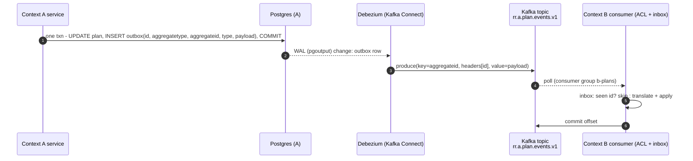
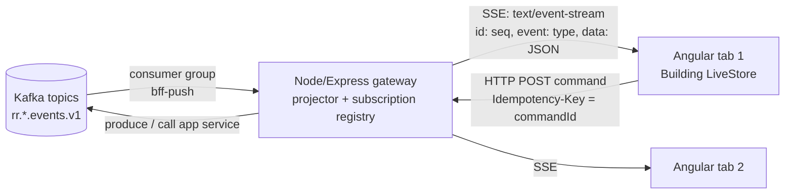

# R3 — Event / Message Bus (Kafka and alternatives) research brief v0

**Created:** 2026-09-03 | **Last updated:** 2026-09-03, pass 2 (modernization) | **Author:** research agent under Axium (R3) | **Status:** exploratory — not doctrine

**Two clocks (README §Currency contract).** Concept claims below cite their canonical source regardless of age (Hohpe & Woolf 2003, Evans 2003, Kleppmann 2017). Every *implementation-idiom* claim — how a component, store or stream is written, which broker version does what — was re-verified on **2026-09-03** against primary sources and carries that date; the Modernization ledger at the end lists what was checked against which URL.

## 2. TL;DR

- **A bus is a contract surface, not plumbing.** What crosses a bounded-context boundary is an *integration event* in a *published language*; the broker is only the carrier. Design the events first, choose the broker second ([Vernon, IDDD ch. 8, 2013](https://www.informit.com/store/implementing-domain-driven-design-9780321834577); [Evans, DDD, 2003](https://www.domainlanguage.com/ddd/)).
- **Kafka is a replicated, partitioned log; RabbitMQ/NATS are brokers.** The log keeps history and lets consumers replay from an *offset*; a queue deletes on ack. That one difference drives most other trade-offs ([Kleppmann, DDIA ch. 11, 2017](https://www.oreilly.com/library/view/designing-data-intensive-applications/9781491903063/ch11.html)).
- **Kafka is KRaft-only and now has real queues.** Kafka 4.0 (March 2025) removed ZooKeeper; the current release is **4.3.1** (23 June 2026; 4.4.0 was not yet on the Apache archive on 2026-09-03), and **4.2.0** (16 February 2026) marked the KIP-932 *share group* interfaces stable for GA — queue semantics on a log ([Kafka 4.2.0 release notes](https://archive.apache.org/dist/kafka/4.2.0/RELEASE_NOTES.html); [Apache dist archive](https://archive.apache.org/dist/kafka/)). Strimzi **1.2.0** (current; 1.3.0 in development) runs Kafka 4.2.0–4.3.1 and dropped ZooKeeper clusters in 0.46 ([Strimzi CHANGELOG](https://github.com/strimzi/strimzi-kafka-operator/blob/main/CHANGELOG.md)). An isolated-network Kafka is therefore *one* stateful workload, not two.
- **"Exactly once" is a property of the whole pipeline, not the broker.** Every broker in the comparison gives at-least-once by default; make consumers idempotent and stop arguing about delivery semantics ([Kafka design: message delivery semantics](https://kafka.apache.org/documentation/#semantics)).
- **Publish through a transactional outbox, never dual-write.** Write the event in the same DB transaction as the aggregate; let Debezium 3.6 (CDC) or a poller relay it to the bus ([Richardson, Transactional outbox](https://microservices.io/patterns/data/transactional-outbox.html); [Debezium Outbox Event Router source](https://github.com/debezium/debezium/blob/main/documentation/modules/ROOT/pages/transformations/outbox-event-router.adoc)).
- **Browsers never talk to the bus; the Angular side is signal-first and zoneless.** The Node/Express gateway consumes the bus and fans out over **SSE** (default) or WebSockets (only if the client must stream *up*). In the browser the stream lands in a **NgRx SignalStore** (`rxMethod` + `patchState`, `withEntities`) for the shared Building-level connection, or in a **`resource({ stream })`** for a single self-contained live value; reconnection maps `Last-Event-ID` to a gateway sequence ([Angular, Async reactivity with resources](https://github.com/angular/angular/blob/main/adev/src/content/guide/signals/resource.md); [NgRx, RxJS integration](https://github.com/ngrx/platform/blob/main/projects/www/src/app/pages/guide/signals/rxjs-integration.md); [WHATWG HTML, Server-sent events](https://html.spec.whatwg.org/multipage/server-sent-events.html)). No component-owned subscriptions, no smart/dumb split, no NgModules.
- **Licensing is a real selection criterion on an island.** Apache Kafka, Strimzi, Apicurio, Pulsar, NATS, Karapace are Apache-2.0; RabbitMQ server is MPL-2.0; pgmq is PostgreSQL-licensed; `@confluentinc/kafka-javascript` is **MIT** (corrected this pass). Confluent Schema Registry / REST Proxy / ksqlDB are *Confluent Community License*; Redpanda core is **BSL 1.1** with an Additional Use Grant that excludes running it as a streaming/queueing *service*, converting four years after each release ([Redpanda BSL text](https://github.com/redpanda-data/redpanda/blob/dev/licenses/bsl.md)).
- **Honest first release:** a 3-node KRaft Kafka via Strimzi, Apicurio 3.3 for schemas, Debezium 3.6 for the outbox, JSON Schema payloads in CloudEvents 1.0.2 envelopes — or, if volume is modest and the ops team tiny, **Postgres (pgmq 1.12 / outbox) first, Kafka later**. Not "enterprise Kafka".

## 3. Core concepts and vocabulary

| Term | One meaning (for the RR lexicon) | Source |
|---|---|---|
| **Message** | A unit of data transmitted through a messaging channel; the generic term. Three sub-kinds below. | [Hohpe & Woolf, EIP: Message](https://www.enterpriseintegrationpatterns.com/patterns/messaging/Message.html) |
| **Command (message)** | Tells a receiver to do something; exactly one logical handler; may be rejected. Imperative, named `DoX`. | [EIP: Command Message](https://www.enterpriseintegrationpatterns.com/patterns/messaging/CommandMessage.html) |
| **Event (message)** | States that something *happened*; immutable fact; zero-to-many consumers; sender does not care how receivers react. Past tense, `XHappened`. | [EIP: Event Message](https://www.enterpriseintegrationpatterns.com/patterns/messaging/EventMessage.html) |
| **Document message** | Carries data without prescribing action (a snapshot, a report). | [EIP: Document Message](https://www.enterpriseintegrationpatterns.com/patterns/messaging/DocumentMessage.html) |
| **Domain event** | An event raised *inside* a bounded context by the domain model, in the ubiquitous language of that context. | [Vernon, IDDD ch. 8](https://www.informit.com/store/implementing-domain-driven-design-9780321834577) |
| **Integration event** | An event published *across* context boundaries in the published language; a deliberate, versioned contract; usually a *translation* of one or more domain events. | Vernon ch. 8/13; [Evans, Published Language](https://www.domainlanguage.com/ddd/) |
| **Published language** | A well-documented shared language for inter-context communication (schemas on the bus). | Evans, DDD (2003) |
| **Anticorruption layer (ACL)** | Consumer-side translation from the publisher's language into the consumer's model, so upstream churn does not leak in. | Evans, DDD (2003) |
| **Pub/sub** | One message copied to every subscriber (topic semantics). | [EIP: Publish-Subscribe Channel](https://www.enterpriseintegrationpatterns.com/patterns/messaging/PublishSubscribeChannel.html) |
| **Queue (point-to-point)** | Each message consumed by exactly one competing consumer; removed on ack. | [EIP: Point-to-Point Channel](https://www.enterpriseintegrationpatterns.com/patterns/messaging/PointToPointChannel.html) |
| **Log-based broker** | Broker persists an append-only, partitioned log; consumers keep a position (offset) and can re-read. Kafka, Redpanda, Pulsar, RabbitMQ Streams, NATS JetStream streams. | [Kleppmann, DDIA ch. 11](https://www.oreilly.com/library/view/designing-data-intensive-applications/9781491903063/ch11.html) |
| **Topic** | Named category of records. In Kafka, split into **partitions**. | [Kafka docs: intro](https://kafka.apache.org/documentation/#intro_concepts_and_terms) |
| **Partition** | Ordered, immutable sequence of records; the unit of parallelism and *the only ordering scope*. Records with the same key land on the same partition. | Kafka docs: intro |
| **Offset** | The sequential id of a record within a partition; a consumer's "bookmark". | Kafka docs: intro |
| **Consumer group** | Consumers sharing a `group.id` split a topic's partitions among them (queue-like); different groups each get every record (pub/sub-like). | [Kafka docs: consumers](https://kafka.apache.org/documentation/#design_consumer) |
| **Share group** | KIP-932, GA since Kafka **4.2.0** (Feb 2026): multiple consumers in one group read the *same* partition cooperatively with per-record acks — true queue semantics on Kafka. | [Kafka 4.2.0 release notes](https://archive.apache.org/dist/kafka/4.2.0/RELEASE_NOTES.html); [KIP-932](https://cwiki.apache.org/confluence/x/CIq3FQ) |
| **Retention** | Time- or size-bound after which old log segments are deleted. | [Kafka docs: log](https://kafka.apache.org/documentation/#design_log) |
| **Compaction** | Alternative retention: keep at least the *latest* record per key forever — makes a topic a changelog/table. | [Kafka docs: log compaction](https://kafka.apache.org/documentation/#compaction) |
| **At-most / at-least / exactly-once** | Delivery guarantees: may lose / may duplicate / neither. Kafka's EOS = idempotent producer + transactions + `read_committed` consumers; it covers Kafka-to-Kafka, not arbitrary side effects. | [Kafka docs: semantics](https://kafka.apache.org/documentation/#semantics); [KIP-98](https://cwiki.apache.org/confluence/display/KAFKA/KIP-98+-+Exactly+Once+Delivery+and+Transactional+Messaging) |
| **Idempotent consumer** | Handler whose effect is the same whether a message arrives once or N times (dedupe by event id / inbox table). | [Richardson, Idempotent Consumer](https://microservices.io/patterns/communication-style/idempotent-consumer.html) |
| **Transactional outbox** | Persist the event in an `outbox` table inside the business transaction; a relay publishes it. Removes dual-write. | [Richardson, Transactional outbox](https://microservices.io/patterns/data/transactional-outbox.html) |
| **CDC** | Change Data Capture: read the DB's replication log (Postgres `pgoutput`) and emit row changes as events. Debezium is the reference implementation. | [Debezium Postgres connector](https://debezium.io/documentation/reference/stable/connectors/postgresql.html) |
| **Saga / process manager** | A long-running business transaction as a sequence of local transactions with compensations; *choreography* (events trigger the next step) or *orchestration* (a coordinator issues commands). | [Richardson, Saga](https://microservices.io/patterns/data/saga.html); [EIP: Process Manager](https://www.enterpriseintegrationpatterns.com/patterns/messaging/ProcessManager.html) |
| **Event notification / ECST / event sourcing / CQRS** | Fowler's four distinct "event-driven" things: *notify* (id + link, go fetch); *event-carried state transfer* (event carries the data, consumer keeps a copy); *event sourcing* (the log IS the system of record); *CQRS* (separate write and read models). | [Fowler, What do you mean by "Event-Driven"?, 2017](https://martinfowler.com/articles/201701-event-driven.html) |
| **Schema registry** | Service holding versioned schemas (Avro/Protobuf/JSON Schema) with **compatibility modes** (`BACKWARD`, `FORWARD`, `FULL`, `*_TRANSITIVE`, `NONE`). | [Confluent: Schema Evolution & Compatibility](https://docs.confluent.io/platform/current/schema-registry/fundamentals/schema-evolution.html) |
| **CloudEvents** | CNCF spec for an event *envelope* (`id`, `source`, `type`, `time`, `subject`, `datacontenttype`, `data`, extensions) with Kafka/HTTP/AMQP/NATS bindings. Current release **1.0.2**; `main` carries 1.0.3-wip (2026-09-03). | [CloudEvents spec](https://github.com/cloudevents/spec/blob/main/cloudevents/spec.md) |
| **AsyncAPI** | OpenAPI-for-messaging: describes channels, operations (`send`/`receive`), message schemas and bindings. Current **3.1.0** (spec `master`, 2026-09-03). | [AsyncAPI spec](https://github.com/asyncapi/spec/blob/master/spec/asyncapi.md) |
| **KRaft** | Kafka's built-in Raft metadata quorum (KIP-500/595) replacing ZooKeeper; the only mode since Kafka 4.0. | [KIP-500](https://cwiki.apache.org/confluence/display/KAFKA/KIP-500:+Replace+ZooKeeper+with+a+Self-Managed+Metadata+Quorum) |
| **Strimzi** | CNCF Kubernetes operator for Kafka (`v1` CRDs since 1.0.0: `Kafka`, `KafkaNodePool`, `KafkaTopic`, `KafkaUser`, `KafkaConnect`, `KafkaConnector`). | [Strimzi CHANGELOG](https://github.com/strimzi/strimzi-kafka-operator/blob/main/CHANGELOG.md) |
| **Gateway sequence** (browser side) | The monotonic `id:` the gateway stamps on each SSE event; the client's *only* cursor. Never a Kafka `partition:offset`. | this brief, §5.7 |
| **Optimistic command** | A `POST` with an `Idempotency-Key` = `commandId`; the store applies the change locally as *pending* until the bus-fed event carrying the same `commandId` confirms or rejects it. | this brief, §5.7 |

## 4. Canonical sources

- **Hohpe & Woolf, *Enterprise Integration Patterns* (2003)** — the 65-pattern vocabulary. Free online at [enterpriseintegrationpatterns.com](https://www.enterpriseintegrationpatterns.com/patterns/messaging/Introduction.html).
- **Kleppmann, *Designing Data-Intensive Applications* (2017), ch. 11 "Stream Processing"** — log-based vs. AMQP/JMS brokers, CDC, event sourcing, exactly-once ([O'Reilly](https://www.oreilly.com/library/view/designing-data-intensive-applications/9781491903063/ch11.html)). A 2nd edition is in progress (2025/26) [UNVERIFIED chapter numbering].
- **Vernon, *Implementing Domain-Driven Design* (2013), ch. 8 "Domain Events", ch. 13 "Integrating Bounded Contexts"** — domain events, event store, notifications, published language over messaging.
- **Evans, *Domain-Driven Design* (2003), Part IV** — Context Map, Published Language, Anticorruption Layer ([DDD Reference, free](https://www.domainlanguage.com/ddd/reference/)).
- **Fowler, "What do you mean by 'Event-Driven'?" (2017)** — the four-way taxonomy ([martinfowler.com](https://martinfowler.com/articles/201701-event-driven.html)).
- **Richardson, microservices.io** — [Transactional outbox](https://microservices.io/patterns/data/transactional-outbox.html), [Transaction log tailing](https://microservices.io/patterns/data/transaction-log-tailing.html), [Saga](https://microservices.io/patterns/data/saga.html), [Idempotent consumer](https://microservices.io/patterns/communication-style/idempotent-consumer.html).
- **Apache Kafka documentation §4 "Design"** ([kafka.apache.org/documentation](https://kafka.apache.org/documentation/#design)) and the KIPs: [KIP-98](https://cwiki.apache.org/confluence/display/KAFKA/KIP-98+-+Exactly+Once+Delivery+and+Transactional+Messaging) (EOS), [KIP-500](https://cwiki.apache.org/confluence/display/KAFKA/KIP-500:+Replace+ZooKeeper+with+a+Self-Managed+Metadata+Quorum) (KRaft), [KIP-932](https://cwiki.apache.org/confluence/x/CIq3FQ) (queues). Confluent's [delivery semantics](https://docs.confluent.io/kafka/design/delivery-semantics.html) and [schema evolution](https://docs.confluent.io/platform/current/schema-registry/fundamentals/schema-evolution.html) pages are good; read them knowing they sell Confluent Platform.
- **Debezium documentation** — [Outbox Event Router](https://debezium.io/documentation/reference/stable/transformations/outbox-event-router.html) (source: [`outbox-event-router.adoc`](https://github.com/debezium/debezium/blob/main/documentation/modules/ROOT/pages/transformations/outbox-event-router.adoc)), [PostgreSQL connector](https://debezium.io/documentation/reference/stable/connectors/postgresql.html).
- **Specs:** [CloudEvents](https://github.com/cloudevents/spec) (CNCF), [AsyncAPI](https://github.com/asyncapi/spec) (Linux Foundation), [WHATWG HTML §9.2 Server-sent events](https://html.spec.whatwg.org/multipage/server-sent-events.html).
- **Front-end primary docs (idiom clock, verified 2026-09-03):** Angular [`resource.md`](https://github.com/angular/angular/blob/main/adev/src/content/guide/signals/resource.md), [CHANGELOG](https://github.com/angular/angular/blob/main/CHANGELOG.md), source stability tags in [`packages/core/src/resource/resource.ts`](https://github.com/angular/angular/blob/main/packages/core/src/resource/resource.ts), [`packages/common/http/src/resource.ts`](https://github.com/angular/angular/blob/main/packages/common/http/src/resource.ts), [`packages/forms/signals/src/api/structure.ts`](https://github.com/angular/angular/blob/main/packages/forms/signals/src/api/structure.ts); NgRx [SignalStore](https://github.com/ngrx/platform/blob/main/projects/www/src/app/pages/guide/signals/signal-store/index.md), [RxJS integration (`rxMethod`)](https://github.com/ngrx/platform/blob/main/projects/www/src/app/pages/guide/signals/rxjs-integration.md), [Events plugin](https://github.com/ngrx/platform/blob/main/projects/www/src/app/pages/guide/signals/signal-store/events.md), [Entity management](https://github.com/ngrx/platform/blob/main/projects/www/src/app/pages/guide/signals/signal-store/entity-management.md), [CHANGELOG](https://github.com/ngrx/platform/blob/main/CHANGELOG.md).
- **Operator/broker docs for the comparison:** [Strimzi Helm chart README](https://github.com/strimzi/strimzi-kafka-operator/blob/main/helm-charts/helm3/strimzi-kafka-operator/README.md) + [container-image module](https://github.com/strimzi/strimzi-kafka-operator/blob/main/documentation/modules/deploying/con-deploy-container-images.adoc), [Redpanda licences](https://github.com/redpanda-data/redpanda/tree/dev/licenses), [Apache Pulsar Helm chart](https://github.com/apache/pulsar-helm-chart), [RabbitMQ](https://www.rabbitmq.com/docs/quorum-queues) + [release notes](https://github.com/rabbitmq/rabbitmq-server/tree/main/release-notes), [NATS JetStream](https://docs.nats.io/nats-concepts/jetstream) + [nats-io/k8s](https://github.com/nats-io/k8s), [pgmq](https://github.com/pgmq/pgmq), [PostgreSQL NOTIFY](https://www.postgresql.org/docs/current/sql-notify.html).

## 5. How it is done in practice

### 5.1 Which "event-driven" do you mean?

Teams say "event-driven" and mean four different things with different costs ([Fowler, 2017](https://martinfowler.com/articles/201701-event-driven.html)). Pick per integration, not per system:

- **Event notification** — `MissionPlanApproved {planId}`; the consumer calls back for detail. Least payload coupling, but a hidden synchronous dependency.
- **Event-carried state transfer (ECST)** — the event carries the plan; consumers keep a copy. Better availability and load isolation; costs eventual consistency and duplication. A *compacted* Kafka topic exists for this.
- **Event sourcing** — the log is the source of truth; state is a fold over it. Strong for audit and time-travel; expensive in schema evolution, snapshots and query. Use it *inside* a context that needs it, never as the system-wide default (Kleppmann, Fowler).
- **CQRS** — separate read and write models, often bus-fed. Justified when read shapes diverge from the aggregate; otherwise indirection.

### 5.2 Domain events vs. integration events, and who owns the topic

Inside a context the aggregate raises **domain events** in its own language; the application layer chooses which become **integration events** and translates them into the **published language** ([Vernon, IDDD ch. 8, 13](https://www.informit.com/store/implementing-domain-driven-design-9780321834577)). Conventions that follow:

- **One producer context owns each topic.** Name for ownership and kind, e.g. `rr.<context>.<aggregate>.<events|commands>.v<N>` — major version in the name, because a breaking schema change is a new topic. Topic-per-aggregate-type is what Debezium's outbox router emits by default ([Debezium Outbox Event Router](https://debezium.io/documentation/reference/stable/transformations/outbox-event-router.html)).
- **Key = aggregate id**, so one aggregate's events share a partition and stay ordered. Cross-aggregate ordering does not exist; design so you do not need it.
- **Consumers wrap the bus in an anticorruption layer**: deserialize the published schema, translate to local types, then call the local application service. A foreign schema never becomes a domain type.
- **Commands get their own channel** (point-to-point / share group). A command has one handler and can fail; an event has already happened.

### 5.3 Publishing reliably: outbox + CDC

Dual write (commit, then publish; crash between) is the canonical failure. The fix is the transactional outbox, relayed by *polling* or *log tailing* (CDC) ([Richardson](https://microservices.io/patterns/data/transactional-outbox.html)). Debezium's Postgres connector reads the built-in `pgoutput` plugin (no server extension) and its `EventRouter` SMT (`transforms.outbox.type=io.debezium.transforms.outbox.EventRouter`, verified in the Debezium 3.6 doc source on 2026-09-03) turns outbox rows into topic-routed messages carrying the event `id` for dedupe ([Debezium Postgres connector](https://debezium.io/documentation/reference/stable/connectors/postgresql.html); [Outbox Event Router source](https://github.com/debezium/debezium/blob/main/documentation/modules/ROOT/pages/transformations/outbox-event-router.adoc)). Current Debezium is the **3.6** line (3.6.2.Final tagged; `main` is 3.7.0-SNAPSHOT).



Sagas ride the same rails: each step is a local transaction + outbox event; orchestration adds a process manager with persisted state that issues commands ([Richardson, Saga](https://microservices.io/patterns/data/saga.html); [EIP, Process Manager](https://www.enterpriseintegrationpatterns.com/patterns/messaging/ProcessManager.html)). Prefer orchestration beyond ~3 steps or when status must be visible; choreography's coupling is invisible until it breaks.

### 5.4 Contracts: schema registry, CloudEvents, AsyncAPI

- **Registry + compatibility mode.** `BACKWARD` (default; new readers read old data, so consumers can *rewind*) or `FULL_TRANSITIVE` for long-lived topics; non-transitive modes check against the latest version only ([Confluent, Schema Evolution](https://docs.confluent.io/platform/current/schema-registry/fundamentals/schema-evolution.html)). Only add optional fields; never rename; never change type.
- **Format.** Avro is compact but needs the schema to decode; Protobuf is similar with better cross-language tooling; JSON Schema is readable and native to a TypeScript gateway and browser, at a byte cost. For a TS-heavy stack, **JSON Schema on the bus, Protobuf only where volume demands** is a defensible default.
- **Registry choice.** Confluent Schema Registry is Confluent-Community-licensed; **Apicurio Registry 3.3** (Apache-2.0 verified in-repo; 3.3.2 is the latest tag, `main` is 3.3.3-SNAPSHOT; Confluent-API-compatible, also stores OpenAPI/AsyncAPI) and **Karapace** (Apache-2.0 verified) are the open alternatives ([Apicurio compatibility API](https://www.apicur.io/registry/docs/apicurio-registry/3.3.x/getting-started/assembly-confluent-schema-registry-compatibility.html); [Karapace](https://github.com/Aiven-Open/karapace)).
- **Envelope.** Wrap every payload in **CloudEvents 1.0.2** (`id`, `source`, `type`, `time`, `subject`, extensions) via the Kafka binding — where the *security marking* and correlation/causation ids (`commandid`) live ([CloudEvents spec](https://github.com/cloudevents/spec/blob/main/cloudevents/spec.md)).
- **Catalogue.** One **AsyncAPI 3.1** document per bounded context describing channels and messages; generate TS types into `common/` so the same generated `ServerEvent` union is what the SignalStore reduces ([AsyncAPI spec 3.1.0](https://github.com/asyncapi/spec/blob/master/spec/asyncapi.md)).

### 5.5 Broker comparison

Version and licence cells re-verified 2026-09-03 against each project's repository (tags, `LICENSE`, `pom.xml`/`const.go`/`pgmq.control`), because doc sites were egress-blocked.

| | **Apache Kafka 4.3 (KRaft)** | **Redpanda** | **Apache Pulsar 4.2** | **RabbitMQ 4.4** | **NATS 2.14 + JetStream** | **Postgres (pgmq 1.12 / outbox / NOTIFY)** |
|---|---|---|---|---|---|---|
| Model | Partitioned replicated log; consumer groups; share groups (GA 4.2.0) | Kafka-protocol log, C++ single binary, no JVM | Log + BookKeeper storage; topics, subscriptions (exclusive/shared/failover/key-shared) | Broker with exchanges; quorum queues (Raft) + streams (log) | Core pub/sub (at-most-once) + JetStream streams/consumers (persisted) | Table-backed queue with visibility timeout; `NOTIFY` is ephemeral, ≤8000-byte payload |
| Guarantees | At-least-once; EOS for Kafka-to-Kafka via idempotent producer + transactions | Same as Kafka (protocol-compatible) | At-least-once; dedup + transactions | At-least-once (quorum queues); publisher confirms | At-least-once; exactly-once *publish* via `Nats-Msg-Id` dedup window | pgmq: "exactly once within a visibility timeout"; ACID with your data |
| Ordering | Per partition (by key) | Per partition | Per partition / key | Per queue (FIFO), not across | Per subject in a stream | Per queue, or true global order via SQL |
| Replay / history | Yes — offsets, retention, compaction | Yes | Yes | Streams yes; queues no | Streams yes (limits-based retention) | Yes if you keep rows (`archive`) |
| Throughput / scale | Very high; horizontal by partitions | Very high; lower latency per node | High; separates compute/storage | Moderate; per-queue bottlenecks | High for small messages; lightweight | Bounded by one DB; fine to low-thousands msg/s [UNVERIFIED] |
| Operational weight | Medium (3+ brokers, JVM, Connect, registry) — no ZK since 4.0 | Low–medium (one binary, needs `rpk`/tuning, `CAP_SYS_RESOURCE` for tuner) | **High** (brokers + bookies + ZooKeeper by default; Oxia optional, off by default in the Helm chart) | Low–medium (Erlang; one operator) | **Low** (tiny Go binary; 3-node JetStream) | **Lowest** — it is the DB you already run |
| K8s operator | **Strimzi 1.2.0** (CNCF, Apache-2.0); Helm OCI `oci://quay.io/strimzi-helm/strimzi-kafka-operator` | Redpanda Operator + Helm chart | Official Helm chart (`apache/pulsar-helm-chart`); StreamNative operators | RabbitMQ Cluster Operator + Topology Operator | `nats` Helm chart + NACK controller (`nats-io/k8s`) | Whatever runs Postgres (CloudNativePG etc.) |
| Licence (verified in-repo) | Apache-2.0 | **BSL 1.1** (core; Additional Use Grant bars offering it as a streaming/queueing service; Change Date four years after each release); enterprise features under the Redpanda Community License + key | Apache-2.0 | MPL-2.0 (server + tier-1 plugins) | Apache-2.0 | PostgreSQL licence (server and pgmq) |
| Offline install | Feasible: ~6–8 images (operator, Kafka per version, Connect, Bridge, registry) + one OCI chart; `defaultImageRegistry` override | Feasible; vendor documents air-gapped K8s [UNVERIFIED this pass — vendor site blocked] | Feasible but many images (chart defaults: zookeeper, bookkeeper, autorecovery, broker, proxy, toolset) | Feasible; 2 images + operator | Easiest of the brokers | Trivial |
| Best fit for RR | Default backbone once >1 producer context and replay/audit matter | If Kafka protocol wanted with less JVM ops and BSL is acceptable | Multi-tenant, geo-replication needs — not RR's shape | Work queues / RPC-style commands; not an event backbone with history | Command/RPC + light events at the edge; internal control plane | **First release**, or forever if volume stays modest |

Sources: [Kafka 4.2.0 / 4.3.1 release notes](https://archive.apache.org/dist/kafka/); [KIP-932](https://cwiki.apache.org/confluence/x/CIq3FQ); [Redpanda BSL](https://github.com/redpanda-data/redpanda/blob/dev/licenses/bsl.md) and [RCL](https://github.com/redpanda-data/redpanda/blob/dev/licenses/rcl.md); [Pulsar Helm `values.yaml`](https://github.com/apache/pulsar-helm-chart/blob/master/charts/pulsar/values.yaml) (`components.zookeeper: true`, `components.oxia: false`); [RabbitMQ LICENSE](https://github.com/rabbitmq/rabbitmq-server/blob/main/LICENSE), [4.4.0 release notes](https://github.com/rabbitmq/rabbitmq-server/blob/main/release-notes/4.4.0.md), [Quorum Queues](https://www.rabbitmq.com/docs/quorum-queues), [Operator overview](https://www.rabbitmq.com/kubernetes/operator/operator-overview); [NATS server `const.go` v2.14.6](https://github.com/nats-io/nats-server/blob/v2.14.6/server/const.go), [JetStream](https://docs.nats.io/nats-concepts/jetstream), [nats-io/k8s](https://github.com/nats-io/k8s); [pgmq `pgmq.control` v1.12.0](https://github.com/pgmq/pgmq/blob/v1.12.0/pgmq-extension/pgmq.control); [PostgreSQL NOTIFY](https://www.postgresql.org/docs/current/sql-notify.html); [Strimzi Helm README](https://github.com/strimzi/strimzi-kafka-operator/blob/main/helm-charts/helm3/strimzi-kafka-operator/README.md). Pulsar 5.0 (Oxia default, etcd removal) is still pre-release and its milestone tag could not be found in `apache/pulsar` [UNVERIFIED].

### 5.6 Kafka on an isolated Kubernetes cluster

**KRaft and versions (verified 2026-09-03):** Kafka 4.0.0 (18 March 2025) removed ZooKeeper — its release notes list the ZooKeeper-migration removals ([4.0.0 release notes](https://archive.apache.org/dist/kafka/4.0.0/RELEASE_NOTES.html)); the requirement that 4.x brokers already run KRaft with metadata version ≥ 3.3 comes from the 4.0 upgrade guide, which was egress-blocked this pass [UNVERIFIED this pass]. The Apache archive holds 4.0.2, 4.1.0–4.1.2, 4.2.0 (16 Feb 2026), 4.2.1, 4.3.0 (20 May 2026) and **4.3.1 (23 June 2026)**; 4.4.0 is not yet published (the `4.4` branch is versioned `4.4.0`, `trunk` is 4.5.0-SNAPSHOT). Greenfield RR never touches ZooKeeper. **Strimzi 1.2.0** is the current release (Helm values `defaultImageTag: 1.2.0`; 1.3.0 is in development on `main`); it dropped ZooKeeper clusters in 0.46.0, moved to `v1` CRDs in 1.0.0, supports Kafka 4.2.0, 4.2.1, 4.3.0 and 4.3.1 (default 4.3.1), and ships its Helm chart as an OCI artifact — `helm install … oci://quay.io/strimzi-helm/strimzi-kafka-operator` — the `strimzi.io/charts` repo having been deprecated since 0.36.0 ([Strimzi CHANGELOG](https://github.com/strimzi/strimzi-kafka-operator/blob/main/CHANGELOG.md); [`kafka-versions.yaml` on `release-1.2.x`](https://github.com/strimzi/strimzi-kafka-operator/blob/release-1.2.x/kafka-versions.yaml); [Helm README](https://github.com/strimzi/strimzi-kafka-operator/blob/main/helm-charts/helm3/strimzi-kafka-operator/README.md)). 1.2.0 also defaults its operator pods to the Kubernetes *Restricted* Pod Security Standard and supports Maven mirrors for Kafka Connect Build — both useful on an island. **Do not plan on Bitnami's Kafka chart:** on 28 August 2025 the public Bitnami catalogue shrank to a limited community tier at `docker.io/bitnamisecure` (latest tags only), the older versioned images were archived read-only to `docker.io/bitnamilegacy`, production-grade images moved behind a Bitnami Secure Images subscription, and the legacy deletion was pushed to 29 September 2025 ([bitnami/charts#35164](https://github.com/bitnami/charts/issues/35164), re-read 2026-09-03).

**Air-gapped guidance (Strimzi, verified):** the deployment guide's module "Pushing container images to your own registry" says: if you cannot reach `quay.io/strimzi`, pull *all* listed images, push them to your registry, and update the image names in the deployment YAML — noting that **each supported Kafka version has a separate image** ([`con-deploy-container-images.adoc`](https://github.com/strimzi/strimzi-kafka-operator/blob/main/documentation/modules/deploying/con-deploy-container-images.adoc)). With Helm the same override is `defaultImageRegistry` / `defaultImageRepository` / `defaultImageTag` (global) plus per-component `kafka.image.registry`, `kafkaConnect.image.registry`, `topicOperator.image.registry`, … and `image.imagePullSecrets` for a private registry ([Helm README](https://github.com/strimzi/strimzi-kafka-operator/blob/main/helm-charts/helm3/strimzi-kafka-operator/README.md); [`values.yaml`](https://github.com/strimzi/strimzi-kafka-operator/blob/main/helm-charts/helm3/strimzi-kafka-operator/values.yaml)).

**What must be in the bundle** (pin exact tags against the chosen Strimzi release):

1. Strimzi operator image; the Kafka image for the *one* Kafka version you pin (brokers *and* controllers); Kafka Connect image with Debezium 3.6 **pre-built** on the open side (Strimzi's in-cluster `build` needs a registry to push to — or a Maven mirror, supported since 1.2.0); optionally Bridge, Cruise Control, kafka-exporter.
2. Apicurio Registry 3.3 image (+ its Postgres or KafkaSQL storage).
3. The Strimzi OCI chart, plus the CRDs it installs (Helm does not upgrade CRDs — the CHANGELOG repeats this every release).
4. Node client: **`@confluentinc/kafka-javascript` 1.10.0** (1 July 2026; **MIT** per npm and the repo `LICENSE.txt`) wraps librdkafka, exposes a KafkaJS-compatible promise API, and ships **prebuilt binaries** for Debian/Ubuntu, Alpine 3.20+, Alma/Rocky/CentOS Stream 9, macOS arm64 and Windows x64 on Node 18–24 — the offline npm mirror needs the right prebuild or a compile toolchain; `node-rdkafka` 3.6.1 (Dec 2025, MIT) is the lower-level alternative. **KafkaJS** 2.2.4 was last published 27 February 2023 and its README describes maintenance by "a small group of dedicated volunteers" ([npm registry](https://registry.npmjs.org/@confluentinc/kafka-javascript); [client README](https://github.com/confluentinc/confluent-kafka-javascript/blob/master/README.md); [KafkaJS README](https://github.com/tulios/kafkajs/blob/master/README.md)).
5. Monitoring: Strimzi's examples ship Prometheus metric configs and Grafana dashboards; kafka-exporter gives consumer lag.

**Minimal, honest first-release topology:** one `Kafka` CR with a 3-node `KafkaNodePool` in **combined** controller+broker role, persistent volumes, TLS listeners with `KafkaUser` SCRAM/mTLS, GitOps-declared `KafkaTopic` CRs (replication 3, `min.insync.replicas=2`), one `KafkaConnect` running Debezium, Apicurio, kafka-exporter. That is 6–10 pods and one operator — not "enterprise Kafka" (tiered storage, MirrorMaker 2, Cruise Control, ksqlDB), none of which RR needs on day one.

### 5.7 The front end and the bus

Browsers do not speak Kafka, and the HTTP proxies that exist (Confluent REST Proxy, Strimzi Bridge, Redpanda's HTTP proxy) expose *broker* concepts — partitions, offsets, consumer instances — that have no business in a UI. The gateway is a **backend-for-frontend fan-out**; the browser side is written in the **2026 Angular idiom**: standalone, `OnPush` by default (v22), zoneless (`provideZonelessChangeDetection`, stable since 20.2), signal inputs, `@if`/`@for` control flow, async data through `resource()` or a SignalStore. There is no smart/dumb component split — a component reads signals from a store or a resource and dispatches through store methods; the "smartness" lives in the store.



**Push transport.** Server-Sent Events are the default: one-directional, plain HTTP, proxy- and auth-friendly; `EventSource` reconnects automatically and sends `Last-Event-ID` on reconnect ([WHATWG HTML §9.2](https://html.spec.whatwg.org/multipage/server-sent-events.html)). Use WebSockets only when the client must *stream* upward (collaborative cursors, telemetry from the browser). Two SSE caveats: `EventSource` cannot set custom headers, so authenticate by cookie (`withCredentials`) or use `fetch` + `ReadableStream` and parse `text/event-stream` yourself; and keep HTTP/2 in front, since HTTP/1.1 browsers cap ~6 connections per origin ([MDN, Using server-sent events](https://developer.mozilla.org/en-US/docs/Web/API/Server-sent_events/Using_server-sent_events)).

**Fan-out and projection.** The gateway runs *one* consumer group per deployment (not per user), authorizes per subscriber (a user sees only entities they may read — where R4/R5's RBAC/MAC bites), *projects* bus events into UI-shaped view events, and coalesces bursts. Per-user replay comes from the gateway's ring buffer or projection store, never by seeking Kafka per browser.

**Reconnection and replay via offsets.** Give every pushed event a monotonic `id` per stream — a gateway-assigned sequence with the Kafka offset persisted beside it (never the raw `partition:offset`). On reconnect the gateway reads `Last-Event-ID`: if it is within the buffer, replay from there; if not (gateway restarted, retention passed), send a `snapshot` event and let the client rebuild. The client must always tolerate the snapshot path.

**Which browser primitive consumes the stream — `resource({ stream })` vs. SignalStore vs. the Events plugin.** Three legitimate shapes, verified against the Angular 22.1 / NgRx 22.0 docs on 2026-09-03:

| Case | Use | Why |
|---|---|---|
| One live *value* whose identity is a signal (an Office widget showing a single plan's status; a chart following the selected asset) | `resource({ params: () => ({ id: selectedId() }), stream: ({ params, abortSignal }) => … })` | `stream` is the documented loader for "WebSockets, Server-Sent Events, Firestore `onSnapshot`"; the resource re-subscribes when `params` changes, aborts the old subscription via `abortSignal`, exposes `value`/`status`/`error`/`isLoading`, and its lifetime is the injector's — no subscription in the component. Since 22.0 `stream` may return the `Signal<ResourceStreamItem<T>>` synchronously, not only a `Promise` of one ([resource.md §Streaming resources](https://github.com/angular/angular/blob/main/adev/src/content/guide/signals/resource.md); CHANGELOG 22.0.0 "allow synchronous values for stream Resources"). |
| Deriving a stream-fed value (keep the previous value while re-subscribing; hold the last good value across a `stale` gap) | `resourceFromSnapshots(linkedSignal({ source: r.snapshot, computation }))` | Composition over `snapshot` (added 21.2, public in 22.0) replaces hand-rolled `startWith`/`scan` pipelines ([resource.md §Resource composition with snapshots](https://github.com/angular/angular/blob/main/adev/src/content/guide/signals/resource.md)). |
| The **shared** Building-level connection: one `EventSource`, many entity collections, pending optimistic commands, a persisted cursor | `signalStore` with `withState` (cursor, connection state, pending map), `withEntities`, a `connect`/`listen` method built with `rxMethod`, `withHooks({ onInit })` | `rxMethod` is the documented place for an RxJS pipeline that feeds `patchState`; called with a signal or observable inside the injection context it is cleaned up with the store ([RxJS integration](https://github.com/ngrx/platform/blob/main/projects/www/src/app/pages/guide/signals/rxjs-integration.md)). The store, not a component, owns the subscription. |
| Several Suite stores must react to the *same* gateway event without importing each other | `@ngrx/signals/events`: `eventGroup({ source: 'Gateway', … })`, `withReducer(on(…))` per Suite store, `withEventHandlers` for side effects, `Dispatcher`/`injectDispatch` | The Events plugin (added 19.2; `withEffects` renamed `withEventHandlers` in 21.0) is "for inter-store coordination or a decoupled architecture" — exactly the Building→Suite fan-out; the Building's `listen` method dispatches one NgRx event per gateway event and each Suite reduces what it registered for ([Events plugin](https://github.com/ngrx/platform/blob/main/projects/www/src/app/pages/guide/signals/signal-store/events.md)). |

Rule of thumb: **one value → `resource({ stream })`; one connection feeding one store → `rxMethod`; one connection feeding many stores → Events plugin.** Never one `EventSource` per component, never a `Subscription` field on a component.

**Sketch — `building/live-store.ts` (Angular 22.1 / `@ngrx/signals` 22.0; the Building owns the one SSE connection, Suites reduce from it; gateway SSE → Building SignalStore, optimistic command keyed by `commandId`, reconnection via the persisted cursor):**

```ts
import { patchState, signalStore, withHooks, withMethods, withState } from '@ngrx/signals';
import { setEntity, withEntities } from '@ngrx/signals/entities';
import { rxMethod } from '@ngrx/signals/rxjs-interop';
import { Observable, pipe, retry, switchMap, tap, timer } from 'rxjs';
import type { Plan, ServerEvent } from '@rr/common';                // generated from the AsyncAPI document
const sse = (since: () => string | null) => new Observable<ServerEvent>((sub) => {
  const es = new EventSource(`/api/stream?since=${since() ?? ''}`, { withCredentials: true }); // cookie auth: EventSource cannot set headers
  es.onmessage = (m) => sub.next({ id: m.lastEventId, ...JSON.parse(m.data) });               // `id:` = gateway sequence, never a Kafka offset
  es.onerror = () => sub.error(new Error('sse lost'));   // native retry resends Last-Event-ID; our resubscribe passes the persisted cursor
  return () => es.close();
});
export const LiveStore = signalStore(
  { providedIn: 'root' },
  withState({ lastEventId: null as string | null, connection: 'connecting' as 'connecting' | 'live' | 'stale', pending: {} as Record<string, Plan> }),
  withEntities<Plan>(),
  withMethods((store) => {
    const apply = (e: ServerEvent) => {
      if (e.type === 'rr.gateway.snapshot') patchState(store, { pending: {} });              // replay impossible: rebuild, drop optimism
      if (e.type.startsWith('rr.planning.Plan')) patchState(store, setEntity(e.data as Plan)); // Updated *or* Rejected: server truth wins
      const done = e.commandid;                                                                 // confirm/reject clears the optimistic entry
      if (done) patchState(store, ({ pending }) => { const { [done]: _, ...rest } = pending; return { pending: rest }; });
      patchState(store, { lastEventId: e.id, connection: 'live' });
    };
    const listen = rxMethod<void>(pipe(
      switchMap(() => sse(store.lastEventId).pipe(retry({ delay: () => (patchState(store, { connection: 'stale' }), timer(2_000)) }))),
      tap(apply)));
    const submit = async (plan: Plan) => {                                                      // optimistic command keyed by commandId
      const commandId = crypto.randomUUID();
      patchState(store, setEntity(plan), (s) => ({ pending: { ...s.pending, [commandId]: plan } }));
      await fetch('/api/commands/plan', { method: 'POST', headers: { 'Idempotency-Key': commandId }, body: JSON.stringify(plan) });
    };
    return { listen, submit };
  }),
  withHooks({ onInit: ({ listen }) => listen() }),
);
```

An Office component then reads `store.entities()` / `store.pending()` / `store.connection()` and calls `store.submit(plan)`; a Suite that only needs one plan wraps `resource({ params: () => ({ id: planId() }), stream: … })` around the same gateway endpoint filtered by `subject`. Reducers should stay pure `(state, event) => patch` per event `type`, generated from the AsyncAPI/JSON Schema so the published language reaches the browser typed. The `*Rejected` event carries the authoritative entity, so "rollback" is just `setEntity(serverTruth)` plus clearing the pending key — the bus, not the HTTP `202`, is the source of truth.

**Stability per Angular major — the two-island re-pin risk.** Desert Island's target may fall back to whatever Legacy Island reaches (v19–v22, `two_island_model.md` §Stack synchronization). The primitives above are *not* uniformly available, verified from the `@experimental`/`@publicApi` JSDoc tags on each release branch and the CHANGELOG on 2026-09-03:

| API | v19 (19.2.x) | v20 (20.3.x) | v21 (21.2.x) | v22 (22.1.5) |
|---|---|---|---|---|
| `resource()` / `rxResource()` | `@experimental` (introduced 19.0) | `@experimental 19.0` | `@experimental 19.0` | **`@publicApi 22.0`** |
| `resource({ stream })` | `@experimental` (19.2; must return `Promise<Signal<ResourceStreamItem<T>>>`) | same | same | stable; may return the signal synchronously (22.0) |
| `httpResource` | `@experimental` (19.2) | `@experimental 19.2` | `@experimental 19.2` | **`@publicApi 22.0`** |
| `resource.snapshot` / `resourceFromSnapshots` | — | — | added 21.2 (`// @public` in the golden; family still experimental) | public with the family (22.0) |
| Zoneless | `provideExperimentalZonelessChangeDetection` (`@experimental`) | dev preview 20.0 → **stable 20.2** (`provideZonelessChangeDetection`, `@publicApi 20.2`) | stable; migration for zoneless-by-default (21.0) | stable |
| `OnPush` default | no | no | no | **yes** (22.0; `ChangeDetectionStrategy.Eager` opts out) |
| Signal Forms (`@angular/forms/signals`) | — | — | `@experimental 21.0.0` | **`@publicApi 22.0`** |
| `@ngrx/signals` `rxMethod`, `withEntities`, `patchState` | stable | stable | stable (21.1 deprecates calling `rxMethod` outside an injection context) | stable (22.0: union state slices become per-member `DeepSignal`s — breaking) |
| `@ngrx/signals/events` | 19.2+ (`withEffects`) | `withEffects` | `withEventHandlers` (renamed 21.0) | `withEventHandlers` |

Consequence for RR: the **SignalStore + `rxMethod` shape is the portable one** — it is stable on every major the islands could land on — while `resource({ stream })`, `resourceFromSnapshots` and Signal Forms are stable **only on v22**. If the pin drops to v19–v21, keep the resource-based Suite widgets behind a thin adapter (or use `rxMethod` for them too) and treat any Signal Forms usage as experimental. Do not scaffold on the v22-only primitives before DR-04 closes.

**Where this lives in the Building / Floor / Suite / Office hierarchy** (R7): the *Building* shell provides `LiveStore` (route-level `providers` or `providedIn: 'root'`) and owns the single SSE connection and the `connection` signal; each *Suite* (a bounded-context-aligned UI slice) registers the event types and entity scopes it needs and owns its own reducers (`withReducer(on(gatewayEvents.planUpdated, …))` or a `withMethods` reducer); *Offices* only read signals and call store methods. One connection, many subscriptions.

## 6. Trade-offs, anti-patterns, failure modes

- **Kafka as the system of record by accident.** Retention deletes data; compaction keeps only the last value per key. Unless you *decide* on event sourcing with an event store, the database is truth and Kafka is a transport with history ([Kleppmann, DDIA ch. 11](https://www.oreilly.com/library/view/designing-data-intensive-applications/9781491903063/ch11.html)).
- **Dual write.** DB commit then publish (or vice versa) without an outbox — will lose or phantom events under failure ([Richardson](https://microservices.io/patterns/data/transactional-outbox.html)).
- **CDC of raw tables as "events".** Row-change streams leak the producer's schema into every consumer — the opposite of a published language. Use CDC *on the outbox table only*.
- **Chatty entity events / distributed monolith.** Publishing every field change, or building request/response over the bus, recreates synchronous coupling with worse debuggability. Commands that need a reply usually want HTTP.
- **Ordering assumptions across partitions or topics.** Only same-key, same-partition order holds; rebalances and retries reorder everything else. Consumers must tolerate out-of-order and duplicate delivery.
- **No lag alerting, no dead-letter topic, no registry.** One poison message stalls a partition forever; one renamed field breaks every downstream context at once.
- **Over-buying.** Pulsar tiering or Kafka MirrorMaker/Cruise Control for a handful of producers is debt with no return. Conversely, **Postgres-as-bus** stops being honest once you need many independent consumer groups with independent replay, or sustained tens-of-thousands msg/s.
- **Browser-side replay from Kafka offsets.** Tying UI state to raw partition offsets couples the UI to broker topology; keep the gateway sequence as the client's cursor.
- **Component-owned streams.** An `EventSource` or `Subscription` field on a component, `ngOnDestroy` teardown, `async` pipes chained off a service `Subject` — the 2019 shape. It leaks on route changes, duplicates connections per tab region, and cannot be reasoned about under zoneless change detection. The subscription belongs to a store (`rxMethod`) or a `resource`.
- **Building on v22-only primitives before the pin is settled.** `resource({ stream })`, `resourceFromSnapshots` and Signal Forms are experimental on v19–v21 (table above); a re-pin would turn them into a rewrite.

## 7. RR lens

- **Isolated network.** Everything above is Apache-2.0, MPL-2.0, MIT or PostgreSQL-licensed and bundle-able as OCI images + charts; nothing phones home. The Strimzi chart's `defaultImageRegistry`/per-component `image.registry` overrides, `imagePullSecrets`, and pinned tags are the mechanism — and *each Kafka version is a separate image*, so pin one. The bundle manifest needs the `@confluentinc/kafka-javascript` prebuild for the island's Node/OS (Node 22 LTS on Debian/Alpine/RHEL-9-family is covered). The Debezium-loaded Connect image must be built on the open side (or via a Maven mirror, Strimzi 1.2+). Confluent-Community-licensed components add a licence review that the Apache alternatives (Apicurio, Karapace) avoid. Redpanda's BSL would need explicit programme acceptance — its Additional Use Grant forbids offering Redpanda *as* a streaming/queueing service, which an internal RR bus is not, but counsel decides.
- **Stack fit (2026 idiom).** Node 22/Express gateway = the *only* Kafka client the browser side ever meets; `@confluentinc/kafka-javascript` (MIT, KafkaJS-compatible API) is the maintained option. Shared `common/` (`@rr/*` workspace package) carries the CloudEvents envelope type, the AsyncAPI-generated `ServerEvent` union and the reducer signatures — consumed by the gateway *and* the Angular `LiveStore`, so gateway and browser cannot drift. The Angular side is standalone + `OnPush` (v22 default) + zoneless + NgRx SignalStore; the stream enters through `rxMethod` (portable v19–v22) or `resource({ stream })` (v22-stable). JSON Schema payloads keep TypeScript in the loop; Java/Python contexts consume the same registry.
- **Defense context.** The CloudEvents envelope carries the marking/caveat as an extension attribute, the gateway enforces per-subscriber filtering (nothing reaches a browser that the user's clearance does not permit), and topics are partitioned *by context and by marking level* so a whole topic can be characterised for a guard. Audit is a consumer group, not a code path.
- **Two-island synchronisation.** The bus is a *third* thing that must stay in sync: Kafka 4.3.1 / Strimzi 1.2.0 / Apicurio 3.3.2 / Debezium 3.6.2 / `@confluentinc/kafka-javascript` 1.10.0 pins become part of the version-pinned manifest per island, and both islands must run the same topic/schema contract versions when they meet in the shared cluster. A schema is a bundle artifact. The Angular-side primitive choice is *also* a pin (table in §5.7): a v19 Legacy Island and a v22 Desert Island can share `common/` and the gateway contract, but not `resource({ stream })` code.
- **Crossing a security domain (R6 covers this).** A bus never spans domains; a **guard** does. Design a dedicated *export* topic per direction whose messages are fully self-describing (ECST, not notification — the other side cannot call back), single-schema, validated, marked in the envelope, idempotent by `id`, and assume the guard reorders, delays and drops. Everything the guard must inspect must be in the message; nothing may be referenced by id alone.
- **First release.** Decide between (a) Postgres outbox + pgmq 1.12 + gateway SSE, with the bus abstracted behind a port so Kafka can be swapped in, and (b) Strimzi 1.2 / Kafka 4.3 from day one. The deciding facts are the expected event volume, the number of independent consuming contexts, and whether the island team can run a stateful JVM cluster. Either way the browser contract (SSE + gateway sequence + `commandId`) is identical, so the front end does not care which is chosen.

## 8. Open questions for Graham

1. How many bounded contexts will *produce* events in release 1, and does any consumer need independent replay? (If "one or two" and "no", Postgres first.)
2. Expected peak event rate and payload size? Order of hundreds/s or tens-of-thousands/s decides Postgres vs Kafka.
3. Does the island permit privileged pods (Redpanda tuner) or only unprivileged StatefulSets? Strimzi 1.2 now defaults to the *Restricted* PSS — does the island cluster enforce it? Persistent storage class and IOPS on the island cluster?
4. Who operates stateful workloads on the island, and are they JVM-literate? Strimzi hides a lot but not everything.
5. Is BSL (Redpanda) or Confluent Community License acceptable to programme counsel, or is Apache/MPL/MIT-only a hard rule?
6. Does any UI need browser-to-server streaming (WebSocket), or is SSE sufficient everywhere?
7. Does the deploy-time cluster shared with Legacy Island already run a broker (RabbitMQ is common in older estates) that RR must coexist with or reuse?
8. Which marking/caveat vocabulary must the event envelope carry (feeds R5/R6)?
9. **Front-end pin (new, pass 2):** if DR-04 lands Legacy Island on v19–v21, do we accept `resource({ stream })` / Signal Forms as experimental APIs on Desert Island, or standardise on the portable `rxMethod` shape until both islands are on v22?

## 9. Sources

### Concept sources (any age — cited for the idea, not the idiom)

- Hohpe & Woolf, Enterprise Integration Patterns (2003) — https://www.enterpriseintegrationpatterns.com/patterns/messaging/Introduction.html
- Kleppmann, Designing Data-Intensive Applications (2017), ch. 11 — https://www.oreilly.com/library/view/designing-data-intensive-applications/9781491903063/ch11.html
- Vernon, Implementing Domain-Driven Design (2013) — https://www.informit.com/store/implementing-domain-driven-design-9780321834577
- Evans, DDD Reference — https://www.domainlanguage.com/ddd/reference/
- Fowler, What do you mean by "Event-Driven"? (2017) — https://martinfowler.com/articles/201701-event-driven.html
- Richardson: Transactional outbox — https://microservices.io/patterns/data/transactional-outbox.html ; Transaction log tailing — https://microservices.io/patterns/data/transaction-log-tailing.html ; Saga — https://microservices.io/patterns/data/saga.html ; Idempotent consumer — https://microservices.io/patterns/communication-style/idempotent-consumer.html
- Apache Kafka documentation §4 Design — https://kafka.apache.org/documentation/ [egress-blocked 2026-09-03; concept content]
- KIP-98 — https://cwiki.apache.org/confluence/display/KAFKA/KIP-98+-+Exactly+Once+Delivery+and+Transactional+Messaging ; KIP-500 — https://cwiki.apache.org/confluence/display/KAFKA/KIP-500:+Replace+ZooKeeper+with+a+Self-Managed+Metadata+Quorum ; KIP-595 — https://cwiki.apache.org/confluence/spaces/KAFKA/pages/148647470/KIP-595+A+Raft+Protocol+for+the+Metadata+Quorum ; KIP-932 — https://cwiki.apache.org/confluence/x/CIq3FQ
- Confluent, Message Delivery Guarantees — https://docs.confluent.io/kafka/design/delivery-semantics.html ; Schema Evolution and Compatibility — https://docs.confluent.io/platform/current/schema-registry/fundamentals/schema-evolution.html ; Community License FAQ — https://www.confluent.io/confluent-community-license-faq/
- WHATWG HTML §9.2 Server-sent events — https://html.spec.whatwg.org/multipage/server-sent-events.html ; MDN, Using server-sent events — https://developer.mozilla.org/en-US/docs/Web/API/Server-sent_events/Using_server-sent_events
- PostgreSQL NOTIFY — https://www.postgresql.org/docs/current/sql-notify.html ; NATS JetStream concepts — https://docs.nats.io/nats-concepts/jetstream ; RabbitMQ Quorum Queues — https://www.rabbitmq.com/docs/quorum-queues and operators — https://www.rabbitmq.com/kubernetes/operator/operator-overview ; Pulsar metadata store — https://pulsar.apache.org/docs/next/administration-metadata-store/

### Idiom / version sources (dated, primary — verified 2026-09-03 unless marked)

- Angular, Async reactivity with resources (`adev/src/content/guide/signals/resource.md`) — https://github.com/angular/angular/blob/main/adev/src/content/guide/signals/resource.md
- Angular CHANGELOG (22.0.0 2026-06-03 · 22.1.0 2026-07-29 · 22.1.5 2026-09-02 · 21.2.0 2026-02-25 · 21.0.0 2025-11-19 · 20.2.0 2025-08-20 · 20.0.0 2025-05-28 · 19.2.0 2025-02-26 · 19.0.0 2024-11-19) — https://github.com/angular/angular/blob/main/CHANGELOG.md
- Angular source stability tags on branches `19.2.x` / `20.3.x` / `21.2.x` / `main`: `packages/core/src/resource/{resource,api}.ts`, `packages/common/http/src/resource.ts`, `packages/core/rxjs-interop/src/rx_resource.ts`, `packages/forms/signals/src/api/structure.ts`, `packages/core/src/change_detection/scheduling/zoneless_scheduling_impl.ts`; golden `goldens/public-api/core/index.api.md` — https://github.com/angular/angular
- npm registry (`@angular/core` 22.1.5 · `@ngrx/signals` 22.0.0 · `@confluentinc/kafka-javascript` 1.10.0 MIT · `node-rdkafka` 3.6.1 MIT · `kafkajs` 2.2.4, 2023-02-27) — https://registry.npmjs.org/
- NgRx docs (`projects/www/src/app/pages/guide/signals/`: signal-store/index.md, rxjs-integration.md, signal-store/events.md, signal-store/entity-management.md) — https://github.com/ngrx/platform/tree/main/projects/www/src/app/pages/guide/signals ; CHANGELOG — https://github.com/ngrx/platform/blob/main/CHANGELOG.md ; `modules/signals/events/src/index.ts` — https://github.com/ngrx/platform/blob/main/modules/signals/events/src/index.ts
- Apache Kafka release notes on the dist archive: 4.0.0 — https://archive.apache.org/dist/kafka/4.0.0/RELEASE_NOTES.html ; 4.2.0 (2026-02-16) — https://archive.apache.org/dist/kafka/4.2.0/RELEASE_NOTES.html ; 4.3.1 (2026-06-23) — https://archive.apache.org/dist/kafka/4.3.1/RELEASE_NOTES.html ; listing — https://archive.apache.org/dist/kafka/ ; source `gradle.properties` (`trunk`, `4.4`, `4.3`) — https://github.com/apache/kafka ; 4.0.0 announcement (2025-03-18) — https://kafka.apache.org/blog/2025/03/18/apache-kafka-4.0.0-release-announcement/ [blocked this pass; cited from pass 1]
- Strimzi: CHANGELOG — https://github.com/strimzi/strimzi-kafka-operator/blob/main/CHANGELOG.md ; `kafka-versions.yaml` (`release-1.2.x`) — https://github.com/strimzi/strimzi-kafka-operator/blob/release-1.2.x/kafka-versions.yaml ; Helm README / `values.yaml` — https://github.com/strimzi/strimzi-kafka-operator/blob/main/helm-charts/helm3/strimzi-kafka-operator/README.md ; "Pushing container images to your own registry" — https://github.com/strimzi/strimzi-kafka-operator/blob/main/documentation/modules/deploying/con-deploy-container-images.adoc ; rendered guide — https://strimzi.io/docs/operators/latest/deploying [blocked; search snippet only]
- Bitnami catalogue changes — https://github.com/bitnami/charts/issues/35164
- Debezium (`main` 3.7.0-SNAPSHOT; tags `v3.6.0.Final`–`v3.6.2.Final`; `outbox-event-router.adoc`) — https://github.com/debezium/debezium/blob/main/documentation/modules/ROOT/pages/transformations/outbox-event-router.adoc ; rendered docs — https://debezium.io/documentation/reference/stable/transformations/outbox-event-router.html , https://debezium.io/documentation/reference/stable/connectors/postgresql.html [not re-fetched]
- Apicurio Registry (`main` 3.3.3-SNAPSHOT, tag 3.3.2, Apache-2.0) — https://github.com/Apicurio/apicurio-registry ; compatibility API docs — https://www.apicur.io/registry/docs/apicurio-registry/3.3.x/getting-started/assembly-confluent-schema-registry-compatibility.html [not re-fetched] ; Karapace — https://github.com/Aiven-Open/karapace
- Redpanda `licenses/bsl.md`, `licenses/rcl.md` — https://github.com/redpanda-data/redpanda/tree/dev/licenses ; docs licensing page — https://docs.redpanda.com/current/get-started/licensing/overview/ and air-gapped K8s blog — https://www.redpanda.com/blog/private-k8s-deployment-redpanda-cluster [both blocked; UNVERIFIED this pass]
- Apache Pulsar (`branch-4.2` 4.2.5-SNAPSHOT; tags `v4.2.4`, `v4.1.3`; Apache-2.0) — https://github.com/apache/pulsar ; Helm chart `values.yaml` — https://github.com/apache/pulsar-helm-chart/blob/master/charts/pulsar/values.yaml ; 5.0.0-M1 announcement — https://pulsar.apache.org/blog/2026/06/23/announcing-apache-pulsar-5-0-m1/ [UNVERIFIED]
- RabbitMQ `LICENSE` (MPL-2.0), `release-notes/4.4.0.md` — https://github.com/rabbitmq/rabbitmq-server ; NATS server `v2.14.6` `server/const.go`, `LICENSE` — https://github.com/nats-io/nats-server ; NATS on Kubernetes — https://github.com/nats-io/k8s ; pgmq `v1.12.0` `pgmq.control`, `LICENSE` — https://github.com/pgmq/pgmq
- CloudEvents spec (`main` 1.0.3-wip; release 1.0.2) — https://github.com/cloudevents/spec/blob/main/cloudevents/spec.md ; AsyncAPI 3.1.0 — https://github.com/asyncapi/spec/blob/master/spec/asyncapi.md ; 3.0.0 release notes — https://www.asyncapi.com/blog/release-notes-3.0.0
- Confluent JavaScript client README + `LICENSE.txt` (MIT) — https://github.com/confluentinc/confluent-kafka-javascript ; announcement — https://www.confluent.io/blog/introducing-confluent-kafka-javascript/ [not re-fetched] ; KafkaJS README — https://github.com/tulios/kafkajs/blob/master/README.md ; Kafka wiki Clients — https://cwiki.apache.org/confluence/display/KAFKA/Clients [blocked; UNVERIFIED]

## Modernization ledger (pass 2, 2026-09-03)

**What changed**

- **§5.7 rewritten in the 2026 Angular idiom** — standalone, `OnPush` default (v22), zoneless, signal inputs; the stream is consumed by a NgRx SignalStore (`rxMethod` + `patchState` + `withEntities`), by `resource({ stream })` for a single live value, or by the `@ngrx/signals/events` plugin for Building→Suite fan-out, with a decision table saying which fits which case. Added the ≤35-line sketch (gateway SSE → `LiveStore`, optimistic `submit` keyed by `commandId`, reconnection via the persisted `lastEventId` cursor). No component-owned subscriptions, no smart/dumb split, no NgModules, no Zone assumption.
- **Stability-per-major table (v19–v22)** for `resource`, `stream`, `httpResource`, `resourceFromSnapshots`, zoneless, `OnPush` default, Signal Forms and the NgRx features, plus the two-island consequence: SignalStore + `rxMethod` is portable; `resource({ stream })` / Signal Forms are v22-stable only. New open question 9 and a new anti-pattern entry.
- **Corrections:** `@confluentinc/kafka-javascript` is **MIT** (not Apache-2.0), 1.10.0 (2026-07-01), prebuilt-binary matrix recorded; KafkaJS claim reduced to verifiable facts (last publish 2023-02-27; README "small group of dedicated volunteers"). Strimzi: **1.2.0** current (1.3.0 in development), Kafka 4.2.0/4.2.1/4.3.0/4.3.1 (default 4.3.1), Restricted-PSS default and Maven-mirror Connect Build since 1.2.0, air-gapped procedure and exact Helm override keys. Kafka: **4.3.1** (2026-06-23) latest on the archive, 4.4.0 unpublished, KIP-932 share groups **GA in 4.2.0** (2026-02-16). Pinned Debezium 3.6.2.Final, Apicurio 3.3.2, NATS 2.14.6, Pulsar 4.2.4, RabbitMQ 4.4.0, pgmq 1.12.0, CloudEvents 1.0.2, AsyncAPI 3.1.0; RabbitMQ MPL-2.0 and Redpanda BSL 1.1 terms verified in-repo (clearing two pass-1 `[UNVERIFIED]`s); Pulsar image inventory now cites the chart's default components; Bitnami dates/registries made exact (`bitnamisecure` from 2025-08-28, `bitnamilegacy` archive, deletion 2025-09-29).
- Sources split into concept vs. idiom groups; two lexicon rows added (Gateway sequence, Optimistic command).

**What was verified, against which URL (all 2026-09-03)**

- Versions/licences: `@angular/core` 22.1.5, `@ngrx/signals` 22.0.0, `@confluentinc/kafka-javascript` 1.10.0 MIT, `node-rdkafka` 3.6.1, `kafkajs` 2.2.4 — https://registry.npmjs.org/
- Angular API stability: `resource`/`rxResource`/`httpResource` `@publicApi 22.0` on `main`, `@experimental` on `19.2.x`/`20.3.x`/`21.2.x`; `ResourceStreamingLoader` synchronous-signal return on `main` only; Signal Forms `form()` `@experimental 21.0.0` → `@publicApi 22.0`; `provideZonelessChangeDetection` `@publicApi 20.2`; `provideExperimentalZonelessChangeDetection` on 19.2.x — https://github.com/angular/angular (files in Sources). CHANGELOG: 22.0.0 "Set default Component changeDetection strategy to OnPush", "graduate signal forms APIs to public API", "allow synchronous values for stream Resources"; 21.2.0 "resource composition via snapshots"; 21.0.0 "Add migration for zoneless by default"; 20.2.0 "Promote zoneless to stable"; 20.0.0 zoneless dev preview; 19.2.0 experimental `httpResource` + streaming resources; 19.0.0 experimental `resource()` — https://github.com/angular/angular/blob/main/CHANGELOG.md. `stream` loader semantics and `resourceFromSnapshots` — https://github.com/angular/angular/blob/main/adev/src/content/guide/signals/resource.md
- NgRx: `rxMethod` semantics, Events plugin API and positioning, `withEntities` — docs under https://github.com/ngrx/platform/tree/main/projects/www/src/app/pages/guide/signals ; Events plugin 19.2.0, `withLinkedState` 20.0, `withEffects`→`withEventHandlers` 21.0, `rxMethod` injection-context deprecation 21.1, 22.0.0 DeepSignal union breaking change — https://github.com/ngrx/platform/blob/main/CHANGELOG.md
- Kafka: 4.2.0 notes ("Mark KIP-932 interfaces as stable for GA release"), 4.0.0 notes (ZooKeeper-migration removals), archive listing through 4.3.1 — https://archive.apache.org/dist/kafka/ ; branch versions — https://github.com/apache/kafka
- Strimzi CHANGELOG, `kafka-versions.yaml`, Helm README/`values.yaml`, `con-deploy-container-images.adoc`, `LICENSE` — https://github.com/strimzi/strimzi-kafka-operator ; Debezium `pom.xml`, tags, `outbox-event-router.adoc` — https://github.com/debezium/debezium ; Apicurio, Karapace, Redpanda, Pulsar (+ Helm chart), RabbitMQ, NATS, pgmq, CloudEvents, AsyncAPI, Confluent client, KafkaJS — repository files named in Sources ; Bitnami — https://github.com/bitnami/charts/issues/35164
- Two web searches used (of 20): Strimzi air-gapped guidance; Kafka 4.4.0 status (release slipped to September 2026; no announcement found).

**What stayed (version-independent concepts):** §3 vocabulary and §4 canonical sources; §5.1–5.4 (Fowler's taxonomy, domain vs. integration events, outbox + CDC, registry/CloudEvents/AsyncAPI contracts); the gateway fan-out/projection/replay design and the "gateway sequence, never a Kafka offset" rule; §7's security-domain and marking guidance; the Postgres-vs-Kafka first-release decision.

**What remains `[UNVERIFIED]`**

- Kafka 4.0 upgrade-guide requirement (KRaft, metadata version ≥ 3.3 before 4.x) and the 4.0.0 announcement date — kafka.apache.org blocked; carried from pass 1.
- Pulsar 5.0.0-M1 (June 2026), Oxia-recommended / etcd-removed in 5.0 — site blocked, no `v5.0.0-M1` tag in `apache/pulsar`.
- Redpanda's documented air-gapped Kubernetes procedure — vendor site and blog blocked (licence terms are verified from the repo).
- Postgres-as-bus throughput ceiling ("low-thousands msg/s") — estimate, no primary benchmark; Kleppmann DDIA 2nd-edition chapter numbering.
- `@ngrx/signals` 22.0.0 "resource extensions" (#5167) — in the CHANGELOG, not yet in the reachable docs; not relied on here.
- `resourceFromSnapshots` stability on 21.2.x — golden says `@public` while the resource family is `@experimental`; treated as experimental until 22.0.
