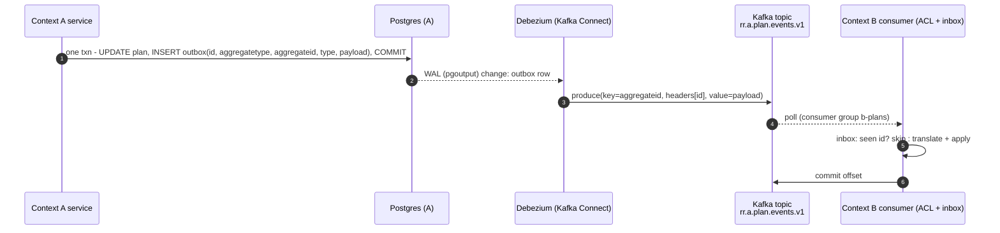
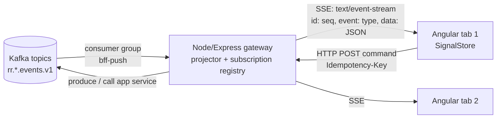

# R3 — Event / Message Bus (Kafka and alternatives) research brief v0

**Created:** 2026-09-03 | **Last updated:** 2026-09-03 | **Author:** research agent under Axium (R3) | **Status:** exploratory — not doctrine

## 2. TL;DR

- **A bus is a contract surface, not plumbing.** What crosses a bounded-context boundary is an *integration event* in a *published language*; the broker is only the carrier. Design the events first, choose the broker second ([Vernon, IDDD ch. 8, 2013](https://www.informit.com/store/implementing-domain-driven-design-9780321834577); [Evans, DDD, 2003](https://www.domainlanguage.com/ddd/)).
- **Kafka is a replicated, partitioned log; RabbitMQ/NATS are brokers.** The log keeps history and lets consumers replay from an *offset*; a queue deletes on ack. That one difference drives most other trade-offs ([Kleppmann, DDIA ch. 11, 2017](https://www.oreilly.com/library/view/designing-data-intensive-applications/9781491903063/ch11.html)).
- **Kafka no longer needs ZooKeeper.** Kafka 4.0 (March 2025) removed ZooKeeper entirely; KRaft is the only metadata mode, and Strimzi dropped ZooKeeper clusters in 0.46 ([Apache Kafka 4.0.0 release announcement, 2025](https://kafka.apache.org/blog/2025/03/18/apache-kafka-4.0.0-release-announcement/); [Strimzi CHANGELOG](https://github.com/strimzi/strimzi-kafka-operator/blob/main/CHANGELOG.md)). An isolated-network Kafka is therefore *one* stateful workload, not two.
- **"Exactly once" is a property of the whole pipeline, not the broker.** Every broker in the comparison gives at-least-once by default; make consumers idempotent and stop arguing about delivery semantics ([Kafka design: message delivery semantics](https://kafka.apache.org/documentation/#semantics)).
- **Publish through a transactional outbox, never dual-write.** Write the event in the same DB transaction as the aggregate; let Debezium (CDC) or a poller relay it to the bus ([Richardson, Transactional outbox](https://microservices.io/patterns/data/transactional-outbox.html); [Debezium Outbox Event Router](https://debezium.io/documentation/reference/stable/transformations/outbox-event-router.html)).
- **Browsers never talk to the bus.** The Node/Express gateway consumes the bus and fans out to the Angular client over **SSE** (default) or WebSockets (only if the client must stream *up*). Reconnection uses the SSE `Last-Event-ID` header mapped to a bus offset/sequence ([WHATWG HTML, Server-sent events](https://html.spec.whatwg.org/multipage/server-sent-events.html)).
- **Licensing is a real selection criterion on an island.** Apache Kafka, Strimzi, Apicurio, Pulsar, RabbitMQ, NATS and pgmq are Apache-2.0/MPL; Confluent Schema Registry / REST Proxy / ksqlDB are *Confluent Community License*; Redpanda core is *BSL* ([Confluent Community License FAQ](https://www.confluent.io/confluent-community-license-faq/); [Redpanda licensing](https://docs.redpanda.com/current/get-started/licensing/overview/)).
- **Honest first release:** a 3-node KRaft Kafka via Strimzi, Apicurio for schemas, Debezium for the outbox, JSON Schema payloads in CloudEvents envelopes — or, if volume is modest and the ops team tiny, **Postgres (pgmq/outbox) first, Kafka later**. Not "enterprise Kafka".

## 3. Core concepts and vocabulary

| Term | One meaning (for the RR lexicon) | Source |
|---|---|---|
| **Message** | A unit of data transmitted through a messaging channel; the generic term. Three sub-kinds below. | [Hohpe & Woolf, EIP: Message](https://www.enterpriseintegrationpatterns.com/patterns/messaging/Message.html) |
| **Command (message)** | Tells a receiver to do something; exactly one logical handler; may be rejected. Imperative, named `DoX`. | [EIP: Command Message](https://www.enterpriseintegrationpatterns.com/patterns/messaging/CommandMessage.html) |
| **Event (message)** | States that something *happened*; immutable fact; zero-to-many consumers; sender does not care how receivers react. Past tense, `XHappened`. | [EIP: Event Message](https://www.enterpriseintegrationpatterns.com/patterns/messaging/EventMessage.html) |
| **Document message** | Carries data without prescribing action (a snapshot, a report). | [EIP: Document Message](https://www.enterpriseintegrationpatterns.com/patterns/messaging/DocumentMessage.html) |
| **Domain event** | An event raised *inside* a bounded context by the domain model, in the ubiquitous language of that context. | [Vernon, IDDD ch. 8](https://www.informit.com/store/implementing-domain-driven-design-9780321834577) |
| **Integration event** | An event published *across* context boundaries in the published language; a deliberate, versioned contract; usually a *translation* of one or more domain events. | Vernon ch. 8/13; [Evans, Published Language](https://www.domainlanguage.com/ddd/) |
| **Published language** | A well-documented shared language for inter-context communication (schemas on the bus). | Evans, DDD (2003) |
| **Anticorruption layer (ACL)** | Consumer-side translation from the publisher's language into the consumer's model, so upstream churn does not leak in. | Evans, DDD (2003) |
| **Pub/sub** | One message copied to every subscriber (topic semantics). | [EIP: Publish-Subscribe Channel](https://www.enterpriseintegrationpatterns.com/patterns/messaging/PublishSubscribeChannel.html) |
| **Queue (point-to-point)** | Each message consumed by exactly one competing consumer; removed on ack. | [EIP: Point-to-Point Channel](https://www.enterpriseintegrationpatterns.com/patterns/messaging/PointToPointChannel.html) |
| **Log-based broker** | Broker persists an append-only, partitioned log; consumers keep a position (offset) and can re-read. Kafka, Redpanda, Pulsar, RabbitMQ Streams, NATS JetStream streams. | [Kleppmann, DDIA ch. 11](https://www.oreilly.com/library/view/designing-data-intensive-applications/9781491903063/ch11.html) |
| **Topic** | Named category of records. In Kafka, split into **partitions**. | [Kafka docs: intro](https://kafka.apache.org/documentation/#intro_concepts_and_terms) |
| **Partition** | Ordered, immutable sequence of records; the unit of parallelism and *the only ordering scope*. Records with the same key land on the same partition. | Kafka docs: intro |
| **Offset** | The sequential id of a record within a partition; a consumer's "bookmark". | Kafka docs: intro |
| **Consumer group** | Consumers sharing a `group.id` split a topic's partitions among them (queue-like); different groups each get every record (pub/sub-like). | [Kafka docs: consumers](https://kafka.apache.org/documentation/#design_consumer) |
| **Share group** | Kafka 4.2+ (KIP-932): multiple consumers in one group read the *same* partition cooperatively with per-record acks — true queue semantics on Kafka. | [KIP-932 release notes](https://cwiki.apache.org/confluence/x/CIq3FQ) |
| **Retention** | Time- or size-bound after which old log segments are deleted. | [Kafka docs: log](https://kafka.apache.org/documentation/#design_log) |
| **Compaction** | Alternative retention: keep at least the *latest* record per key forever — makes a topic a changelog/table. | [Kafka docs: log compaction](https://kafka.apache.org/documentation/#compaction) |
| **At-most / at-least / exactly-once** | Delivery guarantees: may lose / may duplicate / neither. Kafka's EOS = idempotent producer + transactions + `read_committed` consumers; it covers Kafka-to-Kafka, not arbitrary side effects. | [Kafka docs: semantics](https://kafka.apache.org/documentation/#semantics); [KIP-98](https://cwiki.apache.org/confluence/display/KAFKA/KIP-98+-+Exactly+Once+Delivery+and+Transactional+Messaging) |
| **Idempotent consumer** | Handler whose effect is the same whether a message arrives once or N times (dedupe by event id / inbox table). | [Richardson, Idempotent Consumer](https://microservices.io/patterns/communication-style/idempotent-consumer.html) |
| **Transactional outbox** | Persist the event in an `outbox` table inside the business transaction; a relay publishes it. Removes dual-write. | [Richardson, Transactional outbox](https://microservices.io/patterns/data/transactional-outbox.html) |
| **CDC** | Change Data Capture: read the DB's replication log (Postgres `pgoutput`) and emit row changes as events. Debezium is the reference implementation. | [Debezium Postgres connector](https://debezium.io/documentation/reference/stable/connectors/postgresql.html) |
| **Saga / process manager** | A long-running business transaction as a sequence of local transactions with compensations; *choreography* (events trigger the next step) or *orchestration* (a coordinator issues commands). | [Richardson, Saga](https://microservices.io/patterns/data/saga.html); [EIP: Process Manager](https://www.enterpriseintegrationpatterns.com/patterns/messaging/ProcessManager.html) |
| **Event notification / ECST / event sourcing / CQRS** | Fowler's four distinct "event-driven" things: *notify* (id + link, go fetch); *event-carried state transfer* (event carries the data, consumer keeps a copy); *event sourcing* (the log IS the system of record); *CQRS* (separate write and read models). | [Fowler, What do you mean by "Event-Driven"?, 2017](https://martinfowler.com/articles/201701-event-driven.html) |
| **Schema registry** | Service holding versioned schemas (Avro/Protobuf/JSON Schema) with **compatibility modes** (`BACKWARD`, `FORWARD`, `FULL`, `*_TRANSITIVE`, `NONE`). | [Confluent: Schema Evolution & Compatibility](https://docs.confluent.io/platform/current/schema-registry/fundamentals/schema-evolution.html) |
| **CloudEvents** | CNCF spec for an event *envelope* (`id`, `source`, `type`, `time`, `subject`, `datacontenttype`, `data`, extensions) with Kafka/HTTP/AMQP/NATS bindings. v1.0.2 (Feb 2024). | [CloudEvents spec](https://github.com/cloudevents/spec/blob/main/cloudevents/spec.md) |
| **AsyncAPI** | OpenAPI-for-messaging: describes channels, operations (`send`/`receive`), message schemas and bindings. v3.0.0 (Dec 2023), v3.1.0 (Jan 2026). | [AsyncAPI 3.0.0 release notes](https://www.asyncapi.com/blog/release-notes-3.0.0) |
| **KRaft** | Kafka's built-in Raft metadata quorum (KIP-500/595) replacing ZooKeeper; only mode since Kafka 4.0. | [KIP-500](https://cwiki.apache.org/confluence/display/KAFKA/KIP-500:+Replace+ZooKeeper+with+a+Self-Managed+Metadata+Quorum) |
| **Strimzi** | CNCF Kubernetes operator for Kafka (CRDs: `Kafka`, `KafkaNodePool`, `KafkaTopic`, `KafkaUser`, `KafkaConnect`, `KafkaConnector`). | [Strimzi docs](https://strimzi.io/docs/operators/latest/deploying) |

## 4. Canonical sources

- **Hohpe & Woolf, *Enterprise Integration Patterns* (2003)** — the 65-pattern vocabulary. Free online at [enterpriseintegrationpatterns.com](https://www.enterpriseintegrationpatterns.com/patterns/messaging/Introduction.html).
- **Kleppmann, *Designing Data-Intensive Applications* (2017), ch. 11 "Stream Processing"** — log-based vs. AMQP/JMS brokers, CDC, event sourcing, exactly-once ([O'Reilly](https://www.oreilly.com/library/view/designing-data-intensive-applications/9781491903063/ch11.html)). A 2nd edition is in progress (2025/26) [UNVERIFIED chapter numbering].
- **Vernon, *Implementing Domain-Driven Design* (2013), ch. 8 "Domain Events", ch. 13 "Integrating Bounded Contexts"** — domain events, event store, notifications, published language over messaging.
- **Evans, *Domain-Driven Design* (2003), Part IV** — Context Map, Published Language, Anticorruption Layer ([DDD Reference, free](https://www.domainlanguage.com/ddd/reference/)).
- **Fowler, "What do you mean by 'Event-Driven'?" (2017)** — the four-way taxonomy ([martinfowler.com](https://martinfowler.com/articles/201701-event-driven.html)).
- **Richardson, microservices.io** — [Transactional outbox](https://microservices.io/patterns/data/transactional-outbox.html), [Transaction log tailing](https://microservices.io/patterns/data/transaction-log-tailing.html), [Saga](https://microservices.io/patterns/data/saga.html), [Idempotent consumer](https://microservices.io/patterns/communication-style/idempotent-consumer.html).
- **Apache Kafka documentation §4 "Design"** ([kafka.apache.org/documentation](https://kafka.apache.org/documentation/#design)) and the KIPs: [KIP-98](https://cwiki.apache.org/confluence/display/KAFKA/KIP-98+-+Exactly+Once+Delivery+and+Transactional+Messaging) (EOS), [KIP-500](https://cwiki.apache.org/confluence/display/KAFKA/KIP-500:+Replace+ZooKeeper+with+a+Self-Managed+Metadata+Quorum) (KRaft), [KIP-932](https://cwiki.apache.org/confluence/x/CIq3FQ) (queues). Confluent's [delivery semantics](https://docs.confluent.io/kafka/design/delivery-semantics.html) and [schema evolution](https://docs.confluent.io/platform/current/schema-registry/fundamentals/schema-evolution.html) pages are good; read them knowing they sell Confluent Platform.
- **Debezium documentation** — [Outbox Event Router](https://debezium.io/documentation/reference/stable/transformations/outbox-event-router.html), [PostgreSQL connector](https://debezium.io/documentation/reference/stable/connectors/postgresql.html).
- **Specs:** [CloudEvents](https://github.com/cloudevents/spec) (CNCF), [AsyncAPI](https://github.com/asyncapi/spec) (Linux Foundation), [WHATWG HTML §9.2 Server-sent events](https://html.spec.whatwg.org/multipage/server-sent-events.html).
- **Operator/broker docs for the comparison:** [Strimzi](https://strimzi.io/docs/operators/latest/deploying), [Redpanda](https://docs.redpanda.com/current/get-started/licensing/overview/), [Apache Pulsar](https://pulsar.apache.org/docs/next/administration-metadata-store/), [RabbitMQ](https://www.rabbitmq.com/docs/quorum-queues) + [Cluster Operator](https://www.rabbitmq.com/kubernetes/operator/operator-overview), [NATS JetStream](https://docs.nats.io/nats-concepts/jetstream) + [nats-io/k8s](https://github.com/nats-io/k8s), [pgmq](https://github.com/pgmq/pgmq), [PostgreSQL NOTIFY](https://www.postgresql.org/docs/current/sql-notify.html).

## 5. How it is done in practice

### 5.1 Which "event-driven" do you mean?

Teams say "event-driven" and mean four different things with different costs ([Fowler, 2017](https://martinfowler.com/articles/201701-event-driven.html)). Pick per integration, not per system:

- **Event notification** — `MissionPlanApproved {planId}`; the consumer calls back for detail. Least payload coupling, but a hidden synchronous dependency.
- **Event-carried state transfer (ECST)** — the event carries the plan; consumers keep a copy. Better availability and load isolation; costs eventual consistency and duplication. A *compacted* Kafka topic exists for this.
- **Event sourcing** — the log is the source of truth; state is a fold over it. Strong for audit and time-travel; expensive in schema evolution, snapshots and query. Use it *inside* a context that needs it, never as the system-wide default (Kleppmann, Fowler).
- **CQRS** — separate read and write models, often bus-fed. Justified when read shapes diverge from the aggregate; otherwise indirection.

### 5.2 Domain events vs. integration events, and who owns the topic

Inside a context the aggregate raises **domain events** in its own language; the application layer chooses which become **integration events** and translates them into the **published language** ([Vernon, IDDD ch. 8, 13](https://www.informit.com/store/implementing-domain-driven-design-9780321834577)). Conventions that follow:

- **One producer context owns each topic.** Name for ownership and kind, e.g. `rr.<context>.<aggregate>.<events|commands>.v<N>` — major version in the name, because a breaking schema change is a new topic. Topic-per-aggregate-type is what Debezium's outbox router emits by default ([Debezium Outbox Event Router](https://debezium.io/documentation/reference/stable/transformations/outbox-event-router.html)).
- **Key = aggregate id**, so one aggregate's events share a partition and stay ordered. Cross-aggregate ordering does not exist; design so you do not need it.
- **Consumers wrap the bus in an anticorruption layer**: deserialize the published schema, translate to local types, then call the local application service. A foreign schema never becomes a domain type.
- **Commands get their own channel** (point-to-point / share group). A command has one handler and can fail; an event has already happened.

### 5.3 Publishing reliably: outbox + CDC

Dual write (commit, then publish; crash between) is the canonical failure. The fix is the transactional outbox, relayed by *polling* or *log tailing* (CDC) ([Richardson](https://microservices.io/patterns/data/transactional-outbox.html)). Debezium's Postgres connector reads the built-in `pgoutput` plugin (no server extension) and its `EventRouter` SMT turns outbox rows into topic-routed messages carrying the event `id` for dedupe ([Debezium Postgres connector](https://debezium.io/documentation/reference/stable/connectors/postgresql.html); [Outbox Event Router](https://debezium.io/documentation/reference/stable/transformations/outbox-event-router.html)).

Sagas ride the same rails: each step is a local transaction + outbox event; orchestration adds a process manager with persisted state that issues commands ([Richardson, Saga](https://microservices.io/patterns/data/saga.html); [EIP, Process Manager](https://www.enterpriseintegrationpatterns.com/patterns/messaging/ProcessManager.html)). Prefer orchestration beyond ~3 steps or when status must be visible; choreography's coupling is invisible until it breaks.

### 5.4 Contracts: schema registry, CloudEvents, AsyncAPI

- **Registry + compatibility mode.** `BACKWARD` (default; new readers read old data, so consumers can *rewind*) or `FULL_TRANSITIVE` for long-lived topics; non-transitive modes check against the latest version only ([Confluent, Schema Evolution](https://docs.confluent.io/platform/current/schema-registry/fundamentals/schema-evolution.html)). Only add optional fields; never rename; never change type.
- **Format.** Avro is compact but needs the schema to decode; Protobuf is similar with better cross-language tooling; JSON Schema is readable and native to a TypeScript gateway and browser, at a byte cost. For a TS-heavy stack, **JSON Schema on the bus, Protobuf only where volume demands** is a defensible default.
- **Registry choice.** Confluent Schema Registry is Confluent-Community-licensed; **Apicurio Registry** (Apache 2.0, Confluent-API-compatible, also stores OpenAPI/AsyncAPI) and **Karapace** (Apache 2.0) are the open alternatives ([Apicurio compatibility API](https://www.apicur.io/registry/docs/apicurio-registry/3.3.x/getting-started/assembly-confluent-schema-registry-compatibility.html); [Karapace](https://github.com/Aiven-Open/karapace)).
- **Envelope.** Wrap every payload in **CloudEvents** (`id`, `source`, `type`, `time`, `subject`, extensions) via the Kafka binding — where the *security marking* and correlation/causation ids live ([CloudEvents spec 1.0.2](https://github.com/cloudevents/spec/blob/main/cloudevents/spec.md)).
- **Catalogue.** One **AsyncAPI 3.x** document per bounded context describing channels and messages; generate TS types into `common/` ([AsyncAPI 3.0.0](https://www.asyncapi.com/blog/release-notes-3.0.0)).

### 5.5 Broker comparison

| | **Apache Kafka (KRaft)** | **Redpanda** | **Apache Pulsar** | **RabbitMQ 4.x** | **NATS + JetStream** | **Postgres (pgmq / outbox / NOTIFY)** |
|---|---|---|---|---|---|---|
| Model | Partitioned replicated log; consumer groups; share groups (4.2+) | Kafka-protocol log, C++ single binary, no JVM | Log + BookKeeper storage; topics, subscriptions (exclusive/shared/failover/key-shared) | Broker with exchanges; quorum queues (Raft) + streams (log) | Core pub/sub (at-most-once) + JetStream streams/consumers (persisted) | Table-backed queue with visibility timeout; `NOTIFY` is ephemeral, ≤8000-byte payload |
| Guarantees | At-least-once; EOS for Kafka-to-Kafka via idempotent producer + transactions | Same as Kafka (protocol-compatible) | At-least-once; dedup + transactions | At-least-once (quorum queues); publisher confirms | At-least-once; exactly-once *publish* via `Nats-Msg-Id` dedup window | pgmq: "exactly once within a visibility timeout"; ACID with your data |
| Ordering | Per partition (by key) | Per partition | Per partition / key | Per queue (FIFO), not across | Per subject in a stream | Per queue, or true global order via SQL |
| Replay / history | Yes — offsets, retention, compaction | Yes | Yes | Streams yes; queues no | Streams yes (limits-based retention) | Yes if you keep rows (`archive`) |
| Throughput / scale | Very high; horizontal by partitions | Very high; lower latency per node | High; separates compute/storage | Moderate; per-queue bottlenecks | High for small messages; lightweight | Bounded by one DB; fine to low-thousands msg/s [UNVERIFIED] |
| Operational weight | Medium (3+ brokers, JVM, Connect, registry) — no ZK since 4.0 | Low–medium (one binary, needs `rpk`/tuning, `CAP_SYS_RESOURCE` for tuner) | **High** (brokers + bookies + ZooKeeper/Oxia) | Low–medium (Erlang; one operator) | **Low** (tiny Go binary; 3-node JetStream) | **Lowest** — it is the DB you already run |
| K8s operator | **Strimzi** (CNCF, Apache 2.0); Helm OCI `quay.io/strimzi-helm` | Redpanda Operator + Helm chart | Official Helm chart (`apache/pulsar-helm-chart`); StreamNative operators | RabbitMQ Cluster Operator + Topology Operator | `nats` Helm chart + NACK controller (`nats-io/k8s`) | Whatever runs Postgres (CloudNativePG etc.) |
| Licence | Apache 2.0 | **BSL** (core; converts to Apache 2.0 four years after each merge); enterprise features under Redpanda Community License + key | Apache 2.0 | MPL 2.0 (server) | Apache 2.0 | PostgreSQL licence; pgmq PostgreSQL licence |
| Offline install | Feasible: ~6–8 images (operator, Kafka, Connect, Bridge, registry) + one OCI chart; `defaultImageRegistry` override | Feasible; vendor documents air-gapped K8s | Feasible but many images (ZK/Oxia, bookie, broker, proxy) | Feasible; 2 images + operator | Easiest of the brokers | Trivial |
| Best fit for RR | Default backbone once >1 producer context and replay/audit matter | If Kafka protocol wanted with less JVM ops and BSL is acceptable | Multi-tenant, geo-replication needs — not RR's shape | Work queues / RPC-style commands; not an event backbone with history | Command/RPC + light events at the edge; internal control plane | **First release**, or forever if volume stays modest |

Sources: [Kafka 4.0 announcement](https://kafka.apache.org/blog/2025/03/18/apache-kafka-4.0.0-release-announcement/); [KIP-932](https://cwiki.apache.org/confluence/x/CIq3FQ); [Redpanda licensing](https://docs.redpanda.com/current/get-started/licensing/overview/) and [air-gapped K8s](https://www.redpanda.com/blog/private-k8s-deployment-redpanda-cluster); [Pulsar metadata store](https://pulsar.apache.org/docs/next/administration-metadata-store/) (ZooKeeper default, Oxia recommended for new clusters in 5.0, etcd removed in 5.0); [RabbitMQ Quorum Queues](https://www.rabbitmq.com/docs/quorum-queues), [Operator overview](https://www.rabbitmq.com/kubernetes/operator/operator-overview); [NATS JetStream](https://docs.nats.io/nats-concepts/jetstream), [nats-io/k8s](https://github.com/nats-io/k8s); [pgmq](https://github.com/pgmq/pgmq); [PostgreSQL NOTIFY](https://www.postgresql.org/docs/current/sql-notify.html); [Strimzi Helm README](https://github.com/strimzi/strimzi-kafka-operator/blob/main/helm-charts/helm3/strimzi-kafka-operator/README.md). RabbitMQ's MPL-2.0 licence and the Pulsar image inventory were not re-checked in session [UNVERIFIED].

### 5.6 Kafka on an isolated Kubernetes cluster

**KRaft (verified):** Kafka 4.0.0 (18 March 2025) removed ZooKeeper; 4.x brokers must already be KRaft with metadata version ≥ 3.3 ([Kafka 4.0 release notes](https://archive.apache.org/dist/kafka/4.0.0/RELEASE_NOTES.html); [upgrade guide](https://kafka.apache.org/40/getting-started/upgrade/)). Greenfield RR never touches ZooKeeper. Strimzi dropped ZooKeeper clusters in 0.46.0; the current line (1.2–1.3, September 2026) supports Kafka 4.2.x–4.3.x, and the Helm chart is an OCI artifact at `quay.io/strimzi-helm` (the `strimzi.io/charts` repo is deprecated) ([Strimzi CHANGELOG](https://github.com/strimzi/strimzi-kafka-operator/blob/main/CHANGELOG.md)). **Do not plan on Bitnami's Kafka chart:** the public catalogue moved to `bitnamilegacy` (frozen) in Aug–Sep 2025; production images now need a subscription ([bitnami/charts#35164](https://github.com/bitnami/charts/issues/35164)).

**What must be in the bundle** (pin exact tags against the chosen Strimzi release; the Helm chart exposes `defaultImageRegistry`/`defaultImageRepository`/`defaultImageTag` for a private registry):

1. Strimzi operator image; Kafka image (brokers *and* controllers); Kafka Connect image with Debezium **pre-built** on the open side (Strimzi's in-cluster `build` needs a registry to push to); optionally Bridge, Cruise Control, kafka-exporter.
2. Apicurio Registry image (+ its Postgres or KafkaSQL storage).
3. The Strimzi OCI chart, plus the CRDs it installs.
4. Node client: `@confluentinc/kafka-javascript` and `node-rdkafka` wrap librdkafka and ship **prebuilt binaries per platform** — the offline npm mirror needs the right prebuild or a compile toolchain. KafkaJS is pure JS but has had no release since Feb 2023 and seeks maintainers ([Confluent JS client announcement](https://www.confluent.io/blog/introducing-confluent-kafka-javascript/); [Kafka wiki: Clients](https://cwiki.apache.org/confluence/display/KAFKA/Clients)). The Confluent client is Apache-2.0-licensed [UNVERIFIED — confirm in the package's LICENSE].
5. Monitoring: Strimzi's examples ship Prometheus metric configs and Grafana dashboards; kafka-exporter gives consumer lag.

**Minimal, honest first-release topology:** one `Kafka` CR with a 3-node `KafkaNodePool` in **combined** controller+broker role, persistent volumes, TLS listeners with `KafkaUser` SCRAM/mTLS, GitOps-declared `KafkaTopic` CRs (replication 3, `min.insync.replicas=2`), one `KafkaConnect` running Debezium, Apicurio, kafka-exporter. That is 6–10 pods and one operator — not "enterprise Kafka" (tiered storage, MirrorMaker 2, Cruise Control, ksqlDB), none of which RR needs on day one.

### 5.7 The front end and the bus

Browsers do not speak Kafka, and the HTTP proxies that exist (Confluent REST Proxy, Strimzi Bridge, Redpanda's HTTP proxy) expose *broker* concepts — partitions, offsets, consumer instances — that have no business in a UI. The gateway is a **backend-for-frontend fan-out**:

**Push transport.** Server-Sent Events are the default: one-directional, plain HTTP, proxy- and auth-friendly; `EventSource` reconnects automatically and sends `Last-Event-ID` on reconnect ([WHATWG HTML §9.2](https://html.spec.whatwg.org/multipage/server-sent-events.html)). Use WebSockets only when the client must *stream* upward (collaborative cursors, telemetry from the browser). Two SSE caveats: `EventSource` cannot set custom headers, so authenticate by cookie or a short-lived token in the URL, or use `fetch` + `ReadableStream` and parse `text/event-stream` yourself; and keep HTTP/2 in front, since HTTP/1.1 browsers cap ~6 connections per origin ([MDN, Using server-sent events](https://developer.mozilla.org/en-US/docs/Web/API/Server-sent_events/Using_server-sent_events)).

**Fan-out and projection.** The gateway runs *one* consumer group per deployment (not per user), authorizes per subscriber (a user sees only entities they may read — where R4/R5's RBAC/MAC bites), *projects* bus events into UI-shaped view events, and coalesces bursts. Per-user replay comes from the gateway's ring buffer or projection store, never by seeking Kafka per browser.

**Reconnection and replay via offsets.** Give every pushed event a monotonic `id` per stream — either the Kafka `partition:offset` pair or, better, a gateway-assigned sequence with the Kafka offset persisted beside it. On reconnect the gateway reads `Last-Event-ID`: if it is within the buffer, replay from there; if not (gateway restarted, retention passed), send a `snapshot` event and let the client rebuild. The client must always tolerate the snapshot path.

**NgRx SignalStore consumption.** The store holds `withState({ entities, lastEventId, connection: 'connecting'|'live'|'replaying'|'stale' })`; a `connect` method built with `rxMethod` subscribes to an `Observable<ServerEvent>` from the SSE service and reduces each event with `patchState` — exactly the `rxMethod` + `patchState` shape the NgRx docs prescribe for async inputs ([NgRx SignalStore guide](https://ngrx.io/guide/signals/signal-store)). Reducers should be pure `(state, event) => patch` functions per event `type`, generated from the AsyncAPI/JSON Schema so the published language reaches the browser typed. `withEntities` handles the collection bookkeeping.

**Optimistic UI.** A command is an HTTP `POST` with an `Idempotency-Key`; the gateway returns `202 { commandId }`. The store records a *pending* mutation keyed by `commandId` and applies it locally; the confirming integration event carries the same `commandId` (correlation id in the CloudEvents envelope), which clears the pending entry; a `*Rejected` event or timeout rolls it back. This is the classic optimistic-update pattern, with the bus, not the HTTP response, as the source of truth.

**Where this lives in the Building / Floor / Suite / Office hierarchy** (R7): the *Building* shell owns the single SSE connection and the connection-state signal; each *Suite* (a bounded-context-aligned UI slice) registers the event types and entity scopes it needs and owns its own SignalStore reducers; *Offices* only read signals. One connection, many subscriptions — never one `EventSource` per component.

## 6. Trade-offs, anti-patterns, failure modes

- **Kafka as the system of record by accident.** Retention deletes data; compaction keeps only the last value per key. Unless you *decide* on event sourcing with an event store, the database is truth and Kafka is a transport with history ([Kleppmann, DDIA ch. 11](https://www.oreilly.com/library/view/designing-data-intensive-applications/9781491903063/ch11.html)).
- **Dual write.** DB commit then publish (or vice versa) without an outbox — will lose or phantom events under failure ([Richardson](https://microservices.io/patterns/data/transactional-outbox.html)).
- **CDC of raw tables as "events".** Row-change streams leak the producer's schema into every consumer — the opposite of a published language. Use CDC *on the outbox table only*.
- **Chatty entity events / distributed monolith.** Publishing every field change, or building request/response over the bus, recreates synchronous coupling with worse debuggability. Commands that need a reply usually want HTTP.
- **Ordering assumptions across partitions or topics.** Only same-key, same-partition order holds; rebalances and retries reorder everything else. Consumers must tolerate out-of-order and duplicate delivery.
- **No lag alerting, no dead-letter topic, no registry.** One poison message stalls a partition forever; one renamed field breaks every downstream context at once.
- **Over-buying.** Pulsar tiering or Kafka MirrorMaker/Cruise Control for a handful of producers is debt with no return. Conversely, **Postgres-as-bus** stops being honest once you need many independent consumer groups with independent replay, or sustained tens-of-thousands msg/s.
- **Browser-side replay from Kafka offsets.** Tying UI state to raw partition offsets couples the UI to broker topology; keep the gateway sequence as the client's cursor.

## 7. RR lens

- **Isolated network.** Everything above is Apache-2.0 or MPL and bundle-able as OCI images + charts; nothing phones home. The Strimzi chart's registry override and pinned tags are the mechanism; the bundle manifest needs the librdkafka prebuild for the island's Node/OS. The Debezium-loaded Connect image must be built on the open side. Confluent-Community-licensed components add a licence review that the Apache alternatives (Apicurio, Karapace) avoid. Redpanda's BSL would need explicit programme acceptance.
- **Stack fit.** Node/Express gateway = the *only* Kafka client the browser side ever meets; `@confluentinc/kafka-javascript` (KafkaJS-compatible API) is the current maintained option. Shared `common/` package carries the CloudEvents envelope type, the generated event types and the reducer signatures. JSON Schema payloads keep TypeScript in the loop; Java/Python contexts consume the same registry.
- **Defense context.** The CloudEvents envelope carries the marking/caveat as an extension attribute, the gateway enforces per-subscriber filtering (nothing reaches a browser that the user's clearance does not permit), and topics are partitioned *by context and by marking level* so a whole topic can be characterised for a guard. Audit is a consumer group, not a code path.
- **Two-island synchronisation.** The bus is a *third* thing that must stay in sync: Kafka/Strimzi/Apicurio/Debezium/client-library pins become part of the version-pinned manifest per island, and both islands must run the same topic/schema contract versions when they meet in the shared cluster. A schema is a bundle artifact.
- **Crossing a security domain (R6 covers this).** A bus never spans domains; a **guard** does. Design a dedicated *export* topic per direction whose messages are fully self-describing (ECST, not notification — the other side cannot call back), single-schema, validated, marked in the envelope, idempotent by `id`, and assume the guard reorders, delays and drops. Everything the guard must inspect must be in the message; nothing may be referenced by id alone.
- **First release.** Decide between (a) Postgres outbox + pgmq + gateway SSE, with the bus abstracted behind a port so Kafka can be swapped in, and (b) Strimzi Kafka from day one. The deciding facts are the expected event volume, the number of independent consuming contexts, and whether the island team can run a stateful JVM cluster.

## 8. Open questions for Graham

1. How many bounded contexts will *produce* events in release 1, and does any consumer need independent replay? (If "one or two" and "no", Postgres first.)
2. Expected peak event rate and payload size? Order of hundreds/s or tens-of-thousands/s decides Postgres vs Kafka.
3. Does the island permit privileged pods (Redpanda tuner) or only unprivileged StatefulSets? Persistent storage class and IOPS on the island cluster?
4. Who operates stateful workloads on the island, and are they JVM-literate? Strimzi hides a lot but not everything.
5. Is BSL (Redpanda) or Confluent Community License acceptable to programme counsel, or is Apache/MPL-only a hard rule?
6. Does any UI need browser-to-server streaming (WebSocket), or is SSE sufficient everywhere?
7. Does the deploy-time cluster shared with Legacy Island already run a broker (RabbitMQ is common in older estates) that RR must coexist with or reuse?
8. Which marking/caveat vocabulary must the event envelope carry (feeds R5/R6)?

## 9. Sources

- Apache Kafka 4.0.0 release announcement (2025) — https://kafka.apache.org/blog/2025/03/18/apache-kafka-4.0.0-release-announcement/
- Apache Kafka 4.0.0 release notes — https://archive.apache.org/dist/kafka/4.0.0/RELEASE_NOTES.html
- Apache Kafka documentation §4 Design (intro, consumers, log, compaction, semantics) — https://kafka.apache.org/documentation/
- KIP-98 Exactly Once Delivery and Transactional Messaging — https://cwiki.apache.org/confluence/display/KAFKA/KIP-98+-+Exactly+Once+Delivery+and+Transactional+Messaging
- KIP-500 Replace ZooKeeper with a Self-Managed Metadata Quorum — https://cwiki.apache.org/confluence/display/KAFKA/KIP-500:+Replace+ZooKeeper+with+a+Self-Managed+Metadata+Quorum
- KIP-595 A Raft Protocol for the Metadata Quorum — https://cwiki.apache.org/confluence/spaces/KAFKA/pages/148647470/KIP-595+A+Raft+Protocol+for+the+Metadata+Quorum
- KIP-932 Queues for Kafka — release notes — https://cwiki.apache.org/confluence/x/CIq3FQ
- Apache Kafka wiki: Clients — https://cwiki.apache.org/confluence/display/KAFKA/Clients
- Confluent, Message Delivery Guarantees — https://docs.confluent.io/kafka/design/delivery-semantics.html
- Confluent, Schema Evolution and Compatibility — https://docs.confluent.io/platform/current/schema-registry/fundamentals/schema-evolution.html
- Confluent Community License FAQ — https://www.confluent.io/confluent-community-license-faq/
- Confluent, Introducing the JavaScript client for Apache Kafka — https://www.confluent.io/blog/introducing-confluent-kafka-javascript/
- Strimzi, Deploying and Managing — https://strimzi.io/docs/operators/latest/deploying
- Strimzi CHANGELOG — https://github.com/strimzi/strimzi-kafka-operator/blob/main/CHANGELOG.md
- Strimzi Helm chart README — https://github.com/strimzi/strimzi-kafka-operator/blob/main/helm-charts/helm3/strimzi-kafka-operator/README.md
- Bitnami catalogue changes (Aug 2025) — https://github.com/bitnami/charts/issues/35164
- Debezium, Outbox Event Router — https://debezium.io/documentation/reference/stable/transformations/outbox-event-router.html
- Debezium, PostgreSQL connector — https://debezium.io/documentation/reference/stable/connectors/postgresql.html
- Richardson, Transactional outbox — https://microservices.io/patterns/data/transactional-outbox.html
- Richardson, Transaction log tailing — https://microservices.io/patterns/data/transaction-log-tailing.html
- Richardson, Saga — https://microservices.io/patterns/data/saga.html
- Richardson, Idempotent consumer — https://microservices.io/patterns/communication-style/idempotent-consumer.html
- Hohpe & Woolf, Enterprise Integration Patterns (2003), online catalogue — https://www.enterpriseintegrationpatterns.com/patterns/messaging/Introduction.html
- Kleppmann, Designing Data-Intensive Applications (2017), ch. 11 — https://www.oreilly.com/library/view/designing-data-intensive-applications/9781491903063/ch11.html
- Vernon, Implementing Domain-Driven Design (2013) — https://www.informit.com/store/implementing-domain-driven-design-9780321834577
- Evans, DDD Reference — https://www.domainlanguage.com/ddd/reference/
- Fowler, What do you mean by "Event-Driven"? (2017) — https://martinfowler.com/articles/201701-event-driven.html
- CloudEvents specification (v1.0.2, Feb 2024) — https://github.com/cloudevents/spec/blob/main/cloudevents/spec.md ; releases — https://github.com/cloudevents/spec/releases
- AsyncAPI 3.0.0 release notes — https://www.asyncapi.com/blog/release-notes-3.0.0 ; 3.1.0 — https://www.asyncapi.com/blog/release-notes-3.1.0
- Apicurio Registry, Confluent compatibility API — https://www.apicur.io/registry/docs/apicurio-registry/3.3.x/getting-started/assembly-confluent-schema-registry-compatibility.html
- Karapace (Aiven, Apache 2.0) — https://github.com/Aiven-Open/karapace
- Redpanda, Licenses and Enterprise Features — https://docs.redpanda.com/current/get-started/licensing/overview/
- Redpanda, Considerations for air-gapped Kubernetes — https://www.redpanda.com/blog/private-k8s-deployment-redpanda-cluster
- Apache Pulsar, Configure metadata store — https://pulsar.apache.org/docs/next/administration-metadata-store/
- Apache Pulsar 5.0.0-M1 announcement (2026) — https://pulsar.apache.org/blog/2026/06/23/announcing-apache-pulsar-5-0-m1/
- Apache Pulsar Helm chart — https://github.com/apache/pulsar-helm-chart
- RabbitMQ, Quorum Queues — https://www.rabbitmq.com/docs/quorum-queues ; Kubernetes operators — https://www.rabbitmq.com/kubernetes/operator/operator-overview
- NATS, JetStream concepts — https://docs.nats.io/nats-concepts/jetstream ; NATS on Kubernetes (Helm, NACK) — https://github.com/nats-io/k8s
- pgmq — https://github.com/pgmq/pgmq
- PostgreSQL, NOTIFY — https://www.postgresql.org/docs/current/sql-notify.html
- WHATWG HTML §9.2 Server-sent events — https://html.spec.whatwg.org/multipage/server-sent-events.html
- MDN, Using server-sent events — https://developer.mozilla.org/en-US/docs/Web/API/Server-sent_events/Using_server-sent_events
- NgRx, SignalStore guide — https://ngrx.io/guide/signals/signal-store
