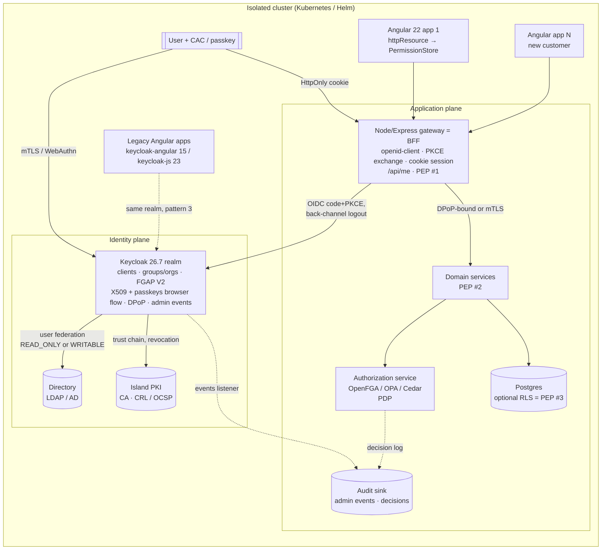

**Created:** 2026-09-03 | **Last updated:** 2026-09-03 — pass 2 (modernization) | **Author:** research agent under Axium (R4) | **Status:** exploratory — not doctrine

# R4 — Identity Stores, IdPs and Delegated User Management

## 1. TL;DR

- **Four different things get called "the identity store."** A *directory* (LDAP/AD) is the system of record for people and groups; an *identity provider* (IdP, e.g. Keycloak) authenticates them and issues tokens; the *app user table* should hold only app-local profile data keyed by the IdP's subject id; an *authorization store* (OpenFGA/SpiceDB/OPA/Cedar, or Postgres row-level security) answers "may X do Y to Z". Collapsing them is the classic failure.
- **Keycloak is almost certainly already in the target cluster** — both legacy apps pin `keycloak-angular 15.1.0` / `keycloak-js 23.0.7` (`docs/source-documents/legacy-apps/*/monorepo_client_package.json`; those are 2024 releases — today's are `keycloak-angular 22.0.0` and `keycloak-js 26.2.4`, and the server is at **26.7.3**). RR should be one more OIDC client of that IdP, not a second IdP.
- **Browser flow: Authorization Code + PKCE behind a Backend-for-Frontend (BFF)** that keeps tokens out of the browser behind HttpOnly cookies — the IETF Best Current Practice, published as [RFC 10017 / BCP 212 on 2026-08-21](https://www.rfc-editor.org/info/rfc10017/). The Node/Express gateway RR already plans is the BFF; **the Angular app then needs no Keycloak library at all** — it reads `/api/me` through `httpResource` into a SignalStore (§4.6).
- **Graham's "group admin manages only their group" requirement is supported natively by Keycloak Fine-Grained Admin Permissions V2** (supported since 26.2; V1 is now `DEPRECATED` in the feature registry): Group-resource scopes `view-members`, `manage-members`, `manage-membership`, `manage-membership-of-members` (26.6), `impersonate-members`, granted to a group-membership policy, with a negative policy to carve out sub-groups. Organizations became an FGAP resource type in 26.7.
- **Sender-constrained tokens and passkeys are now current practice, not roadmap.** Keycloak supports DPoP ([RFC 9449](https://datatracker.ietf.org/doc/html/rfc9449)) since 26.4 and passkeys (conditional + modal UI in the stock login forms) since 26.4; both are `DEFAULT`-typed features today. Under the BFF the browser never holds a token, so DPoP matters at the *gateway→service* hop and for any legacy public client; passkeys are a realm-policy switch, invisible to RR's code.
- **Map groups → data privileges through claims, then enforce server-side.** Keycloak puts group/organization membership in the token; the gateway/services (and optionally Postgres RLS) enforce; the Angular UI only *reflects* permissions. Nothing client-side is ever a security boundary.
- **Multi-tenancy default: one realm, Organizations (or top-level groups) per customer; a new realm only when a customer needs hard isolation.** Hundreds of realms degrade Keycloak; one realm is cheaper to operate on an island.
- **CAC/PIV login is mutual-TLS X.509 through Keycloak's `X509/Validate Username Form` authenticator**, which needs the island PKI's CA chain, CRL/OCSP reachability *on the island*, and TLS passthrough at the ingress.
- **Offline install is a bundling problem:** the Keycloak image (built "optimized" with `kc.sh build`), its Postgres, the directory server image, the Helm chart (codecentric `keycloakx` 7.3.1 → Keycloak 26.7.3; Bitnami's free catalog ended 2025-08-28), and the CA/CRL material all ride the one-way bundle. There is no DISA STIG specific to Keycloak `[UNVERIFIED]`; harden against the Application Security & Development STIG (V6R4) and the platform STIGs instead.

## 2. Core concepts and vocabulary

| Term | Meaning (one meaning per word) |
|---|---|
| **Identity** | A digital representation of a person or non-person entity, plus its attributes. DoD ICAM: "the creation of digital identities and maintenance of associated attributes" ([DoD CIO, ICAM Strategy, 2020](https://dodcio.defense.gov/Portals/0/Documents/Cyber/ICAM_Strategy.pdf)). |
| **Authentication (AuthN)** | Proving a claimed identity, at an *Authentication Assurance Level* (AAL 1–3) ([NIST SP 800-63-4, July 2025](https://pages.nist.gov/800-63-4/sp800-63.html)). |
| **Authorization (AuthZ)** | Deciding whether an authenticated principal may perform an operation on a resource. Distinct from AuthN; a different system usually answers it. |
| **Principal / Subject** | The authenticated actor a request runs as (user, service account, device). The OIDC `sub` claim is its stable id. |
| **Claim** | A name/value assertion about a subject carried in a token (e.g. `groups`, `organization`, `acr`) ([OpenID Connect Core 1.0](https://openid.net/specs/openid-connect-core-1_0.html)). |
| **Assertion** | The SAML term for the signed statement an IdP makes about a subject; the OIDC equivalent is the ID token. |
| **Token** | A signed, time-boxed credential: ID token (who logged in), access token (what the bearer may call — JWT profile in [RFC 9068](https://www.rfc-editor.org/rfc/rfc9068)), refresh token (obtain new access tokens). |
| **Sender-constrained token** | A token usable only by the party holding a private key it was bound to; a stolen one is useless. OAuth's application-layer mechanism is **DPoP** ([RFC 9449, Sept 2023](https://datatracker.ietf.org/doc/html/rfc9449)); the transport-layer one is mTLS ([RFC 8705](https://datatracker.ietf.org/doc/html/rfc8705)). Opposite: *bearer* token. |
| **Passkey** | A FIDO2/WebAuthn discoverable credential (device-bound or synced) used as a phishing-resistant, passwordless authenticator; Keycloak acts as the WebAuthn Relying Party (`authentication/passkeys.adoc`). |
| **Session** | Server-side state that a login exists — at the IdP (SSO session) and/or at the BFF (cookie session). Tokens are *derived from* sessions, not the other way round. |
| **Realm / tenant** | Keycloak's top-level isolation unit: its own users, clients, roles, groups, keys and login flows. "Tenant" is the vendor-neutral word. |
| **Group** | A named set of users, hierarchical in Keycloak; membership can be mapped from LDAP and emitted as a claim. |
| **Role** | A named capability label (realm-level or client-level in Keycloak). **Composite role** = a role that bundles other roles. |
| **Permission / entitlement** | A concrete (operation, resource) grant. Roles and groups are ways of *assigning* permissions; the permission is the thing enforced. |
| **Scope** | OAuth: what a client asks to do on the user's behalf (`openid organization`). Keycloak FGAP: an admin operation on a resource type (`manage-members`). Never use it for data visibility — say *privilege*. |
| **Federation** | Trusting another system's authentication: IdP-to-IdP brokering, or IdP-to-directory user federation (Keycloak → LDAP/AD). |
| **Provisioning** | Creating/updating/deactivating accounts and memberships across systems; standardized by SCIM ([RFC 7643](https://datatracker.ietf.org/doc/html/rfc7643) schema, [RFC 7644](https://datatracker.ietf.org/doc/html/rfc7644) protocol). |
| **MFA / phishing-resistant** | Two or more factor types; SP 800-63-4 elevates phishing-resistant authenticators (PKI/PIV, passkeys) at AAL2+ ([NIST SP 800-63-4](https://nvlpubs.nist.gov/nistpubs/SpecialPublications/NIST.SP.800-63-4.pdf)). |
| **PKI / CAC / PIV** | The DoD Common Access Card and federal PIV card are smart cards carrying X.509 certificates, used as a phishing-resistant authenticator via mutual TLS ([DoDI 8520.03, 2023-05-19](https://www.esd.whs.mil/Portals/54/Documents/DD/issuances/dodi/852003p.pdf)). |
| **PDP / PEP** | Policy Decision Point (decides) vs Policy Enforcement Point (sits in the request path, allows/denies) — [NIST SP 800-207, 2020](https://tsapps.nist.gov/publication/get_pdf.cfm?pub_id=930420). |
| **Delegated administration** | Granting a subset of admin rights, bounded to a subset of resources (one group, one OU, one organization), to a non-global administrator. |
| **BFF (Backend-for-Frontend)** | RFC 10017's preferred pattern: a confidential server-side OAuth client that owns the tokens and gives the browser only an HttpOnly session cookie. In RR, the Node/Express gateway. |

### The four stores, and why they differ

| Store | Question it answers | Examples | Owns |
|---|---|---|---|
| Directory | "Who exists, what are their attributes, which groups are they in?" | OpenLDAP, 389 DS, Active Directory | the authoritative person/group records; password verification |
| Identity provider | "Is this person who they claim, and here is a signed token saying so" | Keycloak, Authentik, Ory Kratos+Hydra | login flows, MFA/passkeys, sessions, token issuance, client registrations |
| App user table | "What does *this application* know about the user?" | Postgres table keyed by `sub` | preferences, app-local state, denormalized display fields |
| Authorization store | "May subject S do action A on resource R?" | OpenFGA, SpiceDB, OPA, Cedar, Postgres RLS policies | relationships and policies; decision logs |

An app that stores passwords in its own table has reinvented an IdP badly; an IdP that stores every application's fine-grained permissions becomes the bottleneck and the outage. Keep the boundaries.

## 3. Canonical sources

- **Identity assurance:** [NIST SP 800-63-4 *Digital Identity Guidelines*](https://nvlpubs.nist.gov/nistpubs/SpecialPublications/NIST.SP.800-63-4.pdf) — final, document date July 2025, published 2025-08-01 (supersedes -3; volumes 63A proofing, 63B authentication, 63C federation; HTML mirror maintained in [`usnistgov/800-63-4`](https://github.com/usnistgov/800-63-4)).
- **Access control models:** [NIST SP 800-162 *Guide to ABAC*, 2014](https://nvlpubs.nist.gov/nistpubs/specialpublications/nist.sp.800-162.pdf); [NIST SP 800-207 *Zero Trust Architecture*, 2020](https://tsapps.nist.gov/publication/get_pdf.cfm?pub_id=930420).
- **DoD:** [DoD Zero Trust Strategy, 2022-10-21](https://dodcio.defense.gov/Portals/0/Documents/Library/DoD-ZTStrategy.pdf); [DoD ICAM Strategy, 2020-03-30](https://dodcio.defense.gov/Portals/0/Documents/Cyber/ICAM_Strategy.pdf); [DoD Enterprise ICAM Reference Design, June 2020](https://dodcio.defense.gov/Portals/0/Documents/Cyber/DoD_Enterprise_ICAM_Reference_Design.pdf); [DoD Zero Trust Reference Architecture v2.0, Sept 2022](https://dodcio.defense.gov/Portals/0/Documents/Library/(U)ZT_RA_v2.0(U)_Sep22.pdf); [DoDI 8520.03 *Identity Authentication for Information Systems*, 2023-05-19](https://www.esd.whs.mil/Portals/54/Documents/DD/issuances/dodi/852003p.pdf); [DTM 25-003 *Implementing the DoD Zero Trust Strategy*, effective 2025-07-17, Change 1 2025-09-02](https://www.esd.whs.mil/Portals/54/Documents/DD/issuances/dtm/DTM%2025-003.PDF) `[search-listed, not fetched]`; DoD Zero Trust Overlays (2024, updated) `[UNVERIFIED — version/date not confirmed]`.
- **Protocols:** OAuth 2.0 (RFC 6749, 6750, 7519, 7636 PKCE, 8628, 9068, 9470) and [RFC 10017 / BCP 212 *OAuth 2.0 for Browser-Based Applications*, 2026-08-21](https://www.rfc-editor.org/info/rfc10017/) (source repo [`oauth-wg/oauth-browser-based-apps`](https://github.com/oauth-wg/oauth-browser-based-apps)); [RFC 9449 DPoP, Sept 2023](https://datatracker.ietf.org/doc/html/rfc9449); [OpenID Connect Core 1.0](https://openid.net/specs/openid-connect-core-1_0.html) plus the RP-Initiated / Back-Channel / Front-Channel Logout specs; SAML 2.0 (OASIS, 2005) `[UNVERIFIED — not fetched in-session]`; [RFC 4510 LDAP](https://datatracker.ietf.org/doc/html/rfc4510); SCIM RFC 7643/7644 — URLs in §8.
- **Keycloak (primary docs, read as `.adoc` from the `keycloak/keycloak` repo, 2026-09-03):** [Server Administration Guide](https://www.keycloak.org/docs/latest/server_admin/index.html) — FGAP V2 (`admin-console-permissions/fine-grain-v2.adoc`), Organizations, LDAP federation, X.509, WebAuthn/passkeys, session/token timeouts, admin events; [DPoP guide](https://www.keycloak.org/securing-apps/dpop) (`docs/guides/securing-apps/dpop.adoc`); [container guide](https://www.keycloak.org/server/containers); [operator installation](https://www.keycloak.org/operator/installation); release notes `docs/documentation/release_notes/topics/26_2_0…26_8_0.adoc`; feature registry `common/src/main/java/org/keycloak/common/Profile.java`; [RHBK 26.2 admin-permissions chapter](https://docs.redhat.com/en/documentation/red_hat_build_of_keycloak/26.2/html/server_administration_guide/admin_permissions).
- **Directories:** [OpenLDAP Admin Guide — Access Control](https://www.openldap.org/doc/admin26/access-control.html); [389 DS ACI design](https://www.port389.org/docs/389ds/design/aci.html); [Microsoft, Delegation of Control in AD DS](https://learn.microsoft.com/en-us/windows-server/identity/ad-ds/manage/delegation-control-wizard).
- **Authorization engines:** Pang et al., *Zanzibar: Google's Consistent, Global Authorization System*, [USENIX ATC '19](https://www.usenix.org/conference/atc19/presentation/pang); [OpenFGA](https://github.com/openfga/openfga); [SpiceDB](https://github.com/authzed/spicedb); [Cedar](https://github.com/cedar-policy/cedar); [Open Policy Agent](https://github.com/open-policy-agent/opa) (CNCF graduated per `cncf/landscape`); [PostgreSQL row security policies](https://www.postgresql.org/docs/current/ddl-rowsecurity.html).
- **Front end (idiom, primary, 2026-09-03):** Angular `adev` guides — [`httpResource`](https://angular.dev/guide/http/http-resource), [resources](https://angular.dev/guide/signals/resource), [zoneless](https://angular.dev/guide/zoneless), [route guards](https://angular.dev/guide/routing/route-guards), [Signal Forms](https://angular.dev/guide/forms/signals/overview) (read from `angular/angular` `adev/src/content/guide/**`); [NgRx SignalStore](https://ngrx.io/guide/signals/signal-store) and [`withLinkedState`](https://ngrx.io/guide/signals/signal-store/linked-state) (read from `ngrx/platform` `projects/www/src/app/pages/guide/signals/**`); [`keycloak-js`](https://github.com/keycloak/keycloak-js) and [`keycloak-angular`](https://github.com/mauriciovigolo/keycloak-angular/blob/main/README.md) READMEs — relevant only to the legacy apps (pattern 3).

## 4. How it is done in practice

### 4.1 Browser flows for an Angular SPA + Node gateway

BCP 212 describes three patterns and ranks them: **(1) Backend-for-Frontend** — the SPA never sees a token; a confidential backend does the Authorization Code + PKCE exchange, stores tokens server-side, and gives the browser an HttpOnly, `SameSite`, `Secure` session cookie; **(2) token-mediating backend** — the backend obtains tokens and hands the SPA only the access token; **(3) browser-based OAuth client** — the SPA holds tokens itself (what `keycloak-js` does). Implicit flow is prohibited; PKCE is mandatory in all three ([RFC 10017](https://www.rfc-editor.org/info/rfc10017/)). The BFF is preferred because a browser-held token is exposed to any XSS, whereas a cookie session can only be *used* from the origin, and CSRF is handled with `SameSite` plus an anti-forgery token.

Consequences for RR (the BFF is the Express gateway; the OIDC client library on Node is [`openid-client` 6.8.7](https://www.npmjs.com/package/openid-client) — Keycloak's own [`keycloak-connect`](https://github.com/keycloak/keycloak-nodejs-connect) declares itself deprecated in its README):

- **Sign-in is a full-page navigation, not an SPA call:** `/auth/login?returnTo=/office` → BFF builds the PKCE challenge and redirects to Keycloak → callback exchanges the code (confidential client: id + secret or a signed JWT assertion) → BFF stores tokens in its session store and sets the cookie → 302 back to `returnTo`. The SPA's only job afterwards is `GET /api/me` (§4.6).
- **Token lifetimes belong to two dials and one rule.** Keycloak's realm knobs are *SSO Session Idle/Max* (the parent user session), *Client Session Idle/Max* (per-client, must be shorter), *Access Token Lifespan*, and *Revoke Refresh Token* (+ *Refresh Token Max Reuse*) for rotation; idle timeouts carry a two-minute grace window (`sessions/timeouts.adoc`). BFF rule: keep the access token short (minutes) and refresh it *at the BFF* on demand; make the cookie session's idle/max no longer than the client session's; turn on refresh-token rotation so a leaked refresh token is single-use. The refresh token never leaves the server (`keycloak-js`'s `withAutoRefreshToken` does the refresh in the browser — pattern 3).
- **Sender-constrain what leaves the BFF.** Under pattern 1 the browser holds no token, so DPoP is not a browser concern; it *is* the mechanism for the gateway→service hop if services accept tokens rather than trusting the mesh, and for any legacy public client that keeps pattern 3. Keycloak's client switch *Require DPoP bound tokens* maps to `dpop_bound_access_tokens`; for public clients both access and refresh tokens are key-bound, for confidential clients only the access token; every bearer-secured Keycloak endpoint accepts DPoP tokens (`securing-apps/dpop.adoc`; supported since 26.4).
- **Logout** is three-sided: clear the BFF session, call RP-Initiated Logout (`end_session_endpoint`, `id_token_hint`), and register a Back-Channel Logout URL so the IdP can end your session when the user logs out of *another* app in the cluster ([OIDC Back-Channel Logout 1.0](https://openid.net/specs/openid-connect-backchannel-1_0.html)).
- **Step-up**: a resource server returns `401` with `error="insufficient_user_authentication"` plus `acr_values`/`max_age`; the BFF re-runs the authorization request with them (`/auth/login?acr_values=…&max_age=0`); the new token carries `acr` and `auth_time` ([RFC 9470](https://www.rfc-editor.org/rfc/rfc9470.html)). The SPA sees only "navigate to the BFF's step-up URL" and a refreshed `/api/me`.
- **Passkeys and CAC/PIV are IdP-side choices, not SPA code.** Passkeys: *Authentication → Policies → WebAuthn Passwordless Policy → Enable Passkeys* adds conditional-UI (autofill) and modal-UI login to the stock username/password forms, governed by *Passkey Mediation* and *Discoverable Credential* (`required`/`preferred`/`discouraged`); a passkey login skips the *Browser – Conditional 2FA* sub-flow (`authentication/passkeys.adoc`, `webauthn.adoc`; supported since 26.4). CAC/PIV: Keycloak's `X509/Validate Username Form` authenticator, `ALTERNATIVE` in a copied Browser flow, requires mutual TLS at the ingress (passthrough — the web container validates the PKIX path), extracts identity from the certificate (Subject DN regex, SAN UPN/RFC822, serial, thumbprint), maps it to a user attribute, and checks revocation by CRL/CDP or OCSP with an explicit *OCSP Fail-Open Behavior* setting (`authentication/x509.adoc`). The rest of the OIDC dance is unchanged — the point of putting the smart card behind an IdP.

### 4.2 Authorization models

| | RBAC | ABAC | ReBAC (Zanzibar) | Policy-as-code |
|---|---|---|---|---|
| Decision input | subject's roles | attributes of subject, object, action, environment ([SP 800-162](https://nvlpubs.nist.gov/nistpubs/specialpublications/nist.sp.800-162.pdf)) | graph of relationships (`user:alice member group:ops`, `group:ops#member viewer dataset:x`) | a policy language over any of the above (Rego, Cedar) |
| Strength | simple, auditable, matches org charts | context-sensitive (time, classification, device) | answers "who can see this?" and "what can alice see?" (reverse queries) at scale | separates policy from code; testable, versionable |
| Weakness | role explosion; cannot express "own group's data" without a role per group | hard to audit ("why was this allowed?"); attribute quality is everything | another stateful service to run and keep consistent | needs data feeds; policy sprawl |
| Tooling (versions 2026-09-03, all Apache-2.0) | Keycloak roles/composites, groups → claims | Keycloak Authorization Services policies; OPA | OpenFGA v1.19.0 (2026-08-25), SpiceDB v1.56.1 (2026-08-21) — both Zanzibar-inspired per their READMEs | OPA v1.20.2 (2026-09-03, CNCF graduated); Cedar `cedar-policy` 4.12.0 (2026-07-28; validator + symbolic analysis, default-deny) |
| Fit for "each group has unique data privileges" | works if privilege = group label on data rows | works if rows carry classification/attributes (see R5) | best when privileges follow *relationships* (group owns dataset; dataset shared to group) | wraps any of the three |

Where PDP and PEP live (SP 800-207 vocabulary): the **gateway/BFF** is PEP #1 (token validity, coarse route-to-group checks); each **service** is a PEP for its own resources, calling a PDP (OPA sidecar, OpenFGA `Check`, in-process Cedar); the **database** can be a last-line PEP via Postgres row-level security (`CREATE POLICY … USING (group_id = current_setting('app.group'))`, set per request from the validated token — [Crunchy Data](https://www.crunchydata.com/blog/row-level-security-for-tenants-in-postgres), secondary; primary docs unreachable in-session); the **UI** is never a PEP. Keycloak 26.7 also ships an experimental [OpenID AuthZEN](https://openid.net/specs/authorization-api-1_0.html) PDP endpoint — a vendor-neutral PDP↔PEP wire protocol worth watching, not adopting (`26_7_0.adoc`).

### 4.3 Multi-tenancy patterns in Keycloak

| Pattern | How | Isolation | Cost / limits | When |
|---|---|---|---|---|
| Realm per customer | new realm: own users, clients, keys, flows, theme | hard: separate admins, signing keys, SSO | operations scale with realm count; community guidance puts practical ceilings in the hundreds ([Phase Two](https://phasetwo.io/blog/multi-tenancy-options-keycloak/), [cloud-iam](https://www.cloud-iam.com/post/keycloak-multi-tenancy)) `[secondary]`; every app registered per realm | a customer that must be sealed off (classification, IdP trust, contract) |
| Group per customer (one realm) | top-level group per customer, sub-groups for teams; `groups` claim | soft: shared user namespace and login flow | cheapest; FGAP V2 delegates per group | the default on one network with one trust domain |
| Organization per customer (one realm, Keycloak ≥ 26) | first-class org: managed/unmanaged members, domains, per-org IdP, org groups with role inheritance (26.6/26.7), `organization` claim/scope, invitation management (26.5) (`organizations/*.adoc`) | medium: per-org identity-first login and brokering, still one realm | newer; org-level FGAP scopes are `view`/`manage` plus `manage-/view-/query-organizations` realm roles (26.7) | customers who bring their own directory/IdP or need org-scoped login UX |

A new Angular app for a new customer is then one OIDC *client registration* (redirect URIs, `organization`/`groups` scopes) plus a group/org — no new realm.

### 4.4 Delegated administration (Graham's core question)

**Keycloak FGAP V2** (`admin-console-permissions/fine-grain-v2.adoc`; supported since 26.2 per `26_2_0.adoc`; `ADMIN_FINE_GRAINED_AUTHZ_V2` is `Type.DEFAULT` and V1 `Type.DEPRECATED` in `Profile.java`). Enable per realm (*Realm settings → Admin Permissions*, or `PUT /admin/realms/{realm} {"adminPermissionsEnabled": true}`); this creates an `admin-permissions` client holding the permissions. **Delegated realm administrators** "can have limited access to a realm based on the permissions defined through this feature." Resource types: Users, Groups, Clients, Roles, Organizations. Group scopes, verbatim:

- `view`, `manage` — the group itself
- `view-members`, `manage-members` ("together with `manage-membership`, also allows creating new users as members of the group"), `impersonate-members`
- `manage-membership` (add/remove members), `manage-membership-of-members` (added 26.6: whether the admin may grant or deny `manage-group-membership` for members of a group)

Scopes are independent (no transitive grant); `view-members`, `manage-members` and `impersonate-members` **cascade through the group hierarchy** "unless a more specific permission exists on a descendant"; "group membership denies take precedence over user-level permissions." The doc's recipe for Graham's exact requirement — *"Allowing to view and manage members of a group but not members of its subgroups"* — is a Group permission with `view-members` + `manage-members` on `mygroup` bound to a Group policy for the admins' group, plus a second permission over the sub-groups bound to a *negative* Group policy. The admin also needs the `query-users`/`query-groups` realm-management roles to see the console sections, and "delegated realm administrators cannot assign administrative roles to other realm administrators" — delegation cannot escalate. An **Evaluate** tool shows which permissions voted PERMIT/DENY for an admin, resource and scope.

**Organizations** (FGAP since 26.7) add `view`/`manage` per organization (creating one needs type-level `manage`) and the realm roles `manage-organizations` / `view-organizations` / `query-organizations`; with FGAP on, organization member queries respect user-level permissions. Membership, invitations, org groups and org roles are org-scoped and can be emitted in the `organization` claim (`26_7_0.adoc`).

**Directories do it with ACIs/ACLs.** OpenLDAP: `access to dn.subtree="ou=GroupA,…" by group.exact="cn=GroupA-admins,…" write by * read`, first match wins ([OpenLDAP Admin Guide](https://www.openldap.org/doc/admin26/access-control.html)); 389 DS: an `aci` attribute on the subtree granting `(read,write,add)` to a `groupdn` ([389 DS ACI design](https://www.port389.org/docs/389ds/design/aci.html)); Active Directory: the Delegation of Control Wizard writes ACEs on an OU — "Create, delete, and manage user accounts", "Modify the membership of a group" — scoped to that OU ([Microsoft Learn](https://learn.microsoft.com/en-us/windows-server/identity/ad-ds/manage/delegation-control-wizard)). If Keycloak federates the directory `WRITABLE`, a group admin's edit is written back *as Keycloak's bind DN* — the directory trusts Keycloak's service account and the delegation boundary is Keycloak's, not LDAP's. If `READ_ONLY`, admins manage membership with directory tooling and Keycloak syncs it in (`user-federation/ldap.adoc`: modes `READ_ONLY`/`WRITABLE`/`UNSYNCED`; group, role and MSAD account-state mappers).

**SCIM.** Keycloak 26.7 promoted a built-in **SCIM API to a preview feature** (`scim-api`, off in the default profile; full CRUD + `PATCH` on `/Users` and `/Groups`, filtering, pagination, Enterprise User extension, schema discovery — `26_7_0.adoc`; `SCIM_API` is `Type.PREVIEW` in `Profile.java`). Community extensions ([Metatavu](https://github.com/Metatavu/keycloak-scim-server/), [p2-inc](https://github.com/p2-inc/keycloak-scim)) predate it. With no external HR system on the island, SCIM matters as the *shape* of a provisioning API ([RFC 7644](https://datatracker.ietf.org/doc/html/rfc7644)) that RR's gateway could expose to customer tooling later; do not depend on a preview feature for v1.

**Audit.** Keycloak records **user events** (login/logout/errors) and **admin events** (every Admin REST operation) per realm; *Include representation* stores the JSON body of each change; expiry is configurable and a Listener SPI ships events to logs/SIEM (`events/admin.adoc`). The ASD STIG requires automated account-management functions and enforcement of approved authorizations (V-222425) ([ASD STIG, current release V6R4, 2025-09-09 `[secondary]`](https://www.stigviewer.com/stigs/application_security_and_development)); admin events plus the PDP's decision log are the evidence.

### 4.5 Reference architecture for an RR-like system



Group-to-data mapping in this picture: Keycloak emits `groups`/`organization` claims; the BFF validates the token and starts a session; the service asks the PDP "can `user:sub` `read` `dataset:d`?", where the FGA model says `dataset#reader = group#member` and group membership tuples are synced from Keycloak (admin-event listener or periodic Admin-API pull); Postgres RLS is optional belt-and-braces for row-labelled data (that interplay with security markings is R5's territory).

### 4.6 What the front end owns (Angular 22.1 / `@ngrx/signals` 22.0 idiom, verified 2026-09-03)

Under the BFF the Angular app holds **no token, no Keycloak library, no auth state of its own**. It owns exactly four things:

1. **Hydration of the server's view of the user.** `GET /api/me` (BFF; returns `sub`, display name, `groups`/`organization`, the *effective permission set the server computed*, `acr`) is read through `httpResource` — a reactive `HttpClient` wrapper that exposes `value`/`status`/`isLoading`/`hasValue`/`error` as signals and goes through the same interceptors (`guide/http/http-resource.md`). Same-origin cookies ride along automatically; a cross-origin BFF would need `credentials: 'include'`. The resource lives in a root-provided **`PermissionStore`** (`signalStore` with `withProps` for the resource, `withComputed` for derived predicates, `withLinkedState` for selection that should *reset* when the upstream changes — e.g. the active group). The UI never decodes a JWT.
2. **Route gating as UX.** Functional guards (`CanMatchFn`/`CanActivateFn`) read the store's signals and return `true` or a `UrlTree` (never `false`-then-`navigate`, per `guide/routing/route-guards.md`). `CanMatch` falls through to the next matching route, which lets a permission-less Office path land on a "request access" component instead of a 403. Hydrate `/api/me` in `provideAppInitializer` so guards read settled state.
3. **Permission-aware templates.** Control flow only: `@if (perms.can().has('dataset:read'))` to *hide* (user should not learn it exists), a disabled AstroUXDS control with a reason to *disable* (exists, not permitted), and a server `403` → toast for *deny on action*. Hide cross-group data; disable same-group actions the user lacks. `@defer (when perms.isAuthenticated())` keeps privileged bundles out of the initial load.
4. **Session-expiry and CSRF plumbing** in one workspace library (`@rr/auth`): an `HttpInterceptorFn` that maps `401` → full-page `location.assign('/auth/login?returnTo=…')` and `401 insufficient_user_authentication` → the step-up URL; `withXsrfConfiguration` for the double-submit header; the `PermissionStore`; the guard factory. Each new customer app imports it and configures nothing but its BFF base path — there is no per-app client id in the browser under a BFF.

```ts
// @rr/auth — permission.store.ts (Angular 22.1.5 · @ngrx/signals 22.0.0 · zoneless, OnPush default)
import { computed, inject } from '@angular/core';
import { httpResource } from '@angular/common/http';
import { CanMatchFn, Router } from '@angular/router';
import { signalStore, withProps, withComputed, withLinkedState } from '@ngrx/signals';

type Me = { sub: string; groups: string[]; permissions: string[]; acr: string };
export const PermissionStore = signalStore(
  { providedIn: 'root' },
  // BFF cookie session: same-origin, HttpOnly — nothing to attach, nothing to decode.
  withProps(() => ({ me: httpResource<Me>(() => '/api/me') })),
  withComputed(({ me }) => ({
    isAuthenticated: computed(() => me.hasValue()),
    can: computed(() => new Set(me.hasValue() ? me.value().permissions : [])),
  })),
  // Linked state: the active group re-derives (resets) whenever /api/me changes, yet stays patchable.
  withLinkedState(({ me }) => ({
    activeGroup: () => (me.hasValue() ? me.value().groups[0] ?? null : null),
  })),
);

// Functional CanMatch guard: fall through to the next 'office' route when the permission is absent.
export const canMatchPermission = (perm: string): CanMatchFn => () => {
  const perms = inject(PermissionStore);
  if (!perms.isAuthenticated()) {
    return inject(Router).createUrlTree(['/sign-in'], { queryParams: { returnTo: location.pathname } });
  }
  return perms.can().has(perm);
};
// routes.ts
//   { path: 'office', loadComponent: () => import('./office/office'), canMatch: [canMatchPermission('office:enter')] },
//   { path: 'office', loadComponent: () => import('./office/request-access') },   // CanMatch fell through
// office-link.html (permission-aware template)
//   @if (perms.can().has('office:enter')) { <a routerLink="/office">Office</a> }
//   @else if (perms.isAuthenticated()) { <rux-button disabled>Office — request access</rux-button> }
```

**Stability of the idiom per Angular major** (source JSDoc tags in `angular/angular` at each tag; CHANGELOG for dates):

| API | v19 | v20 | v21 | v22 (target) |
|---|---|---|---|---|
| `resource()` / `rxResource()` | `@experimental 19.0` | experimental | experimental | **`@publicApi 22.0`** — stable |
| `httpResource` | `@experimental 19.2` (19.2.0, 2025-02-26) | experimental | experimental | **`@publicApi 22.0`** — stable |
| Zoneless | `provideExperimentalZonelessChangeDetection` | renamed `provideZonelessChangeDetection` (20.0.0); stable 20.2.0 (2025-08-20) | **default**; `provideZoneChangeDetection` opts back in | default |
| `OnPush` default | opt-in | opt-in | opt-in | **default** (22.0.0, 2026-06-03; `ChangeDetectionStrategy.Eager` restores the old behaviour) |
| Signal Forms (`@angular/forms/signals`) | — | — | `@experimental 21.0.0` | **`@publicApi 22.0`** ("graduate signal forms APIs to public API", 22.0.0) |
| Functional guards, `@if`/`@for`/`@defer`, `loadComponent` | stable | stable | stable | stable |
| `@ngrx/signals` `withProps` / `withFeature` / `withLinkedState` / Events plugin | `withProps` 19.0, `withFeature` 19.1 | `withLinkedState` 20.0.0 (2025-07-28); Events 20.1 | `withEffects`→`withEventHandlers` rename (21.0) | 22.0.0 (2026-08-24), peer `@angular/core ^22` |

If DR-04 re-pins Desert Island to v19–v21, the sketch still compiles at v20+ (with `provideZonelessChangeDetection()` added at v20 and `changeDetection: OnPush` written explicitly); at v19 `withLinkedState` must become a `withComputed` + `withState` pair and `httpResource` is experimental. Signal Forms are only relevant to admin forms (§4.4) and are v21+ experimental / v22 stable.

**Never trusted client-side:** the bundle, `localStorage`/`sessionStorage`, a decoded JWT, a guard, a hidden element. Every read and mutation is re-authorized at the gateway or service.

## 5. Trade-offs, anti-patterns, failure modes

- **Tokens in the browser** (pattern 3) match the legacy apps, but every XSS is a token theft — why BCP 212 exists. DPoP narrows the blast radius but does not remove it (the key lives in the same origin). Mixing patterns across apps in one realm is fine; each app is its own client.
- **A deprecated Node adapter.** `keycloak-connect` (26.1.1, 2025-01-28) is deprecated by its own README; a BFF built on it inherits an unmaintained OIDC client. Use `openid-client` (certified, 6.x) and treat Keycloak as any OIDC provider.
- **Realm sprawl**: realm-per-customer becomes 40 realms × every app's client registration, key rotation and login-flow fix.
- **Roles as data privileges** (`ROLE_GROUPA_READER`) explode combinatorially; put the *relationship* (group ↔ dataset) in the authorization store and keep roles for capabilities.
- **Group-claim bloat**: the full group tree in every access token bloats tokens and leaks org structure; emit what the resource server needs, or resolve membership server-side (`/api/me` returns *effective permissions*, not the raw claim).
- **Delegated-admin escalation**: `manage-members` plus `map-roles` lets an admin grant themselves more; FGAP V2 keeps scopes independent for this reason — grant the minimum and use the Evaluate tool.
- **Write-back ambiguity**: `WRITABLE` federation without a declared system of record yields two half-truths. Decide authority per attribute.
- **CAC revocation blind spot**: if CRL/OCSP is unreachable on the island, Keycloak's *OCSP Fail-Open Behavior* becomes a policy decision someone must sign.
- **Preview features in production**: SCIM API (preview, 26.7), AuthZEN (experimental), Admin API v2 (experimental) are not supported surfaces; pin what the ATO package can defend.
- **Audit without representation** tells you *that* a group changed, not *to what*.
- **PDP as single point of failure**: an OpenFGA/OPA outage is a total outage unless PEPs fail closed *and* the PDP is HA.

## 6. RR lens

- **Reuse the cluster's Keycloak.** Legacy apps use `keycloak-angular 15.1.0` / `keycloak-js 23.0.7` (pattern 3; both 2024 pins, and `keycloak-js` has since moved to its own repo with independent semver — 26.2.4 on 2026-04-22 — so a server upgrade no longer forces a client bump). RR's gateway adopts the BFF pattern against the *same* realm without touching them; back-channel logout keeps SSO consistent across old and new apps.
- **Stack sync:** under the BFF the SPA carries **no** Keycloak dependency — one pin fewer for `two_island_model.md`'s synchronization. Only if RR ever chose pattern 3 would `keycloak-angular` matter (22.0.0 ↔ Angular 22, `keycloak-js` 18–26; 19–22 majors track Angular majors per its README).
- **Node BFF stack:** Node 22/24 LTS, Express 5.2.1, `express-session` 1.19.0 with a server-side store, `openid-client` 6.8.7 for discovery/PKCE/refresh/back-channel logout, `jose` 6.x if services validate JWTs directly. Session cookie: `HttpOnly; Secure; SameSite=Lax`, rotated at login.
- **Offline bundle:** `quay.io/keycloak/keycloak:26.7.3` built *optimized* (`kc.sh build` with `KC_DB=postgres`, `KC_FEATURES`, providers under `/opt/keycloak/providers` — `guides/server/containers.adoc`); Postgres; a directory image (389 DS/OpenLDAP) if the island has no AD; the codecentric `keycloakx` chart 7.3.1 (appVersion 26.7.3) — **Bitnami's free chart/image catalog ended 2025-08-28** ([bitnami/charts#35164](https://github.com/bitnami/charts/issues/35164)): the repo now ships "Bitnami Secure Images" charts (keycloak chart 25.4.0 → appVersion 26.3.3, images behind a subscription; Debian-era images frozen at `docker.io/bitnamilegacy`), so it is not a bundling candidate; the [Keycloak Operator](https://www.keycloak.org/operator/installation) is the alternative (26.8 adds an experimental Helm-chart install of the operator). Keep realm config as exported JSON in the monorepo, applied by the bundle, so both islands converge on identical realms.
- **PKI on the island:** CA chain into Keycloak's truststore and the ingress; CRL distribution reachable in-cluster; DoD-approved PKI roots if enterprise CACs are used (DoD Cyber Exchange PKI/PKE) `[UNVERIFIED — not fetched]`.
- **Hardening:** no Keycloak-specific DISA STIG found (a community WIP exists on GitHub) `[UNVERIFIED]`; apply the ASD STIG (V6R4, 2025-09-09 `[secondary]`), the Kubernetes STIG `[UNVERIFIED]`, the Postgres STIG, and Red Hat's FIPS guidance if RHBK is used ([RHBK](https://access.redhat.com/products/red-hat-build-of-keycloak/)). Keycloak's FIPS mode gained EdDSA in 26.4.
- **Zero Trust:** DoD ZT's user pillar expects an enterprise IdP, phishing-resistant MFA (CAC/PIV, passkeys) and continuous authorization ([DoD ZT Strategy](https://dodcio.defense.gov/Portals/0/Documents/Library/DoD-ZTStrategy.pdf); DTM 25-003 makes implementation directive `[search-listed]`); the PDP/PEP split above is the SP 800-207 shape.
- **Building / Floor / Suite / Office:** *Building* = realm, *Floor* = organization or top-level group (customer), *Suite* = sub-group (team), *Office* = the user's workspace; FGAP's cascading member-scopes fit the hierarchy, and R7's permission-aware UI tiers consume the same `/api/me` permission set through the same `PermissionStore`.

## 7. Open questions for Graham

1. Is there one Keycloak realm on the island today, and who administers it? Which version (FGAP V2 needs ≥ 26.2; `manage-membership-of-members` ≥ 26.6; Organizations FGAP and the preview SCIM API ≥ 26.7; DPoP/passkeys supported ≥ 26.4)?
2. Is there an Active Directory / LDAP that is the system of record for people, or does Keycloak own users? Which store is authoritative for group membership?
3. Do users authenticate with CAC/PIV, and is an island CA with CRL/OCSP available in-cluster? Are passkeys (synced or device-bound) permissible on the island's endpoints?
4. Is "customer" a separate trust domain (realm) or a group within one? Any customer that legally requires isolation?
5. May RR's gateway adopt the BFF/cookie pattern while legacy apps keep browser tokens, or must all apps look alike? Do services accept tokens from the gateway (then DPoP or mTLS at that hop) or trust the mesh?
6. What audit retention and evidence format does the island's ATO/RMF package require?
7. Can a fourth stateful service (OpenFGA/SpiceDB/OPA) be bundled and operated, or should authorization live in Keycloak Authorization Services + Postgres RLS for v1?

## 8. Sources

### Concept sources (any age — the ideas are version-independent)

- NIST SP 800-63-4 (July 2025 / published 2025-08-01) — https://nvlpubs.nist.gov/nistpubs/SpecialPublications/NIST.SP.800-63-4.pdf ; https://pages.nist.gov/800-63-4/sp800-63.html ; https://github.com/usnistgov/800-63-4
- NIST SP 800-162 (2014) — https://nvlpubs.nist.gov/nistpubs/specialpublications/nist.sp.800-162.pdf
- NIST SP 800-207 (2020) — https://tsapps.nist.gov/publication/get_pdf.cfm?pub_id=930420
- DoD Zero Trust Strategy (2022) — https://dodcio.defense.gov/Portals/0/Documents/Library/DoD-ZTStrategy.pdf ; ZT RA v2.0 (2022) — https://dodcio.defense.gov/Portals/0/Documents/Library/(U)ZT_RA_v2.0(U)_Sep22.pdf ; DTM 25-003 (2025) — https://www.esd.whs.mil/Portals/54/Documents/DD/issuances/dtm/DTM%2025-003.PDF
- DoD ICAM Strategy (2020) — https://dodcio.defense.gov/Portals/0/Documents/Cyber/ICAM_Strategy.pdf ; ICAM Reference Design (2020) — https://dodcio.defense.gov/Portals/0/Documents/Cyber/DoD_Enterprise_ICAM_Reference_Design.pdf ; DoDI 8520.03 (2023-05-19) — https://www.esd.whs.mil/Portals/54/Documents/DD/issuances/dodi/852003p.pdf
- RFC 10017 / BCP 212 (2026-08-21) — https://www.rfc-editor.org/info/rfc10017/ ; https://github.com/oauth-wg/oauth-browser-based-apps ; RFC 9449 DPoP (2023-09) — https://datatracker.ietf.org/doc/html/rfc9449 ; RFC 8705 mTLS — https://datatracker.ietf.org/doc/html/rfc8705 ; RFC 6749, 6750, 7519, 7636, 8628, 9068 — https://www.rfc-editor.org/rfc/rfcNNNN ; RFC 9470 — https://www.rfc-editor.org/rfc/rfc9470.html
- OpenID Connect Core — https://openid.net/specs/openid-connect-core-1_0.html ; RP-Initiated Logout — https://openid.net/specs/openid-connect-rpinitiated-1_0.html ; Back-Channel — https://openid.net/specs/openid-connect-backchannel-1_0.html ; Front-Channel — https://openid.net/specs/openid-connect-frontchannel-1_0.html ; AuthZEN 1.0 — https://openid.net/specs/authorization-api-1_0.html
- RFC 4510 — https://datatracker.ietf.org/doc/html/rfc4510 ; SCIM RFC 7643 / 7644 — https://datatracker.ietf.org/doc/html/rfc7643 , https://datatracker.ietf.org/doc/html/rfc7644
- Zanzibar (USENIX ATC '19) — https://www.usenix.org/conference/atc19/presentation/pang ; https://research.google/pubs/zanzibar-googles-consistent-global-authorization-system/
- OpenLDAP Access Control — https://www.openldap.org/doc/admin26/access-control.html ; 389 DS ACI — https://www.port389.org/docs/389ds/design/aci.html ; AD Delegation of Control — https://learn.microsoft.com/en-us/windows-server/identity/ad-ds/manage/delegation-control-wizard
- PostgreSQL RLS — https://www.postgresql.org/docs/current/ddl-rowsecurity.html ; Crunchy Data (secondary) — https://www.crunchydata.com/blog/row-level-security-for-tenants-in-postgres
- Multi-tenancy (secondary): Phase Two — https://phasetwo.io/blog/multi-tenancy-options-keycloak/ ; cloud-iam — https://www.cloud-iam.com/post/keycloak-multi-tenancy
- Alternatives (secondary): Cerbos, Authelia vs Authentik 2026 — https://www.cerbos.dev/blog/authelia-vs-authentik-2026-idp ; Ory/Keycloak comparison — https://www.pkgpulse.com/guides/logto-vs-ory-vs-keycloak-open-source-identity-providers-2026
- ASD STIG (secondary listing) — https://www.stigviewer.com/stigs/application_security_and_development ; https://cyber.trackr.live/stig/Application_Security_and_Development/6/1

### Idiom sources (dated, primary — re-verify when a target major changes)

- Angular 22.1.5 (2026-09-03) guides, `angular/angular` `adev/src/content/guide/`: `http/http-resource.md`, `signals/resource.md`, `signals/linked-signal.md`, `zoneless.md`, `routing/route-guards.md`, `templates/control-flow.md`, `forms/signals/overview.md` — https://angular.dev/guide/http/http-resource ; https://angular.dev/guide/signals/resource ; https://angular.dev/guide/zoneless ; https://angular.dev/guide/routing/route-guards ; https://angular.dev/guide/forms/signals/overview ; stability tags: `packages/core/src/resource/resource.ts`, `packages/common/http/src/resource.ts`, `packages/forms/signals/src/api/structure.ts` at tags `20.0.0`, `21.0.0`, `main`; CHANGELOG — https://github.com/angular/angular/blob/main/CHANGELOG.md
- `@ngrx/signals` 22.0.0 (2026-08-24): SignalStore — https://ngrx.io/guide/signals/signal-store ; Linked State — https://ngrx.io/guide/signals/signal-store/linked-state (read from `ngrx/platform` `projects/www/src/app/pages/guide/signals/signal-store/`); API surface `modules/signals/src/index.ts`; CHANGELOG — https://github.com/ngrx/platform/blob/main/CHANGELOG.md
- Keycloak 26.7.3 (Maven Central `org.keycloak:keycloak-parent`, last updated 2026-08-31) — Server Admin Guide https://www.keycloak.org/docs/latest/server_admin/index.html (`.adoc` under `docs/documentation/server_admin/topics/`: `admin-console-permissions/fine-grain-v2.adoc`, `authentication/passkeys.adoc`, `authentication/webauthn.adoc`, `authentication/x509.adoc`, `sessions/timeouts.adoc`); DPoP guide https://www.keycloak.org/securing-apps/dpop (`docs/guides/securing-apps/dpop.adoc`); containers https://www.keycloak.org/server/containers ; operator https://www.keycloak.org/operator/installation ; release notes `docs/documentation/release_notes/topics/26_2_0.adoc … 26_8_0.adoc`; feature registry `common/src/main/java/org/keycloak/common/Profile.java`; blogs: FGAP 26.2 — https://www.keycloak.org/2025/05/fgap-kc-26-2 ; Keycloak JS 26.2.0 (independent release cycle) — https://www.keycloak.org/2025/02/keycloak-js-2620-released
- Red Hat build of Keycloak — https://docs.redhat.com/en/documentation/red_hat_build_of_keycloak/26.2/html/server_administration_guide/admin_permissions ; https://access.redhat.com/products/red-hat-build-of-keycloak/
- `keycloak-js` 26.2.4 (2026-04-22, Apache-2.0) — https://github.com/keycloak/keycloak-js ; https://www.npmjs.com/package/keycloak-js ; `keycloak-angular` 22.0.0 (2026-06-15, MIT) — https://github.com/mauriciovigolo/keycloak-angular/blob/main/README.md ; `keycloak-connect` 26.1.1 (deprecated per README) — https://github.com/keycloak/keycloak-nodejs-connect
- Node BFF: `openid-client` 6.8.7 (2026-08-20) — https://www.npmjs.com/package/openid-client ; Express 5.2.1 — https://www.npmjs.com/package/express ; `express-session` 1.19.0 — https://www.npmjs.com/package/express-session ; `jose` 6.2.10 — https://www.npmjs.com/package/jose
- Helm: codecentric keycloakx 7.3.1 / appVersion 26.7.3 — https://github.com/codecentric/helm-charts/tree/master/charts/keycloakx ; Bitnami keycloak chart 25.4.0 / appVersion 26.3.3 ("Bitnami Secure Images") — https://github.com/bitnami/charts/tree/main/bitnami/keycloak/ ; catalog change effective 2025-08-28 — https://github.com/bitnami/charts/issues/35164
- Authorization engines (all Apache-2.0): OpenFGA v1.19.0 — https://github.com/openfga/openfga ; SpiceDB v1.56.1 — https://github.com/authzed/spicedb ; Cedar `cedar-policy` 4.12.0 — https://github.com/cedar-policy/cedar ; OPA v1.20.2 — https://github.com/open-policy-agent/opa ; CNCF landscape — https://github.com/cncf/landscape
- Keycloak SCIM extensions (community) — https://github.com/Metatavu/keycloak-scim-server/ ; https://github.com/p2-inc/keycloak-scim

## Modernization ledger (pass 2, 2026-09-03)

**What changed**

- §4.6 rewritten in the Angular 22 / NgRx SignalStore 22 idiom: `/api/me` via `httpResource` into a root `PermissionStore` (`withProps` + `withComputed` + `withLinkedState`), functional `CanMatchFn` guard returning `UrlTree`, `@if`/`@else if`/`@defer` templates, sign-in/step-up as BFF navigations with no browser-side Keycloak library, a ≤35-line TypeScript sketch, and a per-major stability table (v19–v22). Removed the `createAuthGuard` / `*rrCan` structural-directive phrasing (pass 1 leaned on `keycloak-angular`'s API and a `*`-directive, both pattern-3 / pre-control-flow idioms).
- §4.1 gained DPoP (sender-constrained tokens) with Keycloak's public-vs-confidential refresh-token binding, a token-lifetime/refresh rule for the BFF tied to Keycloak's realm timeout knobs, passkeys as a realm-policy switch, and `openid-client` in place of the deprecated `keycloak-connect`.
- §2 gained *Sender-constrained token*, *Passkey* and *BFF* rows; §4.2 tooling row now carries versions/licences; §4.3/§4.4 updated for `manage-membership-of-members` (26.6), organization realm roles (26.7), and the built-in preview SCIM API (26.7) — pass 1 said "no built-in SCIM".
- §6 corrected: Bitnami is no longer a bundling candidate (dated, cited); `keycloak-js` independent versioning; Node BFF stack pinned; ASD STIG release updated to V6R4.
- §8 split into *concept* vs *idiom* groups; TL;DR and §7 updated with the version thresholds.

**What was verified, and where** (all 2026-09-03 unless noted)

- `@angular/core` 22.1.5 (published 2026-09-03), 22.0.0 (2026-06-03); `@ngrx/signals` 22.0.0 (2026-08-24), peer `@angular/core ^22.0.0` — https://registry.npmjs.org/@angular/core , https://registry.npmjs.org/@ngrx/signals , `ngrx/platform` `modules/signals/package.json`.
- `resource()` `@experimental 19.0` → `@publicApi 22.0`; `httpResource` `@experimental 19.2` → `@publicApi 22.0`; Signal Forms `form()` `@experimental 21.0.0` → `@publicApi 22.0` — `angular/angular` `packages/core/src/resource/resource.ts`, `packages/common/http/src/resource.ts`, `packages/forms/signals/src/api/structure.ts` at tags `20.0.0`, `21.0.0` and `main`; CHANGELOG 22.0.0 "graduate signal forms APIs to public API", 19.2.0 "introduce experimental `httpResource`", 19.0.0 "experimental `resource()` API".
- Zoneless: `provideExperimentalZonelessChangeDetection` (19.2.0 golden) → `provideZonelessChangeDetection` (20.0.0 golden); "Promote zoneless to stable" CHANGELOG 20.2.0 (2025-08-20); "Zoneless is the default in Angular v21+" — `adev/src/content/guide/zoneless.md`. `OnPush` default — CHANGELOG 22.0.0 breaking-change note (`ChangeDetectionStrategy.Eager` restores).
- `httpResource` signals API, `credentials: 'include'`, `hasValue()` guard; `CanMatchFn` fall-through semantics and "return `UrlTree`, do not return `false` then navigate"; `@if`/`@else if` — `adev/src/content/guide/http/http-resource.md`, `routing/route-guards.md`, `templates/control-flow.md`. Signal Forms "require Angular v21 or higher" — `guide/forms/signals/overview.md`.
- NgRx: `withLinkedState` (20.0.0, 2025-07-28), `withFeature` (19.1.0), `withProps` (19.0.0), Events plugin 20.1 / `withEventHandlers` rename 21.0 — `ngrx/platform` CHANGELOG; API surface `modules/signals/src/index.ts`; docs `projects/www/src/app/pages/guide/signals/signal-store/{index,linked-state}.md`.
- Keycloak current 26.7.3 — Maven Central `keycloak-parent` `maven-metadata.xml` (`<latest>26.7.3`, lastUpdated 2026-08-31); `26_8_0.adoc` exists on `main` (unreleased). FGAP V2 supported 26.2 (`26_2_0.adoc`); `manage-membership-of-members` and org groups 26.6 (`26_6_0.adoc`); Organizations FGAP + org realm roles, SCIM API preview, AuthZEN experimental, WebAuthn `Discoverable Credential` option 26.7 (`26_7_0.adoc`); DPoP supported + passkeys supported + FIPS EdDSA 26.4 (`26_4_0.adoc`); passkeys preview 26.3 (`26_3_0.adoc`); DPoP guide 26.6; client-secret rotation supported and experimental operator Helm install 26.8 (`26_8_0.adoc`). Feature types `ADMIN_FINE_GRAINED_AUTHZ` DEPRECATED, `_V2` DEFAULT, `DPOP` DEFAULT, `PASSKEYS` DEFAULT, `ORGANIZATION` DEFAULT, `SCIM_API` PREVIEW — `common/src/main/java/org/keycloak/common/Profile.java`. FGAP scope semantics and quotes — `server_admin/topics/admin-console-permissions/fine-grain-v2.adoc`. DPoP binding rules — `docs/guides/securing-apps/dpop.adoc`. Passkey mediation / conditional + modal UI — `authentication/passkeys.adoc`; `webauthn.adoc`. Timeout knobs and 2-minute idle window — `sessions/timeouts.adoc`. OCSP Fail-Open, CRL/CDP — `authentication/x509.adoc`. `kc.sh build`, `KC_DB` — `docs/guides/server/containers.adoc`; operator guide `docs/guides/operator/installation.adoc`.
- `keycloak-js` 26.2.4 (2026-04-22), 23.0.7 (2024-02-22), Apache-2.0, repo `keycloak/keycloak-js` — https://registry.npmjs.org/keycloak-js ; independent release cycle — keycloak.org blog "Keycloak JS 26.2.0 released" (search-confirmed, not fetched). `keycloak-angular` 22.0.0 (2026-06-15), 15.1.0 (2024-01-30), MIT; compatibility table 22.x ↔ Angular 22 ↔ keycloak-js 18–26, majors track Angular since v19, `provideKeycloak` / `createAuthGuard` / `includeBearerTokenInterceptor` / `withAutoRefreshToken` — https://registry.npmjs.org/keycloak-angular ; `mauriciovigolo/keycloak-angular` README. Legacy pins — `docs/source-documents/legacy-apps/legacy-app-0{1,2}/monorepo_client_package.json`. `keycloak-connect` 26.1.1 deprecated — `keycloak/keycloak-nodejs-connect` README. `openid-client` 6.8.7, Express 5.2.1, `express-session` 1.19.0, `jose` 6.2.10 — registry.npmjs.org.
- codecentric keycloakx chart 7.3.1 / appVersion 26.7.3 — `charts/keycloakx/Chart.yaml`. Bitnami keycloak chart 25.4.0 / appVersion 26.3.3, README titled "Bitnami Secure Images Helm chart", legacy pointer to `bitnamilegacy` — `bitnami/charts` `bitnami/keycloak/{Chart.yaml,README.md}`; catalog change effective 2025-08-28 — `bitnami/charts#35164` (search-listed).
- OpenFGA v1.19.0 (2026-08-25), SpiceDB v1.56.1 (2026-08-21), OPA v1.20.2 (2026-09-03) — https://proxy.golang.org/…/@latest ; Cedar `cedar-policy` 4.12.0 (2026-07-28) — https://crates.io/api/v1/crates/cedar-policy ; licences — each repo's `LICENSE`; OPA graduated — `cncf/landscape` `landscape.yml`.
- RFC 10017 = BCP 212, published 2026-08-21 — `oauth-wg/oauth-browser-based-apps` README + rfc-editor listing via search (rfc-editor.org itself egress-blocked). RFC 9449 September 2023 — datatracker listing via search. NIST SP 800-63-4 final (July 2025, published 2025-08-01) — `usnistgov/800-63-4` README + nist.gov listing via search. Zanzibar USENIX ATC '19 — usenix.org listing via search. DoDI 8520.03 effective 2023-05-19; DTM 25-003 (2025-07-17, Ch.1 2025-09-02); ASD STIG V6R4 (2025-09-09) — search results only (esd.whs.mil, stigviewer.com); not fetched.

**What stayed** (concept, version-independent): the four-store separation; RBAC/ABAC/ReBAC/policy-as-code comparison; PDP/PEP placement (SP 800-207); the FGAP V2 delegation recipe and its verbatim scope names; directory ACI/ACL delegation; multi-tenancy patterns; the reference architecture; audit requirements; the BCP 212 pattern ranking; step-up (RFC 9470); back-channel logout; the Building/Floor/Suite/Office mapping.

**Remaining `[UNVERIFIED]`:** DoD Zero Trust Overlays version/date and whether the ZT RA has a v3; DoD Cyber Exchange PKI/PKE root bundles; any Keycloak- or Kubernetes-specific DISA STIG (only a community WIP found); SAML 2.0 OASIS text; Keycloak's numeric default token/session lifetimes (the doc lists the knobs, not defaults — pass 1 quoted none, pass 2 adds none); the `dodcio.defense.gov` URLs (search results now also list `dowcio.war.gov` mirrors — canonical host unconfirmed).
