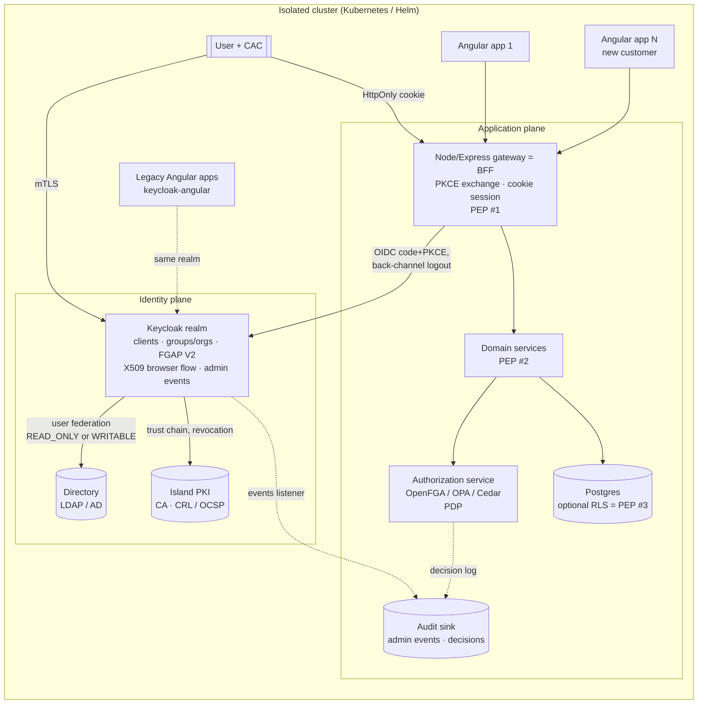

**Created:** 2026-09-03 | **Last updated:** 2026-09-03 | **Author:** research agent under Axium (R4) | **Status:** exploratory — not doctrine

# R4 — Identity Stores, IdPs and Delegated User Management

## 1. TL;DR

- **Four different things get called "the identity store."** A *directory* (LDAP/AD) is the system of record for people and groups; an *identity provider* (IdP, e.g. Keycloak) authenticates them and issues tokens; the *app user table* should hold only app-local profile data keyed by the IdP's subject id; an *authorization store* (OpenFGA/SpiceDB/OPA/Cedar, or Postgres row-level security) answers "may X do Y to Z". Collapsing them is the classic failure.
- **Keycloak is almost certainly already in the target cluster** — both legacy apps pin `keycloak-angular 15.1.0` / `keycloak-js 23.0.7` (`docs/source-documents/legacy-apps/*/monorepo_client_package.json`). RR should be one more OIDC client of that IdP, not a second IdP.
- **Browser flow: Authorization Code + PKCE, and prefer a Backend-for-Frontend (BFF)** that keeps tokens out of the browser behind HttpOnly cookies — the current IETF Best Current Practice ([RFC 10017 / BCP 212](https://www.rfc-editor.org/info/rfc10017/)). The Node/Express gateway RR already plans is the natural BFF.
- **Graham's "group admin manages only their group" requirement is supported natively by Keycloak Fine-Grained Admin Permissions V2** (GA since 26.2): Group-resource scopes `view-members`, `manage-members`, `manage-membership`, `impersonate-members`, granted to a group-membership policy, with a negative policy to carve out sub-groups. Organizations became an FGAP resource type in 26.7.
- **Map groups → data privileges through claims, then enforce server-side.** Keycloak puts group/organization membership in the token; the gateway/services (and optionally Postgres RLS) enforce; the Angular UI only *reflects* permissions. Nothing client-side is ever a security boundary.
- **Multi-tenancy default: one realm, Organizations (or top-level groups) per customer; a new realm only when a customer needs hard isolation.** Hundreds of realms degrade Keycloak; one realm is cheaper to operate on an island.
- **CAC/PIV login is mutual-TLS X.509 through Keycloak's `X509/Validate Username Form` authenticator**, which needs the island PKI's CA chain, CRL/OCSP reachability *on the island*, and TLS passthrough at the ingress.
- **Offline install is a bundling problem:** the Keycloak image (built "optimized" with `kc.sh build`), its Postgres, the directory server image, Helm charts (codecentric `keycloakx`), and the CA/CRL material all ride the one-way bundle. There is no DISA STIG specific to Keycloak `[UNVERIFIED]`; harden against the Application Security & Development STIG and the platform STIGs instead.

## 2. Core concepts and vocabulary

| Term | Meaning (one meaning per word) |
|---|---|
| **Identity** | A digital representation of a person or non-person entity, plus its attributes. DoD ICAM: "the creation of digital identities and maintenance of associated attributes" ([DoD CIO, ICAM Strategy, 2020](https://dodcio.defense.gov/Portals/0/Documents/Cyber/ICAM_Strategy.pdf)). |
| **Authentication (AuthN)** | Proving a claimed identity, at an *Authentication Assurance Level* (AAL 1–3) ([NIST SP 800-63-4, 2025](https://pages.nist.gov/800-63-4/sp800-63.html)). |
| **Authorization (AuthZ)** | Deciding whether an authenticated principal may perform an operation on a resource. Distinct from AuthN; a different system usually answers it. |
| **Principal / Subject** | The authenticated actor a request runs as (user, service account, device). The OIDC `sub` claim is its stable id. |
| **Claim** | A name/value assertion about a subject carried in a token (e.g. `groups`, `organization`, `acr`) ([OpenID Connect Core 1.0](https://openid.net/specs/openid-connect-core-1_0.html)). |
| **Assertion** | The SAML term for the signed statement an IdP makes about a subject; the OIDC equivalent is the ID token. |
| **Token** | A signed, time-boxed credential: ID token (who logged in), access token (what the bearer may call — JWT profile in [RFC 9068](https://www.rfc-editor.org/rfc/rfc9068)), refresh token (obtain new access tokens). |
| **Session** | Server-side state that a login exists — at the IdP (SSO session) and/or at the BFF (cookie session). Tokens are *derived from* sessions, not the other way round. |
| **Realm / tenant** | Keycloak's top-level isolation unit: its own users, clients, roles, groups, keys and login flows. "Tenant" is the vendor-neutral word. |
| **Group** | A named set of users, hierarchical in Keycloak; membership can be mapped from LDAP and emitted as a claim. |
| **Role** | A named capability label (realm-level or client-level in Keycloak). **Composite role** = a role that bundles other roles. |
| **Permission / entitlement** | A concrete (operation, resource) grant. Roles and groups are ways of *assigning* permissions; the permission is the thing enforced. |
| **Scope** | OAuth: what a client asks to do on the user's behalf (`openid organization`). Keycloak FGAP: an admin operation on a resource type (`manage-members`). Never use it for data visibility — say *privilege*. |
| **Federation** | Trusting another system's authentication: IdP-to-IdP brokering, or IdP-to-directory user federation (Keycloak → LDAP/AD). |
| **Provisioning** | Creating/updating/deactivating accounts and memberships across systems; standardized by SCIM ([RFC 7643](https://datatracker.ietf.org/doc/html/rfc7643) schema, [RFC 7644](https://datatracker.ietf.org/doc/html/rfc7644) protocol). |
| **MFA / phishing-resistant** | Two or more factor types; SP 800-63-4 elevates phishing-resistant authenticators (PKI/PIV, passkeys) at AAL2+ ([NIST SP 800-63-4](https://nvlpubs.nist.gov/nistpubs/SpecialPublications/NIST.SP.800-63-4.pdf)). |
| **PKI / CAC / PIV** | The DoD Common Access Card and federal PIV card are smart cards carrying X.509 certificates, used as a phishing-resistant authenticator via mutual TLS ([DoDI 8520.03](https://www.esd.whs.mil/Portals/54/Documents/DD/issuances/dodi/852003p.pdf)). |
| **PDP / PEP** | Policy Decision Point (decides) vs Policy Enforcement Point (sits in the request path, allows/denies) — [NIST SP 800-207, 2020](https://tsapps.nist.gov/publication/get_pdf.cfm?pub_id=930420). |
| **Delegated administration** | Granting a subset of admin rights, bounded to a subset of resources (one group, one OU, one organization), to a non-global administrator. |

### The four stores, and why they differ

| Store | Question it answers | Examples | Owns |
|---|---|---|---|
| Directory | "Who exists, what are their attributes, which groups are they in?" | OpenLDAP, 389 DS, Active Directory | the authoritative person/group records; password verification |
| Identity provider | "Is this person who they claim, and here is a signed token saying so" | Keycloak, Authentik, Ory Kratos+Hydra | login flows, MFA, sessions, token issuance, client registrations |
| App user table | "What does *this application* know about the user?" | Postgres table keyed by `sub` | preferences, app-local state, denormalized display fields |
| Authorization store | "May subject S do action A on resource R?" | OpenFGA, SpiceDB, OPA, Cedar, Postgres RLS policies | relationships and policies; decision logs |

An app that stores passwords in its own table has reinvented an IdP badly; an IdP that stores every application's fine-grained permissions becomes the bottleneck and the outage. Keep the boundaries.

## 3. Canonical sources

- **Identity assurance:** [NIST SP 800-63-4 *Digital Identity Guidelines*, July 2025](https://nvlpubs.nist.gov/nistpubs/SpecialPublications/NIST.SP.800-63-4.pdf) (supersedes -3 as of 2025-08-01; volumes 63A proofing, 63B authentication, 63C federation).
- **Access control models:** [NIST SP 800-162 *Guide to ABAC*, 2014](https://nvlpubs.nist.gov/nistpubs/specialpublications/nist.sp.800-162.pdf); [NIST SP 800-207 *Zero Trust Architecture*, 2020](https://tsapps.nist.gov/publication/get_pdf.cfm?pub_id=930420).
- **DoD:** [DoD Zero Trust Strategy, 2022-10-21](https://dodcio.defense.gov/Portals/0/Documents/Library/DoD-ZTStrategy.pdf); [DoD ICAM Strategy, 2020-03-30](https://dodcio.defense.gov/Portals/0/Documents/Cyber/ICAM_Strategy.pdf); [DoD Enterprise ICAM Reference Design, June 2020](https://dodcio.defense.gov/Portals/0/Documents/Cyber/DoD_Enterprise_ICAM_Reference_Design.pdf); [DoD Zero Trust Reference Architecture v2.0, Sept 2022](https://dodcio.defense.gov/Portals/0/Documents/Library/(U)ZT_RA_v2.0(U)_Sep22.pdf); [DoDI 8520.03 *Identity Authentication for Information Systems*](https://www.esd.whs.mil/Portals/54/Documents/DD/issuances/dodi/852003p.pdf).
- **Protocols:** OAuth 2.0 (RFC 6749, 6750, 7519, 8628, 9068, 9470) and [RFC 10017 / BCP 212 OAuth for Browser-Based Apps](https://www.rfc-editor.org/info/rfc10017/); [OpenID Connect Core 1.0](https://openid.net/specs/openid-connect-core-1_0.html) plus the RP-Initiated / Back-Channel / Front-Channel Logout specs; SAML 2.0 (OASIS, 2005) `[UNVERIFIED — not fetched in-session]`; [RFC 4510 LDAP](https://datatracker.ietf.org/doc/html/rfc4510); SCIM RFC 7643/7644 — URLs in §8.
- **Keycloak (primary docs, read as `.adoc` from the `keycloak/keycloak` repo):** [Server Administration Guide](https://www.keycloak.org/docs/latest/server_admin/index.html) — FGAP V2, Organizations, LDAP federation, X.509, admin events; [container guide](https://www.keycloak.org/server/containers); blogs [FGAP in 26.2](https://www.keycloak.org/2025/05/fgap-kc-26-2), [Organizations FGAP](https://www.keycloak.org/2026/05/org-fgap); [RHBK 26.2 admin-permissions chapter](https://docs.redhat.com/en/documentation/red_hat_build_of_keycloak/26.2/html/server_administration_guide/admin_permissions).
- **Directories:** [OpenLDAP Admin Guide — Access Control](https://www.openldap.org/doc/admin26/access-control.html); [389 DS ACI design](https://www.port389.org/docs/389ds/design/aci.html); [Microsoft, Delegation of Control in AD DS](https://learn.microsoft.com/en-us/windows-server/identity/ad-ds/manage/delegation-control-wizard).
- **Authorization engines:** Pang et al., *Zanzibar: Google's Consistent, Global Authorization System*, USENIX ATC 2019 ([research.google](https://research.google/pubs/zanzibar-googles-consistent-global-authorization-system/)) `[venue/year from memory — page not reachable in-session]`; [OpenFGA](https://github.com/openfga/openfga); [SpiceDB](https://github.com/authzed/spicedb); [Cedar](https://github.com/cedar-policy/cedar); [Open Policy Agent](https://github.com/open-policy-agent/opa) (CNCF graduated); [PostgreSQL row security policies](https://www.postgresql.org/docs/current/ddl-rowsecurity.html).
- **Front end:** [`keycloak-angular` README](https://github.com/mauriciovigolo/keycloak-angular/blob/main/README.md) (22.x ↔ Angular 22, keycloak-js 18–26).

## 4. How it is done in practice

### 4.1 Browser flows for an Angular SPA + Node gateway

BCP 212 describes three patterns and ranks them: **(1) Backend-for-Frontend** — the SPA never sees a token; a confidential backend does the Authorization Code + PKCE exchange, stores tokens server-side, and gives the browser an HttpOnly, `SameSite`, `Secure` session cookie; **(2) token-mediating backend** — the backend obtains tokens and hands the SPA only the access token; **(3) browser-based OAuth client** — the SPA holds tokens itself (what `keycloak-js` does). Implicit flow is prohibited; PKCE is mandatory in all three ([RFC 10017](https://www.rfc-editor.org/info/rfc10017/)). The BFF is preferred because a browser-held token is exposed to any XSS, whereas a cookie session can only be *used* from the origin, and CSRF is handled with `SameSite` plus an anti-forgery token.

Consequences for RR:

- **Refresh** happens at the BFF; the refresh token never leaves the server. (`keycloak-js`'s `withAutoRefreshToken` does it in the browser — pattern 3.)
- **Logout** is three-sided: clear the BFF session, call RP-Initiated Logout (`end_session_endpoint`, `id_token_hint`), and register a Back-Channel Logout URL so the IdP can end your session when the user logs out of *another* app in the cluster ([OIDC Back-Channel Logout 1.0](https://openid.net/specs/openid-connect-backchannel-1_0.html)).
- **Step-up**: a resource server returns `401` with `error="insufficient_user_authentication"` plus `acr_values`/`max_age`; the client re-authorizes with them; the new token carries `acr` and `auth_time` ([RFC 9470](https://www.rfc-editor.org/rfc/rfc9470.html)).
- **CAC/PIV** is a *browser-flow* choice at the IdP, not SPA code: Keycloak's `X509/Validate Username Form` authenticator, `ALTERNATIVE` in a copied Browser flow, requires mutual TLS at the ingress (passthrough — the web container validates the PKIX path), extracts identity from the certificate (Subject DN regex, SAN UPN/RFC822, serial, thumbprint), maps it to a user attribute, and checks revocation by CRL/CDP or OCSP (`authentication/x509.adoc`). The rest of the OIDC dance is unchanged — the point of putting the smart card behind an IdP.

### 4.2 Authorization models

| | RBAC | ABAC | ReBAC (Zanzibar) | Policy-as-code |
|---|---|---|---|---|
| Decision input | subject's roles | attributes of subject, object, action, environment ([SP 800-162](https://nvlpubs.nist.gov/nistpubs/specialpublications/nist.sp.800-162.pdf)) | graph of relationships (`user:alice member group:ops`, `group:ops#member viewer dataset:x`) | a policy language over any of the above (Rego, Cedar) |
| Strength | simple, auditable, matches org charts | context-sensitive (time, classification, device) | answers "who can see this?" and "what can alice see?" (reverse queries) at scale | separates policy from code; testable, versionable |
| Weakness | role explosion; cannot express "own group's data" without a role per group | hard to audit ("why was this allowed?"); attribute quality is everything | another stateful service to run and keep consistent | needs data feeds; policy sprawl |
| Tooling | Keycloak roles/composites, groups → claims | Keycloak Authorization Services policies; OPA | OpenFGA, SpiceDB (both Zanzibar-inspired, per their READMEs) | OPA/Rego (CNCF graduated), Cedar (AWS; validator + symbolic analysis, default-deny) |
| Fit for "each group has unique data privileges" | works if privilege = group label on data rows | works if rows carry classification/attributes (see R5) | best when privileges follow *relationships* (group owns dataset; dataset shared to group) | wraps any of the three |

Where PDP and PEP live (SP 800-207 vocabulary): the **gateway/BFF** is PEP #1 (token validity, coarse route-to-group checks); each **service** is a PEP for its own resources, calling a PDP (OPA sidecar, OpenFGA `Check`, in-process Cedar); the **database** can be a last-line PEP via Postgres row-level security (`CREATE POLICY … USING (group_id = current_setting('app.group'))`, set per request from the validated token — [Crunchy Data](https://www.crunchydata.com/blog/row-level-security-for-tenants-in-postgres), secondary; primary docs unreachable in-session); the **UI** is never a PEP.

### 4.3 Multi-tenancy patterns in Keycloak

| Pattern | How | Isolation | Cost / limits | When |
|---|---|---|---|---|
| Realm per customer | new realm: own users, clients, keys, flows, theme | hard: separate admins, signing keys, SSO | operations scale with realm count; community guidance puts practical ceilings in the hundreds ([Phase Two](https://phasetwo.io/blog/multi-tenancy-options-keycloak/), [cloud-iam](https://www.cloud-iam.com/post/keycloak-multi-tenancy)) `[secondary]`; every app registered per realm | a customer that must be sealed off (classification, IdP trust, contract) |
| Group per customer (one realm) | top-level group per customer, sub-groups for teams; `groups` claim | soft: shared user namespace and login flow | cheapest; FGAP V2 delegates per group | the default on one network with one trust domain |
| Organization per customer (one realm, Keycloak ≥ 26) | first-class org: managed/unmanaged members, domains, per-org IdP, org groups, `organization` claim/scope, invitations (`organizations/*.adoc`) | medium: per-org identity-first login and brokering, still one realm | new; org FGAP scopes are only `view`/`manage` (26.7) | customers who bring their own directory/IdP or need org-scoped login UX |

A new Angular app for a new customer is then one OIDC *client registration* (redirect URIs, `organization`/`groups` scopes) plus a group/org — no new realm.

### 4.4 Delegated administration (Graham's core question)

**Keycloak FGAP V2** (`fine-grain-v2.adoc`; GA in 26.2 per the [Keycloak blog](https://www.keycloak.org/2025/05/fgap-kc-26-2)). Enable per realm (*Realm settings → Admin Permissions*, or `PUT /admin/realms/{realm} {"adminPermissionsEnabled": true}`); this creates an `admin-permissions` client holding the permissions. **Delegated realm administrators** "can have limited access to a realm based on the permissions defined through this feature." Resource types: Users, Groups, Clients, Roles, Organizations. Group scopes, verbatim:

- `view`, `manage` — the group itself
- `view-members`, `manage-members` ("together with `manage-membership`, also allows creating new users as members of the group"), `impersonate-members`
- `manage-membership` (add/remove members), `manage-membership-of-members`

Scopes are independent (no transitive grant); member-scopes **cascade down the group hierarchy** with explicit allow carve-outs on children; "group membership denies take precedence over user-level permissions." The doc's recipe for Graham's exact requirement — *"Allowing to view and manage members of a group but not members of its subgroups"* — is a Group permission with `view-members` + `manage-members` on `mygroup` bound to a Group policy for the admins' group, plus a second permission over the sub-groups bound to a *negative* Group policy. The admin also needs the `query-users`/`query-groups` realm-management roles to see the console sections, and "delegated realm administrators cannot assign administrative roles to other realm administrators" — delegation cannot escalate. An **Evaluate** tool shows which permissions voted PERMIT/DENY for an admin, resource and scope.

**Organizations** (FGAP since 26.7) add `view`/`manage` per organization (creating one needs type-level `manage`); membership, invitations, org groups and org roles are org-scoped and can be emitted in the `organization` claim.

**Directories do it with ACIs/ACLs.** OpenLDAP: `access to dn.subtree="ou=GroupA,…" by group.exact="cn=GroupA-admins,…" write by * read`, first match wins ([OpenLDAP Admin Guide](https://www.openldap.org/doc/admin26/access-control.html)); 389 DS: an `aci` attribute on the subtree granting `(read,write,add)` to a `groupdn` ([389 DS ACI design](https://www.port389.org/docs/389ds/design/aci.html)); Active Directory: the Delegation of Control Wizard writes ACEs on an OU — "Create, delete, and manage user accounts", "Modify the membership of a group" — scoped to that OU ([Microsoft Learn](https://learn.microsoft.com/en-us/windows-server/identity/ad-ds/manage/delegation-control-wizard)). If Keycloak federates the directory `WRITABLE`, a group admin's edit is written back *as Keycloak's bind DN* — the directory trusts Keycloak's service account and the delegation boundary is Keycloak's, not LDAP's. If `READ_ONLY`, admins manage membership with directory tooling and Keycloak syncs it in (`user-federation/ldap.adoc`: modes `READ_ONLY`/`WRITABLE`/`UNSYNCED`; group, role and MSAD account-state mappers).

**SCIM.** Keycloak has no built-in SCIM; a SCIM module is being added to the codebase (announced 2026-02) and community extensions exist ([Keycloak blog](https://www.keycloak.org/2026/02/scim-support-survey-feedback), [Metatavu](https://github.com/Metatavu/keycloak-scim-server/), [p2-inc](https://github.com/p2-inc/keycloak-scim)). With no external HR system on the island, SCIM matters as the *shape* of a provisioning API — `/Users`, `/Groups`, `PATCH` membership ([RFC 7644](https://datatracker.ietf.org/doc/html/rfc7644)) — that the Keycloak Admin REST API can stand in for.

**Audit.** Keycloak records **user events** (login/logout/errors) and **admin events** (every Admin REST operation) per realm; *Include representation* stores the JSON body of each change; expiry is configurable and a Listener SPI ships events to logs/SIEM (`events/admin.adoc`). The ASD STIG requires automated account-management functions and enforcement of approved authorizations (V-222425) ([ASD STIG V6R1](https://cyber.trackr.live/stig/Application_Security_and_Development/6/1)); admin events plus the PDP's decision log are the evidence.

### 4.5 Reference architecture for an RR-like system

Group-to-data mapping in this picture: Keycloak emits `groups`/`organization` claims; the BFF validates the token and starts a session; the service asks the PDP "can `user:sub` `read` `dataset:d`?", where the FGA model says `dataset#reader = group#member` and group membership tuples are synced from Keycloak (admin-event listener or periodic Admin-API pull); Postgres RLS is optional belt-and-braces for row-labelled data (that interplay with security markings is R5's territory).

### 4.6 What the front end owns

- **Route guards** (`createAuthGuard` / `CanActivateFn`) are navigation UX, not security.
- **Permission-aware UI** — per element: *hide* (user should not know it exists), *disable* (exists, not permitted, say why), *deny on action* (server 403 → toast). Hide cross-group data; disable same-group actions the user lacks.
- **Claims-driven feature flags** — a `PermissionStore` (SignalStore) hydrated from a BFF `/api/me` endpoint returning the *server's* view of effective permissions; in the BFF pattern the UI never decodes a token.
- **One shared auth library** in the workspace (`@rr/auth`): interceptor (cookie credentials + CSRF header), `/api/me` client, guard factories, an `*rrCan="'dataset:read'"` directive, session-expiry handling. Each new customer app imports it and configures only its client id.
- **Never trusted client-side:** the bundle, `localStorage`, a decoded JWT, a guard. Every read and mutation is re-authorized at the gateway or service.

## 5. Trade-offs, anti-patterns, failure modes

- **Tokens in the browser** (pattern 3) match the legacy apps, but every XSS is a token theft — why BCP 212 exists. Mixing patterns across apps in one realm is fine; each app is its own client.
- **Realm sprawl**: realm-per-customer becomes 40 realms × every app's client registration, key rotation and login-flow fix.
- **Roles as data privileges** (`ROLE_GROUPA_READER`) explode combinatorially; put the *relationship* (group ↔ dataset) in the authorization store and keep roles for capabilities.
- **Group-claim bloat**: the full group tree in every access token bloats tokens and leaks org structure; emit what the resource server needs, or resolve membership server-side.
- **Delegated-admin escalation**: `manage-members` plus `map-roles` lets an admin grant themselves more; FGAP V2 keeps scopes independent for this reason — grant the minimum and use the Evaluate tool.
- **Write-back ambiguity**: `WRITABLE` federation without a declared system of record yields two half-truths. Decide authority per attribute.
- **CAC revocation blind spot**: if CRL/OCSP is unreachable on the island, Keycloak's OCSP fail-open setting becomes a policy decision someone must sign.
- **Audit without representation** tells you *that* a group changed, not *to what*.
- **PDP as single point of failure**: an OpenFGA/OPA outage is a total outage unless PEPs fail closed *and* the PDP is HA.

## 6. RR lens

- **Reuse the cluster's Keycloak.** Legacy apps use `keycloak-angular`/`keycloak-js` (pattern 3). RR's gateway can adopt the BFF pattern against the *same* realm without touching them; back-channel logout keeps SSO consistent across old and new apps.
- **Stack sync:** `keycloak-angular` 22.x ↔ Angular 22, keycloak-js 18–26; if DR-04 lands Legacy Island on v19, the pin follows (`two_island_model.md`). In the BFF pattern the SPA needs no Keycloak library — one pin fewer to synchronize.
- **Offline bundle:** `quay.io/keycloak/keycloak` built *optimized* (`kc.sh build` with `KC_DB=postgres`, `KC_FEATURES`, providers under `/opt/keycloak/providers` — [container guide](https://www.keycloak.org/server/containers)); Postgres; a directory image (389 DS/OpenLDAP) if the island has no AD; the codecentric `keycloakx` chart ([GitHub](https://github.com/codecentric/helm-charts/tree/master/charts/keycloakx)) — Bitnami's chart/images went commercial in 2025 `[secondary sources]`; the Keycloak Operator is the alternative ([docs](https://www.keycloak.org/operator/installation)) `[not fetched]`. Keep realm config as exported JSON in the monorepo, applied by the bundle, so both islands converge on identical realms.
- **PKI on the island:** CA chain into Keycloak's truststore and the ingress; CRL distribution reachable in-cluster; DoD-approved PKI roots if enterprise CACs are used (DoD Cyber Exchange PKI/PKE) `[UNVERIFIED — not fetched]`.
- **Hardening:** no Keycloak-specific DISA STIG found `[UNVERIFIED]`; apply the ASD STIG ([V6R1](https://cyber.trackr.live/stig/Application_Security_and_Development/6/1)), the Kubernetes STIG `[UNVERIFIED]`, the Postgres STIG, and Red Hat's FIPS guidance if RHBK is used ([RHBK](https://access.redhat.com/products/red-hat-build-of-keycloak/)).
- **Zero Trust:** DoD ZT's user pillar expects an enterprise IdP, phishing-resistant MFA (CAC/PIV) and continuous authorization ([DoD ZT Strategy](https://dodcio.defense.gov/Portals/0/Documents/Library/DoD-ZTStrategy.pdf)); the PDP/PEP split above is the SP 800-207 shape.
- **Building / Floor / Suite / Office:** *Building* = realm, *Floor* = organization or top-level group (customer), *Suite* = sub-group (team), *Office* = the user's workspace; FGAP's cascading member-scopes fit the hierarchy, and R7's permission-aware UI tiers consume the same claims.

## 7. Open questions for Graham

1. Is there one Keycloak realm on the island today, and who administers it? Which version (FGAP V2 needs ≥ 26.2; Organizations FGAP ≥ 26.7)?
2. Is there an Active Directory / LDAP that is the system of record for people, or does Keycloak own users? Which store is authoritative for group membership?
3. Do users authenticate with CAC/PIV, and is an island CA with CRL/OCSP available in-cluster?
4. Is "customer" a separate trust domain (realm) or a group within one? Any customer that legally requires isolation?
5. May RR's gateway adopt the BFF/cookie pattern while legacy apps keep browser tokens, or must all apps look alike?
6. What audit retention and evidence format does the island's ATO/RMF package require?
7. Can a fourth stateful service (OpenFGA/SpiceDB/OPA) be bundled and operated, or should authorization live in Keycloak Authorization Services + Postgres RLS for v1?

## 8. Sources

- NIST SP 800-63-4 — https://nvlpubs.nist.gov/nistpubs/SpecialPublications/NIST.SP.800-63-4.pdf ; https://pages.nist.gov/800-63-4/sp800-63.html
- NIST SP 800-162 — https://nvlpubs.nist.gov/nistpubs/specialpublications/nist.sp.800-162.pdf
- NIST SP 800-207 — https://tsapps.nist.gov/publication/get_pdf.cfm?pub_id=930420
- DoD Zero Trust Strategy — https://dodcio.defense.gov/Portals/0/Documents/Library/DoD-ZTStrategy.pdf ; ZT RA v2.0 — https://dodcio.defense.gov/Portals/0/Documents/Library/(U)ZT_RA_v2.0(U)_Sep22.pdf
- DoD ICAM Strategy — https://dodcio.defense.gov/Portals/0/Documents/Cyber/ICAM_Strategy.pdf ; ICAM Reference Design — https://dodcio.defense.gov/Portals/0/Documents/Cyber/DoD_Enterprise_ICAM_Reference_Design.pdf ; DoDI 8520.03 — https://www.esd.whs.mil/Portals/54/Documents/DD/issuances/dodi/852003p.pdf
- RFC 10017 / BCP 212 — https://www.rfc-editor.org/info/rfc10017/ ; RFC 6749, 6750, 7519, 8628, 9068 — https://www.rfc-editor.org/rfc/rfcNNNN ; RFC 9470 — https://www.rfc-editor.org/rfc/rfc9470.html
- OpenID Connect Core — https://openid.net/specs/openid-connect-core-1_0.html ; RP-Initiated Logout — https://openid.net/specs/openid-connect-rpinitiated-1_0.html ; Back-Channel — https://openid.net/specs/openid-connect-backchannel-1_0.html ; Front-Channel — https://openid.net/specs/openid-connect-frontchannel-1_0.html
- RFC 4510 — https://datatracker.ietf.org/doc/html/rfc4510 ; SCIM RFC 7643 / 7644 — https://datatracker.ietf.org/doc/html/rfc7643 , https://datatracker.ietf.org/doc/html/rfc7644
- Keycloak Server Admin Guide — https://www.keycloak.org/docs/latest/server_admin/index.html (read as `.adoc` sources under github.com/keycloak/keycloak `docs/documentation/server_admin/topics/`)
- Keycloak blog: FGAP 26.2 — https://www.keycloak.org/2025/05/fgap-kc-26-2 ; Organizations FGAP — https://www.keycloak.org/2026/05/org-fgap ; SCIM survey — https://www.keycloak.org/2026/02/scim-support-survey-feedback ; container guide — https://www.keycloak.org/server/containers ; operator — https://www.keycloak.org/operator/installation
- Red Hat build of Keycloak — https://docs.redhat.com/en/documentation/red_hat_build_of_keycloak/26.2/html/server_administration_guide/admin_permissions ; https://access.redhat.com/products/red-hat-build-of-keycloak/
- Keycloak Helm: codecentric keycloakx — https://github.com/codecentric/helm-charts/tree/master/charts/keycloakx ; Bitnami — https://github.com/bitnami/charts/tree/main/bitnami/keycloak/
- Multi-tenancy (secondary): Phase Two — https://phasetwo.io/blog/multi-tenancy-options-keycloak/ ; cloud-iam — https://www.cloud-iam.com/post/keycloak-multi-tenancy
- OpenLDAP Access Control — https://www.openldap.org/doc/admin26/access-control.html ; 389 DS ACI — https://www.port389.org/docs/389ds/design/aci.html ; AD Delegation of Control — https://learn.microsoft.com/en-us/windows-server/identity/ad-ds/manage/delegation-control-wizard
- Zanzibar — https://research.google/pubs/zanzibar-googles-consistent-global-authorization-system/ ; OpenFGA — https://github.com/openfga/openfga ; SpiceDB — https://github.com/authzed/spicedb ; Cedar — https://github.com/cedar-policy/cedar ; OPA — https://github.com/open-policy-agent/opa
- PostgreSQL RLS — https://www.postgresql.org/docs/current/ddl-rowsecurity.html ; Crunchy Data — https://www.crunchydata.com/blog/row-level-security-for-tenants-in-postgres
- keycloak-angular — https://github.com/mauriciovigolo/keycloak-angular/blob/main/README.md
- Alternatives (secondary): Cerbos, Authelia vs Authentik 2026 — https://www.cerbos.dev/blog/authelia-vs-authentik-2026-idp ; Ory/Keycloak comparison — https://www.pkgpulse.com/guides/logto-vs-ory-vs-keycloak-open-source-identity-providers-2026
- ASD STIG V6R1 — https://cyber.trackr.live/stig/Application_Security_and_Development/6/1
- Keycloak SCIM extensions — https://github.com/Metatavu/keycloak-scim-server/ ; https://github.com/p2-inc/keycloak-scim
