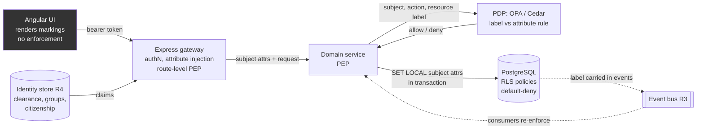

# R5 — Mandatory Access Control (MAC) stores and label-based data research brief v0

**Created:** 2026-09-03 | **Last updated:** 2026-09-03 — pass 2 (modernization) | **Author:** research agent under Axium (R5) | **Status:** exploratory — not doctrine

> **Interpretation note.** This brief reads "MAC stores / DBs" as **Mandatory Access Control** data stores: stores where access is decided by comparing a **security label on the data** against **attributes of the subject** (clearance, compartments, citizenship), enforced by the system rather than at the data owner's discretion. That is what "MAC" means in NIST SP 800-53 (AC-3(3)) and in the defense marking world, and it is the reading that fits the per-group data privilege requirement this brief feeds.
>
> **If a different "MAC" was meant, correct the commission:** (a) **Media Access Control** address stores — hardware-address inventories for network asset management (NAC/CMDB territory, not an access-control model); (b) **Message Authentication Code** stores — HMAC/tag storage for integrity verification (a cryptography topic that overlaps with the Trusted Data Format's integrity bindings, mentioned below, but is otherwise out of scope). Neither is covered further here.

## 1. TL;DR

- **MAC is a policy shape, not a product.** Data carries a label; the subject carries attributes; a rule the user cannot override compares them. NIST SP 800-53 Rev 5 AC-3(3): the policy "is uniformly enforced over all subjects and objects to which the system has control. Otherwise, the access control policy can be circumvented" [NIST, SP 800-53 Rev 5 (OSCAL), 2020](https://github.com/usnistgov/oscal-content/blob/main/nist.gov/SP800-53/rev5/json/NIST_SP-800-53_rev5_catalog.json). One enforcement path, everywhere.
- **Graham's per-group data privilege model is a compartment model** — the non-hierarchical half of a MAC label. "Group X may see records tagged X" is a label-vs-attribute rule, not per-group `WHERE` clauses hand-written into each service. ABAC "can be implemented as either a mandatory or discretionary form of access control" (AC-3(13)); the vocabulary is interchangeable, the discipline is not.
- **Enforcement belongs in the database and in one policy decision point (PDP); never in the UI.** The UI *displays*; the gateway *carries attributes*; the PDP *decides*; the store *enforces last*.
- **Cell-level stores (Accumulo, HBase) are mature but bring the Hadoop stack** (HDFS + ZooKeeper) [Apache Accumulo, README](https://github.com/apache/accumulo/blob/main/README.md) — a heavy tax on an island with no vendor. Take it only if requirements prove mixed-label cells inside one record, or Bigtable-scale volume.
- **The evidence points at PostgreSQL row-level security + a policy engine (OPA or Cedar) as the honest first release**: default-deny policies driven by per-transaction subject attributes, a small `Marking` value object in `common/`, and signal-first marking-rendering primitives in the Angular 22 base library. All Apache-2.0 or PostgreSQL-licensed, all with Kubernetes operators. Current majors on 2026-09-03: PostgreSQL 18 (18.6; 19 at beta3), OPA 1.20.1, Cedar 4.12.0 — the RLS semantics quoted below are unchanged in the 18 and 19 release notes.
- **Two PostgreSQL facts shape the design:** `sepgsql` explicitly *does not* do row-level control, and RLS is bypassed by superusers, `BYPASSRLS` roles and — by default — table owners [PostgreSQL, Row Security Policies](https://github.com/postgres/postgres/blob/master/doc/src/sgml/ddl.sgml). The application role must be none of these.
- **"You cannot see this exists" is a data-model requirement, not a UI style.** Absent, not disabled; counts, pagination totals, suggestions and 403-vs-404 leak existence as surely as a greyed-out row.
- **The unclassified base library carries marking *primitives*, never marking *data*.** Levels, compartment names, colours and banner text arrive as runtime configuration on the island, via the ConfigMap path the gateway already serves at `/api/config`.

## 2. Core concepts and vocabulary

| Term | Meaning (one meaning per word) |
|---|---|
| **MAC** (Mandatory Access Control) | System-enforced comparison of object labels against subject attributes; subjects cannot pass information or privileges on, or alter labels (NIST AC-3(3)). |
| **DAC** (Discretionary) | The owner decides who gets access and may pass that right on (AC-3(4)). Unix permissions, SQL `GRANT`. |
| **RBAC** | Permissions attached to roles. Coarse, administrable, label-blind. |
| **ABAC** | Rules over subject, action, environment and resource attributes; "can be implemented as either a mandatory or discretionary form" (AC-3(13)). How MAC is built today. |
| **Security attribute / label** | Metadata bound to information "in storage, in process, and/or in transmission" and "retained with the information" (AC-16a–b). |
| **Classification level** | The hierarchical, ordered part of a label (U < C < S < TS). |
| **Compartment / category** | The non-hierarchical part (SCI compartments, SAP names, project tags, "groups"). Set-valued, compared by subset. |
| **Dissemination control** | Caveats such as NOFORN, REL TO, ORCON constraining *who* may receive, keyed on citizenship or organisation rather than clearance. |
| **Clearance** | The subject's label: maximum level plus compartment set (plus citizenship/affiliation for dissemination). |
| **Dominance / lattice** | A dominates B if A's level ≥ B's *and* A's categories ⊇ B's [SELinux Notebook, MLS/MCS](https://github.com/SELinuxProject/selinux-notebook/blob/main/src/mls_mcs.md). Levels × category-sets form a lattice. |
| **No read up / no write down** | Bell–LaPadula's simple-security and *-properties, for confidentiality [Bell & LaPadula, MITRE MTR-2547, 1973] `[UNVERIFIED]`. |
| **Biba** | The integrity dual: no read down, no write up [Biba, MITRE MTR-3153, 1977] `[UNVERIFIED]`. Governs who may *taint* a record. |
| **MLS** | One system stores several levels and enforces between them. High assurance, rare in application software. |
| **MSL** | Separate systems per level joined by guards — the two-island/CDS model (R6). |
| **System-high** | The enclave runs at the highest level present; everyone is cleared to it; internal labels serve handling and need-to-know, not level separation. |
| **Marking** | The human-readable rendering of a label. |
| **Portion mark** | Parenthetical mark on each paragraph/field: `(U)`, `(S//NF)`. |
| **Banner line** | Overall marking at top and bottom of a page or screen. |
| **Enforcement vs display** | Enforcement stops a byte reaching a subject (AC-3). Display renders a mark so a human handles it correctly (AC-16(5)). |
| **Visibility expression** | Accumulo's boolean label grammar, e.g. `(A|B)&(C|D)` [Apache Accumulo, `ColumnVisibility` Javadoc](https://github.com/apache/accumulo/blob/main/core/src/main/java/org/apache/accumulo/core/security/ColumnVisibility.java). |
| **Authorizations** | Accumulo's term for the subject's token set; a scan may request only a subset of it. |
| **PDP / PEP** | Policy Decision Point (evaluates) vs Policy Enforcement Point (acts). OPA and Cedar are PDPs. |
| **Reference monitor** | The always-invoked, tamper-proof, verifiable mediator MAC presupposes (AC-25, cited by AC-3(3)). |
| **Regrading** | Changing a label "only via regrading mechanisms validated" by the organisation (AC-16(9)); never an ordinary `UPDATE`. |
| **TDF** | Trusted Data Format — encrypted payload plus a manifest carrying policy and key-access information [OpenTDF, spec](https://github.com/opentdf/spec). |

## 3. Canonical sources

- **Models.** Bell & LaPadula, *Secure Computer Systems: Mathematical Foundations* (MITRE, 1973); Biba, *Integrity Considerations for Secure Computer Systems* (MITRE, 1977) `[UNVERIFIED — DTIC blocked in-session]`.
- **History.** DoD 5200.28-STD, *Trusted Computer System Evaluation Criteria* ("Orange Book", 1985): from class B1 "Labeled Security Protection" upward, sensitivity labels and MAC are evaluation requirements; superseded by the Common Criteria `[UNVERIFIED]`.
- **Controls.** NIST SP 800-53 Rev 5: AC-3 with enhancements (3) MAC, (4) DAC, (13) ABAC; AC-4 and AC-4(1) (attribute-based flow: "an information object labeled Secret would be allowed to flow to a destination object labeled Secret, but an information object labeled Top Secret would not"); AC-16 with (1) dynamic association, (5) display on output, (7) consistent interpretation, (8) binding, (9) regrading — all verified verbatim from NIST's OSCAL catalog [NIST, oscal-content](https://github.com/usnistgov/oscal-content). NIST SP 800-162 is the ABAC guide `[UNVERIFIED]`.
- **Markings.** DoD Manual 5200.01 Vol 2, *Marking of Information*, and the ODNI CAPCO *Register and Manual* — the authoritative marking vocabulary `[UNVERIFIED — dni.gov and esd.whs.mil blocked]`.
- **Machine-readable markings.** IC specifications ISM.XML (attributes such as `classification`, `ownerProducer`, `SCIcontrols`, `disseminationControls`, `releasableTo`), NTK.XML and the IC TDF `[UNVERIFIED — attribute names from memory]`. OpenTDF is the open JSON successor, BSD-3-Clause-Clear [OpenTDF, spec README](https://github.com/opentdf/spec).
- **OS enforcement.** *The SELinux Notebook*, MLS/MCS chapter [SELinuxProject](https://github.com/SELinuxProject/selinux-notebook/blob/main/src/mls_mcs.md); Oracle Solaris Trusted Extensions (Trusted Solaris's descendant) `[UNVERIFIED]`.
- **Store documentation.** Accumulo authorizations [Apache](https://github.com/apache/accumulo-website/blob/main/_docs-2/security/authorizations.md); HBase `VisibilityController` [Apache](https://github.com/apache/hbase/blob/master/hbase-server/src/main/java/org/apache/hadoop/hbase/security/visibility/VisibilityController.java); PostgreSQL *Row Security Policies* and `CREATE POLICY` [PostgreSQL](https://github.com/postgres/postgres/blob/master/doc/src/sgml/ref/create_policy.sgml); `sepgsql` [PostgreSQL](https://github.com/postgres/postgres/blob/master/doc/src/sgml/sepgsql.sgml); Oracle Label Security guide `[UNVERIFIED]`; OpenSearch DLS/FLS [OpenSearch](https://github.com/opensearch-project/documentation-website/blob/main/_security/access-control/document-level-security.md); Elasticsearch DLS/FLS [Elastic](https://github.com/elastic/docs-content/blob/main/deploy-manage/users-roles/cluster-or-deployment-auth/controlling-access-at-document-field-level.md); MongoDB `$redact` and Queryable Encryption [MongoDB](https://github.com/mongodb/docs/blob/main/content/manual/manual/source/reference/operator/aggregation/redact.txt).
- **Policy engines.** OPA [CNCF, Apache-2.0](https://github.com/open-policy-agent/opa); Cedar [AWS, Apache-2.0](https://github.com/cedar-policy/cedar).

## 4. How it is done in practice

### 4.1 Where enforcement lives



Each layer gives a different guarantee, and the layers are not interchangeable:

| Layer | What it can honestly guarantee | What it cannot |
|---|---|---|
| **OS kernel (SELinux MLS/MCS)** | Process-to-file/socket flow control under a reference monitor; MCS is "a transparent isolation mechanism for sandbox, container, and virtualization runtimes" [SELinux Notebook](https://github.com/SELinuxProject/selinux-notebook/blob/main/src/mls_mcs.md). | Rows inside one database file. `sepgsql` bridges SELinux into Postgres for tables/columns/functions, but "PostgreSQL supports row-level access, but sepgsql does not" and it "does not try to hide the existence of a certain object" [PostgreSQL, sepgsql](https://github.com/postgres/postgres/blob/master/doc/src/sgml/sepgsql.sgml). |
| **Database (RLS, label security, cell visibility)** | The last line: survives application bugs, ad-hoc queries and forgotten `WHERE` clauses. Postgres evaluates the policy "for each row prior to any conditions or functions coming from the user's query". | Rich policy (time, purpose, citizenship) gets awkward in SQL; cross-store consistency (AC-16(7)) is not the store's job. |
| **Service + PDP (OPA/Cedar)** | Expressive, testable, one source of policy. Cedar (4.12.0, 2026-07-28) is default-deny with analysable policies [Cedar](https://github.com/cedar-policy/cedar); OPA (1.20.1; `main` 1.21.0-dev) is a "general-purpose policy engine that enables unified, context-aware policy enforcement across the entire stack" [OPA](https://github.com/open-policy-agent/opa). | Only as good as the PEP that calls it; a code path that skips the call is an open door — hence the DB layer stays on. |
| **Gateway** | Token validation, attribute extraction, route-level coarse checks, audit. | Anything needing the object's label — the gateway does not have the row. |
| **UI** | Correct marking display (AC-16(5)), handling cues, no-leak presentation. | Enforcement of any kind. The browser is the subject's machine. |

The practical pattern is **defense in two depths**: the PDP at the service boundary (the decision you can reason about) and RLS in the store (the decision that cannot be forgotten).

### 4.2 The candidate stores

| Store | Granularity | Label model (verified source) | Maturity | Ops weight | Offline / Kubernetes | Licence |
|---|---|---|---|---|---|---|
| **Apache Accumulo** | **Cell** | Boolean expression over tokens, e.g. `(admin\|system)&audit`; users hold token sets; `VisibilityConstraint` "prevents users from writing data they cannot read" [Accumulo, Authorizations](https://github.com/apache/accumulo-website/blob/main/_docs-2/security/authorizations.md) | Very mature — current release **2.1.6** (`main` is 4.0.0-SNAPSHOT; website config, 2026-09-03); the defense-community canonical (NSA origin 2008, Apache TLP 2012 `[UNVERIFIED dates]`); Bigtable-inspired [Accumulo, Design](https://github.com/apache/accumulo-website/blob/main/_docs-2/getting-started/design.md) | **Heavy**: HDFS + ZooKeeper + Java ops | No official operator found | Apache-2.0 |
| **Apache HBase** | **Cell** | Expressions evaluated by the `VisibilityController` coprocessor ("both the MasterObserver and RegionObserver"); write-side auth checks optional (`checkAuths`); system/superusers bypass [HBase, source](https://github.com/apache/hbase/blob/master/hbase-server/src/main/java/org/apache/hadoop/hbase/security/visibility/VisibilityController.java) | Mature — 2.6.x is the current stable line (`branch-2.6` at 2.6.8-SNAPSHOT), 3.0.x shipped (`branch-3.0` at 3.0.1-SNAPSHOT), `master` 4.0.0-alpha-1-SNAPSHOT (2026-09-03); less label-centric culture | Heavy: HDFS + ZooKeeper | Stackable operator (OSL-3.0) [Stackable](https://github.com/stackabletech/hbase-operator) | Apache-2.0 |
| **PostgreSQL RLS** | **Row** (column via views) | SQL predicate per command; `USING` filters, `WITH CHECK` validates; permissive policies OR, restrictive AND [PostgreSQL, CREATE POLICY](https://github.com/postgres/postgres/blob/master/doc/src/sgml/ref/create_policy.sgml) | Mature (9.5+); **18 is the current major** (18.6 released 2026-08-13), **19 at beta3** on 2026-09-03 — neither release-note set changes RLS semantics (18 adds cached-plan invalidation on role changes and `pg_dump --no-policies`) | Light | CloudNativePG (CNCF sandbox, Apache-2.0) [CNPG](https://github.com/cloudnative-pg/cloudnative-pg); Crunchy PGO (Apache-2.0) [Crunchy](https://github.com/CrunchyData/postgres-operator) | PostgreSQL |
| **Oracle Label Security** | **Row** | Level + compartments + groups per row, compared to user authorisations `[UNVERIFIED — docs.oracle.com blocked]` | Mature commercial | Oracle DBA + licence regime | Oracle k8s operator `[UNVERIFIED]` | Commercial |
| **OpenSearch security plugin** | **Document + field** (+ masking) | DLS = query DSL on a role with `${user.name}` / `${attr.*}` substitution; "It does not restrict write operations"; roles merge with OR [OpenSearch, DLS](https://github.com/opensearch-project/documentation-website/blob/main/_security/access-control/document-level-security.md) | Mature; bundled — OpenSearch **3.8.1** with security plugin 3.8.x current (`main` 3.9.0-SNAPSHOT, 2026-09-03) | Moderate (JVM cluster) | Official operator (Apache-2.0) [OpenSearch](https://github.com/opensearch-project/opensearch-k8s-operator) | Apache-2.0 [security plugin](https://github.com/opensearch-project/security) |
| **Elasticsearch** | **Document + field** | Same shape (`query`, `field_security`); "meant to operate with read-only privileged accounts" [Elastic](https://github.com/elastic/docs-content/blob/main/deploy-manage/users-roles/cluster-or-deployment-auth/controlling-access-at-document-field-level.md) | Mature | Moderate | ECK operator | DLS/FLS in a paid tier `[UNVERIFIED]` |
| **MongoDB** | **Sub-document** (`$redact`); field encryption (QE) | `$redact` walks each level with `$$DESCEND/$$PRUNE/$$KEEP` against in-document tags (docs' example: `["G","STLW"]`) [MongoDB, $redact](https://github.com/mongodb/docs/blob/main/content/manual/manual/source/reference/operator/aggregation/redact.txt); QE supports "equality and range searches", automatic mode Atlas/Enterprise only [QE compat](https://github.com/mongodb/docs/blob/main/content/manual/manual/source/includes/queryable-encryption/compat/qe-mongodb-compat.rst) | `$redact` is a pipeline stage, not a policy | Moderate | MCK operator (Apache-2.0) [MongoDB](https://github.com/mongodb/mongodb-kubernetes) | SSPL |
| **Label column + PDP** (any store) | Whatever the column holds | Your value object; PDP decides | As mature as your discipline | Light | Any | — |
| **TDF / OpenTDF** | **Object** (file/message), portable | `dataAttributes` URIs `{Namespace}/attr/{Name}/value/{Value}` + optional `dissem`; KAS releases the key only if entitlements satisfy *all* attributes (allOf / anyOf / hierarchy) [OpenTDF, access control](https://github.com/opentdf/spec/blob/main/concepts/access_control.md) | Newer and moving fast — spec **4.3.0**; platform `service` v0.26.0 (2026-08-28) / `sdk` v0.31.0 (2026-08-27); npm `@opentdf/sdk` 0.20.0 (2026-07-10); Go, gRPC, LDAP/JWT entity resolution [platform](https://github.com/opentdf/platform) | Adds KAS + policy service | Containerised; Helm `[UNVERIFIED]` | BSD-3-Clause-Clear |

The cloud analogues — AWS Lake Formation LF-Tags and BigQuery policy tags (taxonomy-driven column access) — are the same idea as managed services `[UNVERIFIED — doc sites blocked]`; "label on the object, policy on the tag" is the industry-normal shape, not a defense curiosity.

### 4.3 The data model — how a label is represented and carried

Three representations recur; RR needs a mapping between them, not a choice of one:

1. **A domain value object** (`common/`) mirroring ISM's attribute names so it serialises without translation: `{ classification, ownerProducer, sciControls[], disseminationControls[], releasableTo[] }`. Store the level twice — code (`S`) and integer rank — because dominance needs an order and `ORDER BY` on strings will betray you.
2. **A visibility expression for enforcement**, Accumulo-style, derived from (1): `S&ALPHA&(USA|GBR)`. Even on Postgres a canonical expression string is a stable audit artefact and a cheap bridge to a cell store later.
3. **A portable policy for transfer**: TDF's policy object when data leaves as a file or message; ISM XML when a guard must parse it (R6).

Subject attributes arrive from the identity store (R4) as claims — clearance rank, compartment/group set, citizenship, organisation. The gateway injects them, services forward them, and the DB receives them per transaction:

```sql
-- policy keyed on per-transaction settings the service SETs (SET LOCAL ...)
CREATE POLICY read_dominated ON observation FOR SELECT USING (
  level_rank <= current_setting('rr.clearance_rank', true)::int
  AND compartments <@ string_to_array(current_setting('rr.compartments', true), ',')
  AND NOT ('NOFORN' = ANY(dissem) AND current_setting('rr.citizenship', true) <> 'USA')
);
```

RLS is "default-deny … meaning that no rows are visible" once enabled with no matching policy [PostgreSQL, Row Security](https://github.com/postgres/postgres/blob/master/doc/src/sgml/ddl.sgml), so a request that forgets to set its attributes sees nothing — the failure is closed. Two documented caveats need design: policies "are not applied when the system is performing internal referential integrity checks or validating constraints" (a unique violation can confirm a hidden row exists), and `LEAKPROOF` functions "may be evaluated before policy expressions" — never mark untrusted functions leakproof. PostgreSQL 18 closed a third, quieter gap: role-dependent cached plans are now invalidated after role changes, because "role membership, role attribute, and database ownership changes may impact the expected behavior of row-level security policies" while old plans lingered [PostgreSQL, release-18 notes](https://github.com/postgres/postgres/blob/REL_18_STABLE/doc/src/sgml/release-18.sgml) — one more reason to pin 18+ rather than an older major an island happens to have.

**Across the event bus (R3):** the label rides in envelope *and* payload; consumers re-enforce (a topic ACL is coarse, a message is not); a topic that must mix labels needs either topic-per-label or TDF-style per-object encryption with the key server as PEP. **Across domains (R6):** serialise the marking in the guard's vocabulary, never an internal enum.

### 4.4 Labels and DDD

Labels are a **cross-cutting concern with a domain footprint**. The marking value object is shared kernel — deliberately tiny: the type, its serialisation, dominance arithmetic. *Policy* is not shared kernel; it lives in one PDP so that AC-16(7)'s "consistent interpretation … between distributed system components" is achieved by having one interpreter. The anti-pattern is a label-aware kernel that grows until every bounded context imports policy helpers and the reference monitor is smeared across forty services.

On an aggregate the **root carries the overall marking** (the banner), children may carry **portion marks**, and the invariant is that the root dominates every portion (AC-16(1): aggregation can raise the whole). Regrading is a domain command with its own audit trail, not a field edit.

Read models: filtering by label at query time (RLS) is cheap; materialising per-clearance projections multiplies storage by the number of subject profiles and rots when a label changes. Prefer filtered queries until a measurement forces otherwise.

## 5. Trade-offs, anti-patterns, failure modes

- **UI-only enforcement.** The classic failure; the API is one `curl` away. Treat any front-end `@if (canSee())` block as decoration — a no-leak *rendering* rule, never a *filtering* one.
- **Existence leaks.** Counts ("1 of 27"), pagination totals, autocomplete, sort positions, `403` vs `404`, and constraint errors all reveal hidden rows. `sepgsql` is explicit that it does not hide existence; Postgres RLS is explicit about constraint side channels.
- **The privileged application role.** One shared DB role with `BYPASSRLS` or ownership silently disables the whole model. The application connects as a non-owner, non-superuser role, always.
- **Read-only assumptions in search stores.** OpenSearch and Elastic both warn DLS/FLS does not restrict writes; a searcher with index rights can overwrite documents it cannot read.
- **Role-union surprises.** Multiple roles OR their DLS queries (OpenSearch, Elastic) and permissive RLS policies OR too. Adding a role can widen access; use restrictive policies for the ceiling.
- **Labels as strings without order.** Ranking by `'SECRET' > 'CONFIDENTIAL'` alphabetically is wrong by luck alone; store rank integers.
- **Mixed-label cells forced into a row store.** If one record genuinely holds fields at different levels visible to different people, a row model needs either field-level splitting into child rows or a document/cell store. Discover this *before* choosing the store.
- **Cell-level store adopted for prestige.** Accumulo's grammar is elegant, but the operational cost is the Hadoop stack, on an island where nobody can phone Cloudera.
- **Policy in two places.** A PDP rule and an RLS policy that drift apart give two answers; keep the RLS policy mechanical (dominance) and put the nuance in the PDP.
- **Colour as the only marking.** Fails accessibility and prints in greyscale; the text is normative.

## 6. RR lens

**Enclave posture first.** Each island is almost certainly a *system-high* enclave, connected — if at all — by a CDS (R6). Inside it, level separation is done by the network; the live requirement is **compartment / need-to-know separation between groups**, the non-hierarchical half of a MAC label. That decides the store: a full MLS store is over-engineering for a system-high enclave unless a real mixed-level dataset is demonstrated.

**A minimal honest first release** (design direction, not implementation truth):

- **PostgreSQL** via CloudNativePG or Crunchy PGO, chart and images carried in the one-way bundle; RLS on every labelled table, default-deny, application role without `BYPASSRLS`; subject attributes set per transaction from gateway-forwarded claims.
- **One PDP.** OPA as a sidecar or Go binary with bundles delivered offline; or Cedar, a Rust library with default-deny semantics. Both Apache-2.0, neither needs a network. Node bindings (npm registry, 2026-09-03): `@cedar-policy/cedar-wasm` 4.12.0 (2026-07-28) tracks the Cedar release; `@open-policy-agent/opa-wasm` 1.10.0 was last published 2024-11 and lags OPA 1.20, so for OPA the HTTP API from Express (or an OPA sidecar) is the honest default rather than a fallback.
- **`common/` carries the `Marking` value object** and dominance helpers — nothing else policy-shaped.
- **OpenSearch** only when search is required, DLS/FLS mirrored from the same attribute vocabulary, read-only search roles.
- **Defer** Accumulo/HBase (Hadoop stack), Oracle Label Security (licensing plus an Oracle estate), TDF (when data must leave the enclave as self-protecting objects — R6 territory).

**Two-island synchronisation.** The marking vocabulary is *data*, versioned and bundled like any config; the rendering and comparison code is identical on both islands. Legacy Island's Angular 19-or-22 target constrains the primitives' dependency floor, not the model — signal `input()` has been stable since v19, so the primitives below compile on every re-pin candidate; `resource`/`httpResource` as public API and `OnPush`-by-default are v22 facts, noted where they matter.

**The front end — Building / Floor / Suite / Office.** The Building level (base library, `@rr/markings`) ships marking-rendering primitives — `banner`, `portion-mark`, `marking-chip` — as standalone `OnPush` Angular 22 components (`@angular/core` 22.1.5; `OnPush` is the v22 default and is declared explicitly for any v19–v21 re-pin) whose only inputs are signal `input()`s of the `Marking` value object from `common/`. The vocabulary — level names, compartment names, colours, banner strings, portion-mark syntax — is **runtime data**: loaded once through an `httpResource` against the gateway's `/api/config` ConfigMap path and held in a root-provided `MarkingVocabularyStore` (`signalStore` with `withProps` for the resource and `withMethods` for lookup). The library ships **no** level names, compartment names, colours or banner strings; those arrive on the island. Rendering is `@if`-gated: until the vocabulary resource `hasValue()` nothing marking-shaped paints, and a `Marking` the vocabulary cannot resolve renders an explicit "unresolved marking" state, never a guessed string. No NgModules, no `@Input()` decorators, no `ngOnChanges`, no component-owned RxJS subscriptions — a marking change re-renders through the input signal alone.

```ts
// @rr/markings — Building level. Shape only: no level names, colours or banner strings in source.
export const MarkingVocabularyStore = signalStore(
  { providedIn: 'root' },
  withProps(() => ({ vocab: httpResource<MarkingVocabulary>(() => '/api/config/markings') })),
  withMethods(({ vocab }) => ({
    entry: (m: Marking) => (vocab.hasValue() ? renderMarking(m, vocab.value()) : undefined),
  })),
);
@Component({
  selector: 'rr-banner',
  changeDetection: ChangeDetectionStrategy.OnPush, // v22 default; declare it on a v19–v21 re-pin
  template: `@if (entry(); as e) { <div class="rr-banner" [style.--rr-marking-bg]="e.colour">{{ e.banner }}</div> }`,
})
export class BannerComponent {
  readonly marking = input.required<Marking>();
  private readonly store = inject(MarkingVocabularyStore);
  protected readonly entry = computed(() => this.store.entry(this.marking()));
}
```

Banners render top and bottom of every screen, window and print view; portion marks precede each field or paragraph. The community colour convention (TS orange, S red, C blue, U green, TS//SCI yellow) comes from the vocabulary object, never hard-coded, never the sole cue `[UNVERIFIED as to authoritative source]`. A root SignalStore holds the subject's attribute set as a **display** convenience — choosing which primitives to render (`@if (subject.canRender(marking()))`), never filtering data the API returned unfiltered, because the API must never return it. AstroUXDS supplies the chrome (`@astrouxds/angular` 9.0.0, npm 2026-06-23); its own classification-marking component carries a fixed classification enum and colour set `[UNVERIFIED — Astro docs blocked]`, so the primitive above owns the vocabulary and applies Astro only as tokens and chrome. Any marking-entry form (regrading request, compartment picker) uses Signal Forms (`@angular/forms/signals`: public API in v22, experimental in v21) with the vocabulary as its schema. **Per-major stability for the re-pin:** `input()`/`output()`/`model()` stable v19; `linkedSignal` and zoneless stable v20 (zoneless the default from v21); `resource`/`httpResource` experimental v19.2–v21, public API v22.0; `OnPush` default v22; Signal Forms public v22 — verified against `angular/angular` `CHANGELOG.md` and the `adev` guides on 2026-09-03.

**No-leak contract with the API:** absent rows are absent from responses, totals and cursors; forbidden and non-existent resources yield the same response; suggestions are computed post-RLS.

**Per-group privileges.** "A group sees its own data" becomes: group membership = subject compartment set (R4); record tag = object compartment set; rule = subset dominance. Adding a group is adding a compartment value, not a code change.

## 7. Open questions for Graham

1. Is each island a **system-high** enclave, or does either genuinely store more than one classification level that must be separated inside the system?
2. What is the **marking vocabulary** on the target: how many levels, how many compartments/groups, which dissemination controls, and who owns changes to it?
3. Is "group" a **compartment** (need-to-know tag on data) or an **organisation** (ownership/tenancy)? The answer decides whether the rule is dominance or tenancy.
4. Does any single record hold **fields at different labels** visible to different people? This is the only fact that forces cell- or field-level storage.
5. Do markings need to be **parsed by a guard** (which format — ISM XML, TDF, custom)? That fixes the serialisation, not the store.
6. Where do **clearance and citizenship** come from on the island — an enterprise attribute service, LDAP attributes, or hand-maintained?
7. Are **regrading**, **audit of label changes** (AC-16e) and **aggregation up-labeling** (AC-16(1)) required in release one?
8. Is **search** a first-release requirement (pulls OpenSearch in) or later?
9. Will the app's database role be provisioned by the island's DBAs — and can we guarantee it is never owner or `BYPASSRLS`?

## 8. Sources

### Concept sources (any age — cited for the model, the control text or the marking rule)

Fetched and quoted in-session:

- NIST SP 800-53 Rev 5 catalog (OSCAL JSON; metadata `version: 5.2.0`, last-modified 2026-05-11 — re-read 2026-09-03) — AC-3, AC-3(3), AC-3(4), AC-3(13), AC-4, AC-4(1), AC-16 and enhancements. https://github.com/usnistgov/oscal-content/blob/main/nist.gov/SP800-53/rev5/json/NIST_SP-800-53_rev5_catalog.json
- The SELinux Notebook, *MLS and MCS*. https://github.com/SELinuxProject/selinux-notebook/blob/main/src/mls_mcs.md
- OpenTDF specification concepts (policy object, attribute object, access control). https://github.com/opentdf/spec · https://github.com/opentdf/spec/blob/main/schema/OpenTDF/policy.md · https://github.com/opentdf/spec/blob/main/schema/OpenTDF/attributes.md · https://github.com/opentdf/spec/blob/main/concepts/access_control.md

Cited but **not fetched** (`[UNVERIFIED]` — egress blocked; confirm before quoting):

- Bell, D.E. & LaPadula, L.J., *Secure Computer Systems: Mathematical Foundations*, MITRE MTR-2547 / ESD-TR-73-278, 1973. https://apps.dtic.mil/sti/citations/AD0770768
- Biba, K.J., *Integrity Considerations for Secure Computer Systems*, MITRE MTR-3153 / ESD-TR-76-372, 1977. https://apps.dtic.mil/sti/citations/ADA039324
- DoD 5200.28-STD, *Trusted Computer System Evaluation Criteria*, 1985. https://csrc.nist.gov/publications/history
- DoD Manual 5200.01 Volume 2, *Marking of Information*. https://www.esd.whs.mil/Portals/54/Documents/DD/issuances/dodm/520001m_vol2.pdf
- ODNI/CAPCO, *Authorized Classification and Control Markings Register and Manual*; IC technical specifications (ISM.XML, NTK.XML, TDF). https://www.dni.gov/index.php/who-we-are/organizations/ic-cio/ic-cio-related-menus/ic-cio-related-links/ic-technical-specifications
- NIST SP 800-162, *Guide to Attribute Based Access Control (ABAC) Definition and Considerations*. https://nvlpubs.nist.gov/nistpubs/specialpublications/NIST.sp.800-162.pdf
- Oracle, *Oracle Label Security Administrator's Guide*. https://docs.oracle.com/en/database/oracle/oracle-database/23/olsag/
- Oracle, *Trusted Extensions Configuration and Administration* (Solaris 11). https://docs.oracle.com/cd/E53394_01/html/E54835/
- Apache HBase Reference Guide, *Visibility Labels*. https://hbase.apache.org/book.html#hbase.visibility.labels
- Elastic, *Subscriptions* (tier for DLS/FLS). https://www.elastic.co/subscriptions
- AWS Lake Formation, *Tag-based access control*. https://docs.aws.amazon.com/lake-formation/latest/dg/tag-based-access-control.html
- Google BigQuery, *Introduction to column-level access control*. https://cloud.google.com/bigquery/docs/column-level-security-intro
- Apache Incubator, *Accumulo proposal* (NSA origin). https://cwiki.apache.org/confluence/display/incubator/AccumuloProposal

### Implementation / idiom sources (dated, primary — fetched and quoted; versions re-verified 2026-09-03)

- Apache Accumulo, *Authorizations* (2.x docs source); *Features* and *Design*; `ColumnVisibility` Javadoc; README (licence, HDFS/ZooKeeper); website config (`latest_release: 2.1.6`; `main` 4.0.0-SNAPSHOT). https://github.com/apache/accumulo-website/blob/main/_docs-2/security/authorizations.md · https://github.com/apache/accumulo-website/blob/main/_docs-2/getting-started/features.md · https://github.com/apache/accumulo-website/blob/main/_docs-2/getting-started/design.md · https://github.com/apache/accumulo/blob/main/core/src/main/java/org/apache/accumulo/core/security/ColumnVisibility.java · https://github.com/apache/accumulo/blob/main/README.md · https://github.com/apache/accumulo-website/blob/main/_config.yml
- Apache HBase, `VisibilityController` source; `pom.xml` on `branch-2.6` (2.6.8-SNAPSHOT), `branch-3.0` (3.0.1-SNAPSHOT), `master` (4.0.0-alpha-1-SNAPSHOT). https://github.com/apache/hbase/blob/master/hbase-server/src/main/java/org/apache/hadoop/hbase/security/visibility/VisibilityController.java
- PostgreSQL, *Row Security Policies* (ddl.sgml) and `CREATE POLICY`; `sepgsql` (still in `contrib` on `master`, row-level statement unchanged); `configure.ac` on `REL_18_STABLE` (18.6) and `REL_19_STABLE` (19beta3); release-18 notes (RLS cached-plan invalidation, `pg_dump --no-policies`; 18.6 dated 2026-08-13); release-19 notes (no RLS entries as of 2026-08-18). https://github.com/postgres/postgres/blob/master/doc/src/sgml/ddl.sgml · https://github.com/postgres/postgres/blob/master/doc/src/sgml/ref/create_policy.sgml · https://github.com/postgres/postgres/blob/master/doc/src/sgml/sepgsql.sgml · https://github.com/postgres/postgres/blob/REL_18_STABLE/doc/src/sgml/release-18.sgml · https://github.com/postgres/postgres/blob/REL_19_STABLE/doc/src/sgml/release-19.sgml
- OpenSearch, *Document-level security*, *Field-level security*, security plugin, k8s operator; `buildSrc/version.properties` on branch `3.8` (3.8.1) and `main` (3.9.0-SNAPSHOT); security plugin `build.gradle` on branch `3.8`. https://github.com/opensearch-project/documentation-website/blob/main/_security/access-control/document-level-security.md · https://github.com/opensearch-project/documentation-website/blob/main/_security/access-control/field-level-security.md · https://github.com/opensearch-project/security · https://github.com/opensearch-project/opensearch-k8s-operator
- Elastic, *Controlling access at document and field level*. https://github.com/elastic/docs-content/blob/main/deploy-manage/users-roles/cluster-or-deployment-auth/controlling-access-at-document-field-level.md
- MongoDB, `$redact`; *Queryable Encryption*; QE compatibility; MongoDB Controllers for Kubernetes. https://github.com/mongodb/docs/blob/main/content/manual/manual/source/reference/operator/aggregation/redact.txt · https://github.com/mongodb/docs/blob/main/content/manual/manual/source/core/queryable-encryption.txt · https://github.com/mongodb/docs/blob/main/content/manual/manual/source/includes/queryable-encryption/compat/qe-mongodb-compat.rst · https://github.com/mongodb/mongodb-kubernetes
- OpenTDF platform (`service/CHANGELOG.md` 0.26.0 2026-08-28; `sdk/CHANGELOG.md` 0.31.0 2026-08-27; LICENSE = The Clear BSD License); spec `VERSION` 4.3.0; npm `@opentdf/sdk` 0.20.0. https://github.com/opentdf/platform · https://github.com/opentdf/spec/blob/main/VERSION
- Open Policy Agent (README, Apache-2.0 LICENSE; `CHANGELOG.md` 1.20.1; `v1/version/version.go` 1.21.0-dev); npm `@open-policy-agent/opa-wasm` 1.10.0 (2024-11-08). https://github.com/open-policy-agent/opa
- Cedar policy language (`Cargo.toml` 4.12.0; `cedar-policy/CHANGELOG.md` 4.12.0 dated 2026-07-28); npm `@cedar-policy/cedar-wasm` 4.12.0 (2026-07-28). https://github.com/cedar-policy/cedar
- CloudNativePG; Crunchy Data PGO; Stackable HBase operator. https://github.com/cloudnative-pg/cloudnative-pg · https://github.com/CrunchyData/postgres-operator · https://github.com/stackabletech/hbase-operator `[operator versions not re-checked]`
- Angular `adev` guides (repo `angular/angular`, `main`): *Accepting data with input properties* — https://github.com/angular/angular/blob/main/adev/src/content/guide/components/inputs.md ; *Async reactivity with resources* — https://github.com/angular/angular/blob/main/adev/src/content/guide/signals/resource.md ; *Reactive data fetching with `httpResource`* — https://github.com/angular/angular/blob/main/adev/src/content/guide/http/http-resource.md ; *Angular without ZoneJS* — https://github.com/angular/angular/blob/main/adev/src/content/guide/zoneless.md ; *Forms with Angular Signals* — https://github.com/angular/angular/blob/main/adev/src/content/guide/forms/signals/overview.md ; `CHANGELOG.md` — https://github.com/angular/angular/blob/main/CHANGELOG.md
- NgRx SignalStore guides (`withProps`, `withMethods`, custom features) — https://github.com/ngrx/platform/tree/main/projects/www/src/app/pages/guide/signals/signal-store
- npm registry (2026-09-03): `@angular/core` 22.1.5, `@ngrx/signals` 22.0.0, `@astrouxds/angular` 9.0.0 — https://registry.npmjs.org/

## Modernization ledger (pass 2, 2026-09-03)

**What changed.**

- §6 "The front end" restated in the signal-first, zoneless Angular 22 idiom: `@rr/markings` primitives as standalone `OnPush` components with signal `input()`s of the `Marking` value object; the vocabulary as runtime data through an `httpResource` held in a root `MarkingVocabularyStore` (`signalStore`, `withProps`, `withMethods`); `@if`-gated no-leak rendering with an explicit "unresolved marking" state; Signal Forms for marking-entry forms; one ≤ 20-line TypeScript sketch. No NgModules, decorators, `ngOnChanges` or component-owned RxJS. Per-major (v19–v22) stability stated for the re-pin.
- §5 anti-pattern example restated from `*ngIf="canSee"` to `@if (canSee())` (the structural directive was a forbidden idiom even as a bad example).
- TL;DR bullet 5, §4.1 (OPA/Cedar), §4.2 (Accumulo, HBase, PostgreSQL, OpenSearch, OpenTDF rows), §4.3 (PostgreSQL 18 cached-plan invalidation) and §6 (Node bindings — previously `[UNVERIFIED]`, now verified on npm) carry current majors with dates.
- §8 regrouped into concept vs implementation/idiom sources.

**Verified against (all fetched 2026-09-03 via `raw.githubusercontent.com` and `registry.npmjs.org`).**

- PostgreSQL: `configure.ac` on `REL_18_STABLE` (`18.6`), `REL_19_STABLE` (`19beta3`), `master` (`20devel`); `release-18.sgml` (18.6 release date 2026-08-13; "Invalidate role-dependent cached plans after role changes"; `--no-policies`); `release-19.sgml` (no row-security entries; header "AS OF 2026-08-18"); `sepgsql.sgml` on `master` ("PostgreSQL supports row-level access, but sepgsql does not"; "does not try to hide the existence"); `ddl.sgml` on `master` (`BYPASSRLS` sentence).
- Accumulo: `accumulo-website/_config.yml` (`latest_release: 2.1.6`), `accumulo/main/pom.xml` (4.0.0-SNAPSHOT), README (HDFS + ZooKeeper). HBase: `pom.xml` `<revision>` on `branch-2.6`, `branch-3.0`, `master`.
- OpenSearch: `buildSrc/version.properties` on `3.8` (3.8.1) and `main` (3.9.0-SNAPSHOT); security plugin `build.gradle` on `3.8`.
- OPA: `CHANGELOG.md` (1.20.1 top entry, no dates) and `v1/version/version.go`. Cedar: root `Cargo.toml` and `cedar-policy/CHANGELOG.md` (4.12.0, 2026-07-28). npm: `@cedar-policy/cedar-wasm` 4.12.0, `@open-policy-agent/opa-wasm` 1.10.0.
- OpenTDF: `spec/VERSION` (4.3.0), `platform/service/CHANGELOG.md`, `platform/sdk/CHANGELOG.md`, `platform/LICENSE`; npm `@opentdf/sdk` 0.20.0.
- NIST: OSCAL catalog metadata (`version: 5.2.0`, last-modified 2026-05-11).
- Angular: the five `adev` guides listed above ("Zoneless is the default in Angular v21+"; "Signal Forms require: Angular v21 or higher"); `CHANGELOG.md` — 22.0.0 (2026-06-03) OnPush default and "graduate signal forms APIs to public API"; 21.0.0 (2025-11-19) zoneless-by-default migration; 20.0.0 (2025-05-28) "Promote zoneless to stable", "stabilize linkedSignal API"; 19.2.0 (2025-02-26) "introduce experimental `httpResource`"; 19.0.0 (2024-11-19) "mark input, output and model APIs as stable"; JSDoc `@publicApi 22.0` on `resource`/`httpResource`/`rxResource`. npm: `@angular/core` 22.1.5, `@ngrx/signals` 22.0.0 (peer `@angular/core ^22.0.0`), `@astrouxds/angular` 9.0.0. NgRx: `with-props.ts`, `with-hooks.ts`, `with-linked-state.ts`, `with-feature.ts`, `entities` and `events` entry points on `main`.

**Stayed (version-independent).** The interpretation note, the MAC/DAC/ABAC/label glossary, every NIST control quotation, Bell–LaPadula/Biba/TCSEC, the enforcement-layer table and its guarantees, the store comparison's label models, the data-model section and the RLS example, labels-and-DDD, the trade-offs, the enclave-posture and per-group-privilege reasoning, the no-leak API contract, and the open questions.

**Still `[UNVERIFIED]`.** Everything so marked in pass 1 (DTIC, esd.whs.mil, dni.gov, docs.oracle.com, hbase.apache.org, elastic.co subscriptions, AWS/GCP docs, the Accumulo incubator page — still egress-blocked); OPA 1.20.x release dates; OpenTDF Helm packaging; operator versions (CloudNativePG, Crunchy PGO, Stackable, OpenSearch, MongoDB); the marking colour convention's authoritative source; AstroUXDS's classification-marking component behaviour (docs blocked); HBase 2.6.7 / 3.0.0 as the exact latest tags (inferred from the SNAPSHOT revisions on the stable branches, not from a release page).
