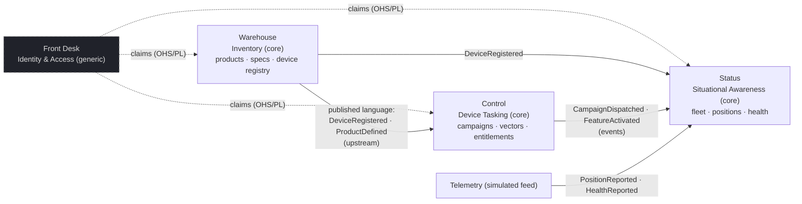

# ACME-INVENT-01 — the DDD reference application

**Created:** 2026-09-03 | **Last updated:** 2026-09-03 | **Author:** Axium, from Graham's rulings of 2026-09-03 | **Status:** `exploratory` — packet cut; board epic [EP-06 (#37)](https://github.com/gstookey/rr/issues/37) + stories stood up; **build NOT activated** (creation is not activation, rule 16)

## What this is

**ACME Invent** is a fictional product built to prove the DDD-ARCH-01 architecture in running code: a hub application for **smart-watch manufacturers** and their B2B customers, covering the supply chain from factory to wearer. It is the **walking skeleton** from `practical_picture_v0.md` §6 (steps 0–6) on a domain with enough meat to template and pattern-build from: real tenancy (several manufacturers, each with B2B customers), a natural need-to-know model (a manufacturer's data is its own compartment), an event flow between contexts (Control tasks a device; Status shows the result), a map, and a paywall.

It is built **in this repo, in the real layout** (`apps/`, `packages/`, `services/` — Graham's ruling, closing C-001's layout half), so it becomes the LOE-8 scaffold for Desert Island rather than a throwaway. When the real Floors arrive they replace ACME's, not the platform.

**Everything in it is invented.** Manufacturers, devices, people, markings and vocabularies are fictional; no real classification string, program name, hostname or address appears anywhere. That is what keeps it portable across the fence.

## Graham's rulings (2026-09-03)

1. **In-repo skeleton, real layout, with meat on the bones** for templating and pattern building.
2. **Domain: a smart-watch manufacturer hub** — inventory management (products, specs, new device classes as manufacturers expand into fitness tech), device tasking (remote pushes: software updates, commands that activate pay-walled on-board features after purchase, distribution-vector configuration: SMS, server, email…), and device situational awareness (in-use devices on a Cesium map, status/health, operator metadata, offline devices with last-known position).
3. **Real Keycloak from slice 1.**
4. **Epic + stories on the board** to track it.
5. **Name:** ACME Invent — Floors *Warehouse* (inventory), *Control* (tasking), *Status* (SA). Axium's addition: *Front Desk* (identity, delegated admin), because every Building needs one and it is the delegated-admin proof's home. Lexicon note: **"Invent" is the product name and never a verb; "Warehouse" is the Floor and "inventory" is the capability** — the near-collision Invent/inventory is recorded in the lexicon so nobody reads "Invent" as the Warehouse.

## The Building, its Floors, and what each proves

| Tier | Name | Bounded context | Suites (v0) | Offices (v0) | Proves |
|---|---|---|---|---|---|
| L1 | **ACME Invent** (the Building) | platform — shell, lobby, session, `@rr/*` base | — | Lobby · Sign-in · the Elevator | the unclassified base library; claims-driven lobby; markings from data |
| L2 | **Front Desk** | Identity & Access (generic) | People · Groups | *Manage my group* (delegated admin) | delegated group admin via Keycloak FGAP, scoped, non-escalating |
| L2 | **Warehouse** | Inventory (core) | Catalog · Devices | *Add product* · *Edit specs* · *Register device* · *Device inspector* (window) | the first vertical slice: read model + command + RLS + markings; new device *classes* without code (rung 1) |
| L2 | **Control** | Device Tasking (core) | Campaigns · Vectors · Entitlements | *Create campaign* · *Push update* · *Activate feature* · *Configure vectors* | commands crossing contexts by event; process-as-data (rung 2) for approval steps that differ per manufacturer; the paywall as an entitlement policy (rung 3) |
| L2 | **Status** | Situational Awareness (core) | Fleet · Map | *Fleet board* · *Device on map* (Cesium) · *Offline devices* | the live read model over SSE; the map; a B2B customer sees only its own operated devices |

**Tenancy is the overlay, never a tier** (tier model §2). Two fictional manufacturers and one B2B customer of one of them exist as *groups* in Keycloak; which Floors they get, which Offices are on, and whose rows they see are claims + manifest + labels. The proof of the whole model is slice S4: **a second manufacturer appears with a different manifest and zero code changes.**

## Context map (v0 hypothesis — the Boundary Test governs changes)

Same-word traps already visible in this domain and pinned in `domain_model_v0.md`: **device** (a product model vs a serialised unit), **update** (software update vs record edit), **activate** (feature activation vs device activation), **customer** (a manufacturer as ACME's tenant vs the manufacturer's B2B customer), **status** (the Floor vs a device's health value).

## Marking vocabulary (fictional, compartment-shaped)

Handling levels **OPEN < PARTNER < INTERNAL < RESTRICTED**, plus **compartments = manufacturer codes** (`TTW`, `MER`, …) and a **B2B sub-compartment** per operating customer. A subject sees a row when its level dominates the row's level *and* its compartment set contains the row's compartments — the R5 dominance rule, demonstrated on invented data. Rendered by `@rr/markings` from a vocabulary served at runtime; the base library carries no vocabulary. Colours and banner strings are ACME's own.

## Packet files

| Document | What |
|---|---|
| [`domain_model_v0.md`](domain_model_v0.md) | the four contexts' aggregates, events, read models and commands; tenants and personas; the lexicon card per context; the seed data shape |
| [`decision_register_v0.md`](decision_register_v0.md) | AI-D1..AI-D12 — the forks this build must rule (map engine offline, telemetry simulation, paywall model, process-as-data format, …) |
| [`slice_decomposition_v0.md`](slice_decomposition_v0.md) | slices S0..S7 = board stories, each with its scope, proof, and the fleet lane that runs it |

## Fleet model

Axium cuts and drives; **Cadence** — light mockup pass on shell/lobby/Floor chrome first (mockups block new surfaces); **Kepler** — S0 (layout, fences, local gate, docker-compose with Keycloak + Postgres); **Marlow** — one slice per PR; **Verin** — review; **Vera** — the proofs as literal tests; **Rin** — closeout after each slice. One well-oriented thread with lightweight checkpoints; every PR click-ready to Graham; no agent merges (rule 15).

## Boundary

- Fictional data only; no real markings; no external network at runtime (Cesium without ion — DA/AI-D1); nothing that would be a problem to port up.
- Angular **22.1.x** / NgRx Signals **22** / TS **6.0.x** / Node **22.23.2** (the ladder's proven Node) / npm workspaces; idioms per the currency contract and R7's v19–v22 delta table, so the skeleton survives a Legacy-Island re-pin (C-008).
- v0 tech: Sheriff, Zod 4, Express 5 + openid-client + Postgres sessions, Postgres RLS, SSE, `@rr/markings`, `@rr/windows`, Vitest, real Keycloak in docker-compose + a mock OIDC provider for CI-side proofs. **Deferred to v1 slices:** OpenFeature, XState, OPA/Cedar, Storybook, Playwright (register DA-D15/D16/D18/D20).
- **Not activated.** Stories exist; S0 starts on Graham's word.
