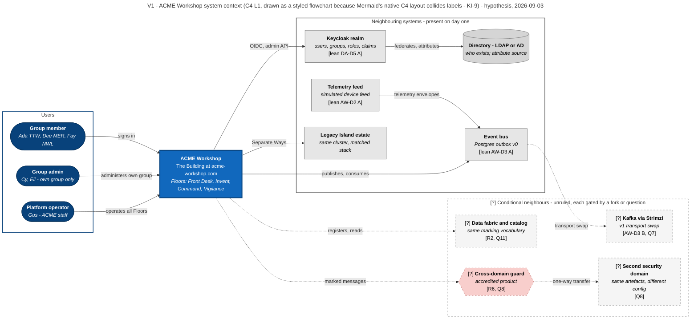

# V1 — System Context (C4 level 1)

**Created:** 2026-09-03 | **Last updated:** 2026-09-03 | **Author:** Trestle (Architect) under Axium | **Status:** `exploratory`

**Diagram status:** `hypothesis` — with leans **DA-D5 A** (Keycloak), **AW-D3 A** (Postgres outbox first), **AW-D2 A** (simulated telemetry). Nothing ruled. **Notation:** **C4 model level 1** (Simon Brown), drawn as a **styled Mermaid `flowchart`** rather than `C4Context`, because Mermaid's native C4 layout places boundaries last and collides edge labels at this element count — recorded as **KI-9**. C4 element kinds are carried by shape and fill; the C4 *semantics* (one system of interest, its people, its neighbours, no internal structure) are unchanged.

**Conforms to viewpoint:** VP-1 Context (see [`README.md`](README.md) §4).

## Purpose

Show **ACME Workshop** as one system among its neighbours, so that a reader can answer "what is inside the thing we are building, and what is somebody else's?" before any internal structure is discussed. Everything internal is deliberately one box; V2 opens it.

## Stakeholders and concerns framed

| Stakeholder | Concern this view answers |
|---|---|
| Programme leadership | What is the system, who uses it, what does it depend on that we do not own? |
| Security / accreditation authority | Where is the identity boundary; is there a cross-domain path; what leaves the system? |
| Platform operations | Which neighbours must exist in the cluster before ACME Workshop can run? |
| Island development team | What is out of scope for us to build (Keycloak, the directory, the estate)? |
| Graham / lead front-end engineer | The Building has exactly one front door and one identity story. |

## Diagram

## Legend

| Notation | Meaning |
|---|---|
| Dark blue rounded capsule | A **person** — a persona, not a group. Groups are identity facts carried *on* the person, never boxes: that is DA-D1 lean A drawn. |
| Bright blue box, heavy border | The **system of interest** — ACME Workshop. C4 level 1 shows it as one box with no internal structure; [V2](V2-container.md) opens it. |
| Grey box | A **neighbouring system** ACME Workshop does not own. |
| Grey cylinder | A neighbouring **store**. |
| Grey box, dashed border, inside the dashed enclosure | **Unruled / conditional** — the element exists only if the named fork or question resolves that way. |
| Red dashed hexagon | The cross-domain guard: an accredited product, conditional on Q8. |
| **`[?]` prefix** | Carried on every conditional element's label as well as the dashed stroke, so the meaning survives a black-and-white print or a paste into a slide. |
| `[lean DA-Dn A]` / `[AW-Dn]` / `[Qn]` | The fork or open question that governs the element, in the DDD-ARCH-01 or ACME-WORKSHOP-01 decision register. |
| Solid edge | A relationship that exists on day one. Labels are deliberately three words or fewer; the detail is in the Elements table. |
| Dotted edge | A relationship that exists only if its conditional endpoint does. |

**Assumed for illustration** (corpus is silent, marked so it is never read as doctrine): that the platform-operator persona (Gus) reaches every Floor through the same shell rather than an operator-only surface; that the directory is a distinct system from Keycloak rather than Keycloak's own user store (R4 §4.5 draws both, and Q5 decides).

## Elements

| Element | Responsibility | Doctrine source |
|---|---|---|
| Group member · Group admin · Platform operator | The three access shapes the architecture must serve: entitled user, delegated administrator, operator. Named personas are fictional. | `acme-workshop-01-design-packet/domain_model_v0.md` §Tenants and personas |
| ACME Workshop | The Building: the reference instance of DDD-ARCH-01, four Floors, built in the real layout so it becomes the Desert Island scaffold. | `acme-workshop-01-design-packet/README.md` §What this is, §The Building |
| Keycloak realm | Identity substrate; owns users, groups, roles; FGAP V2 scopes delegated administration server-side. | `ddd-arch-01-design-packet/decision_register_v0.md` DA-D5, DA-D7; R4 §4.5 |
| Directory (LDAP/AD) | Who exists; the attribute source `/api/me` enriches the subject from. | `ddd-arch-01-design-packet/practical_picture_v0.md` §4; R4 §4.5 |
| Event bus | v0 Postgres outbox plus in-process dispatcher; the port is an interface so the transport can be swapped. | `acme-workshop-01-design-packet/decision_register_v0.md` AW-D3; R3 §5.7 |
| `[?]` Kafka via Strimzi | The v1 transport, if a broker is permitted on the island. | AW-D3 option B; DDD-ARCH-01 register Q7 |
| `[?]` Data fabric / catalog | Discovery, lineage and governed access across sources; only earns its place if the programme mandates one, and must reuse the marking vocabulary. | R2 §5.1–5.2; register Q11 |
| `[?]` Cross-domain guard · second security-domain deployment | Same build artefacts, different configuration and vocabulary, an accredited guard between. Conditional on whether RR moves data between domains at all. | R6 §4.3; register Q8; R8 §7.3 |
| Legacy Island estate | Neighbouring applications in the same cluster; the reason the stack must stay synchronised. | `canonical/two_island_model.md` §Stack synchronization (ADR-005) |
| Telemetry feed | A simulated device feed; the external context Vigilance projects from. | AW-D2; `acme-workshop-01-design-packet/domain_model_v0.md` §Vigilance |

## Correspondences

- **CR-1** — the single `System` box here opens into the containers of [V2](V2-container.md); every container there is inside this boundary or is one of the `System_Ext` neighbours here.
- **CR-2** — the four Floors named in this box are the four bounded contexts of [V3](V3-context-map.md).
- **CR-6** — every `[?]` element carries a fork or question id.
- **CR-8** — the second security-domain deployment is *the same artefacts*; it therefore adds no element to [V6](V6-development-module.md) and only a deployment node to [V7](V7-deployment-evolution.md).
- **Supersession** — this view supersedes `diagrams/01-context-desert-island.md` (generic "Building / Floors" placeholders replaced by ACME names, and the conditional neighbours given fork ids).

## Status and redraw triggers

`hypothesis`. Redraw when: **DA-D5** rules the identity substrate; **AW-D3** rules the event transport; **Q7**, **Q8** or **Q11** are answered by the island owners; or the CDS question moves from background to design.
