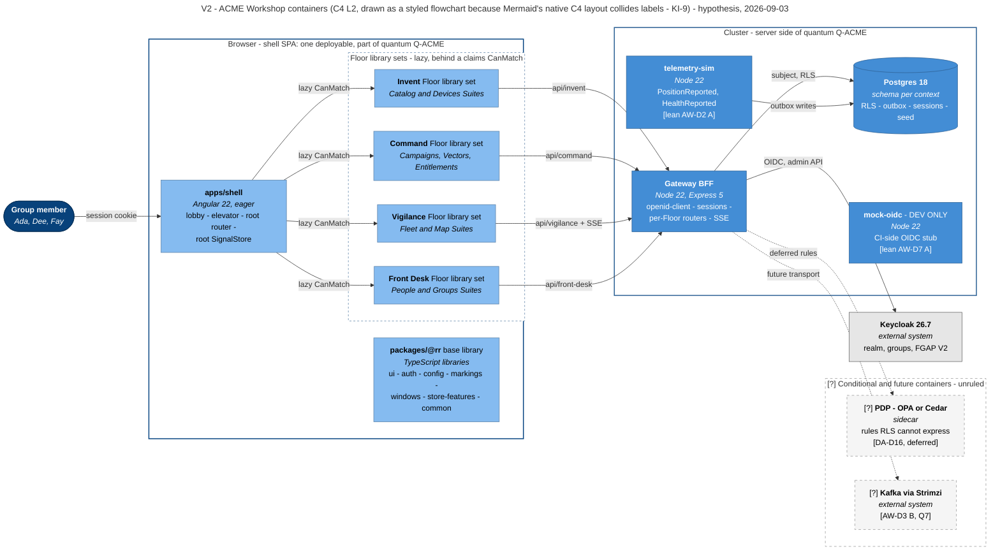

# V2 — Container (C4 level 2)

**Created:** 2026-09-03 | **Last updated:** 2026-09-03 | **Author:** Trestle (Architect) under Axium | **Status:** `exploratory`

**Diagram status:** `hypothesis` — with leans **DA-D2 A** (one shell SPA, Floors as lazy fenced library sets), **DA-D9 A** (BFF per Floor, one gateway host), **DA-D17 A** (openid-client + Postgres sessions), **AW-D3 A** (outbox first), **AW-D6 A** (`SET LOCAL` subject), **AW-D7 A** (mock OIDC for CI). Nothing ruled. **Notation:** **C4 model level 2** (Simon Brown), with level-3 components shown inside the shell container, drawn as a **styled Mermaid `flowchart`** rather than `C4Container`, because Mermaid's native C4 layout places boundaries last and collides edge labels at this element count — recorded as **KI-9**. C4 element kinds are carried by shape and fill; the C4 *semantics* are unchanged.

**Conforms to viewpoint:** VP-2 Container (see [`README.md`](README.md) §4).

## Purpose

Open the single box of [V1](V1-system-context.md) into the units that are separately runnable, and say which of them are one **architecture quantum** and which are not. This is the view an operations engineer reads to know what to run, and the view an architect reads to know what the coupling actually is.

The critical, easily-missed fact this view exists to make unmissable: **the four Floors are not four deployables.** They are lazily loaded, lint-fenced library sets inside one browser deployable (DA-D2 lean A). Calling a Floor a microservice is the vocabulary error R8 §7.1 forbids.

## Stakeholders and concerns framed

| Stakeholder | Concern this view answers |
|---|---|
| Platform operations | What images run, what is dev-only, what needs a database, what must be mirrored to the island. |
| Island development team | Where my Floor's code runs and which API prefix is mine. |
| Graham / lead front-end engineer | The shell is one app; adding a Floor adds a library set, a route and a BFF router — not an application. |
| Security authority | Where the token stops (the gateway) and where the row filter lives (Postgres). |
| Leadership | How few moving parts release 1 needs. |

## Diagram

## Legend

| Notation | Meaning |
|---|---|
| Dark blue rounded capsule | A **person**. |
| Solid-bordered enclosure | A **boundary**, not a deployable: the browser on the left, the cluster on the right. |
| Mid-blue box | A **container** — a separately runnable unit: a process, an image, a served bundle. |
| Mid-blue cylinder | A container that is a **datastore**. |
| Light blue box | A **component** — a build-time unit *inside* the shell SPA. It ships in the same deployable and cannot be started on its own. The four Floor library sets are components, not containers: **the four Floors are not four deployables.** |
| Grey box | A system outside ACME Workshop's control (see [V1](V1-system-context.md)). |
| Dashed enclosure and dashed boxes at the bottom right | **Conditional / future** containers, held apart deliberately so their edges do not cross the live topology. |
| **`[?]` prefix** | Carried on every conditional element's label as well as the dashed stroke. The description carries the fork or question id. |
| **`DEV ONLY`** | Present in the development and CI topology, never in a deployed environment. |
| Edge labels | Three words or fewer by convention; one labelled edge per Floor to the gateway names that Floor's API prefix. The detail is in the Elements table. |

**Assumed for illustration:** that the shell bundle is served by the gateway rather than a separate static-file container — the packets do not say, and V7 draws the alternative; and that the PDP, if adopted, is a sidecar of the gateway rather than a cluster service (DA-D16 is open on the engine, silent on the topology).

## Elements

| Element | Responsibility | Doctrine source |
|---|---|---|
| `apps/shell` | The Building: lobby, elevator, root router, session bootstrap, root SignalStore holding the presumed-global set (identity, claims, acting-as group, navigation manifest). Eagerly loaded. | `practical_picture_v0.md` §1; R7 §4.2, §5.3 |
| `packages/@rr/*` | The unclassified base: `ui` (AstroUXDS façade + RR tokens), `auth`, `config`, `markings`, `windows`, `store-features`, `common` (published language). No domain enums, no group names, no marking strings. | `practical_picture_v0.md` §1; R7 §4.2 |
| Invent / Command / Vigilance / Front Desk Floor library sets | One bounded context each, as `domain` · `data-access` · `feature-*` · `ui` libraries, lazy behind a claims `CanMatch`, promotable to their own app only for a DA-D2 reason. | `tier_model_exploration_v0.md` §2, §5; `acme-workshop-01-design-packet/README.md` §The Building |
| Gateway BFF | Express 5 host of one router per Floor at `/api/<floor>`, plus `/api/me`, `/api/config`, and the single SSE endpoint. Holds the OIDC session; the browser never holds a token. Per-request subject → `SET LOCAL`. Enforcement point PEP #1. | `practical_picture_v0.md` §1, §2; DA-D9, DA-D17; R4 §4.5; R7 §4.3 |
| Postgres 18 | One instance, **schema per bounded context**, RLS policies on every read model, the outbox table, the session store, and the committed seed data. | `acme-workshop-01-design-packet/slice_decomposition_v0.md` S0, S2; AW-D6, AW-D12 |
| `telemetry-sim` | Emits `PositionReported` / `HealthReported` into the outbox at a demo-plausible rate; stands in for real device telemetry. | AW-D2; `slice_decomposition_v0.md` S3 |
| `mock-oidc` (**dev only**) | An in-repo OIDC stub honouring the same claims shape, so CI-side proofs run without Docker. Real Keycloak is used from slice 1 on Graham's machine. | AW-D7; `acme-workshop-01-design-packet/README.md` §Graham's rulings 3 |
| `[?]` PDP (OPA or Cedar) | Rules RLS cannot express. Deliberately **not** in v0 — the seam is designed, the engine deferred. | DA-D16 (lean C → A/B); R5 §4.1 |
| `[?]` Kafka via Strimzi | The v1 transport behind the unchanged bus port. | AW-D3 option B; register Q7 |
| Keycloak 26.7 | External to ACME Workshop; realm as code, FGAP V2 scopes for delegated administration. | AW-D8; DA-D5, DA-D7; R4 |

## Quantum annotation (Ford/Richards, R8)

| Quantum | Contains | Why |
|---|---|---|
| **Q-ACME** | shell SPA + gateway BFF + Postgres + `telemetry-sim` | One deployable set held together by **static coupling** (one Postgres instance; the shared `@rr/common` version) and **synchronous dynamic coupling** (browser → gateway). `telemetry-sim` is a separate pod yet the *same* quantum because it writes the ACME outbox — the 2021 *Hard Parts* refinement that shared data merges quanta. |
| **Q-KC** | Keycloak + its own database | Independently deployable, own data, different availability and security characteristics. |
| **Q-LEGACY(n)** | Legacy Island applications | Drawn in V7; unrelated data, unrelated release train. |

Four bounded contexts live inside **one** quantum. That is the "many contexts, one quantum" row of R8 §5 — *normal and healthy if the context fences are enforced in code*, which is [V6](V6-development-module.md)'s subject and V7's fitness-function table.

## Correspondences

- **CR-1** — each `[Container]` here maps to exactly one quantum in [V7](V7-deployment-evolution.md); the mapping is the table above.
- **CR-2** — each Floor library set corresponds to exactly one bounded context in [V3](V3-context-map.md), one `/api/<floor>` router on the gateway, one Sheriff `scope:` tag in [V6](V6-development-module.md), and one route prefix in [V8](V8-tier-information-architecture.md).
- **CR-3** — the gateway and Postgres appear as enforcement points in [V5](V5-information-security.md) and must appear in the V4 sequences.
- **CR-11** — every container here has exactly one `<<artifact>>` in V7, except `mock-oidc`, which is dev-only and deliberately absent from the deployment view.

## Status and redraw triggers

`hypothesis`. Redraw when: **DA-D2** rules the composition strategy (a promotion splits the SPA container); **AW-D3** rules the transport (Kafka becomes solid and the dispatcher leaves); **DA-D16** adopts a PDP; slice **S0** lands and the container set becomes *implementation truth* rather than hypothesis.
