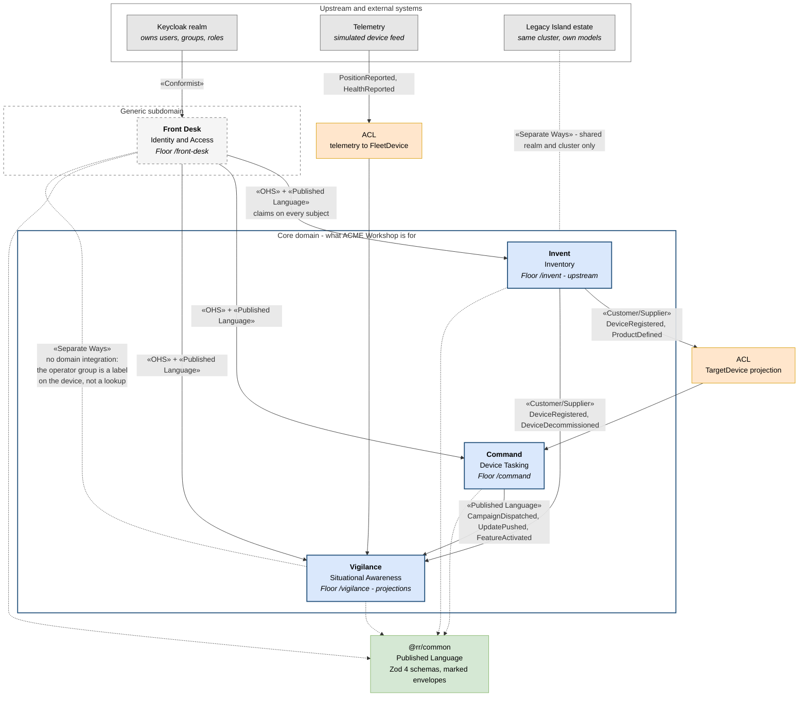

# V3 — Domain / Context Map (DDD strategic view)

**Created:** 2026-09-03 | **Last updated:** 2026-09-03 | **Author:** Trestle (Architect) under Axium | **Status:** `exploratory`

**Diagram status:** `hypothesis` — the ACME context map is explicitly a v0 hypothesis governed by the Context Boundary Test; the *real* programme's contexts come out of an EventStorming session with the island owners (register **Q1**), not from this AD. **Notation:** Mermaid flowchart with Evans context-map relationship stereotypes in guillemets.

**Conforms to viewpoint:** VP-3 Domain (see [`README.md`](README.md) §4).

## Purpose

Draw the **language boundaries** — which is a different question from V2's deployment boundaries, and the confusion between the two is the single most common error when "quantum" and "bounded context" are used interchangeably (R8 §1). This view says what each context *means*, who is upstream of whom, and by what relationship pattern they integrate.

It is also the view that shows why **tenancy is not on the map**: TTW, MER and Northwind are groups, and a group is an access-and-tailoring overlay, never a context (V8).

## Stakeholders and concerns framed

| Stakeholder | Concern this view answers |
|---|---|
| Island development team | Which words are mine, which are borrowed, and where translation is mandatory. |
| Graham / lead front-end engineer | Why there are exactly four Floors, and what would justify a fifth. |
| Leadership | Where ACME's differentiating value sits (core) versus what is bought or generic. |
| Lexicon owner (register Q12) | Where the same-word traps live and which context owns each contested word. |

## Diagram

## Legend

| Notation | Meaning |
|---|---|
| Blue box, solid heavy border | A **core** bounded context — ACME's differentiator. |
| Grey box, dashed border | A **generic** subdomain — necessary, not differentiating; bought or delegated where possible. |
| Grey box, solid border, top band | An **external** system whose model ACME does not own. |
| Orange box | An **anticorruption layer**: the translation ACME owns so a foreign model never leaks in. |
| Green box | The **published language** package — the versioned, documented schema every context integrates through. |
| Solid arrow | An integration relationship; the label is the Evans stereotype plus the events crossing it. |
| Dotted line | A *declared non-relationship* (Separate Ways) or the publication of a schema into the published-language package. |
| `«…»` | A context-map relationship pattern from Evans's catalogue as tabulated in R1 §5.2. |

**Assumed for illustration** (the packets do not state these; they are the architect's reading, and the EventStorming session may overturn them): that Vigilance's translation of the telemetry feed is an anticorruption layer rather than a conformist projection; that Vigilance and Front Desk are deliberately Separate Ways rather than merely un-integrated by accident; and the "generic" classification of Front Desk (implied by "owns nothing domain-shaped", not stated as a Core Domain Chart position).

## Elements

| Element | Responsibility | Doctrine source |
|---|---|---|
| **Invent** (Inventory, core) | Products (a device *model*) and Devices (a serialised *unit*), each with its own lifecycle. The upstream of the whole map: nothing can be tasked or watched until it is registered here. | `acme-workshop-01-design-packet/domain_model_v0.md` §Invent |
| **Command** (Device Tasking, core) | Campaigns, distribution vectors, entitlements. Approval process as data; the paywall as an entitlement policy. | same, §Command |
| **Vigilance** (Situational Awareness, core) | Thin aggregates, mostly projections: fleet board, positions, health, offline devices. Read-only in v0. | same, §Vigilance |
| **Front Desk** (Identity & Access, generic) | UI over Keycloak's admin API, scoped by FGAP V2. Owns nothing domain-shaped. | same, §Front Desk; R4 §4.3 |
| **Telemetry** (external) | The device feed. Simulated in v0 by `services/telemetry-sim`. | AW-D2; domain model §Vigilance |
| **Keycloak realm** (external, upstream) | The system of record for users, groups and roles. | R4 §4.5; DA-D5 |
| **Legacy Island estate** (external) | Neighbouring applications; no shared model. | `canonical/two_island_model.md` |
| **`@rr/common`** | The published language: one module per context, Zod 4 schemas, events as discriminated unions with a `marking` on every envelope, `commandId` on every command. | domain model §The published language; DA-D14 |

## Relationships

| From → To | Stereotype | What crosses | Why this pattern |
|---|---|---|---|
| Keycloak → Front Desk | **«Conformist»** | user / group / role model | Front Desk adopts Keycloak's model wholesale and builds no users table of its own; zero translation, zero influence — exactly Evans's Conformist. |
| Front Desk → Invent · Command · Vigilance | **«Open Host Service» + «Published Language»** | the subject: claims, groups, subject attributes | One protocol for all consumers (`/api/me`), documented and versioned in `@rr/common`. |
| Invent → Command | **«Customer/Supplier»**, with an **«ACL»** on the downstream side | `DeviceRegistered`, `ProductDefined` | Command's needs enter Invent's planning, and Command keeps its own `TargetDevice` projection rather than reading Invent's tables. |
| Invent → Vigilance | **«Customer/Supplier»** | `DeviceRegistered`, `DeviceDecommissioned` | Vigilance's fleet cannot exist before the registry does. |
| Command → Vigilance | **«Published Language»** | `CampaignDispatched`, `UpdatePushed`, `FeatureActivated` | Choreography, not orchestration: Command never calls Vigilance. |
| Telemetry → Vigilance | **«ACL»** | `PositionReported`, `HealthReported` | An external feed's shape must not become Vigilance's model. |
| Vigilance ↔ Front Desk | **«Separate Ways»** | nothing | Integration cost exceeds the value: the operator group is a *label on the device*, not a lookup into the identity context. |
| Legacy estate ↔ ACME contexts | **«Separate Ways»** | nothing | Shared cluster and realm are not a shared model. |

## Same-word traps this map is drawn to prevent

`device` (product model vs serialised unit) · `update` (software update vs record edit) · `activate` (a feature, never a device) · `customer` (a manufacturer as ACME's tenant vs the manufacturer's B2B customer) · **`command`** (the Floor, capitalised; a CQRS write message, lowercase; and what a Campaign pushes to a device, which is an **instruction** and never a "command") · `status` (a device's reported state is its **health**). Source: `acme-workshop-01-design-packet/README.md` §Context map; `domain_model_v0.md` lexicon cards.

## Correspondences

- **CR-2** — each context here is realised by exactly one Floor library set in [V2](V2-container.md) / [V6](V6-development-module.md), one `/api/<floor>` router, and one route prefix in [V8](V8-tier-information-architecture.md).
- **CR-5** — every event named on an edge here appears in `@rr/common` (V6) and at least one of them is traced end to end in [V4](V4-runtime-dynamic.md).
- **CR-9** — no group or manufacturer name appears as a context. Tenancy enters only in V5 and V8.
- **Quantum correspondence (R8 §5)** — all four contexts map into **one** quantum in V7 today. That is the "many contexts, one quantum" case, legitimate *because* the fences of V6 are machine-enforced.

## Status and redraw triggers

`hypothesis`. Redraw when: **Q1** is answered (the real EventStorming, which may rename or re-cut everything); the Context Boundary Test is run against a new customer need and returns "2 or more checks different" (a fifth context); or Vigilance acquires its first command (`RequestCheckIn`), which would turn the Command → Vigilance edge into a Partnership question.
