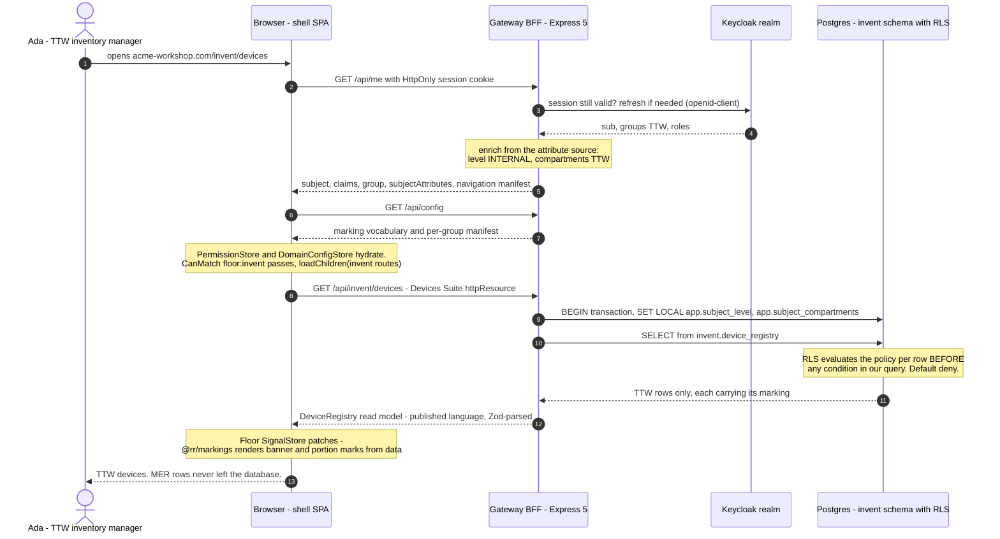
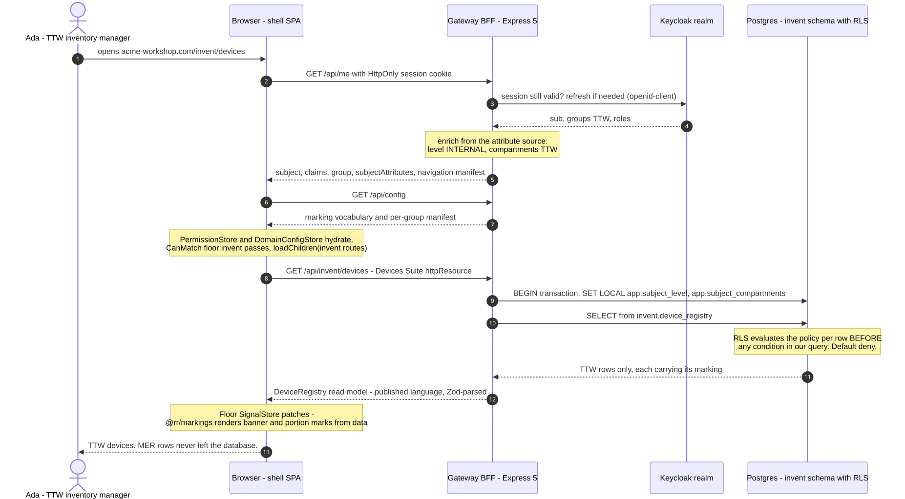
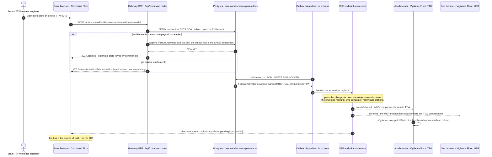
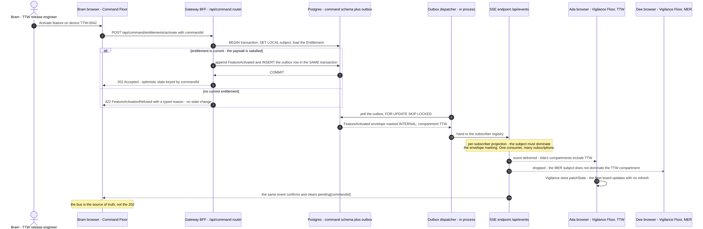

# V4 — Runtime / Dynamic

**Created:** 2026-09-03 | **Last updated:** 2026-09-03 | **Author:** Trestle (Architect) under Axium | **Status:** `exploratory`

**Diagram status:** `hypothesis` — leans **AW-D6 A** (`SET LOCAL` subject transport), **AW-D3 A** (outbox + in-process dispatcher + SSE), **AW-D4 A** (entitlement policy in the Command BFF), **DA-D17 A** (BFF cookie session). **Notation:** Mermaid `sequenceDiagram` (UML 2.5 sequence semantics: lifelines, synchronous and asynchronous messages, combined fragment `alt`, lost message `x`).

**Conforms to viewpoint:** VP-4 Runtime (see [`README.md`](README.md) §4).

## Purpose

Two traces are enough to expose every seam the architecture has: **one screen** (identity → entitlement → read model → markings) and **one event crossing a context boundary** (command → outbox → fan-out → projection). Everything else in ACME Workshop is a repetition of one of these two shapes. This view is also the AD's proof obligation for [V5](V5-information-security.md): an enforcement point drawn there but absent here is not implemented.

## Stakeholders and concerns framed

| Stakeholder | Concern this view answers |
|---|---|
| Island development team | What the request actually does, in order, and where each of their pieces sits in it. |
| Security authority | Where the subject is constructed, where the row filter runs, and that the browser is never the enforcement point. |
| Graham / lead front-end engineer | Where the store, the resource and the markings component sit in a real trace; where optimistic state is confirmed. |
| Platform operations | Which hops exist per page load and per event; what a lost SSE connection costs. |

## 4a — One screen: `acme-workshop.com/invent/devices` as Ada (TTW)

**What the trace proves.** Nothing on this path knows the customer's name — it knows **claims**, **configuration** and **labels** (`practical_picture_v0.md` §2). The gateway never queries without a subject (fail-closed). The browser never holds a token. The UI never decides access; it renders markings and absent-not-disabled navigation. The proof that closes slice S2 is exactly this trace run twice: Ada (`TTW`) and Dee (`MER`) hit the same endpoint and see disjoint rows.

**The one branch not drawn:** if `SET LOCAL` is omitted, RLS default-deny returns **zero rows**, not all rows. That is the guarantee the database layer exists to give and the reason it is not replaced by the PDP (R5 §4.1).

## 4b — One cross-context event: `FeatureActivated` from Command to Vigilance

**What the trace proves.**

1. **The transactional outbox.** The aggregate change and the outbox row commit in one transaction, so a published event can never outrun its commit (R1 §5.3; AW-D3).
2. **The paywall is a rule, not a screen.** `ActivateFeature` is refused by an entitlement policy with a *typed* reason — variation-ladder rung 3, evaluated server-side; the UI only renders the outcome (AW-D4).
3. **The fan-out re-enforces.** The SSE endpoint runs **one** consumer for the deployment and filters **per subscriber**; a subscriber who may not read the row never receives its event. This is where R3 §5.7's "authorize per subscriber" and R5's dominance rule meet, and it is slice S3's proof: *Dee's connection never receives a TTW event.*
4. **The bus is the source of truth, not the HTTP 202.** Optimistic state keyed by `commandId` is cleared by the event, not by the response.

## Legend (both diagrams)

| Notation | Meaning |
|---|---|
| Solid arrow `->>` | A synchronous request. |
| Dashed arrow `-->>` | A response or an asynchronous delivery. |
| Arrow ending in `x` | A **lost message**: the event was produced but deliberately not delivered to that subscriber. |
| `alt` / `else` frame | A combined fragment — mutually exclusive outcomes of the same interaction. |
| Yellow note | An invariant or an enforcement fact, not a message. |
| `autonumber` | Step numbers are for citation in review, not a protocol. |

**Assumed for illustration:** the endpoint paths (`/api/command/entitlements/activate`), the device identifier (`TTW-0042`) and the HTTP status codes are plausible instances, not doctrine — the packets fix the *shape* (one router per Floor, `commandId` on every command, typed refusal) and leave the wire detail to the build.

## Elements

| Element | Responsibility | Doctrine source |
|---|---|---|
| `/api/me` enrichment | Turns a small token into a subject: level, compartments, need-to-know groups, roles. | `practical_picture_v0.md` §4; R4 §4.6 |
| `PermissionStore` / `DomainConfigStore` | Root-provided SignalStores holding claims and the per-group manifest and marking vocabulary. | R4 §4.6; R6 §4.3 |
| `CanMatch('floor:invent')` | Route gating **as UX** — the Floor's chunk is not even matched without the claim. Not a security control. | R7 §5.3; R4 §4.6 |
| `SET LOCAL app.subject_*` | Per-request, per-transaction subject transport into RLS. | AW-D6; R5 §4.1 |
| Postgres RLS | The line that cannot be forgotten: policy evaluated per row before any user condition; default-deny. | R5 §4.1 |
| Outbox + in-process dispatcher | Atomic publish; `FOR UPDATE SKIP LOCKED` polling. | AW-D3; R3 |
| SSE endpoint with per-subscriber projection | One connection per browser owned by the shell; one consumer per deployment; filtering per subject. | R3 §5.7; `slice_decomposition_v0.md` S3 |
| `@rr/markings` | Renders banner and portion marks from a `Marking` value object plus a runtime vocabulary. Display only — never enforcement. | R6 §4.3; R5 §4.1 |

## Correspondences

- **CR-3** — every enforcement point in [V5](V5-information-security.md) appears in one of these two traces: gateway (4a step 3, 4b step 3), RLS (4a step 13), event-gateway filter (4b), UI display (4a step 20). The PDP does **not** appear, because it is deferred (DA-D16 lean C) — that absence is deliberate and recorded.
- **CR-5** — `FeatureActivated` is a published-language event on a [V3](V3-context-map.md) edge.
- **CR-1** — every lifeline is a container in [V2](V2-container.md).

## Status and redraw triggers

`hypothesis`. Redraw when: **AW-D3** rules the transport (a broker adds a hop and changes replay semantics); **DA-D16** adopts a PDP (a lifeline appears between gateway and Postgres); **AW-D6** is ruled otherwise (a per-tenant DB role changes step 12 entirely); or slices S2/S3 land and these traces become *implementation truth*.
