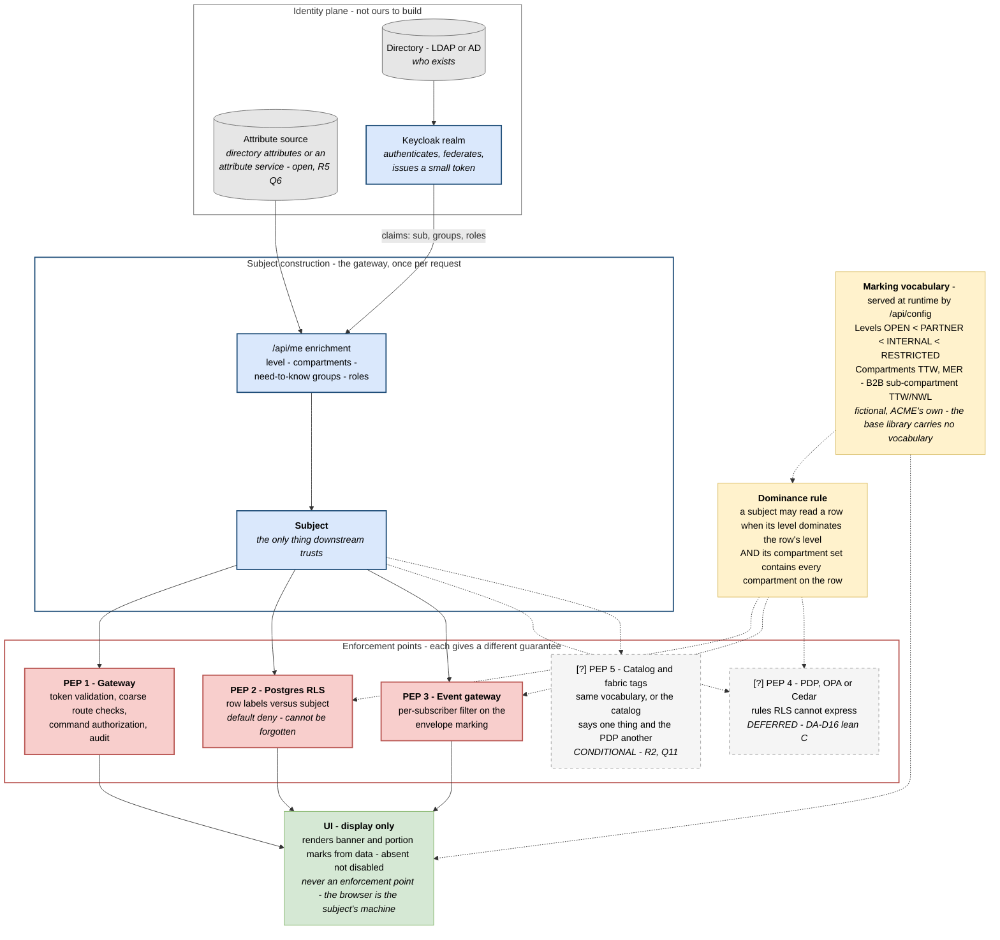

# V5 — Information & Security

**Created:** 2026-09-03 | **Last updated:** 2026-09-03 | **Author:** Trestle (Architect) under Axium | **Status:** `exploratory`

**Diagram status:** `hypothesis` — leans **DA-D6 D** (RBAC now, ABAC/labels designed in from day one), **DA-D16 C** (RLS only for v1; the PDP seam designed, the engine deferred), **AW-D9 A** (for ACME, a group is a compartment *and* an organisational unit, by construction). **Notation:** Mermaid flowchart; an enforcement-chain model kind (PEP/PDP placement in the sense of NIST SP 800-207, as tabulated in R4/R5).

**Conforms to viewpoint:** VP-5 Information & Security (see [`README.md`](README.md) §4).

**Marking discipline.** Every level and compartment on this page is **fictional and ACME's own** — `OPEN < PARTNER < INTERNAL < RESTRICTED`, compartments `TTW` / `MER`, B2B sub-compartment `TTW/NWL`. No real marking, caveat, programme, host or address appears anywhere in this AD, by the packet's binding convention.

## Purpose

Answer three questions that are usually answered by hand-waving: **where does the subject come from**, **which layer guarantees what**, and **who may never be trusted**. This is the view the security and accreditation authority reads first, and the view that makes "each user group has data privileges unique to it" (Graham's requirement 3) into a mechanism rather than an intention.

## Stakeholders and concerns framed

| Stakeholder | Concern this view answers |
|---|---|
| Security / accreditation authority | Where the policy decision and the policy enforcement points sit; what survives an application bug; what the UI can and cannot be trusted for. |
| Island development team | That they never write an identity check in a component, and where a new rule belongs. |
| Manufacturer tenants (persona) | That another manufacturer's data is not merely hidden — it never leaves the database. |
| Graham / lead front-end engineer | That the front end owns exactly four things (hydrate, gate as UX, render markings, plumb session expiry) and enforces none of them. |
| Platform operations | Which stores hold identity, and which are ours to run. |

## Diagram

## Legend

| Notation | Meaning |
|---|---|
| Cylinder, grey | A **store** in the identity plane. R4's discipline: four stores, not one — do not build a users table. |
| Blue box | Subject construction: the only place a token becomes attributes. |
| Red box, heavy border | A **live enforcement point** in v0. |
| Grey box, dashed | A **deferred or conditional** enforcement point. Dashed carries the same meaning as `[?]` in the C4 views. |
| Yellow box | **Data**, not code: the marking vocabulary and the rule that reads it. Both are served at runtime; the base library ships neither. |
| Green box | Display. It renders; it never decides. |
| Dotted edge | An influence that is configuration or deferred, not a live call path. |

**Assumed for illustration:** the attribute source is drawn as distinct from the directory because R5 Q6 is open — it may turn out to be the directory itself; and the levels/compartments are invented for the reference application, not proposed for the real programme (Q6 decides the real vocabulary).

## What each layer can honestly guarantee

Adapted from R5 §4.1 — the point of the table is that the layers are **not interchangeable**, so removing one is never an optimisation.

| Layer | Guarantees | Cannot guarantee |
|---|---|---|
| **UI** (`@rr/markings`, `CanMatch`) | Correct marking display; absent-not-disabled navigation; no leak in presentation of data it already legitimately holds. | Anything at all about access. The bundle, `localStorage`, a decoded token, a guard and a hidden element are all the subject's machine. |
| **Gateway BFF** (PEP 1) | Token validation, session, subject construction, coarse route checks, command authorization, audit. | Anything needing the object's label — the gateway does not have the row. |
| **Postgres RLS** (PEP 2) | The last line: policy evaluated per row *before* any user condition; survives an application bug, a forgotten `WHERE`, an ad-hoc query. Default deny. | Rich rules (time, purpose, citizenship) get awkward in SQL; cross-store consistency is not the store's job. |
| **Event gateway** (PEP 3) | A subscriber who may not read the row never receives its event: the fan-out re-enforces rather than trusting the producer. | Nothing about data a subscriber fetches by other means; it is not a substitute for PEP 2. |
| **`[?]` PDP** (PEP 4, deferred) | Expressive, testable, single-source policy for the rules RLS cannot express. | Only as good as the call site; a code path that skips the call is an open door — which is why PEP 2 stays on. |
| **`[?]` Catalog / fabric tags** (PEP 5, conditional) | Discovery-time governance under the *same* vocabulary. | Nothing, if its vocabulary drifts from the enforcement vocabulary — then the catalog says one thing and the enforcer another (R2 takeaway 3). |

**Defense in two depths** is the standing rule: the decision you can reason about (PDP, when it exists) at the service boundary, and the decision that cannot be forgotten (RLS) in the store.

## Elements

| Element | Responsibility | Doctrine source |
|---|---|---|
| Directory (LDAP/AD) | Who exists. | R4 §4.5; `practical_picture_v0.md` §4 |
| Attribute source | Clearance / compartments / need-to-know groups / citizenship. Distinct from the directory or not — **open** (R5 Q6). | `practical_picture_v0.md` §7 |
| Keycloak | Authenticates, federates, issues a *small* token; FGAP V2 scopes delegated admin server-side so the Front Desk Office cannot escalate. | R4 §4.3, §4.5; DA-D5, DA-D7 |
| `/api/me` enrichment | Turns the small token into the subject. The one enrichment point. | `practical_picture_v0.md` §4 |
| Subject | The per-request value everything downstream keys on. The BFF never queries without one. | `practical_picture_v0.md` §2, §4 |
| Marking vocabulary | Served at runtime by `/api/config`; ACME's own levels and compartments; `@rr/markings` carries none of it. On a second security domain the *same component* resolves a different vocabulary. | R6 §4.3; `acme-workshop-01-design-packet/README.md` §Marking vocabulary |
| Dominance rule | Level dominance **and** compartment containment — the R5 rule, demonstrated on invented data. | `acme-workshop-01-design-packet/README.md` §Marking vocabulary; R5 |
| Delegated group administration | An Office existing only for holders of `group-admin:<gid>`, calling Keycloak's admin API scoped by FGAP V2. Enforcement is server-side; the Office is UX. | `practical_picture_v0.md` §4; DA-D7 |

## Correspondences

- **CR-3** — PEP 1, PEP 2 and PEP 3 all appear in the [V4](V4-runtime-dynamic.md) traces. PEP 4 and PEP 5 appear in no runtime view **because they do not exist yet**; when either is adopted, V4 gains a lifeline in the same pass.
- **CR-12** — the vocabulary drawn here is the *same* vocabulary used on event envelopes in V4b, on rows in V2's Postgres, and in the second security domain in [V7](V7-deployment-evolution.md). One vocabulary everywhere, or the enforcement points disagree.
- **CR-9** — group names appear here only as *claims and compartments*, never as code elements ([V6](V6-development-module.md)) or route segments ([V8](V8-tier-information-architecture.md)).

## Open concerns recorded by this view

- **OC-1 (register Q3):** is a *group* a **compartment** on the data or an **organisational unit**? ACME rules "both, by construction" (AW-D9) for the showcase; the real programme must decide, and the answer changes whether dominance or tenancy is the primary mechanism.
- **OC-2 (new, found while drawing V4b):** does a manufacturer compartment **subsume** its B2B sub-compartment — i.e. does Ada (`TTW`) see Northwind's `TTW/NWL` rows? The corpus states Fay sees only `TTW/NWL`, and is silent on the reverse direction. This must be ruled before slice S3, because the SSE per-subscriber filter needs it as a predicate.
- **OC-3 (register Q6):** which marking vocabulary governs the real programme, and can a public schema be agreed so the base component is stable across the fence.

## Status and redraw triggers

`hypothesis`. Redraw when: **Q3** or **Q6** is answered; **DA-D16** adopts a PDP (PEP 4 turns solid and gains a V4 lifeline); a catalog is mandated (PEP 5 turns solid); or **OC-2** is ruled.
