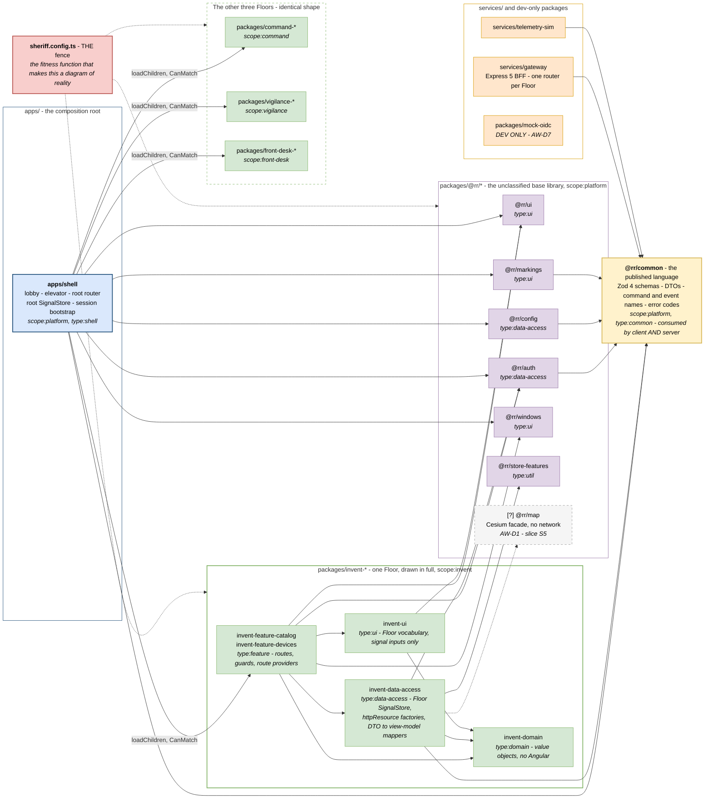

# V6 — Development / Module

**Created:** 2026-09-03 | **Last updated:** 2026-09-03 | **Author:** Trestle (Architect) under Axium | **Status:** `exploratory`

**Diagram status:** `hypothesis` — leans **DA-D4 A** (one monorepo, `apps/` + `packages/` + `services/`), **DA-D2 A** (Floors as library sets), **DA-D12 / DA-D13 A** (Sheriff), **DA-D14 A** (Zod 4 as published language), **AW-D1 A** (`@rr/map` façade), **AW-D7 A** (in-repo mock OIDC). **Notation:** Mermaid flowchart; a module-dependency model kind (allowed edges only).

**Conforms to viewpoint:** VP-6 Development (see [`README.md`](README.md) §4).

## Purpose

Show the repository as an architecture rather than a folder list, and show **which edges are permitted**. Only allowed dependencies are drawn: the forbidden ones are in the legend, because a diagram that draws a forbidden edge to cross it out is a diagram somebody will copy.

This is the view that carries Graham's requirements 1 and 2 — *scalable* and *modular, no copy-paste* — into something a build can check. A new Floor is a new library set, a route and a BFF router; the shell is untouched.

## Stakeholders and concerns framed

| Stakeholder | Concern this view answers |
|---|---|
| Island development team | What may I import, where does my code go, what is the public surface of a package. |
| Graham / lead front-end engineer | Where the unclassified base ends and a Floor begins; where state lives; how a Floor stays promotable. |
| Platform operations / build | What the fence is and what fails the build. |
| Leadership | Why adding a customer or a capability does not multiply the codebase. |

## Diagram

## Legend

| Notation | Meaning |
|---|---|
| Solid arrow | An **allowed** build-time dependency. Every arrow on this diagram is permitted by the Sheriff tag matrix. |
| Dotted arrow from `sheriff.config.ts` | The fence **verifying** a region — not a dependency. |
| Dotted arrow to `[?] @rr/map` | A dependency that exists only once slice S5 lands (AW-D1). |
| Purple | `scope:platform` — the unclassified base library. |
| Green | A Floor scope. Invent is drawn in full; the other three have the identical shape and are collapsed. |
| Yellow, heavy border | `@rr/common`, the published language — the one package consumed by browser **and** server. |
| Orange | Services and dev-only packages. |
| Red | The fitness function. |
| Italic `scope:` / `type:` | The Sheriff tags that make the rule machine-checkable. |

**Forbidden edges — deliberately absent from the diagram, enforced by Sheriff:**

| # | Forbidden | Why |
|---|---|---|
| F-1 | **Floor → Floor** (`scope:invent` → `scope:command`, any direction) | This is the fence that makes a Floor promotable to its own app or remote by a build-configuration change instead of a refactor. Cross-Floor needs go through `@rr/common`, the BFF, or the shell's root store. |
| F-2 | **`type:ui` → `type:data-access` or `type:feature`** | A `ui` library's only knowledge is its inputs and the design system. This is a *dependency rule*, not a component taxonomy — there are no "smart/dumb components". |
| F-3 | **anything → `apps/shell`** | The shell is the composition root. Nothing composes the composer. |
| F-4 | **`scope:platform` → any Floor scope** | The base library must stay unclassified and domain-free: no domain enums, no group names, no marking strings. |
| F-5 | **`type:domain` → the Angular runtime** | Domain types must survive a framework re-pin (DR-04) untouched. |
| F-6 | **deep imports past a package's `index.ts`** | The public API is the entry point; internals are unreachable. Node's `exports` map is the same rule at the package boundary. |

Rule with no arrow to draw: **a generic Office is promoted into `@rr/*` only when a second Floor needs it** — the salvage rule, not speculation.

## Elements

| Element | Responsibility | Doctrine source |
|---|---|---|
| `apps/shell` | Composition root: lobby, elevator, root router, session bootstrap, root SignalStore (identity, claims, acting-as group, manifest, global time/selection). | `practical_picture_v0.md` §1; R7 §4.2, §5.3 |
| `@rr/ui` | AstroUXDS façade plus RR tokens; signal inputs only. Designed as a *replaceable* façade regardless of the AstroUXDS maintenance question. | DA-D11; R7 §4.2 |
| `@rr/auth` | `/api/me` resource, `PermissionStore`, `CanMatchFn` factories, session-expiry interceptor. | R4 §4.6 |
| `@rr/config` | Manifest, flags and tokens through `/api/config`; `DomainConfigStore`. | `practical_picture_v0.md` §1, §3; R6 §4.3 |
| `@rr/markings` | Banner, portion mark and chip driven by a `Marking` value object plus a **runtime** vocabulary. Ships no vocabulary. | R6 §4.3; R5 |
| `@rr/windows` | The utility-window host — the Office host mechanism, recast not copied. | DA-D10; AW-D10 |
| `@rr/store-features` | Shared `signalStoreFeature`s: `withResource`, `withMarkings`, `withEventStream`. | `practical_picture_v0.md` §1 |
| `[?] @rr/map` | Cesium façade with a bundled local base layer and **no network**; keeps MapLibre possible. | AW-D1; slice S5 |
| `@rr/common` | The published language: one module per context, Zod 4 schemas, events as discriminated unions with a `marking` on every envelope, `commandId` on every command; `z.toJSONSchema()` emits the gateway's OpenAPI. | `acme-workshop-01-design-packet/domain_model_v0.md`; DA-D14 |
| `invent-domain / -data-access / -feature-* / -ui` | The Floor shape, replicated for Command, Vigilance and Front Desk: types and value objects; the Floor SignalStore, `httpResource` factories and DTO→view-model mappers (the client-side ACL); routed Suites and Offices; Floor-vocabulary presentational wrappers. | `practical_picture_v0.md` §1; R7 §4.2, §4.3 |
| `services/gateway` | Express 5 BFF: `openid-client`, Postgres sessions, `/api/me`, `/api/config`, one router per Floor, the SSE endpoint, the outbox relay. | `practical_picture_v0.md` §1; DA-D9, DA-D17 |
| `services/telemetry-sim` | The simulated device feed. | AW-D2 |
| `packages/mock-oidc` | Dev/CI-only OIDC stub with the same claims shape. | AW-D7 |
| `sheriff.config.ts` | **The fence.** In Ford/Richards vocabulary a *fitness function*: an automated, objective check that the modularity characteristic still holds. Listed with the others in [V7](V7-deployment-evolution.md). | DA-D12, DA-D13; R8 §6.3; slice S0 proof |

## Correspondences

- **CR-2** — one Floor scope ↔ one bounded context ([V3](V3-context-map.md)) ↔ one `/api/<floor>` router ([V2](V2-container.md)) ↔ one route prefix ([V8](V8-tier-information-architecture.md)).
- **CR-7** — every drawn edge is permitted by the Sheriff tag matrix; every forbidden edge above is expressible as a Sheriff rule. An architecture rule that cannot be written as a fitness function is a wish, not a rule.
- **CR-8** — the second security-domain deployment adds **no** element to this view. If it ever would, the variation is on the wrong rung of the Boundary Test ladder.
- **CR-10** — every element cites doctrine above; `@rr/map` is the only element whose existence is conditional, and it is dashed.

## Status and redraw triggers

`hypothesis`. Redraw when: **DA-D2** promotes a Floor to its own app (the Floor's box moves from `packages/` to `apps/`); **DA-D11** replaces AstroUXDS behind the façade; **DA-D12/D13** rules a different fence tool; slice **S0** lands, at which point this view becomes *implementation truth* and the tree in `practical_picture_v0.md` §1 stops being a proposal.
