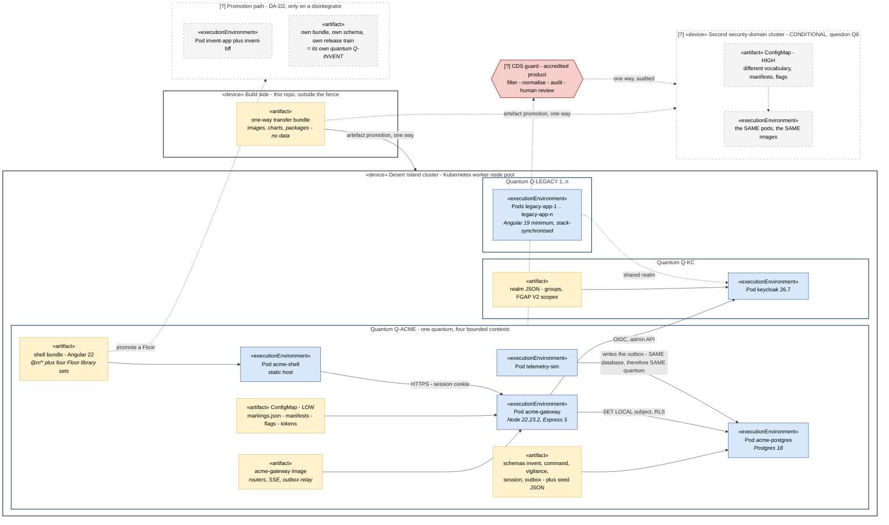

# V7 — Deployment & Evolution

**Created:** 2026-09-03 | **Last updated:** 2026-09-03 | **Author:** Trestle (Architect) under Axium | **Status:** `exploratory`

**Diagram status:** `hypothesis` — leans **DA-D2 A** (one quantum today, promotion designed), **AW-D8 A** (realm as code), **AW-D11 A** (local gate), **AW-D12 A** (seed JSON). Conditional on **Q8** (second security domain). **Notation:** Mermaid flowchart using **UML 2.5 deployment-diagram stereotypes** — `«device»`, `«executionEnvironment»`, `«artifact»`.

**Conforms to viewpoint:** VP-7 Deployment & Evolution (see [`README.md`](README.md) §4).

## Purpose

Say **what runs where**, and — the part most deployment diagrams omit — **what the coupling actually is**. This is where the evolutionary-architecture vocabulary earns its keep: quanta are drawn as boundaries, the reasons a Floor may leave the quantum are named and sourced, and the checks that keep the whole thing honest are listed as fitness functions rather than assumed.

The sentence this view exists to make undeniable: **four bounded contexts, one quantum, and that is a legitimate design** — because the fences of [V6](V6-development-module.md) are machine-enforced. Without those fences, the same picture would be a Big Ball of Mud with subheadings.

## Stakeholders and concerns framed

| Stakeholder | Concern this view answers |
|---|---|
| Platform operations | What pods exist, what artefacts they need, what must ride the transfer bundle. |
| Security / accreditation authority | The build-once / deploy-per-domain pattern; that no data path crosses a domain except through an accredited guard; that the artefacts are identical and only configuration differs. |
| Leadership | Why release 1 is small, and what would make it bigger — with the trigger conditions written down in advance. |
| Island development team | That "we will enforce it in CI" is a list of named checks, not a promise. |
| Legacy Island estate owners | Where their applications sit relative to ACME, and why stack synchronisation is a standing constraint. |

## Diagram

## Legend

| Notation | Meaning |
|---|---|
| `«device»` | A physical or virtual computational resource — here, a cluster node pool or the build side of the fence. UML 2.5 stereotype. |
| `«executionEnvironment»` | Software that hosts other software: a pod / container runtime. UML 2.5 stereotype. |
| `«artifact»` | A concrete deployable file — an image, a bundle, a schema set, a ConfigMap, a realm export. UML 2.5 stereotype. Arrows from an artefact to an execution environment are UML **deployment** relationships. |
| Blue-bordered box labelled `Quantum …` | An **architecture quantum** boundary (Ford/Richards): independently deployable, functionally cohesive, held together by static coupling and synchronous dynamic coupling. |
| Dashed enclosure / dashed edge | Conditional or future — carries its fork or question id. |
| Red hexagon | The cross-domain guard: an accredited product, not our code. |

**Assumed for illustration:** the shell is served by a dedicated static-host pod (V2 notes the alternative); pod names, the node-pool shape and the ConfigMap file names are plausible instances, not doctrine. **No real hostname, address, domain name, programme name or marking appears** — the high side is named only "second security domain".

## Elements

| Element | Responsibility | Doctrine source |
|---|---|---|
| Build side `«device»` | Builds once, outside the fence; emits a one-way transfer bundle of artefacts and no data. | R6 §4.3; `canonical/isolated_network_constraints.md` |
| `Pod acme-shell` + shell bundle | Serves the single browser deployable containing `@rr/*` and all four Floor library sets. | V2; DA-D2 lean A |
| `Pod acme-gateway` + image | The BFF: per-Floor routers, `/api/me`, `/api/config`, SSE, outbox relay, session store. | `practical_picture_v0.md` §1 |
| `Pod acme-postgres` + schema artefact | One instance, schema per bounded context, RLS, outbox, sessions, committed seed. | slices S0, S2; AW-D12 |
| `Pod telemetry-sim` | Writes the ACME outbox — **a separate pod inside the same quantum**, because shared data is static coupling. | AW-D2; R8 §6.2 |
| `ConfigMap — LOW` | The per-deployment data: marking vocabulary, per-group manifests, flags, tokens. The *only* thing that differs between security domains. | R6 §4.3 |
| `Pod keycloak` + realm JSON | Its own quantum: own data, own availability and security characteristics; realm as code with FGAP V2 scopes. | AW-D8; R4 §4.5 |
| `Pods legacy-app-1..n` | The Legacy Island estate: their own quanta, sharing only the cluster and the realm. Stack synchronisation is a standing structural constraint (ADR-005). | `canonical/two_island_model.md` |
| `[?]` CDS guard + second domain | Same images, different ConfigMap; one-way artefact promotion; data only through the guard. Conditional on Q8. | R6 §4.3; register Q8 |
| `[?]` Promotion path | A Floor leaving the quantum: own bundle, own BFF, own schema, own release train. | DA-D2; R8 §6.1 |

## Quantum ledger

| Quantum | Contents | Static coupling that defines it | Architecture characteristics it is scoped to |
|---|---|---|---|
| **Q-ACME** | shell, gateway, Postgres, telemetry-sim | One Postgres instance; one `@rr/common` version; one Angular major | Availability of the whole Building; tenant isolation; isolated-network operability |
| **Q-KC** | Keycloak + its store | Its own database | Authentication availability; credential security; audit |
| **Q-LEGACY 1..n** | Legacy Island applications | Their own stores | Their own; coupled to ACME only by the shared Angular/Node majors (ADR-005) |
| **`[?]` Q-INVENT** | a promoted Invent app + BFF + schema | its own data | Only exists if a disintegrator applies |
| **`[?]` Q-ACME-HIGH** | the same artefacts on the second domain | its own everything | Different accreditation — the textbook "one context, many quanta" case |

**The rule for promotion (R8 §6.1 disintegrators, DA-D2):** a Floor becomes its own quantum for **cadence** (it must release on a different rhythm), **team** (built outside the release train), **compartment** (installed where the rest of the Building is not), **security** (different accreditation), or **static coupling that cannot be shared** (a different Angular major — the two-island case). *"It got big" is not on the list.* The integrators pulling the other way: shared transactions, shared workflow, shared code that would need versioning across quanta, and data relationships.

## Fitness functions

An architecture rule that is not automatically checked is a drawing. These are ACME Workshop's checks, each tied to the characteristic it protects and the slice that introduces it.

| # | Fitness function | Characteristic protected | Where it runs | Source |
|---|---|---|---|---|
| **FF-1** | **Sheriff fences** — a cross-Floor import fails the build | Modularity; context isolation; Floor promotability | Local gate, every commit | DA-D12/D13; R8 §6.3; slice S0 proof |
| **FF-2** | **`scripts/local-ci.sh`** — lint, typecheck, Sheriff, Vitest, build, corpus check, as one gate | All of the above, continuously; merge-readiness | Pre-merge, every PR | AW-D11; slice S0 |
| **FF-3** | **`corpus-graph check`** — frontmatter, dangling edges, area vocabulary | Doctrine integrity: the docs corpus is an architecture artefact and drifts like code | Local gate | `AGENTS.md`; CORPUS-GRAPH-01 |
| **FF-4** | **RLS default-deny test** — Ada (`TTW`) and Dee (`MER`) hit the same endpoint and see disjoint rows; a query without `SET LOCAL` returns **zero** rows | Confidentiality; tenant isolation | Vitest against a real Postgres | Slice S2 proof; AW-D6; R5 §4.1 |
| **FF-5** | **No-network page-load test** — the map Office loads with the network disabled | Isolated-network operability (no CDN, no ion token, no phone-home) | Slice S5 proof | AW-D1; the B9 browser-binary finding |
| **FF-6** | **Zero-code-change tenant test** — a third fictional manufacturer added by seed + realm + manifest gets a working Building | Extensibility; "modular, no copy-paste" (Graham's requirements 1–2) | Slice S4 proof | `practical_picture_v0.md` §3, §6 step 3 |
| **FF-7** | **Cross-subscriber leak test** — Dee's SSE connection never receives a TTW event | Confidentiality at the fan-out (PEP 3): hidden rows must not leak via events | Slice S3 proof | R3 §5.7; V5 |
| **FF-8** | **Non-escalating delegated admin** — Cy adds a member to TTW and cannot see or touch MER | Least privilege; delegation containment | Slice S7 proof | DA-D7; R4 §4.3 |

## Correspondences

- **CR-1 / CR-11** — every container in [V2](V2-container.md) has exactly one `«artifact»` and one `«executionEnvironment»` here, except `mock-oidc`, which is dev-only and deliberately absent.
- **CR-8** — the high-side deployment reuses the *same* artefacts; the only difference is a ConfigMap. If a code element ever appears on one side only, the Boundary Test has been violated and the variation is on the wrong rung.
- **CR-7** — every forbidden edge in [V6](V6-development-module.md) is FF-1's subject matter.
- **CR-12** — the ConfigMap on each side carries the marking vocabulary of [V5](V5-information-security.md); one vocabulary per domain, one component on both sides.

## Status and redraw triggers

`hypothesis`. Redraw when: **Q8** is answered (the high side becomes solid or is deleted); **DA-D2** promotes a Floor (a new quantum box appears); **AW-D3** adopts Kafka (a broker quantum appears, and the outbox relay leaves the gateway); **ADR-005** granularity is settled (exact versions vs same-major changes what "stack-synchronised" means on the Legacy pods); or slice **S0** lands and the low side becomes *implementation truth*.
