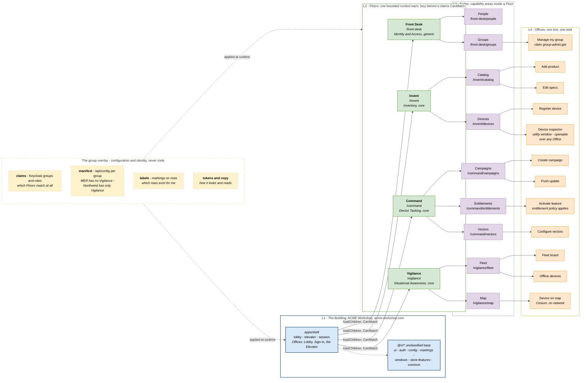

# V8 — Tier / Information-Architecture

**Created:** 2026-09-03 | **Last updated:** 2026-09-03 | **Author:** Trestle (Architect) under Axium | **Status:** `exploratory`

**Diagram status:** `hypothesis` — leans **DA-D1 A** (Floors are bounded contexts, not groups), **DA-D2 A**, **DA-D3 A** (the group is a claim, not a URL segment), **DA-D10 A** (`@rr/windows` as the Office host). **Notation:** Mermaid flowchart; an information-architecture hierarchy model kind with a runtime overlay.

**Conforms to viewpoint:** VP-8 Tier / Information Architecture (see [`README.md`](README.md) §4).

**Supersedes** `diagrams/02-tier-model-building-floors.md` — same picture, ACME names and real routes, and the overlay's four sources made explicit.

## Purpose

Answer Graham's original question — *do groups live on the Floors, or do functions?* — with a picture. The tier hierarchy has **two axes** hiding inside it, and drawing them as one thing is the mistake:

- the **structural axis**: what the code and the URL are organised by — capabilities, i.e. bounded contexts;
- the **access axis**: who may enter, what they see, how it is tailored — identity and configuration, applied at runtime.

**A group is not a tier.** *Tick-Tock Watchworks* is never a Floor; *Invent* is. Northwind Logistics does not get a branch of the tree — it gets a manifest.

## Stakeholders and concerns framed

| Stakeholder | Concern this view answers |
|---|---|
| Graham / lead front-end engineer | Where the Building/Floor/Suite/Office model lands in routes, code and lazy boundaries. |
| Island development team | Which URL a Suite owns, and whether an Office is a route leaf, an embedded block, or a window. |
| Manufacturer tenants (persona) | Why they see a different application without a different application existing. |
| Leadership | Why onboarding a customer is a configuration change. |
| Security authority | That entitlement is expressed as *absent, not disabled*, and that no group name appears in any URL, link or log. |

## Diagram

## Legend

| Notation | Meaning |
|---|---|
| Blue | **L1 — the Building.** The platform: shell, lobby, elevator, session, and the unclassified base library. |
| Green, heavy border | **L2 — a Floor.** One bounded context made visible; a lazily loaded, lint-fenced library set behind a claims `CanMatch`; one BFF router. |
| Purple | **L3 — a Suite.** A capability area inside a Floor, owning a child route set. |
| Orange | **L4 — an Office.** One tool for one task: a routed leaf, an embedded `@defer` block, or a utility window. |
| Yellow, dashed | **The group overlay** — configuration and identity applied at runtime. Never code, never a tier. |
| Solid arrow | Containment plus the lazy boundary that goes with it. |
| Dotted arrow | Applied at runtime, not a build-time dependency. |

**Assumed for illustration:** the assignment of individual Offices to Suites (e.g. *Activate feature* under Entitlements rather than Campaigns) is the architect's reading of the ACME README's Suite/Office lists, not stated doctrine; the *People* Suite has no v0 Office named in the corpus and is drawn without one.

## Elements

| Element | Responsibility | Doctrine source |
|---|---|---|
| **L1 ACME Workshop** (`acme-workshop.com/`) | Lobby listing only the Floors this subject may enter, the elevator, session, the root store, and the unclassified base. Owned by the platform team. | `tier_model_exploration_v0.md` §2; `acme-workshop-01-design-packet/README.md` |
| **L2 Front Desk** (`/front-desk`) | Identity & Access; delegated group administration. Generic subdomain. | ACME README §The Building |
| **L2 Invent** (`/invent`) | Inventory: products, specs, the device registry. Core, and upstream of the map. | same |
| **L2 Command** (`/command`) | Device tasking: campaigns, distribution vectors, entitlements. Core. | same |
| **L2 Vigilance** (`/vigilance`) | Situational awareness: fleet, positions, health, offline devices. Core, mostly projections. | same |
| **L3 Suites** | Catalog · Devices · Campaigns · Vectors · Entitlements · Fleet · Map · People · Groups. A child route set each; `loadChildren` only when heavy or separately entitled. | ACME README; R7 §5.3 |
| **L4 Offices** | Add product · Edit specs · Register device · Device inspector (window) · Create campaign · Push update · Activate feature · Configure vectors · Fleet board · Device on map · Offline devices · Manage my group. | ACME README §The Building |
| **Device inspector** | The Office that proves the model: a *tool*, hostable as a utility window over any Office, not a page. | AW-D10; DA-D10 |
| **Overlay — claims** | Keycloak groups and roles decide which Floors match at all. `CanMatch` falls through; an unentitled Floor is **absent**, not disabled. | R4 §4.6; R7 §4.5 |
| **Overlay — manifest** | `/api/config` per group: MER has no Vigilance; Northwind has *only* Vigilance. The rung-4 variation. | ACME README; `context_boundary_test_v0.md` Part 3 rung 4 |
| **Overlay — labels** | Markings on rows decide which rows exist for this subject; enforced before the browser sees anything. | V5; R5 |
| **Overlay — tokens and copy** | Theme tokens and copy overrides with a group dimension. | `practical_picture_v0.md` §3 |

## URL design (DA-D3)

`acme-workshop.com/<floor>/<suite>/<office>` — **the group is a claim, never a path segment.** A group prefix (`/g/<group>/…`) is added only if multi-group membership turns out to be real (register **Q2**), and then on the Building, never on a Floor, and treated by every guard as a claim to verify rather than a fact. A group in the URL is a group in every link, log and browser history — and it invites somebody to make `/g/<group>` a code boundary, which is the failure this whole view exists to prevent.

## The variation ladder, shown

| Rung | ACME's demonstration | Where it lives |
|---|---|---|
| 1 — different data | MER's products carry `fitness.*` specs, TTW's do not | The Product attribute bag; no schema change |
| 2 — different steps | TTW approves a campaign once; MER needs two sign-offs plus a comment | Process definition as data (AW-D5) |
| 3 — different rules | Feature activation refused without a current entitlement | Entitlement policy (AW-D4) |
| 4 — different UI | MER has no Vigilance Floor; Northwind has only Vigilance | The manifest |
| 5 — different sub-capability | The Entitlements Suite exists for manufacturers, absent for B2B customers | Claim-entitled Suite |
| 6 — different Floor | **none in v0 — and that is the point.** Four contexts, four Floors, every tenant variation below rung 6 | — |

## Correspondences

- **CR-2** — every Floor here is exactly one bounded context ([V3](V3-context-map.md)), one library set ([V6](V6-development-module.md)), one BFF router ([V2](V2-container.md)).
- **CR-4** — Floor names are exactly the four in the ACME lexicon; *Invent* is the inventory Floor and nothing else; *Command* capitalised is the Floor; what a Campaign pushes to a device is an **instruction**; a device's reported state is its **health**.
- **CR-9** — no group name appears as a node, a route segment or a code element. Groups enter only through the dashed overlay.
- **Supersession** — supersedes `diagrams/02-tier-model-building-floors.md`.

## Status and redraw triggers

`hypothesis`. Redraw when: **Q1** renames or re-cuts the contexts; **Q2** makes multi-group membership real (a group switcher and possibly a URL prefix appear); a Boundary Test run mints a fifth Floor; or slices S1–S7 land and the Suite/Office set becomes *implementation truth*.
