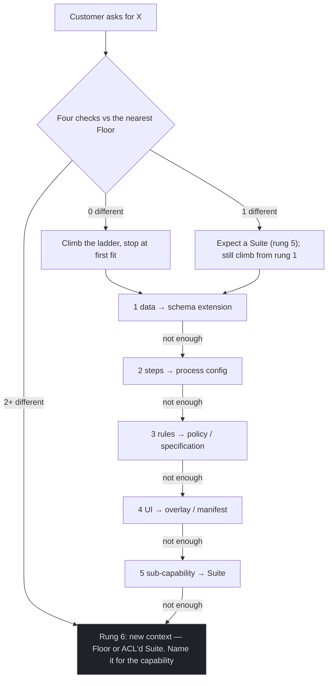

# The Context Boundary Test v0

**Created:** 2026-09-03 | **Last updated:** 2026-09-03 | **Author:** Axium, from the dialog with Graham of 2026-09-03 | **Status:** `exploratory` — proposed doctrine for the packet; becomes binding when Graham accepts it

## What this is for

R7 §5.2 says a customer whose need is a *genuinely different* domain gets a new Floor. Graham's question: **how do I know?** Is a different classification a different domain? What about functionality that is largely the same but different at the margins — slightly different data, slightly different use cases, more steps for one customer than another?

This page is the instrument you run each time a customer asks for something. It has three parts: the **four checks** that draw the line, the **variation ladder** that handles everything short of the line, and the **smells** that tell you the ladder was climbed too slowly or too fast. A worksheet at the end records the outcome so the decision is durable.

The principle behind all of it: **the line between two domains is linguistic and model-based, nothing else.** A bounded context is the boundary inside which one model and one vocabulary stay consistent (R1 §5.1). Organisation charts, customer names, team names and classification levels are not on that list.

## Part 1 — The four checks

Run these with the requesting customer's *experts* in the room, against the existing Floor that the need most resembles. Write down the evidence, not just the verdict.

| # | Check | The question to ask | Same context if… | Different context if… |
|---|---|---|---|---|
| 1 | **Vocabulary** | Do their experts use the same words for the same things as the existing Floor's experts? | Same word, same meaning; or a different word that is a plain synonym | **Same word, different meaning.** "Approval" is a sign-off for one and a cross-domain release for the other. "Asset" is a vehicle for one and a document for the other. |
| 2 | **Invariants** | What makes an entity *valid*? What may never be true of it? | Same rules, perhaps with additional optional ones | **Contradictory rules.** A record that must be valid for A would be invalid for B. A field that is mandatory for one is meaningless for the other. |
| 3 | **Identity and lifecycle** | Is it the same *thing*, with the same identity and the same set of states? | Same identity, same states, more or fewer steps between them | **Different identity or a different state machine.** It is born differently, dies differently, or has states the other never visits. |
| 4 | **Reasons to change** | Would a change for A break B's model? Do they change for different reasons, at different rates, under different owners? | They change together, for the same reasons | **They change for different reasons.** Accreditation drives one; operations drive the other. Different owners, different cadences (Conway; Team Topologies). |

**Reading the score.**

- **0 of 4 different** → one domain with variation. Go to the ladder.
- **1 of 4 different** → usually a **sub-context**: a Suite inside the existing Floor, with its own vocabulary note, not a Floor. Go to the ladder and expect to stop at rung 5.
- **2 or more different** → **two domains sharing a name.** The shared name is the trap. A new Floor (or a new context living as a Suite with an anticorruption layer to the old model) is warranted. Name it for the capability, never for the customer.

## Part 2 — Classification is not a domain boundary

Classification decides **where code runs** and **what data it may see**. It does not change what the words mean. A Floor running on the high side is the same bounded context as the one on the low side, deployed twice with different data and configuration — R6's "same app on both sides" pattern, and the whole reason the unclassified base library exists.

If a classified customer's *rules* differ, the rules split the context — not the classification. So:

- Different classification, same language and rules → **same Floor, different deployment** (a compartment app composes the same Floor libraries with a different manifest — R7 §5.2).
- Different classification *and* the four checks fail → a new context, for the reasons the checks found. The classification was a coincidence.

Treat classification as a **deployment axis** (R6) and a **data-label axis** (R5). Never as a reason to fork a Floor.

## Part 3 — The variation ladder

"Different at the margins" is the normal case, and every rung below is cheaper than a Floor. Climb from the top and **stop at the first rung that fits.** Each rung names where the variation lives in code, so the answer is never "copy the Floor."

| Rung | The variation | Where it lives | Example |
|---|---|---|---|
| 1 | **Different data** — extra fields, customer-specific attributes | Schema extension: optional fields, a typed metadata bag on the read model, a per-group extension object on the aggregate | Customer B's plan carries a `fundingLine`; nobody else's does |
| 2 | **Different steps** — more or fewer stages in the same workflow | The workflow definition becomes **data**: a process manager parameterised by a per-group process configuration | One sign-off for A; two sign-offs plus a comment for B |
| 3 | **Different rules** — validation or policy that differs per customer | **Policy objects / specifications** selected by group, evaluated inside the *same* aggregate. The aggregate never knows which customer it serves; it asks a policy | B forbids scheduling inside a 48-hour window; A allows it with a waiver |
| 4 | **Different UI** — an extra field shown, a tool hidden, a different default | The **tailoring overlay**: navigation manifest, feature flags, tokens, copy overrides — configuration + claims (tier model §2) | B sees a "Legal review" Office in the same Suite; A never does |
| 5 | **Different sub-capability** — a whole task area the others do not need, in the *same* language | A **Suite** inside the existing Floor, entitled by claim, `loadChildren` behind `CanMatch` | B needs a "Reconciliation" Suite in the Planning Floor |
| 6 | **Different model** — the four checks fail | A **new Floor** (or a new context as a Suite with an anticorruption layer to the old model). Named for the capability. | C's "approval" is a cross-domain *release* with a human-review record: a Release context |

**Rungs 1–4 are configuration and policy. Rung 5 is a library. Only rung 6 is a new model.** The shared code does not know about customers at any rung — it knows about *groups' claims* and *configuration documents*, which is what keeps the base library unclassified and un-forked.



## Part 4 — The smells

**Climbed too slowly** (a second domain has been stuffed into one context — the Big Ball of Mud forming):

- `if (customer === X)` branches spreading through aggregates and services.
- The glossary needs footnotes: "Approval (for group C, means…)".
- A field that is mandatory for one group and meaningless for another, on the same entity.
- The "core" model has become the **union of everyone's fields**.
- Two teams arguing over the same aggregate's rules.
- A process configuration (rung 2) that has grown conditional branches of its own.

**Climbed too fast** (split too early):

- Two Floors whose models diverge only by typo and copy-paste drift.
- A "shared kernel" between the two that is really the whole model.
- Every change is made twice.

**Rule: split on observed pain, not on anticipation.** A context is cheap to split later *if the import fences held* (R7 §4.2 — the fence is what makes a Floor promotable and a Suite extractable) and expensive to merge. Keep the fences from day one; delay the split until a smell appears.

## Part 5 — Worked examples

Three customers all say they need "approval".

| Customer | What they mean | Check 1 | Check 2 | Check 3 | Check 4 | Verdict | Rung |
|---|---|---|---|---|---|---|---|
| A | One sign-off on a plan | same | same | same | same | one domain | — (baseline) |
| B | Two sign-offs plus a mandatory comment | same | +1 optional rule | same states, one more step | same | one domain with variation | **2** (process config) |
| C | A reviewer clears a document to cross to another security domain, with the human-review record the guard requires | **different** ("approval" = release) | **different** (review record mandatory; document, not plan) | **different** (pending → reviewed → released / rejected; no "plan" states) | **different** (accreditation-driven) | **two domains** | **6** — a *Release* context, with an ACL to the Plan model |

A fourth: Customer D wants the same approval flow but on the high side with markings shown. Checks all "same"; classification is a deployment axis. **Same Floor, deployed per domain** with markings rendered by the `@rr/markings` primitives from a runtime vocabulary (R5 §6). No rung at all.

## Part 6 — Worksheet (copy per request)

```
CONTEXT BOUNDARY TEST — <need name, verb-noun, customer-neutral>
Date:                  Requesting group:            Nearest existing Floor/Suite:
Experts consulted:

Check 1 Vocabulary      [ same | different ]  evidence:
Check 2 Invariants      [ same | different ]  evidence:
Check 3 Identity/life   [ same | different ]  evidence:
Check 4 Reasons/owners  [ same | different ]  evidence:
Score: __ of 4 different

Classification involved? [ no | yes → deployment axis only | yes → and checks fail ]

Ladder rung chosen: [1 data | 2 steps | 3 rules | 4 UI | 5 Suite | 6 Floor]
Where the variation will live (package / config document / policy / manifest / Suite / Floor):
Lexicon entries added or changed (one meaning per word):
Smells observed in the existing Floor that informed this:
Decision owner:                     Recorded in: [decision register DA-Dn | log YYYY-MM-DD]
```

## How this connects

- The initial context map still comes from **event storming with the island's experts** (register Q1; `needs_catalog_v0.md` is the aid for that session). This test is for every request *after* the map exists — and for arbitrating the map itself when two candidate contexts share a word.
- Rung outcomes are architecture facts: a rung-2 decision creates a process-configuration document type; a rung-3 decision creates a policy seam; a rung-5 decision creates a Suite and a claim. Each gets a register or log entry.
- The **lexicon owner** (register Q12) is the person who rules check 1 when the room disagrees.
