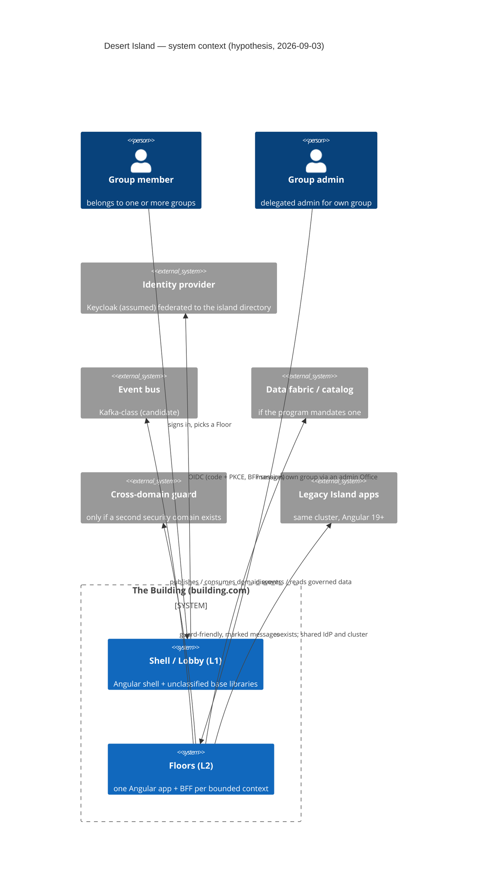

# 01 — System context, Desert Island (C4 level 1)

> **Superseded 2026-09-03 by [V1 — System Context](../architecture-description/V1-system-context.md)** of the ACME Workshop Architecture Description. V1 draws the same picture with the reference application's real names, the conditional neighbours carrying their fork and question ids, and the directory and telemetry feed added. Kept as the record of what was drawn before ACME Workshop existed.

**Created:** 2026-09-03 | **Status:** hypothesis (nothing ruled) | **Notation:** Mermaid C4

## Purpose

Show the Building as one system among its neighbours, before any internal structure is decided. Dashed/`_Ext` elements are neighbours whose existence on Desert Island is still a questionnaire item.

## Interpretation

- The **users are groups' members, not groups** — groups appear as identity facts on the person, not as boxes. That is DA-D1 lean A drawn.
- Four of the six neighbours are *candidates*: the bus, the fabric, the guard and the IdP choice each wait on a research brief (R2–R4, R6) and an island answer.
- Legacy Island's apps are neighbours **in the same cluster**, which is why the stack-synchronization constraint (`two_island_model.md`) is drawn as a relationship and not left implicit.
