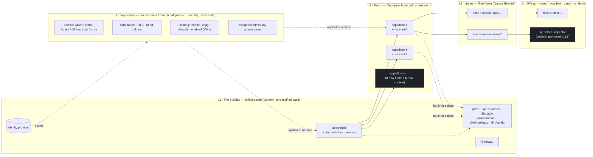

# 02 — Tier model: Building / Floors / Suites / Offices, with the group overlay

**Created:** 2026-09-03 | **Status:** hypothesis (DA-D1 lean A, DA-D2 lean C, DA-D3 lean A — none ruled) | **Notation:** Mermaid flowchart

## Purpose

The structural axis (what code and URLs are organised by) and the access axis (who may enter, what they see) drawn as two different things. Everything in the overlay is configuration + identity, not code.

## Interpretation

- **Floors never depend on each other.** Crossing Floors is an elevator ride (a full navigation under DA-D2 lean C); state that must survive it lives in the URL, the session, or the backend.
- **A group is not a tier.** It enters the picture through the identity provider's claims and lands on the overlay, which the shell and each Floor apply at runtime.
- **A generic Office is promoted into L1 only when a second Floor needs it** (dashed) — the salvage rule, not speculation.
