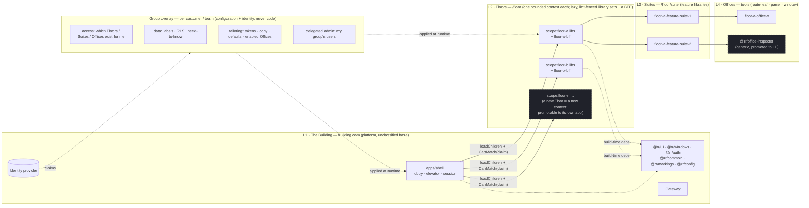

# 02 — Tier model: Building / Floors / Suites / Offices, with the group overlay

> **Superseded 2026-09-03 by [V8 — Tier / Information Architecture](../architecture-description/V8-tier-information-architecture.md)** of the ACME Workshop Architecture Description. V8 draws the same tier model with ACME's Floors, Suites, Offices and routes, and separates the overlay's four sources. Kept as the record of the lettered-Floor hypothesis.

**Created:** 2026-09-03 | **Status:** hypothesis (DA-D1 lean A, DA-D2 lean A *revised after R7*, DA-D3 lean A — none ruled) | **Notation:** Mermaid flowchart

## Purpose

The structural axis (what code and URLs are organised by) and the access axis (who may enter, what they see) drawn as two different things. Everything in the overlay is configuration + identity, not code.

## Interpretation

- **Floors never depend on each other.** That fence is what makes a Floor promotable to its own app or remote later (DA-D2) without a refactor; under the current lean A, crossing Floors is a router navigation inside one app and shared state lives in the shell's root store.
- **A group is not a tier.** It enters the picture through the identity provider's claims and lands on the overlay, which the shell and each Floor apply at runtime.
- **A generic Office is promoted into L1 only when a second Floor needs it** (dashed) — the salvage rule, not speculation.
