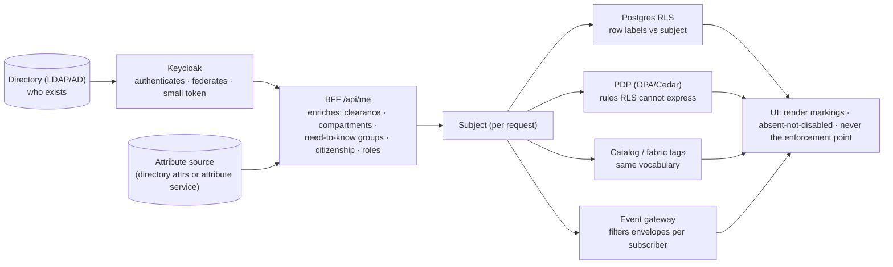

# The Practical Picture v0

**Created:** 2026-09-03 | **Last updated:** 2026-09-03 | **Author:** Axium, from the dialog with Graham of 2026-09-03 | **Status:** `exploratory` — the rubber-meets-the-road companion to the tier model; nothing here is implemented, and every version named is the 2026-09-03 registry state (currency contract, corpus README)

## 0. Graham's picture, confirmed and corrected

Graham's starting picture: stand up an unclassified Angular application on current practice, an Express-driven gateway, Keycloak for auth, a DDD backend arriving later; code the Floors from the event-storm results; attack the common needs first with generic Floors / Suites / Offices; then tailor per customer through configuration-driven and derived state.

That is the architecture the corpus points at, with three corrections:

1. **The Building comes before any Floor, and the first Floor is a vertical slice, not a generic layer.** "Generic Floors first" tempts a horizontal build (all stores, then all routes, then all screens). Build the platform, then *one thin path end to end* — one Floor, one Suite, one Office, one read model, one command — with identity, markings and row-level security switched on from day one. Breadth comes after that path works, because that path is where every seam lives.
2. **Tailoring has three sources, not one.** Configuration is one. The user's **claims** and the data's own **labels** are the other two. Derived state is `computed()` over all three. A component never asks "which group is this?"; it asks "is capability X on?" and receives data already filtered for "may this subject see this row?". Identity checks inside components are the Big Ball of Mud's front door.
3. **Do not wait for the DDD backend.** The BFF is the anticorruption layer from day one: the front end talks only to BFF read models and commands, shaped per screen and typed by the published-language package. Behind the BFF today sits whatever exists (mocks, a legacy service, one Postgres). Domain services slide in behind it later without the front end noticing.

## 1. The repository on day one

```
apps/
  shell/                      lobby, root router, session, root SignalStore, error/landing (eager)
packages/
  @rr/common                  published language: Zod 4 schemas + inferred types, one module per context
  @rr/ui                      AstroUXDS wrappers with signal inputs + RR tokens; may NOT import data-access
  @rr/auth                    /api/me httpResource → PermissionStore; CanMatchFn guards; sign-in/step-up navigations
  @rr/config                  manifest + flags + tokens via httpResource('/api/config'); DomainConfigStore
  @rr/markings                banner · portion-mark · chip, driven by a Marking value object + runtime vocabulary
  @rr/windows                 the utility-window host (the Office host mechanism; TrAIdit UWS precedent)
  @rr/store-features          shared SignalStore features: withResource, withMarkings, withEventStream
  planning-domain             the first Floor's types/value objects (no Angular)
  planning-data-access        Floor SignalStore, httpResource factories, DTO→view-model mappers, command submitters
  planning-feature-conjunctions  a Suite: routes.ts + Offices (route leaves / windowed surfaces)
  planning-ui                 Floor-specific presentational wrappers, if any
services/
  gateway/                    Express 5 BFF: openid-client + session store, /api/me, /api/config,
                              one router per Floor (/api/planning/*), per-request subject → RLS + PDP,
                              SSE endpoint (event bus → per-subscriber projection)
sheriff.config.ts             THE fence: Floors never import Floors; ui never imports data-access; nothing imports the shell
```

Rules the tree encodes (R7 §4.2): a Floor is a **library set**, lazy behind `CanMatch`, promotable to `apps/<floor>` only for a DA-D2 reason. `@rr/*` is the unclassified base; it contains no domain enums, no group names, no marking strings — only shapes and primitives driven by runtime data.

## 2. One screen, as it actually runs

A user opens `building.com/planning/conjunctions/assess`.

```mermaid
sequenceDiagram
  autonumber
  participant B as Browser (shell)
  participant G as Gateway / BFF (Express)
  participant K as Keycloak
  participant P as Policy (OPA/Cedar) + Postgres RLS
  participant E as Event bus
  B->>G: GET /api/me (HttpOnly session cookie)
  G->>K: session valid? (openid-client; refresh if needed)
  G-->>B: { sub, claims, group, subjectAttributes, manifest }
  Note over B: PermissionStore + DomainConfigStore hydrate (httpResource)
  Note over B: CanMatch('floor:planning') → loadChildren(planning routes)
  B->>G: GET /api/planning/conjunctions?… (Suite data-access httpResource, Zod parse)
  G->>P: BEGIN; SET LOCAL app.subject = …; query read model (RLS filters rows); PDP for non-row rules
  P-->>G: rows already filtered, each with its marking
  G-->>B: read model DTO (published language)
  Note over B: Floor SignalStore patches; @rr/markings renders banner + portion marks from data + vocabulary
  B->>G: GET /api/events (one SSE connection, owned by the shell)
  E-->>G: domain events (marked envelopes)
  G-->>B: per-subscriber projected events (filtered by subject) → rxMethod → patchState
  B->>G: POST /api/planning/conjunctions/{id}/assess { commandId, … }
  G-->>B: 202 accepted → optimistic state keyed by commandId, confirmed by the event
```

Nothing in that path knows the customer's name. It knows **claims**, **configuration**, and **labels**. The BFF never queries without a subject (fail-closed); the browser never holds a token; the UI never decides access.

## 3. Tailoring mechanics

| What varies per group | Mechanism | Served by | Consumed in the UI as |
|---|---|---|---|
| Which Floors / Suites / Offices exist for me | **navigation manifest** (per group) | `/api/config` | `computed()` over manifest + claims → `CanMatch`, lobby, Office availability |
| Which capabilities are on | **feature flags keyed by capability**, never by group | flag provider (OpenFeature) | `flags.has('legal-review')` inside a computed |
| How many steps a workflow has | **process definition as data** (Boundary Test rung 2) | BFF, per group | the UI renders the *current step* the server reports |
| Which rules apply | **policy documents** (rung 3) | PDP | server-side only; the UI sees outcomes |
| Look and copy | **theme tokens** (CSS custom properties) + copy overrides with a group dimension | `/api/config` | `@rr/ui` tokens; translation scopes |
| What data I may see | **labels on rows + subject attributes on the session** | RLS + PDP | already filtered before the browser sees it; `@rr/markings` displays |
| What I may *do* | claims → command authorization at the BFF | Keycloak roles / PDP | hide-vs-disable-vs-absent per R7 §4.5; absent for entitlement, disabled for state |

The test that proves the model: **a second group with a different manifest appears with zero code changes.** If it needs a code change, the variation was put on the wrong rung.

## 4. Classification, users, and where "rich user management" actually lives

The richness lives in the **attribute model and the policy**, not in a hand-built users system. Building a users table is the mistake to avoid (R4 §1: four stores, not one).



- **One marking vocabulary everywhere** — rows, catalog tags, event envelopes, the UI's display — or the catalog shows one thing and the PDP enforces another (R2 takeaway 3).
- **Two decisions shape all of it and belong to Graham and the security authority, not to this packet:** (a) is a *group* a **compartment** on the data or an **organisational unit**? — decides dominance vs tenancy (R5 Q3, register Q3); (b) is any customer in a **separate security domain**? — then that customer gets the same code as a **separate quantum** (R8 §7) with its own vocabulary and manifest, and nothing federates across the guard (R6).
- **Delegated group admin** is an Office in an Identity Floor that exists only for holders of a `group-admin:<gid>` claim, calling Keycloak's admin API scoped to that group; Keycloak's fine-grained admin permissions (FGAP V2) enforce the scope server-side, so the Office cannot escalate (R4 §4.3).

## 5. Tech candidates to add to the stack (register DA-D13..DA-D20)

Candidates, not decisions; each needs the island allow-list check (Q11-class question) and rides the bundle.

| # | Candidate | Role | Why | Fallback |
|---|---|---|---|---|
| DA-D13 | **Sheriff** (`@softarc/sheriff-core`) | module-boundary fitness function | the single most important addition: keeps Floors promotable, kills cross-Floor imports; zero-dep, works on plain npm workspaces | `dependency-cruiser` / `eslint-plugin-boundaries`; Nx if adopted for other reasons (DA-D12) |
| DA-D14 | **Zod 4** + `z.toJSONSchema()` | published language + OpenAPI from one source | schemas parse `httpResource` responses and generate the BFF's OpenAPI document | JSON Schema by hand |
| DA-D15 | **OpenFeature** + self-hosted **flagd** | capability flags, vendor-neutral, offline | keeps capability flags out of our own code and out of group-keyed conditionals | flags as a section of `/api/config` |
| DA-D16 | **OPA** or **Cedar** as PDP, beside **Postgres RLS** | authorization | RLS is the line that cannot be forgotten; the PDP handles rules RLS cannot express (R5 §4.1) | RLS + policy in BFF code (worse) |
| DA-D17 | **openid-client** + Postgres-backed session store in the BFF | BFF/cookie pattern (BCP 212) | nothing Keycloak-specific in the browser; one fewer pin across the islands | `keycloak-js` in the browser (legacy apps' pattern) |
| DA-D18 | **XState 5** | process definitions as data (rung 2), runnable on BFF and UI | renders "current step" from one definition; auditable | hand-written process managers |
| DA-D19 | **Drizzle** (or Kysely) | typed SQL in the BFF | first-class RLS policy support fits the per-request subject model `[UNVERIFIED — confirm in Drizzle docs]` | raw `pg` + SQL files |
| DA-D20 | **Storybook** for `@rr/ui` + `@rr/markings` · **Playwright** e2e · **Context Mapper** | catalog · e2e · context maps → diagrams | the island team gets a component catalog without reading source; Chromium binary must ride the bundle (B9); Context Mapper turns event-storm output into the C4 container view | plain docs; Vitest only; hand-drawn maps |

Already decided or in the corpus: Angular 22 / NgRx SignalStore 22 / AstroUXDS behind `@rr/ui` (DA-D11) / Express 5 / Keycloak 26.x / Kafka-class bus later, Postgres outbox first (R3).

## 6. Build order

| Step | What lands | The proof it is done |
|---|---|---|
| 0 | Repo, npm workspaces, Sheriff fences, corpus-graph-style checks in CI (fitness functions before features) | a cross-Floor import fails the build |
| 1 | **The Building:** shell, BFF + Keycloak, `/api/me`, `PermissionStore`, lobby, `@rr/markings` with a stub vocabulary | sign in; see only the Floors your claims allow; a banner renders from data |
| 2 | **First vertical slice:** one Floor, one Suite, one Office, one read model, one command; RLS on; one real marking on one real row | two users with different attributes see different rows from the same endpoint |
| 3 | **Tailoring substrate:** manifest, flags, tokens | a second group with a different manifest appears with **zero code changes** |
| 4 | **Real-time:** one SSE connection, one live read model, optimistic command | a change by user A appears for user B without refresh; hidden rows never leak via events |
| 5 | **Delegated admin Office** | a group admin adds a user to their own group and cannot touch another |
| 6 | **Breadth:** Floors per the event-storm map, each a copy of step 2's shape | each new Floor is a library set + routes + a BFF router; the shell is untouched |

## 7. Open questions this doc adds to the register

- Which candidates in §5 pass the island allow-list, and in what order they should ride the bundle (Q11-class).
- Whether the process-definition format (DA-D18) must be readable by non-engineers on the island.
- Whether the attribute source for `/api/me` enrichment is the directory itself or a separate attribute service (R5 Q6).
