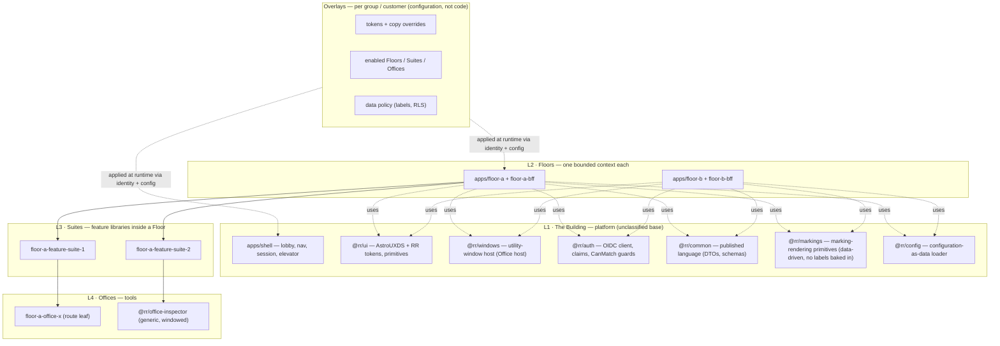

# Building / Floor / Suite / Office — tier model exploration v0

**Created:** 2026-09-03 | **Last updated:** 2026-09-03 | **Author:** Axium | **Status:** `exploratory` — a **hypothesis** written before the research briefs landed, so that R7 has something concrete to confirm or break. Not doctrine. Forks live in the [decision register](decision_register_v0.md).

## 1. The question, sharpened

Graham's hierarchy has two axes hiding in it, and the confusion between "do groups live here or do functions live here" is the two axes being asked at once:

- **The structural axis** — what the *code and the URL* are organised by.
- **The access axis** — who may enter, what they see, and how it is tailored for them.

DDD's answer, Team Topologies' answer and information-architecture practice all point the same way: **structure follows the domain's capabilities (bounded contexts); people and groups are an access-and-tailoring overlay, expressed as configuration and identity, never as a copy of the code.** The whole of Graham's "modular, no copy-paste" goal rides on keeping those axes apart.

## 2. The hypothesis, tier by tier

| Tier | What it is (structure) | DDD / Team Topologies reading | Code shape | URL | Who owns it |
|---|---|---|---|---|---|
| **L1 Building** | the platform: shell, lobby/directory, session, design system + RR tokens, window system, telemetry, the published-language package; identity provider and gateway behind it | generic subdomains + the composition root; the **platform team's** product | `apps/shell` + `packages/@rr/*` base libraries; the IdP; the gateway | `building.com/` | platform team (Graham's) |
| **L2 Floor** | one **bounded context** made visible: its own Angular application (or lazy area), its own BFF, its own read models, its own lexicon | a bounded context; a **stream-aligned team** owns one (or a few) | `apps/<floor>` + `packages/<floor>-*` libraries; `services/<floor>-bff` | `building.com/<floor>` | a stream-aligned team |
| **L3 Suite** | a capability area *inside* the context — a coherent set of tasks with shared vocabulary and state | a sub-context / module; often the unit a squad within the team owns | lazy feature library `packages/<floor>-feature-<suite>` with its own routes and SignalStore | `building.com/<floor>/<suite>` | the Floor team (or a squad) |
| **L4 Office** | a tool: one task-oriented surface (a route leaf, a panel, or a utility window) that may be reused in other Suites and Floors | a task (Vernon's task-based UI); a **primitive** if it is generic | feature library or windowed surface `packages/<floor>-office-<name>` or `packages/@rr/office-<name>` when generic | `.../<suite>/<office>` or a window id | whoever owns the Suite; generic Offices belong to L1 |

**Groups are not a tier.** A group (customer, team, user population) is: (a) an identity fact — a Keycloak group/organisation → claims; (b) an **access** fact — which Floors, Suites and Offices *exist* for that user (absent, not disabled); (c) a **data** fact — what rows/labels its members may read; (d) a **tailoring** fact — tokens, default landing Floor, enabled Offices, copy overrides, all configuration-as-data on top of the base library.

So: *"Product Management" is a Floor if Product Management is a bounded context of the system; "Team One" is never a Floor — Team One is a group that is granted Floors.* The one honest counter-case: when a customer's needs are a genuinely different domain (different words for different things), that **is** a different bounded context and it earns its own Floor — the Floor is still minted by the context, not by the customer.

## 3. Why capability-first (DA-D1 lean A), stated as consequences

1. **Copy-paste is what group-first produces.** If Floors are groups, every capability two groups share is either duplicated or hoisted into a "common" that grows until it is the whole app.
2. **Groups change faster than capabilities.** Reorganisations, new customers and merged teams are configuration changes under capability-first; they are refactors under group-first.
3. **Security must not depend on which app you loaded.** Data privilege is enforced by identity + policy + labels at the BFF and the store (R4, R5); an app boundary is not a security boundary. Group-first tempts teams to believe it is.
4. **The lexicon stays clean.** One bounded context, one vocabulary, one Floor — the TrAIdit Concordance rule ("one meaning per word") becomes structural.
5. **TrAIdit's own floors are capabilities** — Lab, Roster, the TrAIding Floor — and its "Wing = premium-class floor" turned out to be a *tier of access*, not a code boundary. The precedent already ran this experiment.

## 4. What lives where — the base library and its overlays

**Dependency rules (lint-enforced, the point of the taxonomy):** Floors depend on L1 only, never on each other. Suites depend on their Floor's shared libraries and L1. Offices depend on nothing above them. Nothing in L1 imports from a Floor. A generic Office is promoted into L1 only when a second Floor needs it (the salvage rule, not speculation).

## 5. Composition strategy (DA-D2) — the lean and its honest cost

The lean is **one Angular app per Floor under a path prefix, sharing build-time libraries and a shell library** (option C), with a single shell SPA (option A) as the right answer while there is one team, and runtime micro-frontends (option B) held back until independent runtime deployment is demanded by evidence.

Why C: it is literally "add a new Angular application for a new group with ease" — a new Floor is `ng generate application`, wire the base libraries, deploy under `/floor-name/`; each Floor builds and ships independently; there is no federation runtime to bundle and maintain on an isolated network; a Floor can be redeployed without touching the others.

The cost, stated: crossing between Floors is a full page load (the "elevator" is a real elevator), and any state that must survive the crossing (session, selected context, open windows) has to live in the URL, the IdP session, or the backend — **never in memory**. That constraint is a feature: it forces the "presumed-global state" question (TrAIdit's playhead lesson) to be answered explicitly per item. R7 is asked to test this lean against the micro-frontend literature and Angular's current Native Federation state.

## 6. URL design (DA-D3)

Default: `building.com/<floor>/<suite>/<office>` with the group carried as a **claim**, not a path segment. The lobby (`/`) lists only the Floors the user may enter. If a user can hold several groups at once and needs to switch context mid-session, add an explicit switcher and consider `/g/<group>/…` (option B/C) — but only on that evidence, because a group segment in every URL is a tenant leak in every link.

## 7. What breaks this hypothesis

- If the island's product has *one* bounded context and *many* customer-specific workflows, the Floor tier collapses to one and the tailoring overlay does all the work — still capability-first, but the diagram is flatter than Graham pictures.
- If customers require **separate security domains** (R6), the deployment topology — not the code — splits per domain; the base library is the thing that crosses the fence.
- If teams are organised strictly by customer rather than capability, Conway's law will fight capability-first Floors. That is an organisational decision above this packet; the packet's job is to say so, not to hide it.

## 8. Questions for Graham (harvested into the register)

1. Can one user belong to more than one group at a time? (DA-D3)
2. Does *any* Desert Island data carry security markings on day one, or is per-group privilege purely a need-to-know/ownership matter? (DA-D6, R5)
3. Is Keycloak the cluster's IdP today, and will the same instance serve Desert Island? (DA-D5, R4)
4. How many teams will build Floors in year one? (DA-D2, DA-D4)
5. What is the product? Even one sentence of domain lets the first Floors be named instead of lettered.
